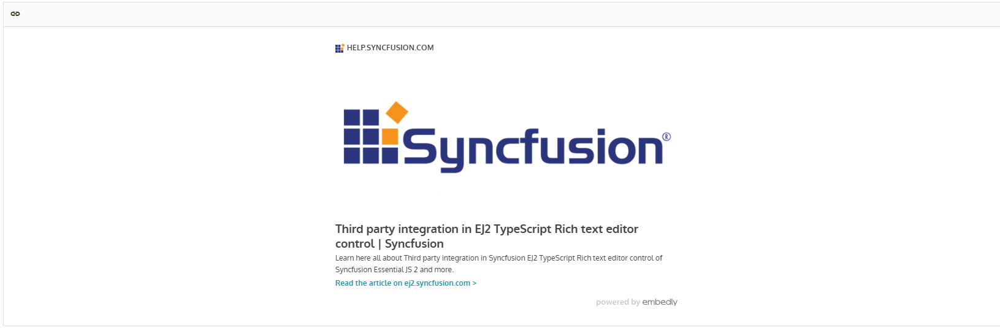

# Embedly Integration with RichTextEditor

By integrating [Embedly](https://www.embedly.com) with the Blazor RichTextEditor, you can automatically convert URLs into rich preview cards. This integration allows users to insert links that render as interactive embed cards, enhancing the visual presentation and user experience when sharing web content.

## Overview

This documentation provides a complete integration of Embedly with the RichTextEditor component. Users can:

- Insert links in the editor content
- Links automatically render as interactive Embedly embed cards
- Support for various content types (videos, articles, social media, etc.)
- Interactive embed cards enhance content visibility and engagement

## Prerequisites

- **Syncfusion.Blazor NuGet package** installed and configured
- **Required namespaces:**
  - `Syncfusion.Blazor.RichTextEditor`
- **JavaScript interop enabled** — `IJSRuntime` support
- **Embedly CDN access** — https://cdn.embedly.com/widgets/platform.js

> Before integrating Embedly with RichTextEditor, refer to the [RichTextEditor Getting Started](https://blazor.syncfusion.com/documentation/rich-text-editor/getting-started) documentation for initial setup.

## Step 1: Add the JavaScript Interop File

Create the JavaScript interop module to handle link processing and communication between Blazor and Embedly.

### 1.1 Create the interop file

In your Blazor project, create a new folder `wwwroot/scripts/` and add a file named `embedly-interop.js`.

Copy the complete interop implementation from:





### 1.2 Verify file placement

Ensure the file is located at:

```
YourProject/
└── wwwroot/
    └── scripts/
        └── embedly-interop.js
```

## Step 2: Add Script Reference in Host Page

Add the script references in your host page before the closing `</body>` tag:

```html
<script src="https://cdn.embedly.com/widgets/platform.js" charset="UTF-8"></script>
<script src="/scripts/embedly-interop.js"></script>
</body>
```

> The host page location varies by project type. Refer to the [RichTextEditor Getting Started](https://blazor.syncfusion.com/documentation/rich-text-editor/getting-started) guide for the correct host page file path.
>
> **Note:** The Embedly CDN script (`https://cdn.embedly.com/widgets/platform.js`) must be loaded before the custom interop file to ensure proper functionality.

## Step 3: Create the Razor Component

In your Blazor project's `Pages` folder, create a new file: `EmbedlyIntegration.razor`

Copy the complete component implementation from:





## How to Use the Integration

1. **Navigate to the component** — Open the page where you created the component (e.g., `/embedlyintegration`)
2. **Insert a link** — Use the RichTextEditor's link tool to insert a URL
3. **View embed card** — The link automatically renders as an Embedly embed card
4. **Interact with content** — Click on the embed card to interact with the content (watch videos, view articles, etc.)



## How It Works

When a user inserts or updates a link in the RichTextEditor:

1. The `OnActionComplete` event is triggered with `RequestType` set to "Links"
2. The JavaScript interop method `embedlyInterop.wrapLinkInEmbedlyCard()` is invoked via `JS.InvokeVoidAsync`
3. The method queries the RichTextEditor content area using the `.e-rte-content` selector
4. Each link is wrapped in a `blockquote` element with the `.embedly-card` class
5. The Embedly library processes the container to render the interactive embed card preview

## Supported content

Embedly supports embedding from a wide range of sources including:

- Video platforms (YouTube, Vimeo, etc.)
- Social media (Twitter, Instagram, Facebook, etc.)
- Articles and blog posts
- Music services
- Image galleries
- And many more content types

For a complete list of supported services, refer to the [Embedly documentation](https://www.embedly.com/).

## Preventing duplicate processing

The JavaScript interop includes a check to prevent duplicate embed card wrapping:

```javascript
if (!link.closest('.embedly-card')) {
    // Process the link only if it's not already wrapped
}
```

This ensures that links are only wrapped once, preventing duplicate Embedly card structures when the same link is processed multiple times.

## Integration points

### Toolbar configuration

The `ToolbarItems` list includes only the `CreateLink` command to allow users to insert links:

```csharp
private List<ToolbarItemModel> ToolbarItems = new()
{
    new ToolbarItemModel { Command = ToolbarCommand.CreateLink }
};
```

### Event handling

The `OnActionComplete` event checks if the action is a link insertion and triggers the Embedly processing:

```csharp
private async Task OnActionComplete(ActionCompleteEventArgs args)
{
    if (args.RequestType == "Links")
    {
        await JS.InvokeVoidAsync("embedlyInterop.wrapLinkInEmbedlyCard");
    }
}
```

## See also

* [Link support in RichTextEditor](https://blazor.syncfusion.com/documentation/rich-text-editor/link)
* [Rich Text Editor documentation](https://blazor.syncfusion.com/documentation/rich-text-editor/getting-started)
* [Rich Text Editor events](https://blazor.syncfusion.com/documentation/rich-text-editor/events)
* [Embedly Developer Documentation](https://www.embedly.com)