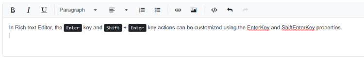
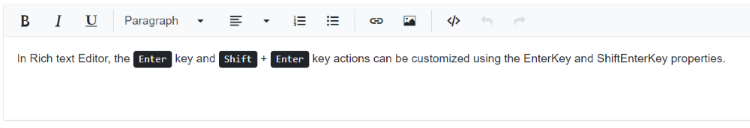

# Enter and Shift-Enter Key Configuration

The Rich Text Editor allows to customize the tag that is inserted when pressing the <kbd>Enter</kbd> key and <kbd>Shift</kbd> + <kbd>Enter</kbd> key in the in the editor.

## Enter key customization

By default, pressing the <kbd>Enter</kbd> key inserts a `
` tag. The <kbd>Enter</kbd> key behavior can be customized using the [EnterKey]T(https://help.syncfusion.com/cr/blazor/Syncfusion.Blazor.RichTextEditor.SfRichTextEditor.html#Syncfusion_Blazor_RichTextEditor_SfRichTextEditor_EnterKey) property. The [possible tags](https://help.syncfusion.com/cr/blazor/Syncfusion.Blazor.RichTextEditor.EnterKeyTag.html) are `
`, `
`, and ` `.

When configured, pressing the <kbd>Enter</kbd> key inserts the specified tag.

N> The **pre** tag will be inserted when code format is applied. If the editor content is inside the **pre** tag, the enter key press will creates ` ` tag. Need to press enter key twice to come out of the **pre** tag.









N> [View Sample](https://blazor.syncfusion.com/demos/rich-text-editor/enterkeyconfiguration)

## Shift-Enter key customization

By default, pressing <kbd>Shift</kbd> + <kbd>Enter</kbd> inserts a ` ` tag. This behavior can be customized using the [ShiftEnterKey](https://help.syncfusion.com/cr/blazor/Syncfusion.Blazor.RichTextEditor.SfRichTextEditor.html#Syncfusion_Blazor_RichTextEditor_SfRichTextEditor_ShiftEnterKey) property. The [possible tags](https://help.syncfusion.com/cr/blazor/Syncfusion.Blazor.RichTextEditor.ShiftEnterKeyTag.html) are ` `, `
`, and `
`.

When configured, pressing <kbd>Shift</kbd> + <kbd>Enter</kbd> inserts the specified tag.









