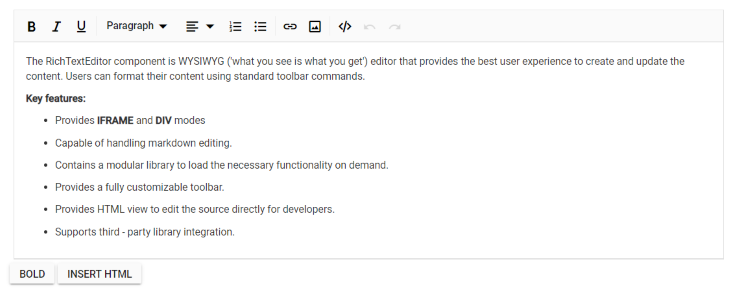
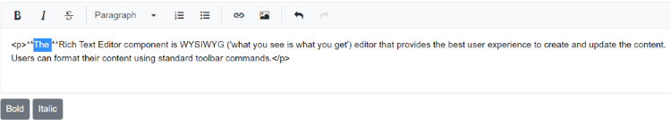

# Execute Command Programmatically

In Rich Text Editor, the [ExecuteCommand](https://help.syncfusion.com/cr/blazor/Syncfusion.Blazor.RichTextEditor.ExecuteCommandOption.html) method runs the HTML and Markdown commands 
programmatically to manipulate content in the current editable area.

## HTML editor commands

The `ExecuteCommand` methods support following HTML editor commands.

<table>
<tr>
<td><b>Commands</b></td>
<td><b>Description</b></td>
<td><b>Code snippets</b></td>
</tr>

<tr>
<td>
Bold
</td>
<td>
Bold the selected content.
</td>
<td>
 
await this.RteObj.ExecuteCommandAsync(CommandName.Bold); 
</td>
</tr>

<tr>
<td>
Italic
</td>
<td>
Apply the italic style for the selected content.
</td>
<td>
 
await this.RteObj.ExecuteCommandAsync(CommandName.Italic);
</td>
</tr>

<tr>
<td>
Underline
</td>
<td>
Underline the selected content.
</td>
<td>
 
await this.RteObj.ExecuteCommandAsync(CommandName.Underline);
</td>
</tr>

<tr>
<td>
StrikeThrough
</td>
<td>
Apply single line strike through formatting for the selected content.
</td>
<td>
 
await this.RteObj.ExecuteCommandAsync(CommandName.StrikeThrough);
</td>
</tr>

<tr>
<td>
Superscript
</td>
<td>
Makes the selected content as superscript (higher).
</td>
<td>
 
await this.RteObj.ExecuteCommandAsync(CommandName.Superscript);
</td>
</tr>

<tr>
<td>
Subscript
</td>
<td>
Makes the selected content as subscript (lower).
</td>
<td>
 
await this.RteObj.ExecuteCommandAsync(CommandName.Subscript);
</td>
</tr>

<tr>
<td>
Uppercase
</td>
<td>
Change the selected content into upper case.
</td>
<td>
 
await this.RteObj.ExecuteCommandAsync(CommandName.Uppercase);
</td>
</tr>

<tr>
<td>
Lowercase
</td>
<td>
Change the selected content into lower case.
</td>
<td>
 
await this.RteObj.ExecuteCommandAsync(CommandName.Lowercase);
</td>
</tr>

<tr>
<td>
FontColor
</td>
<td>
Apply the specified font color for the selected content.
</td>
<td>
 
await this.RteObj.ExecuteCommandAsync(CommandName.FontColor, "Red");
</td>
</tr>

<tr>
<td>
FontName
</td>
<td>
Apply the specified font name for the selected content.
</td>
<td>
 
await this.RteObj.ExecuteCommandAsync(CommandName.FontName, "Impact");
</td>
</tr>

<tr>
<td>
FontSize
</td>
<td>
Apply the specified font size for the selected content.
</td>
<td>
 
await this.RteObj.ExecuteCommandAsync(CommandName.FontSize, "10pt");
</td>
</tr>

<tr>
<td>
BackgroundColor
</td>
<td>
Apply the specified background color the selected content.
</td>
<td>
 
await this.RteObj.ExecuteCommandAsync(CommandName.BackgroundColor, "red");
</td>
</tr>

<tr>
<td>
JustifyCenter
</td>
<td>
Align the content with center margin.
</td>
<td>
 
await this.RteObj.ExecuteCommandAsync(CommandName.JustifyCenter);
</td>
</tr>

<tr>
<td>
JustifyFull
</td>
<td>
Align the content with justify margin.
</td>
<td>
 
await this.RteObj.ExecuteCommandAsync(CommandName.JustifyFull);
</td>
</tr>

<tr>
<td>
JustifyLeft
</td>
<td>
Align the content with left margin. 
</td>
<td>
 
await this.RteObj.ExecuteCommandAsync(CommandName.JustifyLeft);
</td>
</tr>

<tr>
<td>
JustifyRight
</td>
<td>
Align the content with right margin. 
</td>
<td>
 
await this.RteObj.ExecuteCommandAsync(CommandName.JustifyRight);
</td>
</tr>

<tr>
<td>
CreateLink
</td>
<td>
Creates a hyperlink to a text or image to a specific location in the content. 
</td>
<td>
 
await this.RteObj.ExecuteCommandAsync(CommandName.CreateLink, new LinkCommandsArgs() { Text = "Links", Url= "http://", Title = "Link"});
</td>
</tr>

<tr>
<td>
Indent
</td>
<td>
Allows to increase the indent level of the content.
</td>
<td>
 
await this.RteObj.ExecuteCommandAsync(CommandName.Indent);
</td>
</tr>

<tr>
<td>
InsertHTML
</td>
<td>
Insert the html content to the current cursor position.
</td>
<td>
 
await this.RteObj.ExecuteCommandAsync(CommandName.InsertHTML,"
Syncfusion Rich Text Editor
");
</td>
</tr>

<tr>
<td>
InsertOrderedList
</td>
<td>
 Create a new list item(numbered).
</td>
<td>
 
await this.RteObj.ExecuteCommandAsync(CommandName.InsertOrderedList);
</td>
</tr>

<tr>
<td>
InsertUnorderedList
</td>
<td>
Create a new list item(bulleted).
</td>
<td>
 
await this.RteObj.ExecuteCommandAsync(CommandName.InsertUnorderedList);
</td>
</tr>

<tr>
<td>
Outdent
</td>
<td>
Allows to decrease the indent level of the content.
</td>
<td>
 
await this.RteObj.ExecuteCommandAsync(CommandName.Outdent);
</td>
</tr>

<tr>
<td>
Redo
</td>
<td>
Allows to redo the actions
</td>
<td>
 
await this.RteObj.ExecuteCommandAsync(CommandName.Redo);
</td>
</tr>

<tr>
<td>
RemoveFormat
</td>
<td>
Remove all formatting styles (such as bold, italic, underline, color, superscript, subscript, and more) from currently selected text.
</td>
<td>
 
await this.RteObj.ExecuteCommandAsync(CommandName.RemoveFormat);
</td>
</tr>

<tr>
<td>
InsertText
</td>
<td>
Insert text to the current cursor position.
</td>
<td>
 
await this.RteObj.ExecuteCommandAsync(CommandName.InsertText, "Inserted text");
</td>
</tr>

<tr>
<td>
InsertImage
</td>
<td>
Insert an image to the current cursor position.
</td>
<td>
 
await this.RteObj.ExecuteCommandAsync(CommandName.InsertImage, new ImageCommandsArgs() { Url = "https://ej2.syncfusion.com/javascript/demos/src/rich-text-editor/images/RTEImage-Feather.png", CssClass = "rte-img" });
</td>
</tr>
</table>

> Provided support to apply execute commands which do not require direct DOM access.

The following code block demonstrates the usage of the `ExecuteCommand` in Rich Text Editor.









## Markdown editor commands  

The `ExecuteCommand` methods support following Markdown commands.

<table>
<tr>
<td><b>Commands</b></td>
<td><b>Description</b></td>
<td><b>Code snippets</b></td>
</tr>

<tr>
<td>
Bold
</td>
<td>
Bold the selected content.
</td>
<td>
 
await this.RteObj.ExecuteCommandAsync(CommandName.Bold); 
</td>
</tr>

<tr>
<td>
Italic
</td>
<td>
Apply the italic style for the selected content.
</td>
<td>
 
await this.RteObj.ExecuteCommandAsync(CommandName.Italic);
</td>
</tr>

<tr>
<td>
StrikeThrough
</td>
<td>
Apply single line strike through formatting for the selected content.
</td>
<td>
 
await this.RteObj.ExecuteCommandAsync(CommandName.StrikeThrough);
</td>
</tr>

<tr>
<td>
Superscript
</td>
<td>
Makes the selected content as superscript (higher).
</td>
<td>
 
await this.RteObj.ExecuteCommandAsync(CommandName.Superscript);
</td>
</tr>

<tr>
<td>
Subscript
</td>
<td>
Makes the selected content as subscript (lower).
</td>
<td>
 
await this.RteObj.ExecuteCommandAsync(CommandName.Subscript);
</td>
</tr>

<tr>
<td>
Uppercase
</td>
<td>
Change the selected content into upper case.
</td>
<td>
 
await this.RteObj.ExecuteCommandAsync(CommandName.Uppercase);
</td>
</tr>

<tr>
<td>
Lowercase
</td>
<td>
Change the selected content into lower case.
</td>
<td>
 
await this.RteObj.ExecuteCommandAsync(CommandName.Lowercase);
</td>
</tr>

<tr>
<td>
CreateLink
</td>
<td>
Creates a hyperlink to a text or image to a specific location in the content. 
</td>
<td>
 
await this.RteObj.ExecuteCommandAsync(CommandName.CreateLink, new LinkCommandsArgs() { Text = "Links", Url= "http://", Title = "Link"});
</td>
</tr>

<tr>
<td>
InsertOrderedList
</td>
<td>
 Create a new list item(numbered).
</td>
<td>
 
await this.RteObj.ExecuteCommandAsync(CommandName.InsertOrderedList);
</td>
</tr>

<tr>
<td>
InsertUnorderedList
</td>
<td>
Create a new list item(bulleted).
</td>
<td>
 
await this.RteObj.ExecuteCommandAsync(CommandName.InsertUnorderedList);
</td>
</tr>

<tr>
<td>
Redo
</td>
<td>
Allows to redo the actions
</td>
<td>
 
await this.RteObj.ExecuteCommandAsync(CommandName.Redo);
</td>
</tr>

<tr>
<td>
InsertText
</td>
<td>
Insert text to the current cursor position.
</td>
<td>
 
await this.RteObj.ExecuteCommandAsync(CommandName.InsertText, "Inserted text");
</td>
</tr>

<tr>
<td>
InsertImage
</td>
<td>
Insert an image to the current cursor position.
</td>
<td>
 
await this.RteObj.ExecuteCommandAsync(CommandName.InsertImage, new ImageCommandsArgs() { Url = "https://ej2.syncfusion.com/javascript/demos/src/rich-text-editor/images/RTEImage-Feather.png", CssClass = "rte-img" });
</td>
</tr>
</table>









> You can refer to our [Blazor Rich Text Editor](https://www.syncfusion.com/blazor-components/blazor-wysiwyg-rich-text-editor) feature tour page for its groundbreaking feature representations. You can also explore our [Blazor Rich Text Editor](https://blazor.syncfusion.com/demos/rich-text-editor/overview?theme=bootstrap4) example to knows how to render and configure the rich text editor tools.