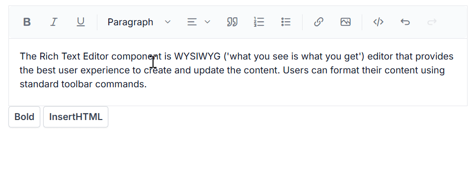
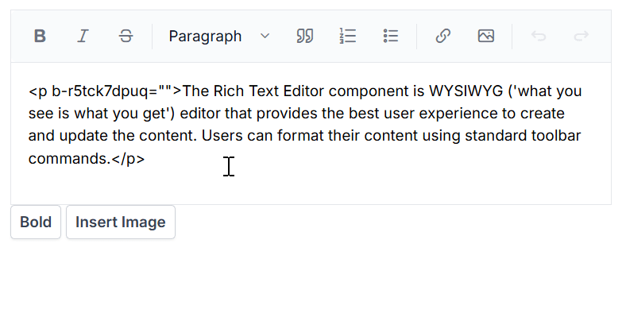

# Execute Command Programmatically

In the Rich Text Editor, the [ExecuteCommand](https://help.syncfusion.com/cr/blazor/Syncfusion.Blazor.RichTextEditor.ExecuteCommandOption.html) method runs HTML and Markdown commands programmatically to manipulate content in the current editable area.

## HTML editor commands

The [ExecuteCommand](https://help.syncfusion.com/cr/blazor/Syncfusion.Blazor.RichTextEditor.ExecuteCommandOption.html#constructors) method supports the following HTML editor commands.

<table>
<tr>
<td><b>Commands</b></td>
<td><b>Description</b></td>
<td><b>Code snippets</b></td>
</tr>

<tr>
<td>
Bold
</td>
<td>
Applies bold formatting to the selected content.
</td>
<td>

await this.RteObj.ExecuteCommandAsync(CommandName.Bold); 
</td>
</tr>

<tr>
<td>
Italic
</td>
<td>
Applies italic formatting to the selected content.
</td>
<td>

await this.RteObj.ExecuteCommandAsync(CommandName.Italic);
</td>
</tr>

<tr>
<td>
Underline
</td>
<td>
Underlines the selected content.
</td>
<td>

await this.RteObj.ExecuteCommandAsync(CommandName.Underline);
</td>
</tr>

<tr>
<td>
StrikeThrough
</td>
<td>
Applies single-line strikethrough formatting to the selected content.
</td>
<td>

await this.RteObj.ExecuteCommandAsync(CommandName.StrikeThrough);
</td>
</tr>

<tr>
<td>
Superscript
</td>
<td>
Applies superscript (higher) formatting to the selected content.
</td>
<td>

await this.RteObj.ExecuteCommandAsync(CommandName.Superscript);
</td>
</tr>

<tr>
<td>
Subscript
</td>
<td>
Applies subscript (lower) formatting to the selected content.
</td>
<td>

await this.RteObj.ExecuteCommandAsync(CommandName.Subscript);
</td>
</tr>

<tr>
<td>
Uppercase
</td>
<td>
Changes the selected content to uppercase.
</td>
<td>

await this.RteObj.ExecuteCommandAsync(CommandName.Uppercase);
</td>
</tr>

<tr>
<td>
Lowercase
</td>
<td>
Changes the selected content to lowercase.
</td>
<td>

await this.RteObj.ExecuteCommandAsync(CommandName.Lowercase);
</td>
</tr>

<tr>
<td>
FontColor
</td>
<td>
Applies the specified font color to the selected content.
</td>
<td>

await this.RteObj.ExecuteCommandAsync(CommandName.FontColor, "Red");
</td>
</tr>

<tr>
<td>
FontName
</td>
<td>
Applies the specified font family to the selected content.
</td>
<td>

await this.RteObj.ExecuteCommandAsync(CommandName.FontName, "Impact");
</td>
</tr>

<tr>
<td>
FontSize
</td>
<td>
Applies the specified font size to the selected content.
</td>
<td>

await this.RteObj.ExecuteCommandAsync(CommandName.FontSize, "10pt");
</td>
</tr>

<tr>
<td>
BackgroundColor
</td>
<td>
Applies the specified background color to the selected content.
</td>
<td>

await this.RteObj.ExecuteCommandAsync(CommandName.BackgroundColor, "red");
</td>
</tr>

<tr>
<td>
JustifyCenter
</td>
<td>
Align the content with the centre margin.
</td>
<td>

await this.RteObj.ExecuteCommandAsync(CommandName.JustifyCenter);
</td>
</tr>

<tr>
<td>
JustifyFull
</td>
<td>
Align the content with justify margin.
</td>
<td>

await this.RteObj.ExecuteCommandAsync(CommandName.JustifyFull);
</td>
</tr>

<tr>
<td>
JustifyLeft
</td>
<td>
Align the content with the left margin.
</td>
<td>

await this.RteObj.ExecuteCommandAsync(CommandName.JustifyLeft);
</td>
</tr>

<tr>
<td>
JustifyRight
</td>
<td>
Align the content with the margin on the right.
</td>
<td>

await this.RteObj.ExecuteCommandAsync(CommandName.JustifyRight);
</td>
</tr>

<tr>
<td>
CreateLink
</td>
<td>
Creates a hyperlink from a text or image to a specific location in the content.
</td>
<td>

await this.RteObj.ExecuteCommandAsync(CommandName.CreateLink, new LinkCommandsArgs() { Text = "Links", Url= "http://", Title = "Link"});
</td>
</tr>

<tr>
<td>
Indent
</td>
<td>
Increases the indentation level of the content.
</td>
<td>

await this.RteObj.ExecuteCommandAsync(CommandName.Indent);
</td>
</tr>

<tr>
<td>
InsertHTML
</td>
<td>
Inserts the specified HTML at the current cursor position.
</td>
<td>

await this.RteObj.ExecuteCommandAsync(CommandName.InsertHTML,"
Syncfusion Rich Text Editor
");
</td>
</tr>

<tr>
<td>
InsertOrderedList
</td>
<td>
Creates a new numbered list item.
</td>
<td>

await this.RteObj.ExecuteCommandAsync(CommandName.InsertOrderedList);
</td>
</tr>

<tr>
<td>
InsertUnorderedList
</td>
<td>
Creates a new bulleted list item.
</td>
<td>

await this.RteObj.ExecuteCommandAsync(CommandName.InsertUnorderedList);
</td>
</tr>

<tr>
<td>
NumberFormatList
</td>
<td>
Creates an ordered list with customizable numbering styles. See the available formats <a href="https://help.syncfusion.com/cr/blazor/Syncfusion.Blazor.RichTextEditor.RichTextEditorNumberFormatList.html">here</a>.
</td>
<td>

await this.RteObj.ExecuteCommandAsync(CommandName.NumberFormatList, "Decimal");
</td>
</tr>

<tr>
<td>
BulletFormatList
</td>
<td>
Creates an unordered list with customizable bullet styles. See the available formats <a href="https://help.syncfusion.com/cr/blazor/Syncfusion.Blazor.RichTextEditor.RichTextEditorBulletFormatList.html">here</a>.
</td>
<td>

await this.RteObj.ExecuteCommandAsync(CommandName.BulletFormatList, "Disc");
</td>
</tr>

<tr>
<td>
Outdent
</td>
<td>
Decreases the indentation level of the content.
</td>
<td>

await this.RteObj.ExecuteCommandAsync(CommandName.Outdent);
</td>
</tr>

<tr>
<td>
Redo
</td>
<td>
Allows you to redo your actions.
</td>
<td>

await this.RteObj.ExecuteCommandAsync(CommandName.Redo);
</td>
</tr>

<tr>
<td>
RemoveFormat
</td>
<td>
Remove all formatting styles (such as bold, italic, underline, color, superscript, subscript, and more) from the currently selected text.
</td>
<td>

await this.RteObj.ExecuteCommandAsync(CommandName.RemoveFormat);
</td>
</tr>

<tr>
<td>
InsertText
</td>
<td>
Inserts text at the current cursor position.
</td>
<td>

await this.RteObj.ExecuteCommandAsync(CommandName.InsertText, "Inserted text");
</td>
</tr>

<tr>
<td>
InsertImage
</td>
<td>
Inserts an image at the current cursor position.
</td>
<td>

await this.RteObj.ExecuteCommandAsync(CommandName.InsertImage, new ImageCommandsArgs() { Url = "https://ej2.syncfusion.com/javascript/demos/src/rich-text-editor/images/RTEImage-Feather.png", CssClass = "rte-img" });
</td>
</tr>

<tr>
<td>
Undo
</td>
<td>
Allows you to undo your actions.
</td>
<td>

await this.RteObj.ExecuteCommandAsync(CommandName.Undo);
</td>
</tr>

<tr>
<td>
Format Block
</td>
<td>
Allows you to apply block-level formatting, such as headings (H1–H6) or paragraphs, to the selected text.
</td>
<td>

await this.RteObj.ExecuteCommandAsync(CommandName.FormatBlock, "H3");
</td>
</tr>

<tr>
<td>
Heading
</td>
<td>
Allows you to directly apply the Heading 1 block style to the selected text.
</td>
<td>

await this.RteObj.ExecuteCommandAsync(CommandName.Heading);
</td>
</tr>

<tr>
<td>
Insert Code Block
</td>
<td>
Allows you to insert a preformatted multi-line block by defining the syntax language identifier and its visual dropdown text label.
</td>
<td>

await this.RteObj.ExecuteCommandAsync(CommandName.InsertCodeBlock, new CodeBlockCommandArgs() { Language = "typescript", Label = "TypeScript" });
</td>
</tr>

<tr>
<td>
Insert Paragraph
</td>
<td>
Allows you to insert a new paragraph block at the current cursor position.
</td>
<td>

await this.RteObj.ExecuteCommandAsync(CommandName.InsertParagraph);
</td>
</tr>

<tr>
<td>
Insert Horizontal Rule
</td>
<td>
Allows you to insert a straight horizontal rule line element to serve as a thematic structural divider between text blocks.
</td>
<td>

await this.RteObj.ExecuteCommandAsync(CommandName.InsertHorizontalRule);
</td>
</tr>

<tr>
<td>
Insert Br On Return
</td>
<td>
Configures the editor to insert a standard HTML line break element when the Enter key is pressed, rather than splitting the current block into a new paragraph.
</td>
<td>

await this.RteObj.ExecuteCommandAsync(CommandName.InsertBrOnReturn);
</td>
</tr>

<tr>
<td>
Insert Code
</td>
<td>
Allows you to apply inline code formatting to the selected text for highlighting variables or short commands.
</td>
<td>

await this.RteObj.ExecuteCommandAsync(CommandName.InsertCode);
</td>
</tr>

<tr>
<td>
Insert Table
</td>
<td>
Allows you to programmatically insert a structured HTML table layout component by declaring the exact row and column constraints.
</td>
<td>

await this.RteObj.ExecuteCommandAsync(CommandName.InsertTable, new TableCommandArgs() { Row = 3, Columns = 3 });
</td>
</tr>

<tr>
<td>
Edit Image
</td>
<td>
Allows you to programmatically modify an existing image element's properties using specific source URLs, dimensions, and custom CSS classes.
</td>
<td>

await this.RteObj.ExecuteCommandAsync(
    CommandName.EditImage, 
    new ImageCommandsArgs() 
    { 
        Url = "https://cdn.syncfusion.com/ej2/richtexteditor-resources/RTE-Portrait.png", 
        AltText = "Alternative description text", 
        CssClass = "custom-img-style",
        Width = new CommandsWidth() { Width = "300px" },
        Height = new CommandsHeight() { Height = "auto" }
    }
);
</td>
</tr>

<tr>
<td>
Edit Link
</td>
<td>
Allows you to programmatically modify a hyperlink element by declaring the destination URL, display text, and title attributes.
</td>
<td>

await this.RteObj.ExecuteCommandAsync(
    CommandName.EditLink, 
    new LinkCommandsArgs() { Url = "https://", Text = "Syncfusion", Title = "Visit Home Page" }
);
</td>
</tr>

<tr>
<td>
Video
</td>
<td>
Allows you to programmatically embed an interactive HTML5 video viewport by assigning specific media source URLs.
</td>
<td>

await this.RteObj.ExecuteCommandAsync(
    CommandName.Video, 
    new VideoCommandsArgs() { Url = "https://cdn.syncfusion.com/ej2/richtexteditor-resources/RTE-Ocean-Waves.mp4", CssClass = "e-rte-video" });
</td>
</tr>

<tr>
<td>
Audio
</td>
<td>
Allows you to programmatically embed an interactive HTML5 audio player tracking path by assigning specific media source URLs.
</td>
<td>

await this.RteObj.ExecuteCommandAsync(
    CommandName.Audio, 
    new AudioCommandsArgs() { Url = "https://cdn.syncfusion.com/ej2/richtexteditor-resources/RTE-Audio.wav", CssClass = "e-rte-audio" });
</td>
</tr>

<tr>
<td>
Checklist
</td>
<td>
Allows you to format the selected text as an interactive checklist.
</td>
<td>

await this.RteObj.ExecuteCommandAsync(CommandName.Checklist);
</td>
</tr>
</table>

N> Provided support to apply execute commands which do not require direct DOM access.

The following code block demonstrates the usage of the [ExecuteCommand](https://help.syncfusion.com/cr/blazor/Syncfusion.Blazor.RichTextEditor.ExecuteCommandOption.html#constructors) in Rich Text Editor.









## Markdown editor commands  

The [ExecuteCommand](https://help.syncfusion.com/cr/blazor/Syncfusion.Blazor.RichTextEditor.ExecuteCommandOption.html#constructors) methods support following markdown commands.

<table>
<tr>
<td><b>Commands</b></td>
<td><b>Description</b></td>
<td><b>Code snippets</b></td>
</tr>

<tr>
<td>
Bold
</td>
<td>
Make the selected content bold.
</td>
<td>

await this.RteObj.ExecuteCommandAsync(CommandName.Bold); 
</td>
</tr>

<tr>
<td>
Italic
</td>
<td>
Apply the italic style to the selected content.
</td>
<td>

await this.RteObj.ExecuteCommandAsync(CommandName.Italic);
</td>
</tr>

<tr>
<td>
StrikeThrough
</td>
<td>
Apply single-line strikethrough formatting for the selected content.
</td>
<td>

await this.RteObj.ExecuteCommandAsync(CommandName.StrikeThrough);
</td>
</tr>

<tr>
<td>
Superscript
</td>
<td>
Makes the selected content as superscript (higher).
</td>
<td>

await this.RteObj.ExecuteCommandAsync(CommandName.Superscript);
</td>
</tr>

<tr>
<td>
Subscript
</td>
<td>
Makes the selected content as subscript (lower).
</td>
<td>

await this.RteObj.ExecuteCommandAsync(CommandName.Subscript);
</td>
</tr>

<tr>
<td>
Uppercase
</td>
<td>
Change the selected content to upper case.
</td>
<td>

await this.RteObj.ExecuteCommandAsync(CommandName.Uppercase);
</td>
</tr>

<tr>
<td>
Lowercase
</td>
<td>
Change the selected content to lower case.
</td>
<td>

await this.RteObj.ExecuteCommandAsync(CommandName.Lowercase);
</td>
</tr>

<tr>
<td>
CreateLink
</td>
<td>
Creates a hyperlink from a text or image to a specific location in the content.
</td>
<td>

await this.RteObj.ExecuteCommandAsync(CommandName.CreateLink, new LinkCommandsArgs() { Text = "Links", Url= "http://", Title = "Link"});
</td>
</tr>

<tr>
<td>
InsertOrderedList
</td>
<td>
Create a new list item(numbered).
</td>
<td>

await this.RteObj.ExecuteCommandAsync(CommandName.InsertOrderedList);
</td>
</tr>

<tr>
<td>
InsertUnorderedList
</td>
<td>
Create a new list item(bulleted).
</td>
<td>

await this.RteObj.ExecuteCommandAsync(CommandName.InsertUnorderedList);
</td>
</tr>

<tr>
<td>
Redo
</td>
<td>
Allows you to redo your actions. 
</td>
<td>

await this.RteObj.ExecuteCommandAsync(CommandName.Redo);
</td>
</tr>

<tr>
<td>
InsertText
</td>
<td>
Text will be inserted at the current cursor position.
</td>
<td>

await this.RteObj.ExecuteCommandAsync(CommandName.InsertText, "Inserted text");
</td>
</tr>

<tr>
<td>
InsertImage
</td>
<td>
Insert an image to the current cursor position.
</td>
<td>

await this.RteObj.ExecuteCommandAsync(CommandName.InsertImage, new ImageCommandsArgs() { Url = "https://ej2.syncfusion.com/javascript/demos/src/rich-text-editor/images/RTEImage-Feather.png", CssClass = "rte-img" });
</td>
</tr>
</table>









N> You can refer to our [Blazor Rich Text Editor](https://www.syncfusion.com/blazor-components/blazor-wysiwyg-rich-text-editor) feature tour page for its groundbreaking feature representations. You can also explore our [Blazor Rich Text Editor](https://blazor.syncfusion.com/demos/rich-text-editor/overview?theme=bootstrap5) example to knows how to render and configure the rich text editor tools.