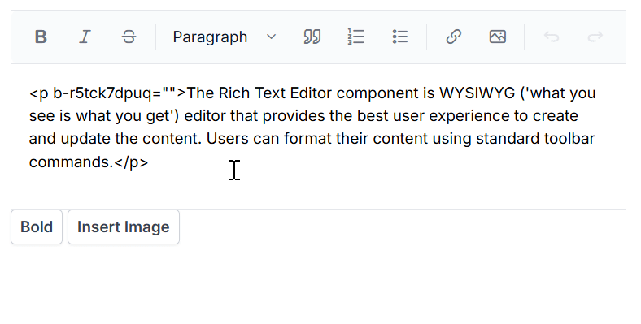

# Execute Command Programmatically

In Rich Text Editor, the [ExecuteCommand](https://help.syncfusion.com/cr/blazor/Syncfusion.Blazor.RichTextEditor.ExecuteCommandOption.html) method runs the HTML and Markdown commands programmatically to manipulate content in the current editable area.

## HTML editor commands

The `ExecuteCommand` methods support following HTML editor commands.

<table>
<tr>
<td><b>Commands</b></td>
<td><b>Description</b></td>
<td><b>Code snippets</b></td>
</tr>

<tr>
<td>
Bold
</td>
<td>
Make the selected content bold.
</td>
<td>

await this.RteObj.ExecuteCommandAsync(CommandName.Bold); 
</td>
</tr>

<tr>
<td>
Italic
</td>
<td>
Apply the italic style to the selected content.
</td>
<td>

await this.RteObj.ExecuteCommandAsync(CommandName.Italic);
</td>
</tr>

<tr>
<td>
Underline
</td>
<td>
Underline the selected content.
</td>
<td>

await this.RteObj.ExecuteCommandAsync(CommandName.Underline);
</td>
</tr>

<tr>
<td>
StrikeThrough
</td>
<td>
Apply single-line strikethrough formatting for the selected content.
</td>
<td>

await this.RteObj.ExecuteCommandAsync(CommandName.StrikeThrough);
</td>
</tr>

<tr>
<td>
Superscript
</td>
<td>
Makes the selected content as superscript (higher).
</td>
<td>

await this.RteObj.ExecuteCommandAsync(CommandName.Superscript);
</td>
</tr>

<tr>
<td>
Subscript
</td>
<td>
Makes the selected content as subscript (lower).
</td>
<td>

await this.RteObj.ExecuteCommandAsync(CommandName.Subscript);
</td>
</tr>

<tr>
<td>
Uppercase
</td>
<td>
Change the selected content to upper case.
</td>
<td>

await this.RteObj.ExecuteCommandAsync(CommandName.Uppercase);
</td>
</tr>

<tr>
<td>
Lowercase
</td>
<td>
Change the selected content to lower case.
</td>
<td>

await this.RteObj.ExecuteCommandAsync(CommandName.Lowercase);
</td>
</tr>

<tr>
<td>
FontColor
</td>
<td>
Apply the specified font color to the selected content.
</td>
<td>

await this.RteObj.ExecuteCommandAsync(CommandName.FontColor, "Red");
</td>
</tr>

<tr>
<td>
FontName
</td>
<td>
Apply the specified font name to the selected content.
</td>
<td>

await this.RteObj.ExecuteCommandAsync(CommandName.FontName, "Impact");
</td>
</tr>

<tr>
<td>
FontSize
</td>
<td>
Apply the specified font size to the selected content.
</td>
<td>

await this.RteObj.ExecuteCommandAsync(CommandName.FontSize, "10pt");
</td>
</tr>

<tr>
<td>
BackgroundColor
</td>
<td>
Apply the specified background color to the selected content.
</td>
<td>

await this.RteObj.ExecuteCommandAsync(CommandName.BackgroundColor, "red");
</td>
</tr>

<tr>
<td>
JustifyCenter
</td>
<td>
Align the content with the centre margin.
</td>
<td>

await this.RteObj.ExecuteCommandAsync(CommandName.JustifyCenter);
</td>
</tr>

<tr>
<td>
JustifyFull
</td>
<td>
Align the content with justify margin.
</td>
<td>

await this.RteObj.ExecuteCommandAsync(CommandName.JustifyFull);
</td>
</tr>

<tr>
<td>
JustifyLeft
</td>
<td>
Align the content with the left margin.
</td>
<td>

await this.RteObj.ExecuteCommandAsync(CommandName.JustifyLeft);
</td>
</tr>

<tr>
<td>
JustifyRight
</td>
<td>
Align the content with the margin on the right.
</td>
<td>

await this.RteObj.ExecuteCommandAsync(CommandName.JustifyRight);
</td>
</tr>

<tr>
<td>
CreateLink
</td>
<td>
Creates a hyperlink from a text or image to a specific location in the content.
</td>
<td>

await this.RteObj.ExecuteCommandAsync(CommandName.CreateLink, new LinkCommandsArgs() { Text = "Links", Url= "http://", Title = "Link"});
</td>
</tr>

<tr>
<td>
Indent
</td>
<td>
Allows you to increase the content's indentation level.
</td>
<td>

await this.RteObj.ExecuteCommandAsync(CommandName.Indent);
</td>
</tr>

<tr>
<td>
InsertHTML
</td>
<td>
Insert the HTML content at the current cursor position.
</td>
<td>

await this.RteObj.ExecuteCommandAsync(CommandName.InsertHTML,"
Syncfusion Rich Text Editor
");
</td>
</tr>

<tr>
<td>
InsertOrderedList
</td>
<td>
Create a new list item(numbered).
</td>
<td>

await this.RteObj.ExecuteCommandAsync(CommandName.InsertOrderedList);
</td>
</tr>

<tr>
<td>
InsertUnorderedList
</td>
<td>
Create a new list item(bulleted).
</td>
<td>

await this.RteObj.ExecuteCommandAsync(CommandName.InsertUnorderedList);
</td>
</tr>

<tr>
<td>
NumberFormatList - None
</td>
<td>
Create an ordered list without any specific numbering style.
</td>
<td>

await this.RteObj.ExecuteCommandAsync(CommandName.NumberFormatList, "none");
</td>
</tr>

<tr>
<td>
NumberFormatList - Number
</td>
<td>
Creates an ordered list using standard Arabic numerals (1, 2, 3...).
</td>
<td>

await this.RteObj.ExecuteCommandAsync(CommandName.NumberFormatList, "decimal");
</td>
</tr>

<tr>
<td>
NumberFormatList - Lower alpha
</td>
<td>
Creates an ordered list using lowercase alphabetic characters (a, b, c...).
</td>
<td>

await this.RteObj.ExecuteCommandAsync(CommandName.NumberFormatList, "lowerAlpha");
</td>
</tr>

<tr>
<td>
NumberFormatList - Upper alpha
</td>
<td>
Creates an ordered list using uppercase alphabetic characters (A, B, C...).
</td>
<td>

await this.RteObj.ExecuteCommandAsync(CommandName.NumberFormatList, "upperAlpha");
</td>
</tr>

<tr>
<td>
NumberFormatList - Lower roman
</td>
<td>
Creates an ordered list using lowercase Roman numerals (i, ii, iii...).
</td>
<td>

await this.RteObj.ExecuteCommandAsync(CommandName.NumberFormatList, "lowerRoman");
</td>
</tr>

<tr>
<td>
NumberFormatList - Upper roman
</td>
<td>
Creates an ordered list using uppercase Roman numerals (I, II, III...).
</td>
<td>

await this.RteObj.ExecuteCommandAsync(CommandName.NumberFormatList, "upperRoman");
</td>
</tr>

<tr>
<td>
NumberFormatList - Lower greek
</td>
<td>
Creates an ordered list using lowercase Greek letters (α, β, γ...).
</td>
<td>

await this.RteObj.ExecuteCommandAsync(CommandName.NumberFormatList, "lowerGreek");
</td>
</tr>

<tr>
<td>
BulletFormatList - None
</td>
<td>
Creates an unordered list without any specific style.
</td>
<td>

await this.RteObj.ExecuteCommandAsync(CommandName.BulletFormatList, "none");
</td>
</tr>

<tr>
<td>
BulletFormatList - Disc
</td>
<td>
Creates an unordered list using solid disc bullets (•).
</td>
<td>

await this.RteObj.ExecuteCommandAsync(CommandName.BulletFormatList, "disc");
</td>
</tr>

<tr>
<td>
BulletFormatList - Circle
</td>
<td>
Creates an unordered list using hollow circle bullets (○).
</td>
<td>

await this.RteObj.ExecuteCommandAsync(CommandName.BulletFormatList, "circle");
</td>
</tr>

<tr>
<td>
BulletFormatList - Square
</td>
<td>
Creates an unordered list using square bullets (▪).
</td>
<td>

await this.RteObj.ExecuteCommandAsync(CommandName.BulletFormatList, "square");
</td>
</tr>

<tr>
<td>
Outdent
</td>
<td>
Allows you to decrease the content's indentation level.
</td>
<td>

await this.RteObj.ExecuteCommandAsync(CommandName.Outdent);
</td>
</tr>

<tr>
<td>
Redo
</td>
<td>
Allows you to redo your actions. 
</td>
<td>

await this.RteObj.ExecuteCommandAsync(CommandName.Redo);
</td>
</tr>

<tr>
<td>
RemoveFormat
</td>
<td>
Remove all formatting styles (such as bold, italic, underline, color, superscript, subscript, and more) from the currently selected text.
</td>
<td>

await this.RteObj.ExecuteCommandAsync(CommandName.RemoveFormat);
</td>
</tr>

<tr>
<td>
InsertText
</td>
<td>
Text will be inserted at the current cursor position.
</td>
<td>

await this.RteObj.ExecuteCommandAsync(CommandName.InsertText, "Inserted text");
</td>
</tr>

<tr>
<td>
InsertImage
</td>
<td>
Insert an image to the current cursor position.
</td>
<td>

await this.RteObj.ExecuteCommandAsync(CommandName.InsertImage, new ImageCommandsArgs() { Url = "https://ej2.syncfusion.com/javascript/demos/src/rich-text-editor/images/RTEImage-Feather.png", CssClass = "rte-img" });
</td>
</tr>
</table>

N> Provided support to apply execute commands which do not require direct DOM access.

The following code block demonstrates the usage of the `ExecuteCommand` in Rich Text Editor.









## Markdown editor commands  

The `ExecuteCommand` methods support following markdown commands.

<table>
<tr>
<td><b>Commands</b></td>
<td><b>Description</b></td>
<td><b>Code snippets</b></td>
</tr>

<tr>
<td>
Bold
</td>
<td>
Make the selected content bold.
</td>
<td>

await this.RteObj.ExecuteCommandAsync(CommandName.Bold); 
</td>
</tr>

<tr>
<td>
Italic
</td>
<td>
Apply the italic style to the selected content.
</td>
<td>

await this.RteObj.ExecuteCommandAsync(CommandName.Italic);
</td>
</tr>

<tr>
<td>
StrikeThrough
</td>
<td>
Apply single-line strikethrough formatting for the selected content.
</td>
<td>

await this.RteObj.ExecuteCommandAsync(CommandName.StrikeThrough);
</td>
</tr>

<tr>
<td>
Superscript
</td>
<td>
Makes the selected content as superscript (higher).
</td>
<td>

await this.RteObj.ExecuteCommandAsync(CommandName.Superscript);
</td>
</tr>

<tr>
<td>
Subscript
</td>
<td>
Makes the selected content as subscript (lower).
</td>
<td>

await this.RteObj.ExecuteCommandAsync(CommandName.Subscript);
</td>
</tr>

<tr>
<td>
Uppercase
</td>
<td>
Change the selected content to upper case.
</td>
<td>

await this.RteObj.ExecuteCommandAsync(CommandName.Uppercase);
</td>
</tr>

<tr>
<td>
Lowercase
</td>
<td>
Change the selected content to lower case.
</td>
<td>

await this.RteObj.ExecuteCommandAsync(CommandName.Lowercase);
</td>
</tr>

<tr>
<td>
CreateLink
</td>
<td>
Creates a hyperlink from a text or image to a specific location in the content.
</td>
<td>

await this.RteObj.ExecuteCommandAsync(CommandName.CreateLink, new LinkCommandsArgs() { Text = "Links", Url= "http://", Title = "Link"});
</td>
</tr>

<tr>
<td>
InsertOrderedList
</td>
<td>
Create a new list item(numbered).
</td>
<td>

await this.RteObj.ExecuteCommandAsync(CommandName.InsertOrderedList);
</td>
</tr>

<tr>
<td>
InsertUnorderedList
</td>
<td>
Create a new list item(bulleted).
</td>
<td>

await this.RteObj.ExecuteCommandAsync(CommandName.InsertUnorderedList);
</td>
</tr>

<tr>
<td>
Redo
</td>
<td>
Allows you to redo your actions. 
</td>
<td>

await this.RteObj.ExecuteCommandAsync(CommandName.Redo);
</td>
</tr>

<tr>
<td>
InsertText
</td>
<td>
Text will be inserted at the current cursor position.
</td>
<td>

await this.RteObj.ExecuteCommandAsync(CommandName.InsertText, "Inserted text");
</td>
</tr>

<tr>
<td>
InsertImage
</td>
<td>
Insert an image to the current cursor position.
</td>
<td>

await this.RteObj.ExecuteCommandAsync(CommandName.InsertImage, new ImageCommandsArgs() { Url = "https://ej2.syncfusion.com/javascript/demos/src/rich-text-editor/images/RTEImage-Feather.png", CssClass = "rte-img" });
</td>
</tr>
</table>









N> You can refer to our [Blazor Rich Text Editor](https://www.syncfusion.com/blazor-components/blazor-wysiwyg-rich-text-editor) feature tour page for its groundbreaking feature representations. You can also explore our [Blazor Rich Text Editor](https://blazor.syncfusion.com/demos/rich-text-editor/overview?theme=bootstrap5) example to knows how to render and configure the rich text editor tools.