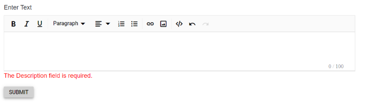
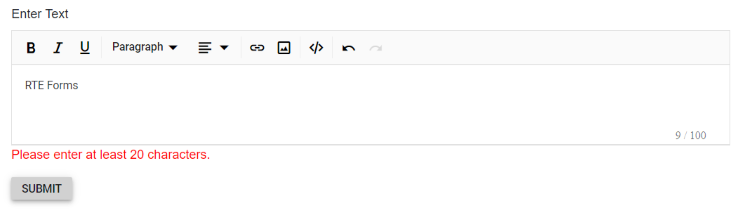
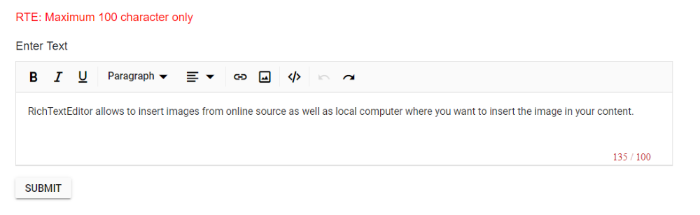

# Form validation in Blazor RichTextEditor Component

This following sample demonstrate how to get the Rich Text Editor validation error message in button click.

## Render the editor in a form




@using Syncfusion.Blazor.RichTextEditor
@using System.ComponentModel.DataAnnotations;

    

        

            <EditForm Model="@Model">
                <DataAnnotationsValidator />
                <SfRichTextEditor ShowCharCount="true" MaxLength="100" Placeholder="Type something..." @bind-Value="@Model.Description" />
                <ValidationMessage For="@(() => Model.Description)" />
                

                    <button class="samplebtn e-control e-btn" type="reset" data-ripple="true">Reset</button>
                    <button class="samplebtn e-control e-btn" type="submit" data-ripple="true">Submit</button>
                

            </EditForm>
        

    

@code{
    private class FormModel
    {
        [Required]
        [MinLength(20, ErrorMessage = "Please enter at least 20 characters.")]
        public string Description { get; set; }
    }
    private FormModel Model = new FormModel();
}










## Validation Rules

The Rich Text Editor is a textarea control. The Rich Text Editor also provides the functionality of character count and its validation. So, you can validate the Rich Text Editor's value on form submission by applying Validation Rules and Validation Message to the Rich Text Editor.

| Rules | Description |
|----------------|---------|
| Required | Requires value for the Rich Text Editor control.|
| MinLength | Requires the value to be of given minimum characters count.|
| MaxLength | Requires the value to be of given maximum characters count.|

This sample is demonstrated form validation using the `DataAnnotationsValidator`.




@using Syncfusion.Blazor.RichTextEditor
@using System.ComponentModel.DataAnnotations;

<EditForm Model="@MyForm">
    <DataAnnotationsValidator />
    

        <label for="description">Enter Text</label>
        <SfRichTextEditor ShowCharCount="true" MaxLength="200" Placeholder="Type something" @bind-Value="@MyForm.Description">
        </SfRichTextEditor>
        <ValidationMessage For="@(() => MyForm.Description)"></ValidationMessage>
    

    <button class="e-btn" type="submit">Submit</button>
</EditForm>

@code{
    public class Form
    {
        [Required]
        [MinLength(20, ErrorMessage = "Please enter at least 20 characters.")]
        public string Description { get; set; } = "
Rich Text Editor allows to insert images from online source as well as local computer where you want to insert the image in your content.
";
    }
    private Form MyForm = new Form();
}










## Custom Placement of Validation Message

The Form Validation error message can be placed from default position to desired custom location.




@using Syncfusion.Blazor.RichTextEditor
@using System.ComponentModel.DataAnnotations;

<EditForm Model="@MyForm">
    

        <ValidationMessage For="@(() => MyForm.Description)"></ValidationMessage>
    

    <DataAnnotationsValidator />
    

        <label for="description">Enter Text</label>
        <SfRichTextEditor ShowCharCount="true" MaxLength="200" Placeholder="Type something" @bind-Value="@MyForm.Description">
        </SfRichTextEditor>
    

    <button class="e-btn" type="submit">Submit</button>
</EditForm>

@code{
    public class Form
    {
        [Required(ErrorMessage = "RTE: value is required")]
        [MinLength(15, ErrorMessage = "RTE: Need atleast 15 character length")]
        [MaxLength(100, ErrorMessage = "RTE: Maximum 200 characters only")]
        public string Description { get; set; } = "
Rich Text Editor allows to insert images from online source as well as local computer where you want to insert the image in your content.
";
    }
    private Form MyForm = new Form();
}










> You can refer to our [Blazor Rich Text Editor](https://www.syncfusion.com/blazor-components/blazor-wysiwyg-rich-text-editor) feature tour page for its groundbreaking feature representations. You can also explore our [Blazor Rich Text Editor](https://blazor.syncfusion.com/demos/rich-text-editor/overview?theme=bootstrap4) example to know how to render and configure the rich text editor tools.