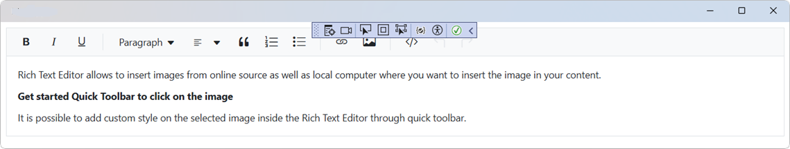
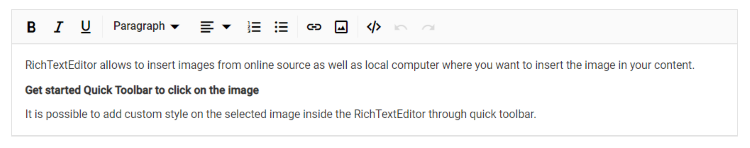
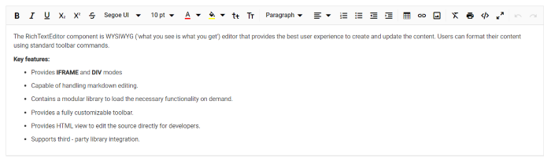

# Getting Started with Blazor RichTextEditor

This section explains you through the step-by-step process of integrating the Syncfusion® Blazor RichTextEditor component to your Blazor Maui app using both Visual Studio and Visual Studio Code.





## Prerequisites

To use the MAUI project templates, install the Mobile development with the .NET extension for Visual Studio. For more details, refer to [here](https://learn.microsoft.com/en-us/dotnet/MAUI/get-started/installation?tabs=vswin) or the [Syncfusion® Blazor Extension](https://blazor.syncfusion.com/documentation/visual-studio-integration/template-studio).

## Create a new Blazor MAUI App in Visual Studio

You can create a Blazor MAUI App using Visual Studio via [Microsoft Templates](https://learn.microsoft.com/en-us/dotnet/maui/get-started/first-app?pivots=devices-windows&view=net-maui-9.0&tabs=vswin). For detailed instructions, refer to [this Blazor MAUI App Getting Started](https://blazor.syncfusion.com/documentation/getting-started/maui-blazor-app) documentation.

## Install Syncfusion<sup style="font-size:70%">&reg;</sup> Blazor RichTextEditor and Themes NuGet in the app

To add **Blazor RichTextEditor**  component in the app, open the NuGet package manager in Visual Studio (Tools → NuGet Package Manager → Manage NuGet Packages for Solution), search and install [Syncfusion.Blazor.RichTextEditor](https://www.nuget.org/packages/Syncfusion.Blazor.RichTextEditor) and [Syncfusion.Blazor.Themes](https://www.nuget.org/packages/Syncfusion.Blazor.Themes/).




Install-Package Syncfusion.Blazor.RichTextEditor -Version {{ site.releaseversion }}
Install-Package Syncfusion.Blazor.Themes -Version {{ site.releaseversion }}




N> Syncfusion<sup style="font-size:70%">&reg;</sup> Blazor components are available in [nuget.org](https://www.nuget.org/packages?q=syncfusion.blazor). Refer to [NuGet packages](https://blazor.syncfusion.com/documentation/nuget-packages) topic for available NuGet packages list with component details.





## Prerequisites

To use the MAUI project templates, install the Mobile development with the .NET extension for Visual Studio Code. For more details, refer to [here](https://learn.microsoft.com/en-us/dotnet/maui/get-started/installation?view=net-maui-9.0&tabs=visual-studio-code) or the [Syncfusion® Blazor Extension](https://blazor.syncfusion.com/documentation/visual-studio-code-integration/create-project).

## Create a new Blazor MAUI App in Visual Studio Code

You can create a Blazor MAUI App using Visual Studio Code via [Microsoft Templates](https://learn.microsoft.com/en-us/dotnet/maui/get-started/first-app?pivots=devices-windows&view=net-maui-9.0&tabs=visual-studio-code) or the [Syncfusion® Blazor Extension](https://blazor.syncfusion.com/documentation/visual-studio-code-integration/create-project). For detailed instructions, refer to [this Blazor MAUI App Getting Started](https://blazor.syncfusion.com/documentation/getting-started/maui-blazor-app) documentation.

## Install Blazor RichTextEditor and Themes NuGet in the App

To add **Blazor RichTextEditor**  component in the app, open the NuGet package manager in Visual Studio (Tools → NuGet Package Manager → Manage NuGet Packages for Solution), search and install [Syncfusion.Blazor.RichTextEditor](https://www.nuget.org/packages/Syncfusion.Blazor.RichTextEditor) and [Syncfusion.Blazor.Themes](https://www.nuget.org/packages/Syncfusion.Blazor.Themes/).





dotnet add package Syncfusion.Blazor.RichTextEditor -v {{ site.releaseversion }}
dotnet add package Syncfusion.Blazor.Themes -v {{ site.releaseversion }}
dotnet restore





N> Syncfusion<sup style="font-size:70%">&reg;</sup> Blazor components are available in [nuget.org](https://www.nuget.org/packages?q=syncfusion.blazor). Refer to [NuGet packages](https://blazor.syncfusion.com/documentation/nuget-packages) topic for available NuGet packages list with component details.





## Add Import Namespaces

Open the **~/_Imports.razor** file and import the `Syncfusion.Blazor` and `Syncfusion.Blazor.RichTextEditor` namespace.




@using Syncfusion.Blazor 
@using Syncfusion.Blazor.RichTextEditor




## Register Syncfusion<sup style="font-size:70%">&reg;</sup> Blazor Service

Register the Syncfusion<sup style="font-size:70%">&reg;</sup> Blazor Service in the **~/MauiProgram.cs** file.




using Microsoft.Extensions.Logging;
using Syncfusion.Blazor;

namespace MauiBlazorWindow;

    public static class MauiProgram
    {
        public static MauiApp CreateMauiApp()
        {
            var builder = MauiApp.CreateBuilder();
            builder
                .UseMauiApp<App>()
                .ConfigureFonts(fonts =>
                {
                    fonts.AddFont("OpenSans-Regular.ttf", "OpenSansRegular");
                });

            builder.Services.AddMauiBlazorWebView();
            builder.Services.AddSyncfusionBlazor();
#if DEBUG
            builder.Services.AddBlazorWebViewDeveloperTools();
            builder.Logging.AddDebug();
#endif

            return builder.Build();
        }
    }




## Add stylesheet and script resources

The theme stylesheet and script can be accessed from NuGet through [Static Web Assets](https://blazor.syncfusion.com/documentation/appearance/themes#static-web-assets). Include the stylesheet and script references in the `<head>` section of the **~/index.html** file.

```html
<head>
    ....
    <link href="_content/Syncfusion.Blazor.Themes/bootstrap5.css" rel="stylesheet" />
    <script src="_content/Syncfusion.Blazor.Core/scripts/syncfusion-blazor.min.js" type="text/javascript"></script>

    //Blazor RichTextEditor Component script reference.
    <!-- <script src="_content/Syncfusion.Blazor.RichTextEditor/scripts/sf-richtexteditor.min.js" type="text/javascript"></script> -->
</head>
```

N> Check out the [Blazor Themes](https://blazor.syncfusion.com/documentation/appearance/themes) topic to discover various methods ([Static Web Assets](https://blazor.syncfusion.com/documentation/appearance/themes#static-web-assets), [CDN](https://blazor.syncfusion.com/documentation/appearance/themes#cdn-reference), and [CRG](https://blazor.syncfusion.com/documentation/common/custom-resource-generator)) for referencing themes in your Blazor application. Also, check out the [Adding Script Reference](https://blazor.syncfusion.com/documentation/common/adding-script-references) topic to learn different approaches for adding script references in your Blazor application.

## Add Blazor RichTextEditor component

Add the Syncfusion<sup style="font-size:70%">&reg;</sup> Blazor RichTextEditor component in the **~/Pages/Home.razor** file.




<SfRichTextEditor>
    <p>Rich Text Editor allows to insert images from online source as well as local computer where you want to insert the image in your content.</p>
    <p><b>Get started Quick Toolbar to click on the image</b></p>
    <p>It is possible to add custom style on the selected image inside the Rich Text Editor through quick toolbar.</p>
</SfRichTextEditor>




### How to Run the Sample on Windows

Run the sample in Windows Machine mode, and it will run Blazor MAUI in Windows.



### How to Run the Sample on Android

To run the Blazor RichTextEditor in a Blazor Android MAUI application using the Android emulator, follow these steps:

Refer [here](https://learn.microsoft.com/en-us/dotnet/maui/android/emulator/device-manager#android-device-manager-on-windows) to install and launch Android emulator.

N> If you encounter any errors while using the Android Emulator, refer to the following link for troubleshooting guidance[Troubleshooting Android Emulator](https://learn.microsoft.com/en-us/dotnet/maui/android/emulator/troubleshooting).



## Configure the Toolbar

Configure the toolbar with the tools using [RichTextEditorToolbarSettings.Items](https://help.syncfusion.com/cr/blazor/Syncfusion.Blazor.RichTextEditor.RichTextEditorToolbarSettings.html#Syncfusion_Blazor_RichTextEditor_RichTextEditorToolbarSettings_Items) property as your application requires.




<SfRichTextEditor>
    <RichTextEditorToolbarSettings Items="@Tools" />
    <p>The Rich Text Editor component is WYSIWYG ('what you see is what you get') editor that provides the best user experience to create and update the content. Users can format their content using standard toolbar commands.</p>
    <p><b> Key features:</b></p>
    <ul>
        <li><p> Provides <b>IFRAME</b> and <b>DIV</b> modes </p></li>
        <li><p> Capable of handling markdown editing.</p></li>
        <li><p> Contains a modular library to load the necessary functionality on demand.</p></li>
        <li><p> Provides a fully customizable toolbar.</p></li>
        <li><p> Provides HTML view to edit the source directly for developers.</p></li>
        <li><p> Supports third - party library integration.</p></li>
        <li><p> Allows preview of modified content before saving it.</p></li>
    </ul>
</SfRichTextEditor>

@code {
    private List<ToolbarItemModel> Tools = new List<ToolbarItemModel>()
    {
        new ToolbarItemModel() { Command = ToolbarCommand.Bold },
        new ToolbarItemModel() { Command = ToolbarCommand.Italic },
        new ToolbarItemModel() { Command = ToolbarCommand.Underline },
        new ToolbarItemModel() { Command = ToolbarCommand.StrikeThrough },
        new ToolbarItemModel() { Command = ToolbarCommand.FontName },
        new ToolbarItemModel() { Command = ToolbarCommand.FontSize },
        new ToolbarItemModel() { Command = ToolbarCommand.Separator },
        new ToolbarItemModel() { Command = ToolbarCommand.FontColor },
        new ToolbarItemModel() { Command = ToolbarCommand.BackgroundColor },
        new ToolbarItemModel() { Command = ToolbarCommand.Separator },
        new ToolbarItemModel() { Command = ToolbarCommand.Formats },
        new ToolbarItemModel() { Command = ToolbarCommand.Alignments },
        new ToolbarItemModel() { Command = ToolbarCommand.Separator },
        new ToolbarItemModel() { Command = ToolbarCommand.LowerCase },
        new ToolbarItemModel() { Command = ToolbarCommand.UpperCase },
        new ToolbarItemModel() { Command = ToolbarCommand.SuperScript },
        new ToolbarItemModel() { Command = ToolbarCommand.SubScript },
        new ToolbarItemModel() { Command = ToolbarCommand.Separator },
        new ToolbarItemModel() { Command = ToolbarCommand.OrderedList },
        new ToolbarItemModel() { Command = ToolbarCommand.UnorderedList },
        new ToolbarItemModel() { Command = ToolbarCommand.Outdent },
        new ToolbarItemModel() { Command = ToolbarCommand.Indent },
        new ToolbarItemModel() { Command = ToolbarCommand.Separator },
        new ToolbarItemModel() { Command = ToolbarCommand.CreateLink },
        new ToolbarItemModel() { Command = ToolbarCommand.Image },
        new ToolbarItemModel() { Command = ToolbarCommand.CreateTable },
        new ToolbarItemModel() { Command = ToolbarCommand.Separator },
        new ToolbarItemModel() { Command = ToolbarCommand.ClearFormat },
        new ToolbarItemModel() { Command = ToolbarCommand.Print },
        new ToolbarItemModel() { Command = ToolbarCommand.SourceCode },
        new ToolbarItemModel() { Command = ToolbarCommand.FullScreen },
        new ToolbarItemModel() { Command = ToolbarCommand.Separator },
        new ToolbarItemModel() { Command = ToolbarCommand.Undo },
        new ToolbarItemModel() { Command = ToolbarCommand.Redo }
    };
}






## Insert images and links

The **Image** inserts an image into Rich Text Editor's content area, and the **Link** links an external resources such as website URLs to the selected text in the Rich Text Editor's content respectively.

Specifies the items to be rendered in quick toolbar based on the target elements such as image, link and table element. The quick toolbar opens to customize the element by clicking the target element.




<SfRichTextEditor>
    <RichTextEditorToolbarSettings Items="@Tools" />
    <RichTextEditorQuickToolbarSettings Image="@Image" Link="@Link" />
    <p>Rich Text Editor allows to insert images from online source as well as local computer where you want to insert the image in your content.</p>
    <p><b>Get started Quick Toolbar to click on the image</b></p>
    <p>It is possible to add custom style on the selected image inside the Rich Text Editor through quick toolbar.</p>
    
</SfRichTextEditor>

@code {
    private List<ToolbarItemModel> Tools = new List<ToolbarItemModel>()
    {
        new ToolbarItemModel() { Command = ToolbarCommand.Bold },
        new ToolbarItemModel() { Command = ToolbarCommand.Italic },
        new ToolbarItemModel() { Command = ToolbarCommand.Underline },
        new ToolbarItemModel() { Command = ToolbarCommand.Separator },
        new ToolbarItemModel() { Command = ToolbarCommand.Formats },
        new ToolbarItemModel() { Command = ToolbarCommand.Alignments },
        new ToolbarItemModel() { Command = ToolbarCommand.Separator },
        new ToolbarItemModel() { Command = ToolbarCommand.CreateLink },
        new ToolbarItemModel() { Command = ToolbarCommand.Image },
        new ToolbarItemModel() { Command = ToolbarCommand.Separator },
        new ToolbarItemModel() { Command = ToolbarCommand.SourceCode },
        new ToolbarItemModel() { Command = ToolbarCommand.Separator },
        new ToolbarItemModel() { Command = ToolbarCommand.Undo },
        new ToolbarItemModel() { Command = ToolbarCommand.Redo }
    };
    private List<ImageToolbarItemModel> Image = new List<ImageToolbarItemModel>()
    {
        new ImageToolbarItemModel() { Command = ImageToolbarCommand.Replace },
        new ImageToolbarItemModel() { Command = ImageToolbarCommand.Align },
        new ImageToolbarItemModel() { Command = ImageToolbarCommand.Caption },
        new ImageToolbarItemModel() { Command = ImageToolbarCommand.Remove },
        new ImageToolbarItemModel() { Command = ImageToolbarCommand.OpenImageLink },
        new ImageToolbarItemModel() { Command = ImageToolbarCommand.HorizontalSeparator },
        new ImageToolbarItemModel() { Command = ImageToolbarCommand.EditImageLink },
        new ImageToolbarItemModel() { Command = ImageToolbarCommand.RemoveImageLink },
        new ImageToolbarItemModel() { Command = ImageToolbarCommand.Display },
        new ImageToolbarItemModel() { Command = ImageToolbarCommand.AltText },
        new ImageToolbarItemModel() { Command = ImageToolbarCommand.Dimension }
    };
    private List<LinkToolbarItemModel> Link = new List<LinkToolbarItemModel>()
    {
        new LinkToolbarItemModel() { Command = LinkToolbarCommand.Open },
        new LinkToolbarItemModel() { Command = LinkToolbarCommand.Edit },
        new LinkToolbarItemModel() { Command = LinkToolbarCommand.UnLink }
    };
}





## Retrieve the formatted content

To retrieve the editor contents in HTML format, use the [Value](https://help.syncfusion.com/cr/blazor/Syncfusion.Blazor.RichTextEditor.SfRichTextEditor.html#Syncfusion_Blazor_RichTextEditor_SfRichTextEditor_Value) property of Rich Text Editor, and to fetch the editor content as plain text, use the [GetText](https://help.syncfusion.com/cr/blazor/Syncfusion.Blazor.RichTextEditor.SfRichTextEditor.html#Syncfusion_Blazor_RichTextEditor_SfRichTextEditor_GetTextAsync) method of Rich Text Editor.




@using Syncfusion.Blazor.Buttons
@using Syncfusion.Blazor.RichTextEditor
@using Syncfusion.Blazor.Popups

<SfButton @onclick="@GetValue">Get Value</SfButton>
<SfButton @onclick="@GetText">Get Text</SfButton>

<br />
<SfDialog @ref="DialogObj" @bind-Visible="@Visibility" Content="@Content" Header="@Header" Target="#target" Height="200px"
          Width="400px" ShowCloseIcon="true">
    <DialogButtons>
        <DialogButton Content="Ok" IsPrimary="true" OnClick="@DlgButtonClick" />
    </DialogButtons>

</SfDialog>
<SfRichTextEditor @ref="RteObj" Value="@RteValue" />

@code {
    SfRichTextEditor RteObj;
    SfDialog DialogObj;
    private string Content;
    private bool Visibility = false;
    private string Header = "Rich Text Editor's Value";
    private string RteValue = @"<p>Rich Text Editor allows to insert images from online source as well as local computer where you want to insert the image in your content.</p><p><b>Get started Quick Toolbar to click on the image</b></p><p>It is possible to add custom style on the selected image inside the Rich Text Editor through quick toolbar.</p>";
    private async Task GetValue()
    {
        this.Content = this.RteValue;
        await this.DialogObj.ShowAsync();
    }
    private async Task GetText()
    {
        this.Content = await this.RteObj.GetTextAsync();
        this.DialogObj.ShowAsync();
    }
    private async Task DlgButtonClick(object arg)
    {
        await this.DialogObj.HideAsync();
    }
}




## Retrieve the number of characters

To retrieve the maximum number of characters in the Rich Text Editor's content, use the [GetCharCount](https://help.syncfusion.com/cr/blazor/Syncfusion.Blazor.RichTextEditor.SfRichTextEditor.html#Syncfusion_Blazor_RichTextEditor_SfRichTextEditor_GetCharCountAsync) method of the Rich Text Editor.




@using Syncfusion.Blazor.Buttons
@using Syncfusion.Blazor.RichTextEditor
@using Syncfusion.Blazor.Popups

<SfButton @onclick="@GetCharCount">Get Char Count</SfButton>

<br />
<SfDialog @ref="DialogObj" @bind-Visible="@Visibility" Content="@Content" Header="@Header" Target="#target" Height="200px"
          Width="400px" ShowCloseIcon="true">
    <DialogButtons>
        <DialogButton Content="Ok" IsPrimary="true" OnClick="@DlgButtonClick" />
    </DialogButtons>

</SfDialog>
<SfRichTextEditor @ref="RteObj" />

@code {
    SfRichTextEditor RteObj;
    SfDialog DialogObj;
    private string Content;
    private bool Visibility = false;
    private string Header = "Rich Text Editor's Value";
    private string RteValue = @"<p>Rich Text Editor allows to insert images from online source as well as local computer where you want to insert the image in your content.</p><p><b>Get started Quick Toolbar to click on the image</b></p><p>It is possible to add custom style on the selected image inside the Rich Text Editor through quick toolbar.</p>";
    private async Task GetCharCount()
    {
        double charCount = await this.RteObj.GetCharCountAsync();
        this.Content = charCount.ToString(); // Convert double to string
        await this.DialogObj.ShowAsync();
    }
    private async Task DlgButtonClick(object arg)
    {
        await this.DialogObj.HideAsync();
    }
}




## See also

* [Getting Started with Syncfusion<sup style="font-size:70%">&reg;</sup> Blazor for client-side in .NET Core CLI](../getting-started/blazor-webassembly-dotnet-cli)

* [Getting Started with Syncfusion<sup style="font-size:70%">&reg;</sup> Blazor for server-side in Visual Studio](../getting-started/blazor-server-side-visual-studio)

* [Getting Started with Syncfusion<sup style="font-size:70%">&reg;</sup> Blazor for server-side in .NET Core CLI](../getting-started/blazor-server-side-dotnet-cli)

* [Blog posting using Rich Text Editor](https://blazor.syncfusion.com/demos/rich-text-editor/usecase?theme=bootstrap5)

* [Accessibility in Rich text editor](https://blazor.syncfusion.com/documentation/rich-text-editor/accessibility)

* [Keyboard support in Rich text editor](https://blazor.syncfusion.com/documentation/rich-text-editor/keyboard-support)

* [Globalization in Rich text editor](https://blazor.syncfusion.com/documentation/rich-text-editor/globalization)