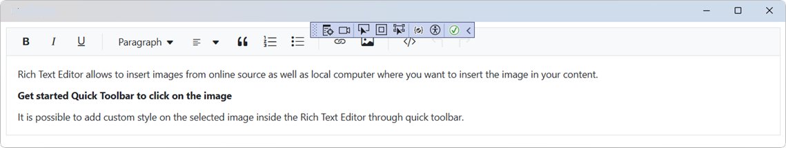
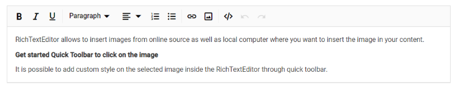

# Getting Started with Blazor Rich Text Editor

This section provides a step-by-step guide to integrating the [Syncfusion<sup style="font-size:70%">&reg;</sup> Blazor Rich TextEditor](https://www.syncfusion.com/blazor-components/blazor-rich-text-editor) component in your Blazor MAUI App using both [Visual Studio](https://visualstudio.microsoft.com/vs/) and [Visual Studio Code](https://code.visualstudio.com/).

> **Ready to streamline your Syncfusion<sup style="font-size:70%">&reg;</sup> Blazor development?** <br/>Discover the full potential of Syncfusion<sup style="font-size:70%">&reg;</sup> Blazor components with Syncfusion<sup style="font-size:70%">&reg;</sup> AI Coding Assistants. Effortlessly integrate, configure, and enhance your projects with intelligent, context-aware code suggestions, streamlined setups, and real-time insights—all seamlessly integrated into your preferred AI-powered IDEs like VS Code, Cursor, Syncfusion<sup style="font-size:70%">&reg;</sup> CodeStudio and more. [Explore Syncfusion<sup style="font-size:70%">&reg;</sup> AI Coding Assistants](https://blazor.syncfusion.com/documentation/ai-coding-assistant/overview)





## Prerequisites

To use the MAUI project templates, install the Mobile development with the .NET extension for Visual Studio. For more details, refer to [here](https://learn.microsoft.com/en-us/dotnet/MAUI/get-started/installation?tabs=vswin) or the [Syncfusion® Blazor Extension](https://blazor.syncfusion.com/documentation/visual-studio-integration/template-studio).

## Create a new Blazor MAUI App in Visual Studio

Create a Blazor MAUI App using Visual Studio via [Microsoft templates](https://learn.microsoft.com/en-us/dotnet/maui/get-started/first-app?pivots=devices-windows&view=net-maui-9.0&tabs=vswin). For detailed instructions, refer to the [Blazor MAUI App Getting Started](https://blazor.syncfusion.com/documentation/getting-started/maui-blazor-app) documentation.





## Prerequisites

To use the MAUI project templates, install the Mobile development with the .NET extension for Visual Studio Code. For more details, refer to [here](https://learn.microsoft.com/en-us/dotnet/maui/get-started/installation?view=net-maui-9.0&tabs=visual-studio-code) or the [Syncfusion® Blazor Extension](https://blazor.syncfusion.com/documentation/visual-studio-code-integration/create-project).

## Create a new Blazor MAUI App in Visual Studio Code

Create a Blazor MAUI App using Visual Studio Code via [Microsoft templates](https://learn.microsoft.com/en-us/dotnet/maui/get-started/first-app?pivots=devices-windows&view=net-maui-9.0&tabs=visual-studio-code) or the [Syncfusion® Blazor Extension](https://blazor.syncfusion.com/documentation/visual-studio-code-integration/create-project). For detailed instructions, refer to the [Blazor MAUI App Getting Started](https://blazor.syncfusion.com/documentation/getting-started/maui-blazor-app) documentation.

Alternatively, create a MAUI application by using the following command in the integrated terminal (<kbd>Ctrl</kbd>+<kbd>`</kbd>).




dotnet new maui-blazor -o MauiBlazorApp
cd MauiBlazorApp








## Install Syncfusion<sup style="font-size:70%">&reg;</sup> Blazor packages

Install the following NuGet packages in your project:

* [Syncfusion.Blazor.RichTextEditor](https://www.nuget.org/packages/Syncfusion.Blazor.RichTextEditor)  
* [Syncfusion.Blazor.Themes](https://www.nuget.org/packages/Syncfusion.Blazor.Themes)

You can install these packages using different methods as shown below:





## Steps
1. In Visual Studio Navigate to:

   **Tools → NuGet Package Manager → Manage NuGet Packages for Solution**
2. Search for the required packages.
3. Select the package and click **Install**.





## Steps
1. In Visual Studio Navigate to:

   **Tools → NuGet Package Manager → Package Manager Console**
2. Run the following commands:




Install-Package Syncfusion.Blazor.RichTextEditor -Version {{ site.releaseversion }}
Install-Package Syncfusion.Blazor.Themes -Version {{ site.releaseversion }}








## Steps
1. Open your project.
2. Open the terminal:
   - In Visual Studio Code: use the integrated terminal (<kbd>Ctrl</kbd> + <kbd>`</kbd>)
   - Or use any system terminal for CLI
3. Run the following commands:




dotnet add package Syncfusion.Blazor.RichTextEditor --version {{ site.releaseversion }}
dotnet add package Syncfusion.Blazor.Themes --version {{ site.releaseversion }}








N> All Syncfusion Blazor packages are available on [nuget.org](https://www.nuget.org/packages?q=syncfusion.blazor). See the [NuGet packages](https://blazor.syncfusion.com/documentation/nuget-packages) topic for details.

## Add import namespaces

After the packages are installed, open the **~/_Imports.razor** file and import the `Syncfusion.Blazor` and `Syncfusion.Blazor.RichTextEditor` namespaces.




@using Syncfusion.Blazor 
@using Syncfusion.Blazor.RichTextEditor




## Register Syncfusion<sup style="font-size:70%">&reg;</sup> Blazor service

Register the Syncfusion<sup style="font-size:70%">&reg;</sup> Blazor service in the **~/MauiProgram.cs** file.




....
using Syncfusion.Blazor;

....

public static class MauiProgram
{
    public static MauiApp CreateMauiApp()
    {
        ....
        builder.Services.AddSyncfusionBlazor();
        ....
    }
}




## Add stylesheet and script resources

The theme stylesheet and script can be accessed from NuGet through [Static Web Assets](https://blazor.syncfusion.com/documentation/appearance/themes#static-web-assets). Include the stylesheet and script references in the **~/index.html** file.

```html

<link href="_content/Syncfusion.Blazor.Themes/fluent2.css" rel="stylesheet" />
<script src="_content/Syncfusion.Blazor.Core/scripts/syncfusion-blazor.min.js" type="text/javascript"></script>

```

N> Check out the [Blazor Themes](https://blazor.syncfusion.com/documentation/appearance/themes) topic to discover various methods ([Static Web Assets](https://blazor.syncfusion.com/documentation/appearance/themes#static-web-assets), [CDN](https://blazor.syncfusion.com/documentation/appearance/themes#cdn-reference), and [CRG](https://blazor.syncfusion.com/documentation/common/custom-resource-generator)) for referencing themes in your Blazor application. Also, check out the [Adding Script Reference](https://blazor.syncfusion.com/documentation/common/adding-script-references) topic to learn different approaches for adding script references in your Blazor application.

## Add Syncfusion<sup style="font-size:70%">&reg;</sup> Blazor Rich Text Editor component

Add the Syncfusion<sup style="font-size:70%">&reg;</sup> Blazor Rich Text Editor component in the **~/Pages/Home.razor** file.




@using Syncfusion.Blazor.RichTextEditor

<SfRichTextEditor>
    <p>Rich Text Editor allows to insert images from online source as well as local computer where you want to insert the image in your content.</p>
    <p><b>Get started Quick Toolbar to click on the image</b></p>
    <p>It is possible to add custom style on the selected image inside the Rich Text Editor through quick toolbar.</p>
</SfRichTextEditor>




### How to run the sample on Windows

Run the sample in Windows Machine mode, and it will run Blazor MAUI in Windows.



### How to run the sample on Android

To run the Blazor Rich Text Editor in a Blazor Android MAUI application using the Android emulator, follow these steps:

Refer to the [Android Device Manager](https://learn.microsoft.com/en-us/dotnet/maui/android/emulator/device-manager#android-device-manager-on-windows) to install and launch Android emulator.

N> If you encounter any errors while using the Android Emulator, refer to the [Troubleshooting Android Emulator](https://learn.microsoft.com/en-us/dotnet/maui/android/emulator/troubleshooting) for guidance.



## See also

* [Getting Started with Syncfusion<sup style="font-size:70%">&reg;</sup> Blazor for client-side in .NET Core CLI](../getting-started/blazor-webassembly-dotnet-cli)

* [Getting Started with Syncfusion<sup style="font-size:70%">&reg;</sup> Blazor for server-side in Visual Studio](../getting-started/blazor-server-side-visual-studio)

* [Getting Started with Syncfusion<sup style="font-size:70%">&reg;</sup> Blazor for server-side in .NET Core CLI](../getting-started/blazor-server-side-dotnet-cli)

* [Blog posting using Rich Text Editor](https://blazor.syncfusion.com/demos/rich-text-editor/usecase?theme=bootstrap5)

* [Accessibility in Rich text editor](https://blazor.syncfusion.com/documentation/rich-text-editor/accessibility)

* [Keyboard support in Rich text editor](https://blazor.syncfusion.com/documentation/rich-text-editor/keyboard-support)

* [Globalization in Rich text editor](https://blazor.syncfusion.com/documentation/rich-text-editor/globalization)