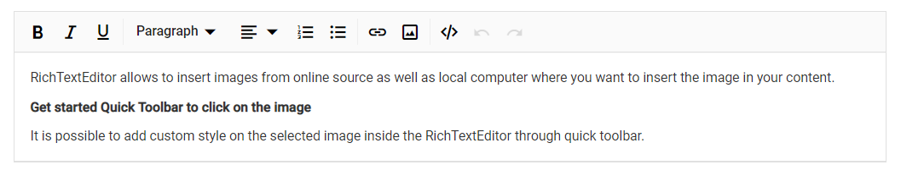
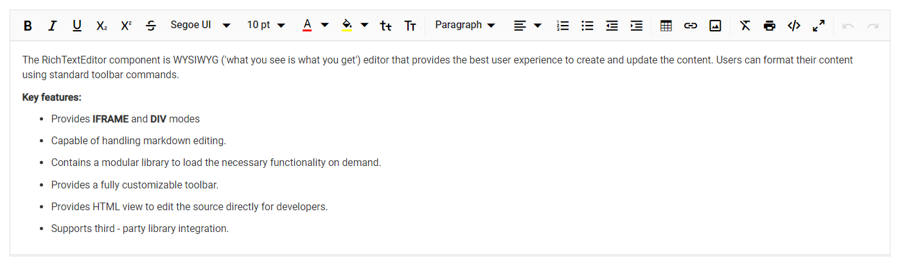
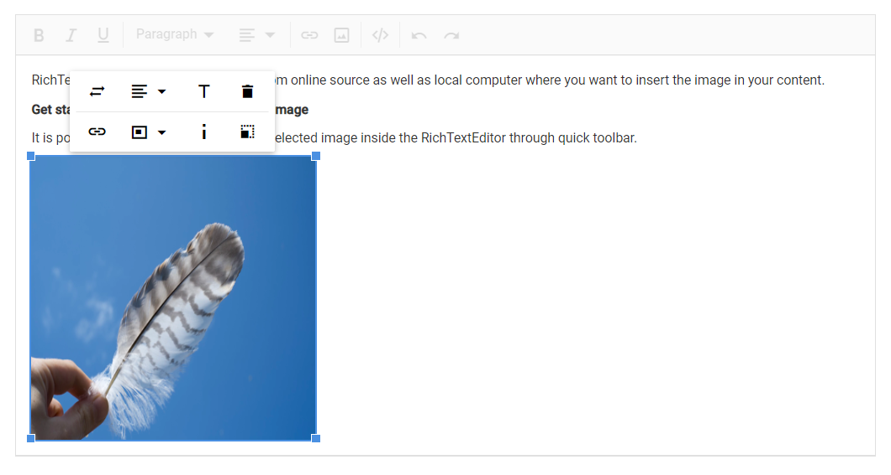

<!-- markdownlint-disable MD024 -->

# Getting Started with Blazor RichTextEditor Component

This section briefly explains how to include a Rich Text Editor component in your Blazor Server-side application. You can refer to our Getting Started with [Syncfusion Blazor for Server-Side in Visual Studio 2019 page](../getting-started/blazor-server-side-visual-studio-2019/) for the introduction and configuring the common specifications.

To get start quickly with Blazor Rich Text Editor components, you can check on this video:


> You can also explore our [Blazor Rich Text Editor](https://blazor.syncfusion.com/demos/rich-text-editor/overview?theme=bootstrap4) example to knows how to render and configure the rich text editor tools.

## Importing Syncfusion Blazor component in the application

* Install **Syncfusion.Blazor.RichTextEditor** NuGet package to the application by using the **NuGet Package Manager**.

* You can add the client-side resources using [NuGet](https://blazor.syncfusion.com/documentation/appearance/themes#static-web-assets) package in the **HEAD** element of the **~/Pages/_Host.cshtml** page.

    ```cshtml

    <head>
        <environment include="Development">
        ....
        ....
            <link href="_content/Syncfusion.Blazor/styles/fabric.css" rel="stylesheet" />
            <!---CDN--->
            @*<link href="https://cdn.syncfusion.com/blazor/18.4.42/styles/fabric.css" rel="stylesheet" />*@
    </environment>
    </head>

    ```

    > For Internet Explorer 11 kindly refer the polyfills. Refer the [documentation](../common/how-to/render-blazor-server-app-in-ie/) for more information.

    ```cshtml

    <head>
    <environment include="Development">
        <link href="_content/Syncfusion.Blazor/styles/fabric.css" rel="stylesheet" />
        <script src="https://github.com/Daddoon/Blazor.Polyfill/releases/download/3.0.1/blazor.polyfill.min.js"></script>
    </environment>
    </head>

    ```

## Adding component package to the application

Open **~/_Imports.razor** file and import the **Syncfusion.Blazor.RichTextEditor** package.

```cshtml

@using Syncfusion.Blazor.RichTextEditor

```

## Add SyncfusionBlazor service in Startup.cs

Open the **Startup.cs** file and add services required by Syncfusion components using **services.AddSyncfusionBlazor()** method. Add this method in the **ConfigureServices** function as follows.

```csharp

using Syncfusion.Blazor;

namespace BlazorApplication
{
    public class Startup
    {
        ....
        ....
        public void ConfigureServices(IServiceCollection services)
        {
            ....
            ....
            services.AddSyncfusionBlazor();
        }
    }
}

```

## Add Rich Text Editor component

To initialize the Rich Text Editor component, add the below code to your **Index.razor** view page which is present under **~/Pages** folder.

The following code explains how to initialize a simple Rich Text Editor in Razor page.

```cshtml

@using Syncfusion.Blazor.RichTextEditor

<SfRichTextEditor>
    <p>Rich Text Editor allows to insert images from online source as well as local computer where you want to insert the image in your content.</p>
    <p><b>Get started Quick Toolbar to click on the image</b></p>
    <p>It is possible to add custom style on the selected image inside the Rich Text Editor through quick toolbar.</p>
</SfRichTextEditor>

```

## Run the application

After successful compilation of your application, run the application.

The output will be as follows.



## Configure the Toolbar

Configure the toolbar with the tools using `Items` field of the `RichTextEditorToolbarSettings` property as your application requires.

```cshtml

@using Syncfusion.Blazor.RichTextEditor

<SfRichTextEditor>
    <RichTextEditorToolbarSettings Items="@Tools" />
    <p>The Rich Text Editor component is WYSIWYG ('what you see is what you get') editor that provides the best user experience to create and update the content. Users can format their content using standard toolbar commands.</p>
    <p><b> Key features:</b></p>
    <ul>
        <li><p> Provides <b>IFRAME</b> and <b>DIV</b> modes </p></li>
        <li><p> Capable of handling markdown editing.</p></li>
        <li><p> Contains a modular library to load the necessary functionality on demand.</p></li>
        <li><p> Provides a fully customizable toolbar.</p></li>
        <li><p> Provides HTML view to edit the source directly for developers.</p></li>
        <li><p> Supports third - party library integration.</p></li>
        <li><p> Allows preview of modified content before saving it.</p></li>
    </ul>
</SfRichTextEditor>

@code {
    private List<ToolbarItemModel> Tools = new List<ToolbarItemModel>()
    {
        new ToolbarItemModel() { Command = ToolbarCommand.Bold },
        new ToolbarItemModel() { Command = ToolbarCommand.Italic },
        new ToolbarItemModel() { Command = ToolbarCommand.Underline },
        new ToolbarItemModel() { Command = ToolbarCommand.StrikeThrough },
        new ToolbarItemModel() { Command = ToolbarCommand.FontName },
        new ToolbarItemModel() { Command = ToolbarCommand.FontSize },
        new ToolbarItemModel() { Command = ToolbarCommand.Separator },
        new ToolbarItemModel() { Command = ToolbarCommand.FontColor },
        new ToolbarItemModel() { Command = ToolbarCommand.BackgroundColor },
        new ToolbarItemModel() { Command = ToolbarCommand.Separator },
        new ToolbarItemModel() { Command = ToolbarCommand.Formats },
        new ToolbarItemModel() { Command = ToolbarCommand.Alignments },
        new ToolbarItemModel() { Command = ToolbarCommand.Separator },
        new ToolbarItemModel() { Command = ToolbarCommand.LowerCase },
        new ToolbarItemModel() { Command = ToolbarCommand.UpperCase },
        new ToolbarItemModel() { Command = ToolbarCommand.SuperScript },
        new ToolbarItemModel() { Command = ToolbarCommand.SubScript },
        new ToolbarItemModel() { Command = ToolbarCommand.Separator },
        new ToolbarItemModel() { Command = ToolbarCommand.OrderedList },
        new ToolbarItemModel() { Command = ToolbarCommand.UnorderedList },
        new ToolbarItemModel() { Command = ToolbarCommand.Outdent },
        new ToolbarItemModel() { Command = ToolbarCommand.Indent },
        new ToolbarItemModel() { Command = ToolbarCommand.Separator },
        new ToolbarItemModel() { Command = ToolbarCommand.CreateLink },
        new ToolbarItemModel() { Command = ToolbarCommand.Image },
        new ToolbarItemModel() { Command = ToolbarCommand.CreateTable },
        new ToolbarItemModel() { Command = ToolbarCommand.Separator },
        new ToolbarItemModel() { Command = ToolbarCommand.ClearFormat },
        new ToolbarItemModel() { Command = ToolbarCommand.Print },
        new ToolbarItemModel() { Command = ToolbarCommand.SourceCode },
        new ToolbarItemModel() { Command = ToolbarCommand.FullScreen },
        new ToolbarItemModel() { Command = ToolbarCommand.Separator },
        new ToolbarItemModel() { Command = ToolbarCommand.Undo },
        new ToolbarItemModel() { Command = ToolbarCommand.Redo }
    };
}

```

The output will be as follows.



## Insert images and links

The `Image` module inserts an image into Rich Text Editor's content area, and the `Link` module links external resources such as website URLs to the selected text in the Rich Text Editor's content respectively.

Specifies the items to be rendered in quick toolbar based on the target elements such as image, link and table element. The quick toolbar opens to customize the element by clicking the target element.

```cshtml

@using Syncfusion.Blazor.RichTextEditor

<SfRichTextEditor>
    <RichTextEditorToolbarSettings Items="@Tools" />
    <RichTextEditorQuickToolbarSettings Image="@Image" Link="@Link" />
    <p>Rich Text Editor allows to insert images from online source as well as local computer where you want to insert the image in your content.</p>
    <p><b>Get started Quick Toolbar to click on the image</b></p>
    <p>It is possible to add custom style on the selected image inside the Rich Text Editor through quick toolbar.</p>
    
</SfRichTextEditor>

@code {
    private List<ToolbarItemModel> Tools = new List<ToolbarItemModel>()
    {
        new ToolbarItemModel() { Command = ToolbarCommand.Bold },
        new ToolbarItemModel() { Command = ToolbarCommand.Italic },
        new ToolbarItemModel() { Command = ToolbarCommand.Underline },
        new ToolbarItemModel() { Command = ToolbarCommand.Separator },
        new ToolbarItemModel() { Command = ToolbarCommand.Formats },
        new ToolbarItemModel() { Command = ToolbarCommand.Alignments },
        new ToolbarItemModel() { Command = ToolbarCommand.Separator },
        new ToolbarItemModel() { Command = ToolbarCommand.CreateLink },
        new ToolbarItemModel() { Command = ToolbarCommand.Image },
        new ToolbarItemModel() { Command = ToolbarCommand.Separator },
        new ToolbarItemModel() { Command = ToolbarCommand.SourceCode },
        new ToolbarItemModel() { Command = ToolbarCommand.Separator },
        new ToolbarItemModel() { Command = ToolbarCommand.Undo },
        new ToolbarItemModel() { Command = ToolbarCommand.Redo }
    };

    private List<ImageToolbarItemModel> Image = new List<ImageToolbarItemModel>()
    {
        new ImageToolbarItemModel() { Command = ImageToolbarCommand.Replace },
        new ImageToolbarItemModel() { Command = ImageToolbarCommand.Align },
        new ImageToolbarItemModel() { Command = ImageToolbarCommand.Caption },
        new ImageToolbarItemModel() { Command = ImageToolbarCommand.Remove },
        new ImageToolbarItemModel() { Command = ImageToolbarCommand.OpenImageLink },
        new ImageToolbarItemModel() { Command = ImageToolbarCommand.HorizontalSeparator },
        new ImageToolbarItemModel() { Command = ImageToolbarCommand.EditImageLink },
        new ImageToolbarItemModel() { Command = ImageToolbarCommand.RemoveImageLink },
        new ImageToolbarItemModel() { Command = ImageToolbarCommand.Display },
        new ImageToolbarItemModel() { Command = ImageToolbarCommand.AltText },
        new ImageToolbarItemModel() { Command = ImageToolbarCommand.Dimension }
    };

    private List<LinkToolbarItemModel> Link = new List<LinkToolbarItemModel>()
    {
        new LinkToolbarItemModel() { Command = LinkToolbarCommand.Open },
        new LinkToolbarItemModel() { Command = LinkToolbarCommand.Edit },
        new LinkToolbarItemModel() { Command = LinkToolbarCommand.UnLink }
    };
}

```

The output will be as follows.



## Retrieve the formatted content

To retrieve the editor contents, use the `Value` property of Rich Text Editor. To fetch the Rich Text Editor's text content, use `GetText` method of Rich Text Editor.

```cshtml

@using Syncfusion.Blazor.Buttons
@using Syncfusion.Blazor.RichTextEditor
@using Syncfusion.Blazor.Popups

<SfButton @onclick="@GetValue">Get Value</SfButton>
<SfButton @onclick="@GetText">Get Text</SfButton>

<br />
<SfDialog @ref="DialogObj" @bind-Visible="@Visibility" Content="@Content" Header="@Header" Target="#target" Height="200px"
          Width="400px" ShowCloseIcon="true">
    <DialogButtons>
        <DialogButton Content="Ok" IsPrimary="true" OnClick="@DlgButtonClick" />
    </DialogButtons>

</SfDialog>
<SfRichTextEditor @ref="RteObj" Value="@RteValue" />

@code {
    SfRichTextEditor RteObj;
    SfDialog DialogObj;
    private string Content;
    private bool Visibility = false;
    private string Header = "RichTextEditor's Value";
    private string RteValue = @"<p>Rich Text Editor allows to insert images from online source as well as local computer where you want to insert the image in your content.</p><p><b>Get started Quick Toolbar to click on the image</b></p><p>It is possible to add custom style on the selected image inside the Rich Text Editor through quick toolbar.</p>";
    private async Task GetValue()
    {
        this.Content = this.RteValue;
        await this.DialogObj.ShowAsync();
    }
    private async Task GetText()
    {
        this.Content = await this.RteObj.GetTextAsync();
        this.DialogObj.ShowAsync();
    }
    private async Task DlgButtonClick(object arg)
    {
        await this.DialogObj.HideAsync();
    }
}
```

## See Also

* [Getting Started with Syncfusion Blazor for client-side in .NET Core CLI](../getting-started/blazor-webassembly-dotnet-cli/)

* [Getting Started with Syncfusion Blazor for server-side in Visual Studio 2019](../getting-started/blazor-server-side-visual-studio-2019/)

* [Getting Started with Syncfusion Blazor for server-side in .NET Core CLI](../getting-started/blazor-server-side-dotnet-cli/)