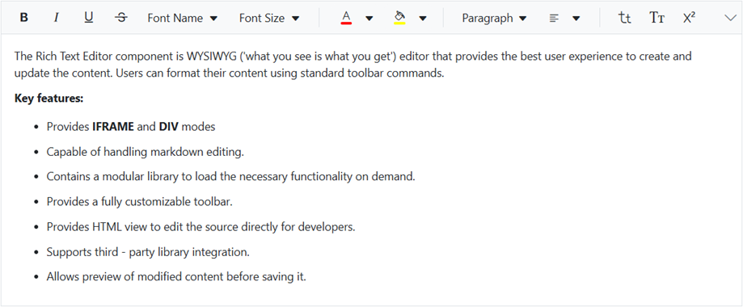

<!-- markdownlint-disable MD024 -->

# Getting Started with Blazor RichTextEditor Component

This section briefly explains about how to include [Blazor RichTextEditor](https://www.syncfusion.com/blazor-components/blazor-wysiwyg-rich-text-editor) component in your Blazor Server App and Blazor WebAssembly App using Visual Studio.

To get start quickly with Blazor Rich Text Editor components, you can check on this video:


> You can also explore our [Blazor Rich Text Editor](https://blazor.syncfusion.com/demos/rich-text-editor/overview?theme=bootstrap4) example to knows how to render and configure the rich text editor tools.

## Prerequisites

* [System requirements for Blazor components](https://blazor.syncfusion.com/documentation/system-requirements)

## Create a new Blazor App in Visual Studio

You can create **Blazor Server App** or **Blazor WebAssembly App** using Visual Studio in one of the following ways,

* [Create a Project using Microsoft Templates](https://docs.microsoft.com/en-us/aspnet/core/blazor/tooling?pivots=windows)

* [Create a Project using Syncfusion Blazor Extension](https://blazor.syncfusion.com/documentation/visual-studio-integration/vs2019-extensions/create-project)

## Install Syncfusion Blazor RichTextEditor NuGet in the App

Syncfusion Blazor components are available in [nuget.org](https://www.nuget.org/packages?q=syncfusion.blazor). To use Syncfusion Blazor components in the application, add reference to the corresponding NuGet. Refer to [NuGet packages topic](https://blazor.syncfusion.com/documentation/nuget-packages) for available NuGet packages list with component details.

To add Blazor RichTextEditor component in the app, open the NuGet package manager in Visual Studio (*Tools → NuGet Package Manager → Manage NuGet Packages for Solution*), search for [Syncfusion.Blazor.RichTextEditor](https://www.nuget.org/packages/Syncfusion.Blazor.RichTextEditor) and then install it.

## Register Syncfusion Blazor Service

Open **~/_Imports.razor** file and import the Syncfusion.Blazor namespace.




@using Syncfusion.Blazor




Now, register the Syncfusion Blazor Service in the Blazor Server App or Blazor WebAssembly App. Here, Syncfusion Blazor Service is registered by setting [IgnoreScriptIsolation](https://help.syncfusion.com/cr/blazor/Syncfusion.Blazor.GlobalOptions.html#Syncfusion_Blazor_GlobalOptions_IgnoreScriptIsolation) property as true to load the scripts externally in the [next steps](#add-script-reference).

> From 2022 Vol1 (20.1) version - The default value of `IgnoreScriptIsolation` is changed as `true`, so, you don’t have to set `IgnoreScriptIsolation` property explicitly to refer scripts externally.

### Blazor Server App

* For **.NET 6** app, open the **~/Program.cs** file and register the Syncfusion Blazor Service.

* For **.NET 5 and .NET 3.X** app, open the **~/Startup.cs** file and register the Syncfusion Blazor Service.




using Microsoft.AspNetCore.Components;
using Microsoft.AspNetCore.Components.Web;
using Syncfusion.Blazor;

var builder = WebApplication.CreateBuilder(args);

// Add services to the container.
builder.Services.AddRazorPages();
builder.Services.AddServerSideBlazor();
builder.Services.AddSyncfusionBlazor(options => { options.IgnoreScriptIsolation = true; });

var app = builder.Build();
....





using Syncfusion.Blazor;

namespace BlazorApplication
{
    public class Startup
    {
        ...
        public void ConfigureServices(IServiceCollection services)
        {
            services.AddRazorPages();
            services.AddServerSideBlazor();
            services.AddSyncfusionBlazor(options => { options.IgnoreScriptIsolation = true; });
        }
        ...
    }
}




### Blazor WebAssembly App

Open **~/Program.cs** file and register the Syncfusion Blazor Service in the client web app.




using Microsoft.AspNetCore.Components.Web;
using Microsoft.AspNetCore.Components.WebAssembly.Hosting;
using Syncfusion.Blazor;

var builder = WebAssemblyHostBuilder.CreateDefault(args);
builder.RootComponents.Add<App>("#app");
builder.RootComponents.Add<HeadOutlet>("head::after");

builder.Services.AddScoped(sp => new HttpClient { BaseAddress = new Uri(builder.HostEnvironment.BaseAddress) });

builder.Services.AddSyncfusionBlazor(options => { options.IgnoreScriptIsolation = true; });
await builder.Build().RunAsync();
....





using Syncfusion.Blazor;

namespace WebApplication1
{
    public class Program
    {
        public static async Task Main(string[] args)
        {
            ....
            builder.Services.AddSyncfusionBlazor(options => { options.IgnoreScriptIsolation = true; });
            await builder.Build().RunAsync();
        }
    }
}




## Add Style Sheet

Checkout the [Blazor Themes topic](https://blazor.syncfusion.com/documentation/appearance/themes) to learn different ways ([Static Web Assets](https://blazor.syncfusion.com/documentation/appearance/themes#static-web-assets), [CDN](https://blazor.syncfusion.com/documentation/appearance/themes#cdn-reference) and [CRG](https://blazor.syncfusion.com/documentation/common/custom-resource-generator)) to refer themes in Blazor application, and to have the expected appearance for Syncfusion Blazor components. Here, the theme is referred using [Static Web Assets](https://blazor.syncfusion.com/documentation/appearance/themes#static-web-assets). Refer to [Enable static web assets usage](https://blazor.syncfusion.com/documentation/appearance/themes#enable-static-web-assets-usage) topic to use static assets in your project.

To add theme to the app, open the NuGet package manager in Visual Studio (*Tools → NuGet Package Manager → Manage NuGet Packages for Solution*), search for [Syncfusion.Blazor.Themes](https://www.nuget.org/packages/Syncfusion.Blazor.Themes/) and then install it. Then, the theme style sheet from NuGet can be referred as follows,

### Blazor Server App

* For .NET 6 app, add the Syncfusion bootstrap5 theme in the `<head>` of the **~/Pages/_Layout.cshtml** file.

* For .NET 5 and .NET 3.X app, add the Syncfusion bootstrap5 theme in the `<head>` of the **~/Pages/_Host.cshtml** file.




<head>
    <link href="_content/Syncfusion.Blazor.Themes/bootstrap5.css" rel="stylesheet" />
</head>





<head>
    <link href="_content/Syncfusion.Blazor.Themes/bootstrap5.css" rel="stylesheet" />
</head>




### Blazor WebAssembly App

For Blazor WebAssembly App, Refer the theme style sheet from NuGet in the `<head>` of **wwwroot/index.html** file in the client web app.




<head>
    <link href="_content/Syncfusion.Blazor.Themes/bootstrap5.css" rel="stylesheet" />
</head>




## Add Script Reference

Checkout [Adding Script Reference topic](https://blazor.syncfusion.com/documentation/common/adding-script-references) to learn different ways to add script reference in Blazor Application. In this getting started walk-through, the required scripts are referred using [Static Web Assets](https://blazor.syncfusion.com/documentation/common/adding-script-references#static-web-assets) externally inside the `<head>` as follows. Refer to [Enable static web assets usage](https://blazor.syncfusion.com/documentation/common/adding-script-references#enable-static-web-assets-usage) topic to use static assets in your project.

### Blazor Server App

* For **.NET 6** app, Refer script in the `<head>` of the **~/Pages/_Layout.cshtml** file.

* For **.NET 5 and .NET 3.X** app, Refer script in the `<head>` of the **~/Pages/_Host.cshtml** file.




<head>
    ....
    <link href="_content/Syncfusion.Blazor.Themes/bootstrap5.css" rel="stylesheet" />
    
    <!--Use below script reference if you are using Syncfusion.Blazor Single NuGet-->
    <!---->
</head>





<head>
    ....
    <link href="_content/Syncfusion.Blazor.Themes/bootstrap5.css" rel="stylesheet" />
    
    <!--Use below script reference if you are using Syncfusion.Blazor Single NuGet-->
    <!---->
</head>




### Blazor WebAssembly App

For Blazor WebAssembly App, Refer script in the `<head>` of the **~/index.html** file.




<head>
    ....
    <link href="_content/Syncfusion.Blazor.Themes/bootstrap5.css" rel="stylesheet" />
    
    <!--Use below script reference if you are using Syncfusion.Blazor Single NuGet-->
    <!---->
</head>




> Syncfusion recommends to reference scripts using [Static Web Assets](https://blazor.syncfusion.com/documentation/common/adding-script-references#static-web-assets), [CDN](https://blazor.syncfusion.com/documentation/common/adding-script-references#cdn-reference) and [CRG](https://blazor.syncfusion.com/documentation/common/custom-resource-generator) by [disabling JavaScript isolation](https://blazor.syncfusion.com/documentation/common/adding-script-references#disable-javascript-isolation) for better loading performance of the Blazor application.

## Add Blazor RichTextEditor component

* Open **~/_Imports.razor** file or any other page under the `~/Pages` folder where the component is to be added and import the **Syncfusion.Blazor.RichTextEditor** namespace.




@using Syncfusion.Blazor
@using Syncfusion.Blazor.RichTextEditor




* Now, add the Syncfusion RichTextEditor component in razor file. Here, the RichTextEditor component is added in the **~/Pages/Index.razor** file under the **~/Pages** folder.




<SfRichTextEditor>
    
Rich Text Editor allows to insert images from online source as well as local computer where you want to insert the image in your content.

    
<b>Get started Quick Toolbar to click on the image</b>

    
It is possible to add custom style on the selected image inside the Rich Text Editor through quick toolbar.

</SfRichTextEditor>




* Press <kbd>Ctrl</kbd>+<kbd>F5</kbd> (Windows) or <kbd>⌘</kbd>+<kbd>F5</kbd> (macOS) to run the application. Then, the Syncfusion `Blazor RichTextEditor` component will be rendered in the default web browser.

## Configure the Toolbar

Configure the toolbar with the tools using `Items` field of the [RichTextEditorToolbarSettings](https://help.syncfusion.com/cr/blazor/Syncfusion.Blazor.RichTextEditor.RichTextEditorToolbarSettings.html) property as your application requires.




<SfRichTextEditor>
    <RichTextEditorToolbarSettings Items="@Tools" />
    
The Rich Text Editor component is WYSIWYG ('what you see is what you get') editor that provides the best user experience to create and update the content. Users can format their content using standard toolbar commands.

    
<b> Key features:</b>

    <ul>
        <li>
 Provides <b>IFRAME</b> and <b>DIV</b> modes 
</li>
        <li>
 Capable of handling markdown editing.
</li>
        <li>
 Contains a modular library to load the necessary functionality on demand.
</li>
        <li>
 Provides a fully customizable toolbar.
</li>
        <li>
 Provides HTML view to edit the source directly for developers.
</li>
        <li>
 Supports third - party library integration.
</li>
        <li>
 Allows preview of modified content before saving it.
</li>
    </ul>
</SfRichTextEditor>

@code {
    private List<ToolbarItemModel> Tools = new List<ToolbarItemModel>()
    {
        new ToolbarItemModel() { Command = ToolbarCommand.Bold },
        new ToolbarItemModel() { Command = ToolbarCommand.Italic },
        new ToolbarItemModel() { Command = ToolbarCommand.Underline },
        new ToolbarItemModel() { Command = ToolbarCommand.StrikeThrough },
        new ToolbarItemModel() { Command = ToolbarCommand.FontName },
        new ToolbarItemModel() { Command = ToolbarCommand.FontSize },
        new ToolbarItemModel() { Command = ToolbarCommand.Separator },
        new ToolbarItemModel() { Command = ToolbarCommand.FontColor },
        new ToolbarItemModel() { Command = ToolbarCommand.BackgroundColor },
        new ToolbarItemModel() { Command = ToolbarCommand.Separator },
        new ToolbarItemModel() { Command = ToolbarCommand.Formats },
        new ToolbarItemModel() { Command = ToolbarCommand.Alignments },
        new ToolbarItemModel() { Command = ToolbarCommand.Separator },
        new ToolbarItemModel() { Command = ToolbarCommand.LowerCase },
        new ToolbarItemModel() { Command = ToolbarCommand.UpperCase },
        new ToolbarItemModel() { Command = ToolbarCommand.SuperScript },
        new ToolbarItemModel() { Command = ToolbarCommand.SubScript },
        new ToolbarItemModel() { Command = ToolbarCommand.Separator },
        new ToolbarItemModel() { Command = ToolbarCommand.OrderedList },
        new ToolbarItemModel() { Command = ToolbarCommand.UnorderedList },
        new ToolbarItemModel() { Command = ToolbarCommand.Outdent },
        new ToolbarItemModel() { Command = ToolbarCommand.Indent },
        new ToolbarItemModel() { Command = ToolbarCommand.Separator },
        new ToolbarItemModel() { Command = ToolbarCommand.CreateLink },
        new ToolbarItemModel() { Command = ToolbarCommand.Image },
        new ToolbarItemModel() { Command = ToolbarCommand.CreateTable },
        new ToolbarItemModel() { Command = ToolbarCommand.Separator },
        new ToolbarItemModel() { Command = ToolbarCommand.ClearFormat },
        new ToolbarItemModel() { Command = ToolbarCommand.Print },
        new ToolbarItemModel() { Command = ToolbarCommand.SourceCode },
        new ToolbarItemModel() { Command = ToolbarCommand.FullScreen },
        new ToolbarItemModel() { Command = ToolbarCommand.Separator },
        new ToolbarItemModel() { Command = ToolbarCommand.Undo },
        new ToolbarItemModel() { Command = ToolbarCommand.Redo }
    };
}




> [View Sample in GitHub](https://github.com/SyncfusionExamples/Blazor-Getting-Started-Examples/tree/main/RichTextEditor).

## Insert images and links

The `Image` module inserts an image into Rich Text Editor's content area, and the `Link` module links external resources such as website URLs to the selected text in the Rich Text Editor's content respectively.

Specifies the items to be rendered in quick toolbar based on the target elements such as image, link and table element. The quick toolbar opens to customize the element by clicking the target element.




<SfRichTextEditor>
    <RichTextEditorToolbarSettings Items="@Tools" />
    <RichTextEditorQuickToolbarSettings Image="@Image" Link="@Link" />
    
Rich Text Editor allows to insert images from online source as well as local computer where you want to insert the image in your content.

    
<b>Get started Quick Toolbar to click on the image</b>

    
It is possible to add custom style on the selected image inside the Rich Text Editor through quick toolbar.

    
</SfRichTextEditor>

@code {
    private List<ToolbarItemModel> Tools = new List<ToolbarItemModel>()
    {
        new ToolbarItemModel() { Command = ToolbarCommand.Bold },
        new ToolbarItemModel() { Command = ToolbarCommand.Italic },
        new ToolbarItemModel() { Command = ToolbarCommand.Underline },
        new ToolbarItemModel() { Command = ToolbarCommand.Separator },
        new ToolbarItemModel() { Command = ToolbarCommand.Formats },
        new ToolbarItemModel() { Command = ToolbarCommand.Alignments },
        new ToolbarItemModel() { Command = ToolbarCommand.Separator },
        new ToolbarItemModel() { Command = ToolbarCommand.CreateLink },
        new ToolbarItemModel() { Command = ToolbarCommand.Image },
        new ToolbarItemModel() { Command = ToolbarCommand.Separator },
        new ToolbarItemModel() { Command = ToolbarCommand.SourceCode },
        new ToolbarItemModel() { Command = ToolbarCommand.Separator },
        new ToolbarItemModel() { Command = ToolbarCommand.Undo },
        new ToolbarItemModel() { Command = ToolbarCommand.Redo }
    };

    private List<ImageToolbarItemModel> Image = new List<ImageToolbarItemModel>()
    {
        new ImageToolbarItemModel() { Command = ImageToolbarCommand.Replace },
        new ImageToolbarItemModel() { Command = ImageToolbarCommand.Align },
        new ImageToolbarItemModel() { Command = ImageToolbarCommand.Caption },
        new ImageToolbarItemModel() { Command = ImageToolbarCommand.Remove },
        new ImageToolbarItemModel() { Command = ImageToolbarCommand.OpenImageLink },
        new ImageToolbarItemModel() { Command = ImageToolbarCommand.HorizontalSeparator },
        new ImageToolbarItemModel() { Command = ImageToolbarCommand.EditImageLink },
        new ImageToolbarItemModel() { Command = ImageToolbarCommand.RemoveImageLink },
        new ImageToolbarItemModel() { Command = ImageToolbarCommand.Display },
        new ImageToolbarItemModel() { Command = ImageToolbarCommand.AltText },
        new ImageToolbarItemModel() { Command = ImageToolbarCommand.Dimension }
    };

    private List<LinkToolbarItemModel> Link = new List<LinkToolbarItemModel>()
    {
        new LinkToolbarItemModel() { Command = LinkToolbarCommand.Open },
        new LinkToolbarItemModel() { Command = LinkToolbarCommand.Edit },
        new LinkToolbarItemModel() { Command = LinkToolbarCommand.UnLink }
    };
}




## Retrieve the formatted content

To retrieve the editor contents, use the [Value](https://help.syncfusion.com/cr/blazor/Syncfusion.Blazor.RichTextEditor.SfRichTextEditor.html#Syncfusion_Blazor_RichTextEditor_SfRichTextEditor_Value) property of Rich Text Editor. To fetch the Rich Text Editor's text content, use `GetText` method of Rich Text Editor.




@using Syncfusion.Blazor.Buttons
@using Syncfusion.Blazor.RichTextEditor
@using Syncfusion.Blazor.Popups

<SfButton @onclick="@GetValue">Get Value</SfButton>
<SfButton @onclick="@GetText">Get Text</SfButton>

 
<SfDialog @ref="DialogObj" @bind-Visible="@Visibility" Content="@Content" Header="@Header" Target="#target" Height="200px"
          Width="400px" ShowCloseIcon="true">
    <DialogButtons>
        <DialogButton Content="Ok" IsPrimary="true" OnClick="@DlgButtonClick" />
    </DialogButtons>

</SfDialog>
<SfRichTextEditor @ref="RteObj" Value="@RteValue" />

@code {
    SfRichTextEditor RteObj;
    SfDialog DialogObj;
    private string Content;
    private bool Visibility = false;
    private string Header = "RichTextEditor's Value";
    private string RteValue = @"
Rich Text Editor allows to insert images from online source as well as local computer where you want to insert the image in your content.

<b>Get started Quick Toolbar to click on the image</b>

It is possible to add custom style on the selected image inside the Rich Text Editor through quick toolbar.
";
    private async Task GetValue()
    {
        this.Content = this.RteValue;
        await this.DialogObj.ShowAsync();
    }
    private async Task GetText()
    {
        this.Content = await this.RteObj.GetTextAsync();
        this.DialogObj.ShowAsync();
    }
    private async Task DlgButtonClick(object arg)
    {
        await this.DialogObj.HideAsync();
    }
}




## Retrieve the number of characters in the Rich Text Editor

To retrieve the maximum number of characters in the Rich Text Editor's content, use the `GetCharCount` property of the Rich Text Editor.




@using Syncfusion.Blazor.Buttons
@using Syncfusion.Blazor.RichTextEditor
@using Syncfusion.Blazor.Popups

<SfButton @onclick="@GetCharCount">Get Char Count</SfButton>

 
<SfDialog @ref="DialogObj" @bind-Visible="@Visibility" Content="@Content" Header="@Header" Target="#target" Height="200px"
          Width="400px" ShowCloseIcon="true">
    <DialogButtons>
        <DialogButton Content="Ok" IsPrimary="true" OnClick="@DlgButtonClick" />
    </DialogButtons>

</SfDialog>
<SfRichTextEditor @ref="RteObj" />

@code {
    SfRichTextEditor RteObj;
    SfDialog DialogObj;
    private string Content;
    private bool Visibility = false;
    private string Header = "RichTextEditor's Value";
    private string RteValue = @"
Rich Text Editor allows to insert images from online source as well as local computer where you want to insert the image in your content.

<b>Get started Quick Toolbar to click on the image</b>

It is possible to add custom style on the selected image inside the Rich Text Editor through quick toolbar.
";
    private async Task GetCharCount()
    {
        this.Content = await this.RteObj.GetCharCountAsync();
        await this.DialogObj.ShowAsync();
    }
    private async Task DlgButtonClick(object arg)
    {
        await this.DialogObj.HideAsync();
    }
}




## See Also

* [Getting Started with Syncfusion Blazor for client-side in .NET Core CLI](../getting-started/blazor-webassembly-dotnet-cli/)

* [Getting Started with Syncfusion Blazor for server-side in Visual Studio](../getting-started/blazor-server-side-visual-studio/)

* [Getting Started with Syncfusion Blazor for server-side in .NET Core CLI](../getting-started/blazor-server-side-dotnet-cli/)

* [How to insert Emoticons](https://blazor.syncfusion.com/demos/rich-text-editor/insert-emoticons?theme=bootstrap5)

* [Blog posting using Rich Text Editor](https://blazor.syncfusion.com/demos/rich-text-editor/usecase?theme=bootstrap5)