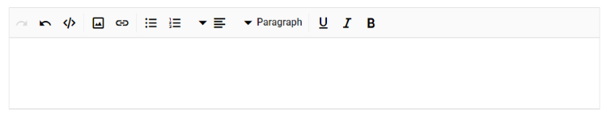

# Globalization and Localization

## Localization

The [Rich Text Editor](https://www.syncfusion.com/blazor-components/blazor-rich-text-editor) supports localization. Refer to the [Blazor Localization](https://blazor.syncfusion.com/documentation/common/localization) documentation to localize Syncfusion Blazor components.

## Globalization

### Enable RTL mode

Specify the direction of the Rich Text Editor component using the [EnableRtl](https://help.syncfusion.com/cr/blazor/Syncfusion.Blazor.RichTextEditor.SfRichTextEditor.html#Syncfusion_Blazor_RichTextEditor_SfRichTextEditor_EnableRtl) property. Writing systems will require Arabic, Hebrew, and more. The direction can be switched to right-to-left.

N> The `EnableRtl` property does not change automatically based on the current culture. Enable it explicitly when RTL is required.




@using Syncfusion.Blazor.RichTextEditor

<SfRichTextEditor EnableRtl="true" />




N> You can refer to our [Blazor Rich Text Editor](https://www.syncfusion.com/blazor-components/blazor-rich-text-editor) feature tour for an overview of its capabilities. Explore the [Blazor Rich Text Editor](https://blazor.syncfusion.com/demos/rich-text-editor/overview?theme=bootstrap5) example to know how to render and configure the rich text editor tools.
