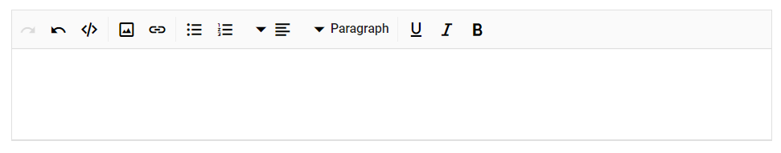

# Globalization

## Localization

The Rich Text Editor provides an option to localize its strings; it is used for adapting the editor to a particular local language. By default, the editor will use the `US English (en-US)` as its language. Find the table with a list of keys and their corresponding values for the default language (en-US).

> Use `Resource` file to translate the static text of the Rich Text Editor. The Resource file is an XML file which contains the strings(key and value pairs) that you want to translate into different language. You can also refer [`Localization`](../../common/localization/) link to know more about how to configure and use localization in the Blazor Server and WebAssembly project for Syncfusion Blazor components.

| Locale key |  en-US (default) |
| ------------ | ------------ |
| RichTextEditor_Alignments |Alignments   |
| RichTextEditor_JustifyLeft  |  Align Left |
| RichTextEditor_JustifyCenter  |Align Center   |
| RichTextEditor_JustifyRight   | Align Right  |
| RichTextEditor_JustifyFull  | Align Justify  |
| RichTextEditor_FontName   | Font Name|
| RichTextEditor_FontColor| Font Color  |
| RichTextEditor_BackgroundColor | Background Color  |
| RichTextEditor_Bold |  Bold |
| RichTextEditor_Italic   |   Italic|
| RichTextEditor_Underline| Underline  |
| RichTextEditor_Strikethrough  | Strikethrough  |
| RichTextEditor_ClearFormat |  Clear Format |
| RichTextEditor_ClearAll |  Clear All |
| RichTextEditor_Cut | Cut  |
| RichTextEditor_Copy  |Copy   |
| RichTextEditor_Paste  |  Paste |
| RichTextEditor_UnorderedList |  Bulleted List |
| RichTextEditor_OrderedList  |Numbered List   |
| RichTextEditor_Indent | Increase Indent  |
| RichTextEditor_Outdent |Decrease Indent   |
| RichTextEditor_Undo  |Undo   |
| RichTextEditor_Redo | Redo  |
| RichTextEditor_Superscript| Superscript  |
| RichTextEditor_Subscript |  Subscript |
| RichTextEditor_CreateLink | Insert Link  |
| RichTextEditor_OpenLink   | Open Link  |
| RichTextEditor_EditLink  |Edit Link   |
| RichTextEditor_RemoveLink | Remove Link  |
| RichTextEditor_Image  | Insert Image  |
| RichTextEditor_Replace   | Replace  |
| RichTextEditor_Align |  Align |
| RichTextEditor_Caption   | Image Caption  |
| RichTextEditor_Remove  | Remove  |
| RichTextEditor_InsertLink| Insert Link  |
| RichTextEditor_Display  |Display   |
| RichTextEditor_AltText |Alternative Text   |
| RichTextEditor_Dimension   | Change Size  |
| RichTextEditor_Fullscreen  | Maximize  |
| RichTextEditor_Maximize  | RichTextEditor_Maximize  |
| RichTextEditor_Minimize | Minimize  |
| RichTextEditor_LowerCase  |  Lower Case |
| RichTextEditor_UpperCase | Upper Case  |
| RichTextEditor_Print|  Print |
| RichTextEditor_Formats  | Formats  |
| RichTextEditor_Sourcecode  | Code View  |
| RichTextEditor_Preview  | Preview  |
| RichTextEditor_Viewside  | ViewSide  |
| RichTextEditor_InsertCode   |  Insert Code |
| RichTextEditor_LinkText   |  Display Text |
| RichTextEditor_LinkTooltipLabel  |  Title |
| RichTextEditor_LinkWebUrl  | Web Address  |
| RichTextEditor_LinkTitle| Enter a title  |
| RichTextEditor_LinkUrl  |  http<span></span>://example.com |
| RichTextEditor_LinkOpenInNewWindow  |Open Link in New Window   |
| RichTextEditor_LinkHeader  |  Insert Link |
| RichTextEditor_DialogInsert  |Insert   |
| RichTextEditor_DialogCancel | Cancel  |
| RichTextEditor_DialogUpdate |  Update |
| RichTextEditor_ImageHeader   |Insert Image   |
| RichTextEditor_ImageLinkHeader  |You can also provide a link from the web   |
| RichTextEditor_MdImageLink   | Please provide a URL for your image  |
| RichTextEditor_ImageUploadMessage |Drop image here or browse to upload   |
| RichTextEditor_ImageDeviceUploadMessage |  Click here to upload |
| RichTextEditor_ImageAlternateText  | Alternate Text  |
| RichTextEditor_Browse   | Browse  |
| RichTextEditor_ImageUrl | http<span></span>://example.com/image.png  |
| RichTextEditor_ImageCaption  | Caption  |
| RichTextEditor_ImageSizeHeader  |Image Size   |
| RichTextEditor_ImageHeight  | Height  |
| RichTextEditor_ImageWidth   |  Width |
| RichTextEditor_TextPlaceholder  |  Enter Text |
| RichTextEditor_InsertTableBtn   | Insert Table  |
| RichTextEditor_TableDialogHeader   | Insert Table  |
| RichTextEditor_TableWidth  |  Width |
| RichTextEditor_Cellpadding | Cell Padding  |
| RichTextEditor_Cellspacing  | Cell Spacing  |
| RichTextEditor_Columns | Number of columns  |
| RichTextEditor_Rows  |Number of rows   |
| RichTextEditor_TableRows   |Table Rows   |
| RichTextEditor_TableColumns | Table Columns  |
| RichTextEditor_TableCellHorizontalAlign  | Table Cell Horizontal Align  |
| RichTextEditor_TableCellVerticalAlign  | Table Cell Vertical Align  |
| RichTextEditor_CreateTable  |  Create Table |
| RichTextEditor_RemoveTable | Remove Table  |
| RichTextEditor_TableHeader | Table Header  |
| RichTextEditor_TableRemove |  Table Remove |
| RichTextEditor_TableCellBackground   | Table Cell Background  |
| RichTextEditor_TableEditProperties | Table Edit Properties   |
| RichTextEditor_Styles  | Styles  |
| RichTextEditor_InsertColumnLeft  | Insert Column Left   |
| RichTextEditor_InsertColumnRight  |  Insert Column Right |
| RichTextEditor_DeleteColumn  | Delete Column  |
| RichTextEditor_InsertRowBefore |  Insert Row Before  |
| RichTextEditor_InsertRowAfter  | Insert Row After  |
| RichTextEditor_DeleteRow | Delete Row  |
| RichTextEditor_TableEditHeader  | Edit Table  |
| RichTextEditor_TableHeadingText |Heading   |
| RichTextEditor_TableColText   |Col   |
| RichTextEditor_ImageInsertLinkHeader   | Insert Link  |
| RichTextEditor_EditImageHeader  | Edit Image   |
| RichTextEditor_AlignmentsDropDownLeft   | Align Left   |
| RichTextEditor_AlignmentsDropDownCenter   |Align Center   |
| RichTextEditor_AlignmentsDropDownRight  |  Align Right |
| RichTextEditor_AlignmentsDropDownJustify  |Align Justify   |
| RichTextEditor_ImageDisplayDropDownInline   | Inline  |
| RichTextEditor_ImageDisplayDropDownBreak  | Break  |
| RichTextEditor_TableInsertRowDropDownBefore  | Insert row before  |
| RichTextEditor_TableInsertRowDropDownAfter  |Insert row after   |
| RichTextEditor_TableInsertRowDropDownDelete  | Delete row  |
| RichTextEditor_TableInsertColumnDropDownLeft  |Insert column left   |
| RichTextEditor_TableInsertColumnDropDownRight  | Insert column right  |
| RichTextEditor_TableInsertColumnDropDownDelete   | Delete column  |
| RichTextEditor_TableVerticalAlignDropDownTop  | Align Top  |
| RichTextEditor_TableVerticalAlignDropDownMiddle   | Align Middle   |
| RichTextEditor_TableVerticalAlignDropDownBottom | Align Bottom  |
| RichTextEditor_TableStylesDropDownDashedBorder  | Dashed Borders  |
| RichTextEditor_TableStylesDropDownAlternateRows  | Alternate Rows  |
| RichTextEditor_PasteFormat  |Paste Format   |
| RichTextEditor_PasteFormatContent  |  Choose the formatting action |
| RichTextEditor_PlainText  |  Plain Text |
| RichTextEditor_CleanFormat   |Clean   |
| RichTextEditor_KeepFormat | Keep  |
| RichTextEditor_PasteDialogOk  | OK  |
| RichTextEditor_PasteDialogCancel  | Cancel  |
| RichTextEditor_FormatsDropDownParagraph  | Paragraph |
| RichTextEditor_FormatsDropDownCode  | Code |
| RichTextEditor_FormatsDropDownQuotation  | Quotation |
| RichTextEditor_FormatsDropDownHeading1  | Heading 1 |
| RichTextEditor_FormatsDropDownHeading2  | Heading 2 |
| RichTextEditor_FormatsDropDownHeading3  | Heading 3 |
| RichTextEditor_FormatsDropDownHeading4  | Heading 4 |
| RichTextEditor_FormatsDropDownHeading5  | Heading 5 |
| RichTextEditor_FormatsDropDownHeading6  | Heading 6 |
| RichTextEditor_FontNameSegoeUI  | Segoe UI |
| RichTextEditor_FontNameArial  | Arial |
| RichTextEditor_FontNameGeorgia  | Georgia |
| RichTextEditor_FontNameImpact  | Impact |
| RichTextEditor_FontNameTahoma  | Tahoma |
| RichTextEditor_FontNameTimesNewRoman  | Times New Roman |
| RichTextEditor_FontNameVerdana  | Verdana |

The following sample code block demonstrates that the Rich Text Editor control rendered with `de-DE` German language.

```csharp

@using Syncfusion.Blazor.RichTextEditor

<SfRichTextEditor>
    <p>The Rich Text Editor component is WYSIWYG ('what you see is what you get') editor that provides the best user experience to create and update the content. Users can format their content using standard toolbar commands.</p>
    <p><b> Key features:</b></p>
    <ul>
    <li><p> Provides <b>IFRAME</b> and <b>DIV</b> modes </p></li>
    <li><p> Capable of handling markdown editing.</p></li>
    <li><p> Contains a modular library to load the necessary functionality on demand.</p></li>
    <li><p> Provides a fully customizable toolbar.</p></li>
    <li><p> Provides HTML view to edit the source directly for developers.</p></li>
    <li><p> Supports third - party library integration.</p></li>
    </ul>
</SfRichTextEditor>

```

The output will be as follows.


## RTL

Specifies the direction of the Rich Text Editor component using the `EnableRtl` property. For writing systems will require Arabic, Hebrew, and more. The direction can be switched to right-to-left.

> `EnableRtl` property will not change, based on current culture.

```csharp

@using Syncfusion.Blazor.RichTextEditor

<SfRichTextEditor EnableRtl="true" />

```

The output will be as follows.



> You can refer to our [Blazor Rich Text Editor](https://www.syncfusion.com/blazor-components/blazor-wysiwyg-rich-text-editor) feature tour page for its groundbreaking feature representations. You can also explore our [Blazor Rich Text Editor](https://blazor.syncfusion.com/demos/rich-text-editor/overview?theme=bootstrap4) example to knows how to render and configure the rich text editor tools.
