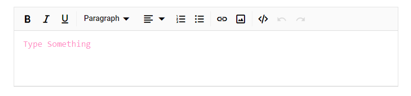

# Customize placeholder style

By using `e-rte-placeholder` class, you can customize the placeholder style.

```csharp

@using Syncfusion.Blazor.RichTextEditor

<SfRichTextEditor Placeholder="Type Something" />

<style>
    .e-richtexteditor .e-rte-placeholder {
        /* placeholder style */
        font-family: monospace;
        color: deeppink;
    }
</style>

```

The output will be as follows.

