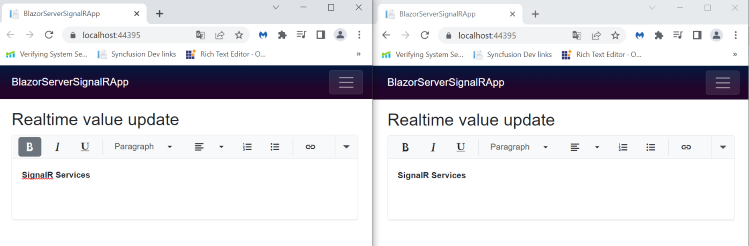

# Realtime editing with SignalR

The Rich Text Editor allows, two or more users can edit the same editor by using [SignalR](https://docs.microsoft.com/en-us/aspnet/core/tutorials/signalr?view=aspnetcore-6.0&tabs=visual-studio) services. Which will update the editor value in real-time, when loading it on multiple pages. In the below example create the `SignalR HubConnectionBuilder` in the `OnInitializedAsync` method and the editor updated value send to the SignalR message in the [ValueChange](https://help.syncfusion.com/cr/blazor/Syncfusion.Blazor.RichTextEditor.RichTextEditorEvents.html#Syncfusion_Blazor_RichTextEditor_RichTextEditorEvents_ValueChange) event.




@using Microsoft.AspNetCore.SignalR.Client
@inject NavigationManager NavigationManager
@implements IAsyncDisposable

<h3>Realtime value update</h3>

@using Syncfusion.Blazor.RichTextEditor

<SfRichTextEditor @bind-Value="RTEValue" SaveInterval="100">
    <RichTextEditorEvents ValueChange="@Send"></RichTextEditorEvents>
</SfRichTextEditor>

@code {
    private HubConnection hubConnection;
    private List<string> messages = new List<string>();
    private string messageInput;
    private string RTEValue;
    protected override async Task OnInitializedAsync()
    {
        //Creates a new instance of the HubConnectionBuilder class.
        
        hubConnection = new HubConnectionBuilder()
            .WithUrl(NavigationManager.ToAbsoluteUri("/chathub"))
            .Build();
        hubConnection.On<string, string>("ReceiveMessage", (value, message) =>
        {
            RTEValue = value;
            StateHasChanged();
        });
        await hubConnection.StartAsync();
    }

    // Sending RTEValue to new connection state.

    async Task Send() =>
        await hubConnection.SendAsync("SendMessage", RTEValue, messageInput);
    public bool IsConnected =>
        hubConnection.State == HubConnectionState.Connected;
    public async ValueTask DisposeAsync()
    {
        if (hubConnection is not null)
        {
            await hubConnection.DisposeAsync();
        }
    }
}





`chathup.cs`

```csharp
   public class ChatHub : Hub 
    { 
        public async Task SendMessage(string value, string message) 
        { 
            await Clients.All.SendAsync("ReceiveMessage", value, message); 
        } 
    } 
```

