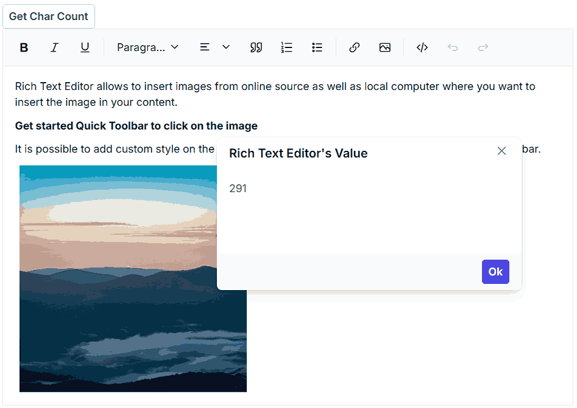

# Retrieve the number of characters

To retrieve the number of characters in the Rich Text Editor content, use the [GetCharCount](https://help.syncfusion.com/cr/blazor/Syncfusion.Blazor.RichTextEditor.SfRichTextEditor.html#Syncfusion_Blazor_RichTextEditor_SfRichTextEditor_GetCharCountAsync) method.




@using Syncfusion.Blazor.Buttons
@using Syncfusion.Blazor.RichTextEditor
@using Syncfusion.Blazor.Popups

<SfButton @onclick="@GetCharCount">Get Char Count</SfButton>

 
<SfDialog @ref="DialogObj" @bind-Visible="@Visibility" Content="@Content" Header="@Header" Target="#target" Height="200px"
          Width="400px" ShowCloseIcon="true">
    <DialogButtons>
        <DialogButton Content="Ok" IsPrimary="true" OnClick="@DlgButtonClick" />
    </DialogButtons>

</SfDialog>
<SfRichTextEditor @ref="RteObj" @bind-Value="@RteValue"/>

@code {
    SfRichTextEditor RteObj;
    SfDialog DialogObj;
    private string Content;
    private bool Visibility = false;
    private string Header = "Rich Text Editor's Value";
    private string RteValue = @"
Rich Text Editor allows to insert images from online source as well as local computer where you want to insert the image in your content.

<b>Get started Quick Toolbar to click on the image</b>

It is possible to add custom style on the selected image inside the Rich Text Editor through quick toolbar.
";
    private async Task GetCharCount()
    {
        double charCount = await this.RteObj.GetCharCountAsync();
        this.Content = charCount.ToString(); // Convert double to string
        await this.DialogObj.ShowAsync();
    }
    private async Task DlgButtonClick(object arg)
    {
        await this.DialogObj.HideAsync();
    }
}




