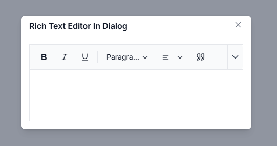

# Rich Text Editor inside the Dialog Component

Integrating the Rich Text Editor within a Dialog component creates a robust modal editing interface for Blazor applications. This pattern is ideal for:

- **Content Management** — Enables creation or editing of content in an isolated, distraction-free modal window.
- **Form Operations** — Embeds rich text editing capabilities within form submissions and data entry workflows.
- **Contextual Editing** — Provides in-context editing for specific data records or entities.
- **Focused Editing Experience** — Maintains focus on the editing task while blocking interactions with the rest of the application.

The combination of the Rich Text Editor with a Dialog component produces a professional editing interface that improves usability and maintains application flow.

## Overview

When embedding the Rich Text Editor inside a Dialog component, a modal editing interface is created where:

- A Dialog window is opened, dedicated to content editing.
- The editor operates within the Dialog's content area.
- The Dialog can be closed after editing is complete.
- A contained, distraction-free editing space is provided.

This documentation explains how to properly set up the Rich Text Editor within a Dialog and handle the initialization.

## Toolbar Rendering in Hidden Dialogs

When a Dialog component is initially closed, its container and wrapper elements are hidden using CSS (`display: none`). During this hidden state, the Rich Text Editor's toolbar cannot calculate the correct offset width and positioning. This results in improper toolbar rendering and potential misalignment with the editor content area.

To resolve this, the `RefreshUIAsync()` method must be called in the Dialog's `Opened` event. This method recalculates the toolbar dimensions and positioning after the Dialog becomes visible, ensuring proper UI layout and alignment.

## Prerequisites

- **Syncfusion.Blazor NuGet package** installed and configured in the Blazor project.
- **Required namespaces:**
  - `Syncfusion.Blazor.RichTextEditor` — For the Rich Text Editor component
  - `Syncfusion.Blazor.Popups` — For the Dialog component
  - `Syncfusion.Blazor.Buttons` — For the button to trigger the Dialog

> Refer to the [Rich Text Editor Getting Started](https://blazor.syncfusion.com/documentation/rich-text-editor/getting-started) guide for initial setup and configuration.

## Implementation

### Step 1: Create the Dialog with Rich Text Editor

Create a new Razor component file called `RichTextEditorInDialog.razor` in the Blazor project's `Pages` folder:







### Step 2: Usage

To use the component in the application:

1. Navigate to the page where the component is added.
2. Click the "Open Dialog" button.
3. The Dialog opens, displaying the Rich Text Editor.
4. Enter or edit content in the editor.
5. Click the close button or outside the dialog to close it.

## How It Works

The integration follows this workflow:

1. **Initialization** — The Dialog component starts in a hidden state (`Visible="false"`).
2. **Trigger Action** — The "Open Dialog" button is clicked.
3. **Dialog Opens** — The `ShowAsync()` method displays the Dialog.
4. **Dialog Opened Event** — The Dialog's `Opened` event fires when fully visible.
5. **Editor Ready** — The Rich Text Editor is now visible and ready for interaction.

The `RefreshUIAsync()` call in the `Opened` event ensures the editor's UI is properly rendered within the Dialog container. For more details on this method, refer to the [RefreshUIAsync documentation](https://help.syncfusion.com/cr/blazor/Syncfusion.Blazor.RichTextEditor.SfRichTextEditor.html#Syncfusion_Blazor_RichTextEditor_SfRichTextEditor_RefreshUIAsync).

## Common Dialog Configuration Options

You can customize the Dialog behavior using these properties:

```csharp
<SfDialog Width="600px"                    // Set dialog width
          Height="500px"                   // Set dialog height
          ShowCloseIcon="true"             // Show close button
          IsModal="true"                   // Disable background interaction
          Visible="false"                  // Start hidden
          AllowDragging="true"             // Allow dragging the dialog
          AllowResizing="true"             // Allow resizing the dialog
          Position="@(new DialogPosition { X = "center", Y = "center" })">
</SfDialog>
```

Refer to the [Dialog Getting Started](https://blazor.syncfusion.com/documentation/dialog/getting-started) for more configuration options.

## Best Practices

- Always set `Visible="false"` to prevent the Dialog from opening automatically.
- Use `IsModal="true"` for focused editing experiences.
- Configure appropriate Dialog width and height for the content.
- Handle editor content before closing the Dialog (save or discard changes).
- Use async/await patterns for Dialog and editor operations.

## See also

* [Rich Text Editor Getting Started](https://blazor.syncfusion.com/documentation/rich-text-editor/getting-started)
* [Dialog Component Getting Started](https://blazor.syncfusion.com/documentation/dialog/getting-started)
* [Rich Text Editor API Reference](https://help.syncfusion.com/cr/blazor/Syncfusion.Blazor.RichTextEditor.SfRichTextEditor.html)
* [Dialog API Reference](https://help.syncfusion.com/cr/blazor/Syncfusion.Blazor.Popups.SfDialog.html)
