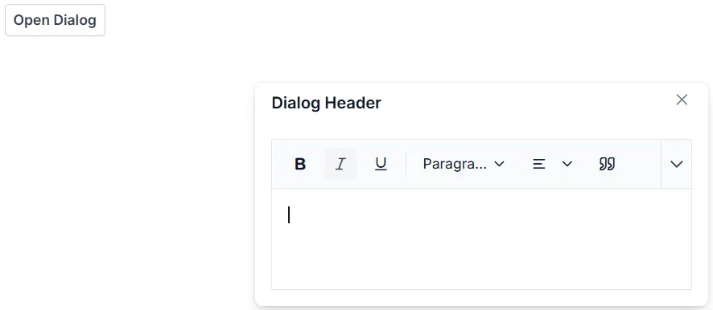

# Rich Text Editor inside the Dialog Component

While rendering the Rich Text Editor inside the [Dialog](https://blazor.syncfusion.com/documentation/dialog/getting-started-with-web-app) component, the dialog container and its wrapper elements are styled with display as none during the initial rendering phase. Because of this behavior, the editor’s toolbar does not receive the proper offset width at the time of initialization, which can cause it to appear above the edit area container instead of being aligned within it.

To ensure consistent layout and proper positioning of the toolbar and editing area, it is recommended to refresh the Rich Text Editor after the Dialog becomes visible. This can be achieved by calling the [RefreshUIAsync](https://help.syncfusion.com/cr/blazor/Syncfusion.Blazor.RichTextEditor.SfRichTextEditor.html#Syncfusion_Blazor_RichTextEditor_SfRichTextEditor_RefreshUIAsync) method of the RichTextEditor component in the [Dialog Opened](https://help.syncfusion.com/cr/blazor/Syncfusion.Blazor.Popups.DialogEvents.html#Syncfusion_Blazor_Popups_DialogEvents_Opened) event.

Invoking this method at the appropriate stage allows the editor to be rendered with the correct dimensions based on the visible container, ensuring that the toolbar and content area are displayed in the expected layout within the Dialog.



@using Syncfusion.Blazor.RichTextEditor
@using Syncfusion.Blazor.Popups
@using Syncfusion.Blazor.Buttons

<SfButton @onclick="@OpenDialog">Open Dialog</SfButton>
<SfDialog @ref="DialogObj" Width="450px" ShowCloseIcon="true">
    <DialogEvents Opened="@DialogOpen"></DialogEvents>
    <DialogTemplates>
        <Header>
            
Dialog Header

        </Header>
        <Content>
            <SfRichTextEditor @ref="RteObj">
            </SfRichTextEditor>
        </Content>
    </DialogTemplates>
</SfDialog>

@code {
    SfDialog DialogObj;
    SfRichTextEditor RteObj;
    private void OpenDialog()
    {
        this.DialogObj.ShowAsync();
    }
    private void DialogOpen()
    {
        this.RteObj.RefreshUIAsync();
    }
} 



