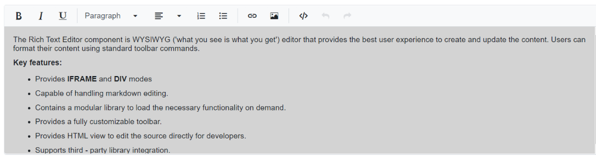
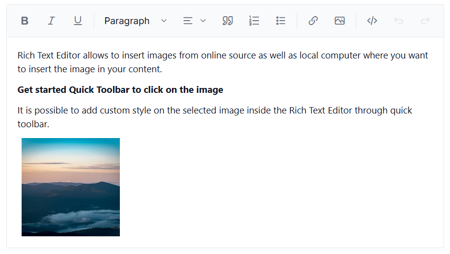

# Iframe Editing Mode in Blazor Rich Text Editor Component

The iframe editor in the Rich Text Editor control provides an isolated environment for content editing. It uses an iframe element to create a separate document, ensuring better compatibility and separation from the parent page's styles and scripts. In this mode, the editor displays only the body tag of the iframe, offering a clean and isolated workspace for content creation.

## Configuring the Iframe editor

When the `RichTextEditorIframeSettings` option is set to [RichTextEditorIframeSettings.Enable ](https://help.syncfusion.com/cr/blazor/Syncfusion.Blazor.RichTextEditor.RichTextEditorIFrameSettings.html#Syncfusion_Blazor_RichTextEditor_RichTextEditorIFrameSettings_Enable), the editor creates an iframe element as the content area during initialization, which is then used to display and edit the content. In iframe mode, the editor displays only the body tag of the iframe document within the content area.

In iframe mode, the editor content is hosted in an isolated document. Only the editor's content is shown, and styles or scripts can be applied specifically to that editor without affecting the rest of the page.

Here's an example of how to enable the iframe editor:




@using Syncfusion.Blazor.RichTextEditor

<SfRichTextEditor>
    <RichTextEditorIFrameSettings Enable="true" />
    
The Rich Text Editor component is WYSIWYG ('what you see is what you get') editor that provides the best user experience to create and update the content. Users can format their content using standard toolbar commands.

</SfRichTextEditor>




## Customizing IFrame attributes

Add additional attributes to the body element of the iframe document using the[RichTextEditorIframeSettings.Attributes](https://help.syncfusion.com/cr/blazor/Syncfusion.Blazor.RichTextEditor.RichTextEditorIFrameSettings.html#Syncfusion_Blazor_RichTextEditor_RichTextEditorIFrameSettings_Attributes) property. This property accepts name–value pairs in string format and can be used to override the default appearance of the content area.









## Integrating external CSS and Script

The editor supports adding external CSS files to style the iframe document by using the [RichTextEditorIframeSettings.Resources](https://help.syncfusion.com/cr/blazor/Syncfusion.Blazor.RichTextEditor.RichTextEditorIFrameSettings.html#Syncfusion_Blazor_RichTextEditor_RichTextEditorIFrameSettings_Resources) property. This allows changing the appearance of the editor content with an external stylesheet.

Similarly, add external script files to the iframe document using the same `RichTextEditorIframeSettings.Resources` property to provide additional functionality for the Rich Text Editor.




@using Syncfusion.Blazor.RichTextEditor

<SfRichTextEditor>
    <RichTextEditorIFrameSettings Enable="true" Resources="@Resources" />
    
Rich Text Editor allows to insert images from online source as well as local computer where you want to insert the image in your content.

    
<b>Get started Quick Toolbar to click on the image</b>

    
It is possible to add custom style on the selected image inside the Rich Text Editor through quick toolbar.

    
</SfRichTextEditor>

@code {
    private ResourcesModel Resources { get; set; } = new ResourcesModel()
    {
        Styles = new string[] { "/styles.css" },
        Scripts = new string[] { "/script.js" }
    };
}




N> Visit the [Blazor Rich Text Editor](https://www.syncfusion.com/blazor-components/blazor-rich-text-editor) feature tour for an overview of its capabilities. Explore the [Blazor Rich Text Editor](https://blazor.syncfusion.com/demos/rich-text-editor/overview?theme=bootstrap5) demo to learn how to render and configure the editor tools.
