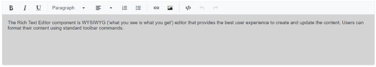

# Iframe Editable in Blazor RichTextEditor

When the `RichTextEditorIframeSettings` option is set to [RichTextEditorIframeSettings.enabled](https://help.syncfusion.com/cr/blazor/Syncfusion.Blazor.RichTextEditor.RichTextEditorIFrameSettings.html#Syncfusion_Blazor_RichTextEditor_RichTextEditorIFrameSettings_Enable), the editor creates the iframe element as the content area on component initialization, which is used to display and edit the content. The editor only displays the body tag of an `<iframe>` document in the content area.

Basically, in an iframe mode, you have the entire document but only the editor content, and you can also use styles and scripts only for the particular editor.




@using Syncfusion.Blazor.RichTextEditor

<SfRichTextEditor>
    <RichTextEditorIFrameSettings Enable="true" />
    
The Rich Text Editor component is WYSIWYG ('what you see is what you get') editor that provides the best user experience to create and update the content. Users can format their content using standard toolbar commands.

</SfRichTextEditor>




## IFrame attributes

You can add an additional attribute to the body tag of an `<iframe>` element by using the [RichTextEditorIframeSettings.Attributes](https://help.syncfusion.com/cr/blazor/Syncfusion.Blazor.RichTextEditor.RichTextEditorIFrameSettings.html#Syncfusion_Blazor_RichTextEditor_RichTextEditorIFrameSettings_Attributes) property. This property contains name or value pairs in string format. It is used to override the default appearance of the content area.









## Adding external CSS/Script file

The editor offers to add an external CSS file to style the `<iframe>` element. Using the [RichTextEditorIframeSettings.Resources](https://help.syncfusion.com/cr/blazor/Syncfusion.Blazor.RichTextEditor.RichTextEditorIFrameSettings.html#Syncfusion_Blazor_RichTextEditor_RichTextEditorIFrameSettings_Resources) property, you can easily change the appearance of the editor's content by using an external CSS file.

Similarly, add the external script file to the `<iframe>` element using the `RichTextEditorIframeSettings.Resources` property, and it will provide the additional functionalities to the Rich Text Editor.




@using Syncfusion.Blazor.RichTextEditor

<SfRichTextEditor>
    <RichTextEditorIFrameSettings Enable="true" Resources="@Resources" />
    
Rich Text Editor allows to insert images from online source as well as local computer where you want to insert the image in your content.

    
<b>Get started Quick Toolbar to click on the image</b>

    
It is possible to add custom style on the selected image inside the Rich Text Editor through quick toolbar.

    
</SfRichTextEditor>

@code {
    private ResourcesModel Resources { get; set; } = new ResourcesModel()
    {
        Styles = new string[] { "/styles.css" },
        Scripts = new string[] { "/script.js" }
    };
}




N> You can refer to our [Blazor Rich Text Editor](https://www.syncfusion.com/blazor-components/blazor-rich-text-editor) feature tour page for its groundbreaking feature representations. You can also explore our [Blazor Rich Text Editor](https://blazor.syncfusion.com/demos/rich-text-editor/overview?theme=bootstrap5) example to knows how to render and configure the rich text editor tools.