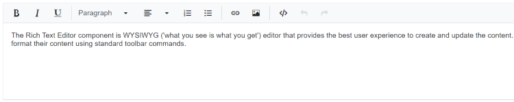

# Iframe Editable in Blazor RichTextEditor Component

When the [`RichTextEditorIframeSettings`](https://help.syncfusion.com/cr/blazor/Syncfusion.Blazor.RichTextEditor.RichTextEditorIFrameSettings.html) option is enabled, the Rich Text Editor creates the iframe element as the content area on component initialization, it is used to display and edit the content. In content area, the editor displays only the body tag of a `<iframe>` document.




@using Syncfusion.Blazor.RichTextEditor

<SfRichTextEditor>
    <RichTextEditorIFrameSettings Enable="true" />
    
The Rich Text Editor component is WYSIWYG ('what you see is what you get') editor that provides the best user experience to create and update the content. Users can format their content using standard toolbar commands.

</SfRichTextEditor>




## IFrame attributes

The editor allows to pass an additional attribute to body tag of a `<iframe>` element using [`Attributes`](https://help.syncfusion.com/cr/blazor/Syncfusion.Blazor.RichTextEditor.RichTextEditorIFrameSettings.html#Syncfusion_Blazor_RichTextEditor_RichTextEditorIFrameSettings_Attributes) fields of [`RichTextEditorIframeSettings`](https://help.syncfusion.com/cr/blazor/Syncfusion.Blazor.RichTextEditor.RichTextEditorIFrameSettings.html) property. This property contains name or value pairs in string format. It is used to override the default appearance of the content area.









## Adding external CSS/Script file

The editor offers to add external CSS file to style the `<iframe>` element. Easily change the appearance of editor’s content using an external CSS file using `Resources - Styles` field in the [`RichTextEditorIframeSettings`](https://help.syncfusion.com/cr/blazor/Syncfusion.Blazor.RichTextEditor.RichTextEditorIFrameSettings.html) property.

Likewise, add the external script file to the `<iframe>` element using `Resources - Scripts` field of [`RichTextEditorIframeSettings`](https://help.syncfusion.com/cr/blazor/Syncfusion.Blazor.RichTextEditor.RichTextEditorIFrameSettings.html) to provide the additional functionalities to the Rich Text Editor.




@using Syncfusion.Blazor.RichTextEditor

<SfRichTextEditor>
    <RichTextEditorIFrameSettings Enable="true" Resources="@Resources" />
    
Rich Text Editor allows to insert images from online source as well as local computer where you want to insert the image in your content.

    
<b>Get started Quick Toolbar to click on the image</b>

    
It is possible to add custom style on the selected image inside the Rich Text Editor through quick toolbar.

    
</SfRichTextEditor>

@code {
    private ResourcesModel Resources { get; set; } = new ResourcesModel()
    {
        Styles = new string[] { "/styles.css" },
        Scripts = new string[] { "/script.js" }
    };
}




> You can refer to our [Blazor Rich Text Editor](https://www.syncfusion.com/blazor-components/blazor-wysiwyg-rich-text-editor) feature tour page for its groundbreaking feature representations. You can also explore our [Blazor Rich Text Editor](https://blazor.syncfusion.com/demos/rich-text-editor/overview?theme=bootstrap4) example to knows how to render and configure the rich text editor tools.

## See Also

* [How to change the editor mode](./editor-modes/#markdown-editor)