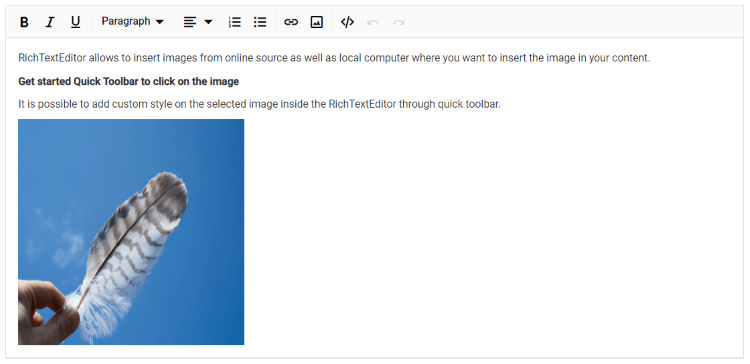

# Image in Blazor Rich Text Editor Component

The Rich Text Editor supports inserting images from online sources and the local computer wherever images are needed in the content. To configure image behavior, use the options in [RichTextEditorImageSettings](https://help.syncfusion.com/cr/blazor/Syncfusion.Blazor.RichTextEditor.RichTextEditorImageSettings.html).

| Options | Description |
|----------------|---------|
| AllowedTypes | Specifies the extensions of the image types allowed to insert on bowering and passing the extensions with List<string>. For example, private List<string> AllowedTypes = new List<string> `{ ".jpg", ".png", ".gif" };`|
| Display | Sets the default display for an image when it is inserted into the Rich Text Editor. Possible options are: `Inline` and `Break`.|
| Width | Sets the default width of an inserted image. |
| Height | Sets the default height of an inserted image. |
| SaveUrl | Specifies the URL of the controller action that handles image upload. |
| Path | Specifies the location to store the image. It is of string type and it appends to the name of the file or folder where you want to store the image. For example, `"api/Images/"`|
| EnableResize | Enables resizing for images. |
| MinWidth | Sets the minimum width of the image. |
| MaxWidth | Sets the maximum width of the image. |
| MinHeight | Sets the minimum height of the image. |
| MaxHeight | Sets the maximum height of the image. |
| ResizeByPercent | Enables image resizing by percentage. |

## Upload options

Use the `browse` option in the Image dialog to select an image from the local machine and insert into the Rich Text Editor content.

If the [Path](https://help.syncfusion.com/cr/blazor/Syncfusion.Blazor.RichTextEditor.RichTextEditorImageSettings.html#Syncfusion_Blazor_RichTextEditor_RichTextEditorImageSettings_Path)  field is not specified in the [RichTextEditorImageSettings](https://help.syncfusion.com/cr/blazor/Syncfusion.Blazor.RichTextEditor.RichTextEditorImageSettings.html), the image will be converted into base64 and blob url for the image will be created then generated url will be set as `src` property of `` tag as below.

The image has been loaded from the local machine and it will be saved in the given location.

```


```

N> If you want to insert a lot of tiny images in the editor and don't want a specific physical location for saving images, you can opt to save format as `Base64`.

## Server side action

The selected image can be uploaded to the required destination by using the following controller action. Map controller method name in `SaveUrl` property of `RichTextEditorImageSettings` and provide required destination path through `Path` property.

N> The following code block shows saving the image file uploaded to Rich Text Editor using the `Blazor Server App` project. The runnable Blazor Server app demo is available in this [Github](https://github.com/SyncfusionExamples/blazor-richtexteditor-image-upload) repository.

`Index.razor`

```cshtml

@using Syncfusion.Blazor.RichTextEditor

<SfRichTextEditor>
    <RichTextEditorImageSettings SaveUrl="api/Image/Save" Path="./Images/" />
</SfRichTextEditor>

```

`ImageController.cs`

```csharp

using System;
using System.IO;
using System.Net.Http.Headers;
using Microsoft.AspNetCore.Mvc;
using Microsoft.AspNetCore.Http;
using System.Collections.Generic;
using Microsoft.AspNetCore.Hosting;
using Microsoft.AspNetCore.Http.Features;

namespace ImageUpload.Controllers
{
    [ApiController]
    public class ImageController : ControllerBase
    {
        private readonly IWebHostEnvironment hostingEnv;

        public ImageController(IWebHostEnvironment env)
        {
            this.hostingEnv = env;
        }

        [HttpPost("[action]")]
        [Route("api/Image/Save")]
        public void Save(IList<IFormFile> UploadFiles)
        {
            try
            {
                foreach (var file in UploadFiles)
                {
                    if (UploadFiles != null)
                    {
                        string targetPath = hostingEnv.ContentRootPath + "\\wwwroot\\Images";
                        string filename = ContentDispositionHeaderValue.Parse(file.ContentDisposition).FileName.Trim('"');

                        // Create a new directory, if it does not exists
                        if (!Directory.Exists(targetPath))
                        {
                            Directory.CreateDirectory(targetPath);
                        }

                        // Name which is used to save the image
                        filename = targetPath + $@"\{filename}";

                        if (!System.IO.File.Exists(filename))
                        {
                            // Upload a image, if the same file name does not exist in the directory
                            using (FileStream fs = System.IO.File.Create(filename))
                            {
                                file.CopyTo(fs);
                                fs.Flush();
                            }
                            Response.StatusCode = 200;
                        }
                        else
                        {
                            Response.StatusCode = 204;
                        }
                    }
                }
            }
            catch (Exception e)
            {
                Response.Clear();
                Response.ContentType = "application/json; charset=utf-8";
                Response.HttpContext.Features.Get<IHttpResponseFeature>().ReasonPhrase = e.Message;
            }
        }
    }
}

```



## Image delete

To remove an image from the Rich Text Editor content, select the image and click "Remove" tool from quick toolbar. It will delete the image from the Rich Text Editor content.

After selecting the image from the local machine, the URL for the image will be generated, from there also you can remove the image from the service location by clicking the cross icon as in the following image.


## Insert from web

To insert an image from online source like Google, Ping, and more, enable images tool on the editor’s toolbar. By default, the images tool opens an image dialog that allows to insert an image from online source.


## Dimension

Sets the default width and height of the image when it is inserted in the Rich Text Editor using `Width` and `Height` of `RichTextEditorImageSettings`.

The image size can also be changed through the `QuickToolbar` using the `Change Size` option. After clicking the option, a dialog opens where width and height can be specified in pixels.


## Caption and alt text

Specify image captions and alternative text using `RichTextEditorQuickToolbarSettings` options such as Image Caption and Alternative Text.

Use the Alternative Text option to set alt text that displays when the image fails to load.

Clicking Image Caption wraps the image with a caption element, allowing caption text to be entered in the editor.

## Display position

Sets the default display for an image when it is inserted in the Rich Text Editor using `Display` field in`RichTextEditorImageSettings`.

N> Available options: Inline and Break.

```cshtml

@using Syncfusion.Blazor.RichTextEditor

<SfRichTextEditor>
    <RichTextEditorImageSettings Display="ImageDisplay.Inline" />
    <p>Rich Text Editor allows to insert images from online source as well as local computer where you want to insert the image in your content.</p>
    <p><b>Get started Quick Toolbar to click on the image</b></p>
    <p>It is possible to add custom style on the selected image inside the Rich Text Editor through quick toolbar.</p>
    
</SfRichTextEditor>

```

## Image with link

An image can be used as a hyperlink. When an image is linked, the quick toolbar includes Remove Link, Edit Link, and Open Link options. For more details, see the[link documentation](./link).


## Resize

The Rich Text Editor includes built-in support for image resizing. Resize handles appear on the image’s corners when focused, allowing users to resize with the mouse or touch easily. Resizing preserves the aspect ratio.


N> You can refer to our [Blazor Rich Text Editor](https://www.syncfusion.com/blazor-components/blazor-rich-text-editor) feature tour page for its groundbreaking feature representations. You can also explore our [Blazor Rich Text Editor](https://blazor.syncfusion.com/demos/rich-text-editor/overview?theme=bootstrap5) example to know how to render and configure the rich text editor tools.

## See Also

* [How to edit the quick toolbar settings](./toolbar#quick-inline-toolbar)
* [How to use link editing option in the toolbar items](./link)