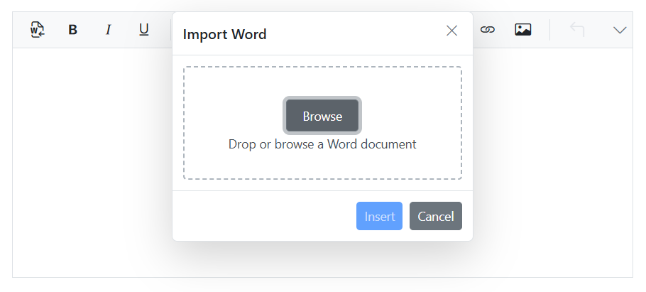

# Import and Export in Blazor Rich Text Editor

## Import to HTML file

The Rich Text Editor allows you to load an external HTML file in the editor's content, which contains the text with styling and images. Read the HTML file from your path using the [Stream Reader](https://docs.microsoft.com/en-us/dotnet/api/system.io.streamreader?view=net-6.0) class and assign it to the editor with the `@bind-Value` property.




@using System.IO; 
@using Syncfusion.Blazor.RichTextEditor 
 
<SfRichTextEditor @bind-Value="@HtmlString"> 
    
Rich Text Editor allows to insert images from online source as well as local computer where you want to insert the image in your content.
 
    
<b>Get started Quick Toolbar to click on the image</b>
 
    
It is possible to add custom style on the selected image inside the Rich Text Editor through quick toolbar.
 
</SfRichTextEditor> 
 
@code { 
    private string HtmlString { get; set; } 
    private string PathToHTMLFile = Path.GetFullPath(Directory.GetCurrentDirectory() + @"\wwwroot\HtmlFiles\HtmlTest.html"); 
    protected override void OnInitialized() 
    { 
        using (FileStream fs = File.Open(PathToHTMLFile, FileMode.Open, FileAccess.ReadWrite)) 
        { 
            using (StreamReader sr = new StreamReader(fs)) 
            {
                // Importing values from HTML file.
                HtmlString = sr.ReadToEnd(); 
            } 
        } 
    } 
} 




N> [View Sample in GitHub](https://github.com/SyncfusionExamples/import-html-file-to-blazor-rich-text-editor).

## Import to RTF file

To import an RTF file into the editor, use the file uploader component and retrieve the file content from the uploader's success event. Then, import the RTF values into the editor.




@using Import_RTF_File.Data;
@using Syncfusion.Blazor.RichTextEditor;
@using Syncfusion.Blazor.Inputs;
@inject ExportService exportService

<SfRichTextEditor ID="defalt_RTE" @ref="RteObj" @bind-Value="@rteValue" EnableHtmlSanitizer="false">
    <RichTextEditorImageSettings SaveUrl="api/SampleData/Save" Path="../images/"></RichTextEditorImageSettings>
</SfRichTextEditor>
<SfUploader ID="UploadFiles">
    <UploaderAsyncSettings SaveUrl="api/SampleData/Import" RemoveUrl="https://aspnetmvc.syncfusion.com/services/api/uploadbox/Remove"></UploaderAsyncSettings>
    <UploaderEvents Success="@onSuccess"></UploaderEvents>
</SfUploader>

@code {
    SfRichTextEditor RteObj;
    private string rteValue { get; set; } = "
Example of Importing Text File into the Editor
";
    public void onSuccess(SuccessEventArgs args)
    {
        var headers = args.Response.Headers.ToString();
        var header = headers.Split("rtevalue: ");
        header = header[1].Split("\r");
        this.rteValue = header[0];
    }
}




N> [View Sample in GitHub](https://github.com/SyncfusionExamples/import-rtf-file-to-blazor-rich-text-editor).

## Import text file to editor

The Rich Text Editor allows you to load an external text file into the editor. Read the text file from your path using the [Stream Reader](https://docs.microsoft.com/en-us/dotnet/api/system.io.streamreader?view=net-6.0) class and assign it to the editor with the `@bind-Value` property.




@using Syncfusion.Blazor.RichTextEditor
@using Syncfusion.Blazor.Buttons
@using System.IO
@using System.Text

<SfButton OnClick="@importStream">Import Text Data</SfButton>
<SfRichTextEditor ID="defalt_RTE" @ref="RteObj" @bind-Value="@rteValue" EnableHtmlSanitizer="false">
</SfRichTextEditor>

@code {
    SfRichTextEditor RteObj;
    public string text { get; set; }
    private string rteValue { get; set; } = "
Click the button to import text file
";
    private string HtmlString { get; set; }
    private string PathToHTMLFile = Path.GetFullPath(Directory.GetCurrentDirectory() + @"\wwwroot\RTESample.txt");
    public void importStream()
    {
        using (FileStream fs = File.Open(PathToHTMLFile, FileMode.Open, FileAccess.ReadWrite))
        {
            using (StreamReader sr = new StreamReader(fs))
            {
                HtmlString = sr.ReadToEnd();
                this.rteValue = HtmlString;
            }
        }
    }
}




N> [View Sample in GitHub](https://github.com/SyncfusionExamples/import-text-file-to-blazor-rich-text-editor).

## Importing content from Microsoft Word

The Rich Text Editor provides functionality to import content directly from Microsoft Word documents, while preserving the original formatting, structure, and styles. This feature ensures a smooth transition of content from Word to the editor, maintaining elements such as headings, lists, tables, and text styles.

To integrate an `ImportWord` option into the Rich Text Editor toolbar, you can add it as a custom toolbar [items](https://help.syncfusion.com/cr/blazor/Syncfusion.Blazor.RichTextEditor.RichTextEditorToolbarSettings.html#Syncfusion_Blazor_RichTextEditor_RichTextEditorToolbarSettings_Items) using the items property in toolbarSettings.

The following example illustrates how to set up the `ImportWord` in the Rich Text Editor to facilitate content importation from Word documents:




@using System.IO; 
@using Syncfusion.Blazor.RichTextEditor 
 
<SfRichTextEditor Height="300px" Width="700px"> 
    <RichTextEditorToolbarSettings Items="@Tools"></RichTextEditorToolbarSettings>
    <RichTextEditorImportWord ServiceUrl="https://blazor.syncfusion.com/services/production/api/RichTextEditor/ImportFromWord"></RichTextEditorImportWord>
</SfRichTextEditor> 
 
@code { 
     private List<ToolbarItemModel> Tools = new List<ToolbarItemModel>()
    {
        new ToolbarItemModel() { Command = ToolbarCommand.ImportWord },
        new ToolbarItemModel() { Command = ToolbarCommand.Bold },
        new ToolbarItemModel() { Command = ToolbarCommand.Italic },
        new ToolbarItemModel() { Command = ToolbarCommand.Underline },
        new ToolbarItemModel() { Command = ToolbarCommand.Separator },
        new ToolbarItemModel() { Command = ToolbarCommand.Formats },
        new ToolbarItemModel() { Command = ToolbarCommand.Alignments },
        new ToolbarItemModel() { Command = ToolbarCommand.BulletFormatList },
        new ToolbarItemModel() { Command = ToolbarCommand.NumberFormatList },
        new ToolbarItemModel() { Command = ToolbarCommand.Separator},
        new ToolbarItemModel() { Command = ToolbarCommand.CreateLink },
        new ToolbarItemModel() { Command = ToolbarCommand.Image },
        new ToolbarItemModel() { Command = ToolbarCommand.Separator },
        new ToolbarItemModel() { Command = ToolbarCommand.SourceCode },
        new ToolbarItemModel() { Command = ToolbarCommand.Separator },
        new ToolbarItemModel() { Command = ToolbarCommand.Undo },
        new ToolbarItemModel() { Command = ToolbarCommand.Redo }
    };
} 




### Maximum file size restriction

You can restrict the word uploaded from the local machine when the uploaded word file size is greater than the allowed size by using the [maxFileSize](https://help.syncfusion.com/cr/blazor/Syncfusion.Blazor.RichTextEditor.RichTextEditorImportWord.html#Syncfusion_Blazor_RichTextEditor_RichTextEditorImportWord_MaxFileSize) property. By default, the maximum file size is 30000000 bytes. You can configure this size as follows.




@using System.IO; 
@using Syncfusion.Blazor.RichTextEditor 
 
<SfRichTextEditor Height="300px"> 
    <RichTextEditorToolbarSettings Items="@Tools"></RichTextEditorToolbarSettings>
    <RichTextEditorImportWord ServiceUrl="https://blazor.syncfusion.com/services/production/api/RichTextEditor/ImportFromWord" MaxFileSize="10000000"></RichTextEditorImportWord>
</SfRichTextEditor> 
 
@code { 
     private List<ToolbarItemModel> Tools = new List<ToolbarItemModel>()
    {
        new ToolbarItemModel() { Command = ToolbarCommand.ImportWord },
        new ToolbarItemModel() { Command = ToolbarCommand.Bold },
        new ToolbarItemModel() { Command = ToolbarCommand.Italic },
        new ToolbarItemModel() { Command = ToolbarCommand.Underline },
        new ToolbarItemModel() { Command = ToolbarCommand.Separator },
        new ToolbarItemModel() { Command = ToolbarCommand.Formats },
        new ToolbarItemModel() { Command = ToolbarCommand.Alignments },
        new ToolbarItemModel() { Command = ToolbarCommand.BulletFormatList },
        new ToolbarItemModel() { Command = ToolbarCommand.NumberFormatList },
        new ToolbarItemModel() { Command = ToolbarCommand.Separator},
        new ToolbarItemModel() { Command = ToolbarCommand.CreateLink },
        new ToolbarItemModel() { Command = ToolbarCommand.Image },
        new ToolbarItemModel() { Command = ToolbarCommand.Separator },
        new ToolbarItemModel() { Command = ToolbarCommand.SourceCode },
        new ToolbarItemModel() { Command = ToolbarCommand.Separator },
        new ToolbarItemModel() { Command = ToolbarCommand.Undo },
        new ToolbarItemModel() { Command = ToolbarCommand.Redo }
    };
} 




### Secure word file upload with authentication

You can add additional data with the word file uploaded from the Rich Text Editor on the client side, which can even be received on the server side. By using the `FileUploading`  event and its `customFormData` argument, you can pass parameters to the controller action. On the server side, you can fetch the custom headers by accessing the form collection from the current request, which retrieves the values sent using the POST method.




@using System.IO; 
@using Syncfusion.Blazor.RichTextEditor 
 
<SfRichTextEditor Height="300px"> 
    <RichTextEditorToolbarSettings Items="@Tools"></RichTextEditorToolbarSettings>
    <RichTextEditorEvents FileUploading="@FileUploading"></RichTextEditorEvents>
    <RichTextEditorImportWord ServiceUrl="api/Word/ImportFromWord" MaxFileSize="10000000"></RichTextEditorImportWord>
</SfRichTextEditor> 
 
@code { 
    private void FileUploading(FileUploadingEventArgs args)
    {
        var accessToken = "Authorization_token";
        // adding custom form Data
        args.CustomFormData = new List<object> { new { Authorization = accessToken } };
    }
     private List<ToolbarItemModel> Tools = new List<ToolbarItemModel>()
    {
        new ToolbarItemModel() { Command = ToolbarCommand.ImportWord },
        new ToolbarItemModel() { Command = ToolbarCommand.Bold },
        new ToolbarItemModel() { Command = ToolbarCommand.Italic },
        new ToolbarItemModel() { Command = ToolbarCommand.Underline },
        new ToolbarItemModel() { Command = ToolbarCommand.Separator },
        new ToolbarItemModel() { Command = ToolbarCommand.Formats },
        new ToolbarItemModel() { Command = ToolbarCommand.Alignments },
        new ToolbarItemModel() { Command = ToolbarCommand.BulletFormatList },
        new ToolbarItemModel() { Command = ToolbarCommand.NumberFormatList },
        new ToolbarItemModel() { Command = ToolbarCommand.Separator},
        new ToolbarItemModel() { Command = ToolbarCommand.CreateLink },
        new ToolbarItemModel() { Command = ToolbarCommand.Image },
        new ToolbarItemModel() { Command = ToolbarCommand.Separator },
        new ToolbarItemModel() { Command = ToolbarCommand.SourceCode },
        new ToolbarItemModel() { Command = ToolbarCommand.Separator },
        new ToolbarItemModel() { Command = ToolbarCommand.Undo },
        new ToolbarItemModel() { Command = ToolbarCommand.Redo }
    };
} 







using System;
using System.IO;
using System.Net.Http.Headers;
using Microsoft.AspNetCore.Mvc;
using Microsoft.AspNetCore.Http;
using System.Collections.Generic;
using Microsoft.AspNetCore.Hosting;
using Microsoft.AspNetCore.Http.Features;

namespace WordUpload.Controllers
{
    [ApiController]
    public class WordController : ControllerBase
    {
        private readonly IWebHostEnvironment hostingEnv;

        public WordController(IWebHostEnvironment env)
        {
            this.hostingEnv = env;
        }

        [HttpPost("[action]")]
        [Route("api/Word/ImportFromWord")]
        public void ImportFromWord(IList<IFormFile> UploadFiles)
        {
            string currentPath = Request.Form["Authorization"].ToString();
        }
    }
}




## Export to RTF file

Use the [Syncfusion.DocIO](https://libraries.io/nuget/Syncfusion.DocIO.NET) libraries to export the RTE content to the RTF format. Ensure the Syncfusion.DocIO.NET NuGet package is installed in your project.

Click **Export**, and use **Syncfusion.DocIO** libraries to convert the RTE content to an RTF file. Use the following code to export the RTF file.




@using Syncfusion.Blazor.RichTextEditor;
@using Syncfusion.Blazor.Inputs;
@inject NavigationManager navigationManager;
@inject HttpClient Http
@using System.Net.Http;
@using System.Threading.Tasks;

<Syncfusion.Blazor.Buttons.SfButton OnClick="OnExport">Export</Syncfusion.Blazor.Buttons.SfButton>
    <SfRichTextEditor ID="customtool" @ref="RteObj" @bind-Value="@rteValue" EnableHtmlSanitizer="false">
        <RichTextEditorImageSettings SaveUrl="api/SampleData/Save" Path="../images/"></RichTextEditorImageSettings>
    </SfRichTextEditor>

@code {
    SfRichTextEditor RteObj;
    [Inject]
    IJSRuntime jsRuntime { get; set; }
    private string rteValue { get; set; } = "
Click the export button to download the RTE content in RTF format
";
    public async Task OnExport()
    {
        HttpClientHandler clientHandler = new HttpClientHandler();
        clientHandler.ServerCertificateCustomValidationCallback = (sender, cert, chain, sslPolicyErrors) => { return true; };
        HttpClient client = new HttpClient(clientHandler);
        var content = new StringContent(rteValue);
        content.Headers.Add("value", rteValue);
        await client.PostAsync(navigationManager.Uri + "api/SampleData/ExportToRtf", content);
        await SampleInterop.SaveAs<object>(jsRuntime, "Sample.rtf");
    }
}




N> [View Sample in GitHub](https://github.com/SyncfusionExamples/blazor-rich-text-editor-export-to-rtf).

## Export to HTML file

Use [Syncfusion.DocIO](https://libraries.io/nuget/Syncfusion.DocIO.NET) libraries to export the RTE content to HTML format. Make sure the required NuGet package is referenced in your project.

While clicking on the export button, it makes a call to the Export to HTML service.




<button @onclick="ExportFile">Export</button>
<SfRichTextEditor ID="defalt_RTE" @ref="RteObj" @bind-Value="@rteValue">
    <ChildContent>
        <RichTextEditorToolbarSettings Items="@Tools" Type="ToolbarType.Expand"></RichTextEditorToolbarSettings>
    </ChildContent>
</SfRichTextEditor>

@code {
    [Inject]
    IJSRuntime jsRuntime { get; set; }
    SfRichTextEditor RteObj;
    private string rteValue { get; set; } = "
Starting Text
";
    public object[] Tools = new object[]{
        "Bold", "Italic", "Underline", "SubScript", "SuperScript", "StrikeThrough",
        "FontName", "FontSize", "FontColor", "BackgroundColor",
        "LowerCase", "UpperCase", "|",
        "Formats", "Alignments", "OrderedList", "UnorderedList",
        "Outdent", "Indent", "|", "CreateTable",
        "CreateLink", "Image", "|", "ClearFormat", "Print",
        "SourceCode", "FullScreen", "|", "Undo", "Redo"
    };
    public void ExportFile()
    {
        exportService.ExportToHtml(rteValue);
    }
}




Here, the [Syncfusion.DocIO](https://libraries.io/nuget/Syncfusion.DocIO.NET) values are converted into document type and then converted to HTML format.




public void ExportToHtml(string value)
{
    WordDocument document = GetDocument(value);
    //Saves the Word document to MemoryStream
    MemoryStream stream = new MemoryStream();
    document.Save(stream, FormatType.Html);
    stream.Position = 0;
    FileStream outputStream = new FileStream("filename.html", FileMode.Create, FileAccess.ReadWrite, FileShare.ReadWrite);
    document.Save(outputStream, FormatType.Html);
    document.Close();
    outputStream.Flush();
    outputStream.Dispose();
    // You can upload this stream to the azure
}
public WordDocument GetDocument(string htmlText)
{
    WordDocument document = null;
    MemoryStream stream = new MemoryStream();
    StreamWriter writer = new StreamWriter(stream, System.Text.Encoding.Default);
    htmlText = htmlText.Replace("\"", "'");
    XmlConversion XmlText = new XmlConversion(htmlText);
    XhtmlConversion XhtmlText = new XhtmlConversion(XmlText);
    writer.Write(XhtmlText.ToString());
    writer.Flush();
    stream.Position = 0;
    document = new WordDocument(stream, FormatType.Html, XHTMLValidationType.None);
    return document;
}




N> [View Sample in GitHub](https://github.com/SyncfusionExamples/blazor-rich-text-editor-export-to-html).