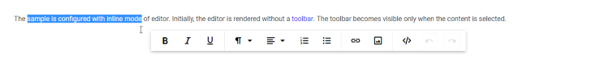

# Inline Mode in Blazor RichTextEditor Component

This is the inline example for the Rich Text Editor. For this, you must set the `RichTextEditorInlineMode` property. Inline editing allows to select any editable element or click the element on the page and edit it in-place. Inline editing is a true WYSIWYG formation and on the contrary to Rich Text Editor HTML/MD editing, the styles that are used for edited content comes directly from the document stylesheet. This means that inline editors ignore the default Rich Text Editor content styles.

## Show on select/click

Enabling the `ShowOnSelection` option of `RichTextEditorInlineMode` makes the inline Rich Text Editor to appear. You can select the text in the editable area, otherwise the inline Rich Text Editor will be appeared after clicking the editable area.

```cshtml

@using Syncfusion.Blazor.RichTextEditor

<SfRichTextEditor>
    <RichTextEditorInlineMode Enable="true" ShowOnSelection="true" />
    <p>The sample is configured with inline mode of editor. Initially, the editor is rendered without a
    <a href='https://blazor.syncfusion.com/home/' target='_blank'>toolbar</a>. The toolbar becomes visible only when the content is selected.</p>
</SfRichTextEditor>

```



> You can refer to our [Blazor Rich Text Editor](https://www.syncfusion.com/blazor-components/blazor-wysiwyg-rich-text-editor) feature tour page for its groundbreaking feature representations. You can also explore our [Blazor Rich Text Editor](https://blazor.syncfusion.com/demos/rich-text-editor/overview?theme=bootstrap4) example to know how to render and configure the rich text editor tools.

## See Also

* [How to edit the quick toolbar settings](./toolbar/#quick-inline-toolbar)
* [How to insert link editing option in the toolbar items](./link/#insert-link)
* [How to insert image editing option in the toolbar items](./image/#upload-options)