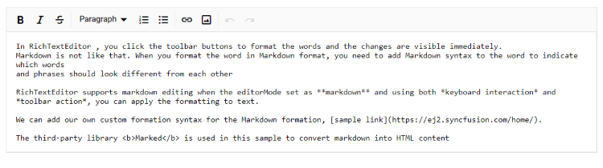

# Keyboard support in Blazor RichTextEditor Component

The editor has full keyboard accessibility that includes shortcuts to open and other actions with toolbar items, drop-down lists, and dialogs.

## HTML formation shortcut key

You can use the following key shortcuts when the Rich Text Editor renders with `HTML` editMode.

| Actions | Keyboard shortcuts |
|----------------|---------|
| Toolbar focus | <kbd>ALT</kbd> + <kbd>F10</kbd> |
| Insert link | <kbd>CTRL</kbd> + <kbd>K</kbd> |
| Insert image | <kbd>CTRL</kbd> + <kbd>SHIFT</kbd> + <kbd>I</kbd> |
| Insert audio | <kbd>Ctrl</kbd> + <kbd>Shift</kbd> + <kbd>a</kbd> |
| Insert video | <kbd>Ctrl</kbd> + <kbd>Alt</kbd> + <kbd>v</kbd> |
| Insert table | <kbd>CTRL</kbd> + <kbd>SHIFT</kbd> + <kbd>E</kbd> |
| Undo | <kbd>CTRL</kbd> + <kbd>Z</kbd> |
| Redo | <kbd>CTRL</kbd> + <kbd>Y</kbd> |
| Copy | <kbd>CTRL</kbd> + <kbd>C</kbd> |
| Cut | <kbd>CTRL</kbd> + <kbd>X</kbd> |
| Paste| <kbd>CTRL</kbd> + <kbd>V</kbd> |
| Bold| <kbd>CTRL</kbd> + <kbd>B</kbd> |
| Italic| <kbd>CTRL</kbd> + <kbd>I</kbd> |
| Underline| <kbd>CTRL</kbd> + <kbd>U</kbd> |
| Strikethrough| <kbd>CTRL</kbd> + <kbd>SHIFT</kbd> + <kbd>S</kbd> |
| Uppercase| <kbd>CTRL</kbd> + <kbd>SHIFT</kbd> + <kbd>U</kbd> |
| Lowercase| <kbd>CTRL</kbd> + <kbd>SHIFT</kbd> + <kbd>L</kbd> |
| Superscript| <kbd>CTRL</kbd> + <kbd>SHIFT</kbd> + <kbd>=</kbd> |
| Subscript| <kbd>CTRL</kbd> + <kbd>=</kbd> |
| Indents| <kbd>CTRL</kbd> + <kbd>]</kbd> |
| Outdents| <kbd>CTRL</kbd> + <kbd>[</kbd> |
| HTML source | <kbd>CTRL</kbd> + <kbd>SHIFT</kbd> + <kbd>H</kbd> |
| Full screen| <kbd>CTRL</kbd> + <kbd>SHIFT</kbd> + <kbd>F</kbd> |
| Exit Full screen| <kbd>Esc</kbd> |
| Justify center| <kbd>CTRL</kbd> + <kbd>E</kbd> |
| Justify full | <kbd>CTRL</kbd> + <kbd>`J</kbd> |
| Justify left | <kbd>CTRL</kbd> + <kbd>L</kbd> |
| Justify right | <kbd>CTRL</kbd> + <kbd>R</kbd> |
| Clear format | <kbd>CTRL</kbd> + <kbd>SHIFT</kbd> + <kbd>R</kbd> |
| Ordered list | <kbd>CTRL</kbd> + <kbd>SHIFT</kbd> + <kbd>O</kbd> |
| Unordered list | <kbd>CTRL</kbd> + <kbd>ALT</kbd> + <kbd>O</kbd> |

## Markdown formation shortcut key

You can use the following key shortcuts when the Rich Text Editor renders with `Markdown` editMode.

| Actions | Keyboard shortcuts |
|----------------|---------|
| Toolbar focus| <kbd>ALT</kbd> + <kbd>F10</kbd> |
| Insert link| <kbd>CTRL</kbd> + <kbd>K</kbd> |
| Insert image| <kbd>CTRL</kbd> + <kbd>SHIFT</kbd> + <kbd>I</kbd> |
| Insert table| <kbd>CTRL</kbd> + <kbd>SHIFT</kbd> + <kbd>E</kbd> |
| Undo| <kbd>CTRL</kbd> + <kbd>Z</kbd> |
| Redo| <kbd>CTRL</kbd> + <kbd>Y</kbd> |
| Copy| <kbd>CTRL</kbd> + <kbd>C</kbd> |
| Cut| <kbd>CTRL</kbd> + <kbd>X</kbd> |
| Paste| <kbd>CTRL</kbd> + <kbd>V</kbd> |
| Bold| <kbd>CTRL</kbd> + <kbd>B</kbd> |
| Italic| <kbd>CTRL</kbd> + <kbd>i</kbd> |
| Strikethrough| <kbd>CTRL</kbd> + <kbd>SHIFT</kbd> + <kbd>S</kbd> |
| Uppercase| <kbd>CTRL</kbd> + <kbd>SHIFT</kbd> + <kbd>U</kbd> |
| Lowercase| <kbd>CTRL</kbd> + <kbd>SHIFT</kbd> + <kbd>L</kbd> |
| Superscript| <kbd>CTRL</kbd> + <kbd>SHIFT</kbd> + <kbd>=</kbd> |
| Subscript| <kbd>CTRL</kbd> + <kbd>=</kbd> |
| Full screen| <kbd>CTRL</kbd> + <kbd>SHIFT</kbd> + <kbd>F</kbd> |
| Exit Full screen| <kbd>Esc</kbd> |
| Ordered list| <kbd>CTRL</kbd> + <kbd>SHIFT</kbd> + <kbd>O</kbd> |
| Unordered list| <kbd>CTRL</kbd> + <kbd>ALT</kbd> + <kbd>O</kbd> |

```cshtml

@using Syncfusion.Blazor.RichTextEditor

<SfRichTextEditor EditorMode="EditorMode.Markdown">
    <p>The Rich Text Editor component is WYSIWYG ('what you see is what you get') editor that provides the best user experience to create and update the content. Users can format their content using standard toolbar commands.</p>
    <p><b> Key features:</b></p>
    <ul>
    <li><p> Provides <b>IFRAME</b> and <b>DIV</b> modes </p></li>
    <li><p> Capable of handling markdown editing.</p></li>
    <li><p> Contains a modular library to load the necessary functionality on demand.</p></li>
    <li><p> Provides a fully customizable toolbar.</p></li><li><p> Provides HTML view to edit the source directly for developers.</p></li>
    <li><p> Supports third - party library integration.</p></li>
    <li><p> Allows preview of modified content before saving it.</p></li>
    </ul>
</SfRichTextEditor>

```



## Custom key config

Customize the key config for the keyboard interaction of Rich Text Editor, using the `KeyConfigure` property.

In the following code block, customize the bold and italic, toolbar actions with `ctrl+1`, `ctrl+2` respectively.

```cshtml

@using Syncfusion.Blazor.RichTextEditor

<SfRichTextEditor KeyConfigure="@KeyConfig">
    <p>The Rich Text Editor component is WYSIWYG ('what you see is what you get') editor that provides the best user experience to create and update the content. Users can format their content using standard toolbar commands.</p>
    <p><b> Key features:</b></p>
    <ul>
    <li><p> Provides <b>IFRAME</b> and <b>DIV</b> modes </p></li>
    <li><p> Capable of handling markdown editing.</p></li>
    <li><p> Contains a modular library to load the necessary functionality on demand.</p></li>
    <li><p> Provides a fully customizable toolbar.</p></li>
    <li><p> Provides HTML view to edit the source directly for developers.</p></li>
    <li><p> Supports third - party library integration.</p></li>
    <li><p> Allows preview of modified content before saving it.</p></li>
    </ul>
</SfRichTextEditor>

@code {
    private ShortcutKeys KeyConfig = new ShortcutKeys()
    {
        Bold = "ctrl+1",
        Italic = "ctrl+2"
    };
}

```

N> You can refer to our [Blazor Rich Text Editor](https://www.syncfusion.com/blazor-components/blazor-wysiwyg-rich-text-editor) feature tour page for its groundbreaking feature representations. You can also explore our [Blazor Rich Text Editor](https://blazor.syncfusion.com/demos/rich-text-editor/overview?theme=bootstrap4) example to know how to render and configure the rich text editor tools.

## See also

* [Globalization](./globalization)
* [Accessibility](./accessibility)