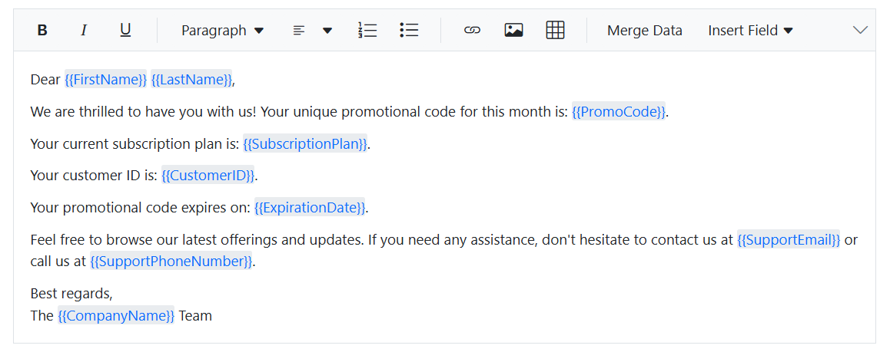

# Mail merge in Blazor Rich Text Editor Control

The Mail merge feature in Blazor Rich Text Editor enables developers to create dynamic, personalized documents by inserting placeholders (merge fields) into the editor content. These placeholders are later replaced with actual data at runtime, making it ideal for generating letters, invoices, and bulk communication templates.

## Rendering custom toolbar items

Custom toolbar items are added using the [RichTextEditorCustomToolbarItems](https://help.syncfusion.com/cr/blazor/Syncfusion.Blazor.RichTextEditor.RichTextEditorCustomToolbarItems.html) tag. Each item is defined with:

- **Name**: Identifier for the toolbar item.
- **Template**: Razor markup for rendering UI elements such as buttons or dropdowns.




<RichTextEditorCustomToolbarItems>
    <RichTextEditorCustomToolbarItem Name="MergeData">
        <Template>
            <SfButton CssClass="@_buttonClass" OnClick="OnClickHandler" id="merge_data" tabindex="-1" aria-label="Merge User-specific Data" Disabled="@_sourceCodeEnabled">
                <div class="e-tbar-btn-text">Merge Data</div>
            </SfButton>
        </Template>
    </RichTextEditorCustomToolbarItem>
    <RichTextEditorCustomToolbarItem Name="InsertField">
        <Template>
            <SfDropDownButton CssClass="@_dropDownButtonClass" id="insertField" Items="@_items" aria-label="Insert Merge Field" Disabled="@_sourceCodeEnabled">
                <ChildContent>
                    <span style="display:inline-flex;">
                        <span class="e-rte-dropdown-btn-text">Insert Field</span>
                    </span>
                    <DropDownButtonEvents ItemSelected="OnItemSelect" OnOpen="OnDropDownOpen" Closed="OnDropDownClose"></DropDownButtonEvents>
                </ChildContent>
            </SfDropDownButton>
        </Template>
    </RichTextEditorCustomToolbarItem>
</RichTextEditorCustomToolbarItems>




## Populating and using insert field dropdown

The `Insert Field` dropdown in the Rich Text Editor is designed to let users quickly insert predefined merge fields into the editor content. This dropdown is powered by the `SfDropDownButton` control, which uses its [Items](https://help.syncfusion.com/cr/blazor/Syncfusion.Blazor.SplitButtons.SfDropDownButton.html#Syncfusion_Blazor_SplitButtons_SfDropDownButton_Items) property to bind a collection of menu items.

### How the items property works

- The `Items` property accepts a list of [DropDownMenuItem](https://help.syncfusion.com/cr/blazor/Syncfusion.Blazor.SplitButtons.DropDownMenuItem.html) objects.
- Each item in this list represents a merge field and contains a [Text](https://help.syncfusion.com/cr/blazor/Syncfusion.Blazor.SplitButtons.DropDownMenuItem.html#Syncfusion_Blazor_SplitButtons_DropDownMenuItem_Text) property, which is displayed in the dropdown.
- These text values correspond to the merge fields available for insertion.




<SfDropDownButton Items="@items">
    <ChildContent>Insert Field</ChildContent>
    <DropDownButtonEvents ItemSelected="OnItemSelect" />
</SfDropDownButton>




Here, `@items` refers to a list of `DropDownMenuItem` objects defined in the `@code` block.

```csharp
 private List<DropDownMenuItem> items = new List<DropDownMenuItem>
    {
        new DropDownMenuItem { Text = "First Name" },
        new DropDownMenuItem { Text = "Last Name" },
        new DropDownMenuItem { Text = "Support Email" },
        new DropDownMenuItem { Text = "Company Name" },
        new DropDownMenuItem { Text = "Promo Code" },
        new DropDownMenuItem { Text = "Support Phone Number" },
        new DropDownMenuItem { Text = "Customer ID" },
        new DropDownMenuItem { Text = "Expiration Date" },
        new DropDownMenuItem { Text = "Subscription Plan" }
    };

```

When the user selects an item from the dropdown:

- The `OnItemSelect()` method retrieves the corresponding field value.
- It constructs an HTML snippet with a non-editable span containing the placeholder.
- The snippet is inserted at the current cursor position using [ExecuteCommandAsync](https://help.syncfusion.com/cr/blazor/Syncfusion.Blazor.RichTextEditor.SfRichTextEditor.html#Syncfusion_Blazor_RichTextEditor_SfRichTextEditor_ExecuteCommandAsync_Syncfusion_Blazor_RichTextEditor_CommandName_System_String_Syncfusion_Blazor_RichTextEditor_ExecuteCommandOption_).

```csharp
 
    public async Task OnItemSelect(MenuEventArgs args)
    {
        if (args.Item.Text != null)
        {
            var value = _mergeData.FirstOrDefault(md => md.Text == args.Item.Text)?.Value;
           string htmlContent = $"<span contenteditable=\"false\" class=\"e-mention-chip\"><span>{{{{{value}}}}}</span></span> 
            var undoOption = new ExecuteCommandOption { Undo = true };
            this._mailMergeEditor.ExecuteCommandAsync(CommandName.InsertHTML, htmlContent, undoOption);
            await this._mailMergeEditor.SaveSelectionAsync();
        }
    }
 
```

## Role of Mention control in mail merge

Mention control enhances usability by enabling inline field suggestions:

- Activated when the user types `{` inside the editor.
- Displays a popup list of available merge fields from DataSource.
- On selection, inserts the placeholder using the same logic as the dropdown.




<SfMention DataSource="_mergeData" TItem="MergeData" Target="#_mailMergeEditor" MentionChar="_mentionChar" AllowSpaces="true" PopupWidth='250px' PopupHeight='200px' @ref="mentionObj">
    <DisplayTemplate>
        
        <span>@((context as MergeData).Value)</span>
        
    </DisplayTemplate>
    <ChildContent>
        <MentionFieldSettings Text="Text"></MentionFieldSettings>
    </ChildContent>
</SfMention>




This feature is ideal for users who prefer keyboard-driven workflows.

## Maintaining cursor position during dropdown operations

When the `Insert Field` dropdown opens, the editor loses its current selection because focus shifts to the popup. To ensure the placeholder is inserted at the correct position:

- **SaveSelectionAsync()** is called when the dropdown opens. This stores the current cursor position in the editor before focus changes.
- **RestoreSelectionAsync()** is called when the dropdown closes. This restores the saved cursor position so that the next insertion happens exactly where the user intended.

**Why is this important?** Without saving and restoring the selection, placeholders might be inserted at the wrong location (e.g., at the end of the content), breaking the user experience.

```csharp
    public async Task OnDropDownOpen()
    {
        if (this._mailMergeEditor != null)
        {
            await this._mailMergeEditor.SaveSelectionAsync();
        }
    }
    public async Task OnDropDownClose()
    {
        if (this._mailMergeEditor != null)
        {
            await this._mailMergeEditor.RestoreSelectionAsync();
        }
    }
```

## Handling editor mode changes with OnActionComplete

The [OnActionComplete](https://help.syncfusion.com/cr/blazor/Syncfusion.Blazor.RichTextEditor.RichTextEditorEvents.html#Syncfusion_Blazor_RichTextEditor_RichTextEditorEvents_OnActionComplete) event fires after specific actions in the RichTextEditor, such as switching between Source Code and Preview modes.

- When entering **Source Code mode**, custom toolbar buttons (Merge Data, Insert Field) should be disabled because HTML editing is manual in this mode.
- When returning to **Preview mode**, these buttons are re-enabled for normal usage.

```csharp
 private void OnActionCompleteHandler(Syncfusion.Blazor.RichTextEditor.ActionCompleteEventArgs args)
    {
        if (args.RequestType == "SourceCode")
        {
            this._buttonClass = "e-tbar-btn e-tbar-btn-text e-overlay";
            this._dropDownButtonClass = "e-rte-elements e-rte-dropdown-menu e-overlay";
            this._sourceCodeEnabled = true;
        }
        if (args.RequestType == "Preview")
        {
            this._buttonClass = "e-tbar-btn e-tbar-btn-text";
            this._dropDownButtonClass = "e-rte-elements e-rte-dropdown-menu";
            this._sourceCodeEnabled = false;
        }
    }
```

**Why is this important?** This prevents users from triggering merge operations or inserting fields while editing raw HTML, which could cause unexpected behavior.

## Executing merge data action

When the `Merge Data` button is clicked:

- The editor’s current content is retrieved by using [Value](https://help.syncfusion.com/cr/blazor/Syncfusion.Blazor.RichTextEditor.SfRichTextEditor.html#Syncfusion_Blazor_RichTextEditor_SfRichTextEditor_Value) property.
- A regex-based function scans for placeholders in the format {{FieldName}}.
- Each placeholder is replaced with its corresponding value from a dictionary.

```csharp

    public void OnClickHandler()
    {
        if (this._mailMergeEditor != null)
        {
            var editorContent = this._mailMergeEditor.Value;
            var mergedContent = ReplacePlaceholders(editorContent, this._placeholderData);
            _rteValue = mergedContent;
        }
    }

    public static string ReplacePlaceholders(string template, Dictionary<string, string> data)
    {
        return Regex.Replace(template, @"{{\s*(\w+)\s*}}", match =>
        {
            string key = match.Groups[1].Value.Trim();
            return data.TryGetValue(key, out var value) ? value : match.Value;
        });
    }

```
This ensures all placeholders are dynamically replaced without manual editing.









## Related resources

[Mention Control Guide](https://blazor.syncfusion.com/documentation/mention/getting-started-webapp)