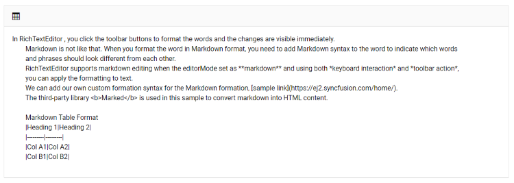

# Markdown in Blazor RichTextEditor Component

In Rich Text Editor, click the toolbar buttons to format the words and the changes are visible immediately.

Markdown is not like that. When you format the word in Markdown format, you need to add Markdown syntax to the word to indicate which words and phrases should look different from each other. Rich Text Editor supports markdown editing when the [`EditorMode`](https://help.syncfusion.com/cr/blazor/Syncfusion.Blazor.RichTextEditor.EditorMode.html#fields) set as [`Markdown`](https://help.syncfusion.com/cr/blazor/Syncfusion.Blazor.RichTextEditor.EditorMode.html#Syncfusion_Blazor_RichTextEditor_EditorMode_Markdown) and using both *keyboard interaction* and *toolbar action*, you can apply the formatting to text.





```cshtml

@using Syncfusion.Blazor.RichTextEditor


<SfRichTextEditor EditorMode="EditorMode.Markdown">

    The sample is added to showcase **markdown editing**.

    Type or edit the content and apply formatting to view markdown formatted content.

    We can add our own custom formation syntax for the Markdown formation, [sample link](https://blazor.syncfusion.com/demos/rich-text-editor/markdown-custom-format).

    The third-party library **Marked** is used in this sample to convert markdown into HTML content.

</SfRichTextEditor>

```


## Markdown  Commands

The [Blazor Markdown editor](https://www.syncfusion.com/blazor-components/blazor-wysiwyg-rich-text-editor/wysiwyg-markdown-editor) supports the following commands to format the markdown content:

|Commands|Syntax| Description |
|--------|------------------------------------------|------------|
| Bold | Sample content for `**`bold text`**`. | For bold, add `**` or `__` to front and back of the text. For order list, precede each line with a number. |
| Italic | Sample content for `*`Italic text`*`. | For Italic, add `*` or `_` to front and back of the text. |
| Bold and Italics | Sample content for `***`bold and Italic text`***`. | For bold and Italics, add `***` to the front and back of the text. |
| Heading 1 | `#` Heading 1 content | For heading 1, add `#` to start of the line. |
| Heading 2 | `##` Heading 2 content | For heading 2, add `##` to start of the line. |
| Heading 3 | `###` Heading 3 content | For heading 3, add `###` to start of the line. |
| Heading 4 | `####` Heading 4 content | For heading 4, add `####` to start of the line. |
| Heading 5 | `#####` Heading 5 content | For heading 5, add `#####` to start of the line. |
| Heading 6 | `######` Heading 6 content | For heading 6, add `######` to start of the line. |
| Line Break | First line `<br>`Second line | For line break, press enter two times (or) add `<br>` in between the first and the second line. |
| Blockquotes | `>` Blockquotes text | For blockquotes, add `>` to start of the line. |
| Strike Through | Sample content for `~~`strike through text`~~`. | For strike through, add `~~` to front and back of the text. |
| Code (Single line) | \`Single line code\` | For single line code, add \` to front and back of the text. |
| Code block (Multi Line) | \`\`\`<br>Multi line code text<br>Multi line code text<br>\`\`\` | For multiple line code, add \`\`\` in the new line before and after the content. |
| Subscript | `<sub>`Subscript text`</sub>` | For subscript, add `<sub>` to the front and `</sub>` to the back of the text. |
| Superscript | `<sup>`Superscript text`</sup>` | For superscript, add `<sup>` to the front and `</sup>` to the back of the text. |
| Ordered List | `1.` First<br>`1.` Second | For ordered list, preceding one or more lines of text with `1.` |
| Unordered List | `*` First<br>`*` second | For unordered list, preceding one or more lines of text with `*`. |
| Links | **Link text without title text**<br>`[` Link text `](`URL`)`<br> **Link text with title text**<br>`[` Link text `](`URL , “title text”`)` | Create an inline link by wrapping link text in brackets `[ ]`, and then wrapping the URL as first parameter and title as second parameter in the parentheses `()`.<br>**Note:** The title text is optional, if needed it can be given manually.|
| Table | `|` Heading 1 `|` Heading 2 `|`<br>`|---------|---------|`<br>`|` Col A1 `|` Col A2 `|`<br>`|` Col B1 `|` Col B2 `|` | Create a table using the pipes and underscores as given in the syntax to create 2 x 2 table. |
| Horizontal Line | `***` (three asterisk in new line)<br>(or)<br>`___` (three underscores in new line) | For horizontal line, add `***` or `___` to the start of the new line. |
| Image | !`[`alt text`](`URL path`)` | Create an image by wrapping the image source in parentheses `()`. |
| Image with alternate text | !`[` alternate text `](`URL path`)` | Create an image with alternate text by wrapping an alternative text in brackets `[ ]`, and then link of the image source in parentheses `()`.<br>**Note:** When inserting the image using toolbar, the alternate text cannot be provided that needs to be given manually. |
| Escape tick marks supported | Sample text content with `**`bold and `**`not bold`**` text can be in the same line.`**` | In the syntax, the whole content is made as bold where the content `not bold` can be made as normal text by adding the bold syntax to the start and end of the respective text. Likewise you can do the same for various inline commands. |
| Escape Character | `\(`any syntax`)` | Escape any markdown syntax by prefix `\` to the syntax.<br>Example:<br>`\**`Bold text`**`|
| HTML Entities | Copyright: &copy; - `&copy;` <br>Trade mark: &trade; - `&trade;`<br>Registered: &reg; - `&reg;`<br>Ampersand: &amp; - `&amp;`<br>Less than: &lt; - `&lt;`<br>Greater than: &gt; - `&gt;` | For HTML entities, add & and ; to the front and back of the respective entities. |

> The above listed commands alone are supported in Syncfusion Markdown editor. For other unsupported commands, you can achieve using the HTML tags in Markdown editor. The foot notes, definitions, math, and check list markdown syntax are also not supported.


### Insert table

To insert the table in Rich Text Editor, click the [`Table`](https://help.syncfusion.com/cr/blazor/Syncfusion.Blazor.RichTextEditor.RichTextEditorTableSettings.html#properties) toolbar option to insert the table into Rich Text Editor content and this is the default way in all the devices. Refer to the following sample and code snippets to add the table in Markdown editor.




@using Syncfusion.Blazor.RichTextEditor

<SfRichTextEditor EditorMode="EditorMode.Markdown" Height="340px" Placeholder="Type Something">
    <RichTextEditorToolbarSettings Items="@Tools" />
    In Rich Text Editor , you click the toolbar buttons to format the words and the changes are visible immediately.
    Markdown is not like that. When you format the word in Markdown format, you need to add Markdown syntax to the word to indicate which words
    and phrases should look different from each other.
    Rich Text Editor supports markdown editing when the editorMode set as **markdown** and using both *keyboard interaction* and *toolbar action*,
    you can apply the formatting to text.
    We can add our own custom formation syntax for the Markdown formation, [sample link](https://blazor.syncfusion.com/home/).
    The third-party library <b>Marked</b> is used in this sample to convert markdown into HTML content.

    Markdown Table Format
    |Heading 1|Heading 2|
    |---------|---------|
    |Col A1|Col A2|
    |Col B1|Col B2|
</SfRichTextEditor>

@code {
    private List<ToolbarItemModel> Tools = new List<ToolbarItemModel>()
    {
        new ToolbarItemModel() { Command = ToolbarCommand.CreateTable }
    };
}












### Insert Image

 We can insert an image into the Rich Text Editor content. Click the Insert Image button in the toolbar item to insert an image. Refer to the following sample and code snippets to insert the image in Markdown editor.




@using Syncfusion.Blazor.RichTextEditor

<SfRichTextEditor EditorMode="EditorMode.Markdown">
    <RichTextEditorToolbarSettings Items="@Tools" />
    Rich Text Editor allows inserting images from online sources as well as the local computers where you want to insert the image in your content.

    Get started Quick Toolbar to click on the image

    It is possible to add custom style on the selected image inside the Rich Text Editor through the quick toolbar.

</SfRichTextEditor>
@code{
    private List<ToolbarItemModel> Tools = new List<ToolbarItemModel>()
    {
        new ToolbarItemModel() { Command = ToolbarCommand.Image }
    };

}










### Insert Link

Point the cursor anywhere within the editor where you would like to insert the link. It is also possible to select a text or an image within the editor and can be converted to the hyperlink. Click the Insert HyperLink tool on the toolbar. The Insert Link Dialog will open. The dialog has the following options.

| Options | Description |
|----------------|--------------------------------------|
| Web Address | Types or pastes the destination for the link you are creating |
| Display Text | Types or edits the required text that you want to display text for the link|




@using Syncfusion.Blazor.RichTextEditor

<SfRichTextEditor EditorMode="EditorMode.Markdown">
    <RichTextEditorToolbarSettings Items="@Tools" />

    Rich Text Editor allows inserting images from online sources as well as the local computers where you want to insert the image in your content.

    Get started Quick Toolbar to click on the image

    It is possible to add custom style on the selected image inside the Rich Text Editor through the quick toolbar.

</SfRichTextEditor>

@code{
    private List<ToolbarItemModel> Tools = new List<ToolbarItemModel>()
    {
        new ToolbarItemModel() { Command = ToolbarCommand.CreateLink }

    };
}











### Custom Format

The Rich Text Editor allows you to customize the markdown syntax by overriding its default syntax. Configure the customized markdown syntax using [`ListSyntax`](https://help.syncfusion.com/cr/blazor/Syncfusion.Blazor.RichTextEditor.RichTextEditorMarkdownOptions.html#Syncfusion_Blazor_RichTextEditor_RichTextEditorMarkdownOptions_ListSyntax), [`FormatSyntax`](https://help.syncfusion.com/cr/blazor/Syncfusion.Blazor.RichTextEditor.RichTextEditorMarkdownOptions.html#Syncfusion_Blazor_RichTextEditor_RichTextEditorMarkdownOptions_FormatSyntax), [`SelectionSyntax`](https://help.syncfusion.com/cr/blazor/Syncfusion.Blazor.RichTextEditor.RichTextEditorMarkdownOptions.html#Syncfusion_Blazor_RichTextEditor_RichTextEditorMarkdownOptions_SelectionSyntax) properties of RichTextEditorMarkdownOptions.




@using Syncfusion.Blazor.RichTextEditor

<SfRichTextEditor Height="250px" EditorMode="EditorMode.Markdown">
        The sample is configured with customized markdown syntax using the [RichTextEditorMarkdownOptions](https://help.syncfusion.com/cr/blazor/Syncfusion.Blazor.RichTextEditor.RichTextEditorMarkdownOptions.html). 
        Type the content and click the toolbar item to view customized markdown syntax.
        + To make a phrase bold, you need to add two underscores before and after the phrase (e.g., __this text is bold__).
        <RichTextEditorMarkdownOptions ListSyntax="@ListSyntax" FormatSyntax="@FormatSyntax" SelectionSyntax="@SelectionSyntax" />
</SfRichTextEditor>

@code{
    private Dictionary<string, string> ListSyntax { get; set; } = new Dictionary<string, string>()
    {
        { "OL", "2. " },
        { "UL", "+ " }
    };
    private Dictionary<string, string> FormatSyntax { get; set; } = new Dictionary<string, string>()
    {
        { "Blockquote", "> " }
    };
    private Dictionary<string, string> SelectionSyntax { get; set; } = new Dictionary<string, string>()
    {
        { "Bold", "__" },
        { "Italic", "_" }
    };
}











## See Also

* [How to change the editor mode](./editor-modes/#markdown-editor)
* [How to convert Markdown string to HTML](https://www.syncfusion.com/kb/12478)
