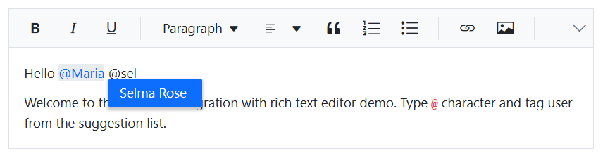
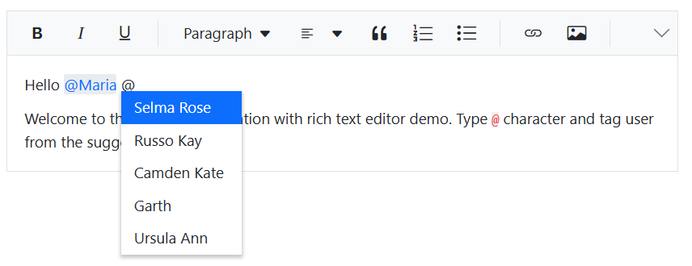
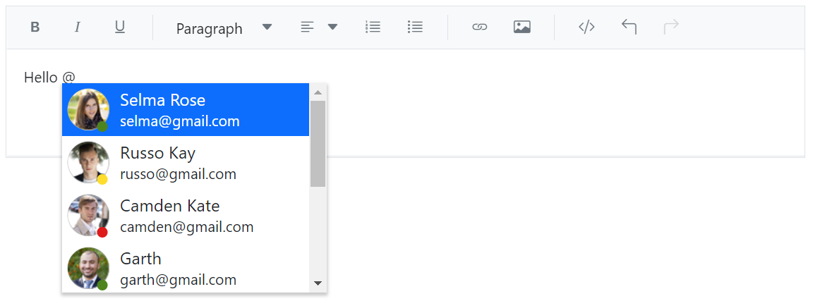

# Mention Integration in Blazor RichTextEditor

By integrating the [Mention](https://blazor.syncfusion.com/documentation/mention/getting-started) component with a Rich Text Editor, users can easily mention or tag other users or objects from the suggested list without manually typing names or identifiers.

## Setup and configuration

The [Target](https://help.syncfusion.com/cr/blazor/Syncfusion.Blazor.DropDowns.SfMention-1.html#Syncfusion_Blazor_DropDowns_SfMention_1_Target) property of the Mention component specifies the `ID` of the content-editable div element in the Rich Text Editor to bind the Mention component. This allows you to enable the Mention functionality within the Rich Text Editor, allowing users to tag items from the suggestion list during text editing.

## Using mentions

Typing the `@` symbol followed by a character displays a list of suggestions for selection. Users can select an item by clicking or typing its name.

## Customizing suggestion list 

### Minimum input length for Mention suggestions

You can control when the suggestion list appears by setting the [MinLength](https://help.syncfusion.com/cr/blazor/Syncfusion.Blazor.DropDowns.SfMention-1.html#Syncfusion_Blazor_DropDowns_SfMention_1_MinLength) property in the Mention control. This property defines the minimum number of characters a user must type after the mention character (@) to trigger the search action. This is especially useful when working with large datasets, as it helps reduce unnecessary queries and improves performance.

By default, `MinLength` is set to 0, which means the suggestion list appears immediately after the mention character is entered. However, you can increase this value to delay the search until the user has typed a specific number of characters.

In the following example, the `MinLength` is set to 3, so the suggestion list will only appear once the user types three or more characters after the @ symbol.









### Customizing suggestion list count

You can control the number of items displayed in the Mention suggestion list using the [SuggestionCount](https://help.syncfusion.com/cr/blazor/Syncfusion.Blazor.DropDowns.SfMention-1.html#Syncfusion_Blazor_DropDowns_SfMention_1_SuggestionCount) property. This is particularly useful when working with large datasets, allowing you to limit the number of suggestions shown to the user.

By default, the suggestion list displays 25 items. You can customize this value to show fewer or more items based on your application's needs.

In the example below, the `SuggestionCount` is set to 5, so only 5 items will be displayed in the suggestion list when the user types the mention character (@).









### Customizing suggestion list using templates

#### Item template

You can customize how each item appears in the suggestion list using the [ItemTemplate](https://help.syncfusion.com/cr/blazor/Syncfusion.Blazor.DropDowns.SfDropDownBase-1.html#Syncfusion_Blazor_DropDowns_SfDropDownBase_1_ItemTemplate) property. This allows you to display additional details such as email, role, or profile image alongside the mention name.

#### Display template 

Use the [DisplayTemplate](https://help.syncfusion.com/cr/blazor/Syncfusion.Blazor.DropDowns.SfMention-1.html#Syncfusion_Blazor_DropDowns_SfMention_1_DisplayTemplate) property to define how the selected mention appears in the editor content.

For example, by default, the mention chip renders as:

```
<span contenteditable="false" class="e-mention-chip">@Selma Rose</span>

```

Using the `DisplayTemplate` property, you can customize it to render as a clickable link:

```
<a href="mailto:selma@gmail.com" title="selma@gmail.com">@Selma Rose</a>

```

This allows you to create more interactive and informative mentions within the editor.

In the following sample, we configured the following properties:

* [ItemTemplate](https://help.syncfusion.com/cr/blazor/Syncfusion.Blazor.DropDowns.SfDropDownBase-1.html#Syncfusion_Blazor_DropDowns_SfDropDownBase_1_ItemTemplate) - Displays customized appearance in the suggestion list.
* [DisplayTemplate](https://help.syncfusion.com/cr/blazor/Syncfusion.Blazor.DropDowns.SfMention-1.html#Syncfusion_Blazor_DropDowns_SfMention_1_DisplayTemplate) - Used to customize how the selected value appears in the editor content.
* [AllowSpaces](https://help.syncfusion.com/cr/blazor/Syncfusion.Blazor.DropDowns.SfMention-1.html#Syncfusion_Blazor_DropDowns_SfMention_1_AllowSpaces) - Allow to continue search action if user enter space after mention character while searching.
* [SuggestionCount](https://help.syncfusion.com/cr/blazor/Syncfusion.Blazor.DropDowns.SfMention-1.html#Syncfusion_Blazor_DropDowns_SfMention_1_SuggestionCount) - The maximum number of items that will be displayed in the suggestion list.









> [View Sample](https://blazor.syncfusion.com/demos/rich-text-editor/mention-integration?theme=bootstrap5)

## See also

* [Mention](https://blazor.syncfusion.com/documentation/mention/getting-started)