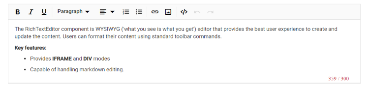

# Miscellaneous in Blazor Rich Text Editor Component

## Placeholder Text Customization

Defines placeholder text for the Rich Text Editor when the content area is empty using the `Placeholder` property.

Customize the placeholder's font style and color using the `e-rte-placeholder` CSS class.

```css

.e-richtexteditor .e-rte-placeholder {
    font-family: monospace;
}

```

The following sample demonstrates the placeholder option in Rich Text Editor.

```cshtml

@using Syncfusion.Blazor.RichTextEditor

<SfRichTextEditor Placeholder="Type something" />

<style>
    .e-richtexteditor .e-rte-placeholder {
        font-family: monospace;
    }
</style>

```


## Character count and limit enforcement

The Rich Text Editor automatically counts the number of characters in the content while typing, using the [ShowCharCount](https://help.syncfusion.com/cr/blazor/Syncfusion.Blazor.RichTextEditor.SfRichTextEditor.html#Syncfusion_Blazor_RichTextEditor_SfRichTextEditor_ShowCharCount) property. The characters count displayed at the bottom of the editor. You can limit the number of characters in your content using the [MaxLength](https://help.syncfusion.com/cr/blazor/Syncfusion.Blazor.RichTextEditor.SfRichTextEditor.html#Syncfusion_Blazor_RichTextEditor_SfRichTextEditor_MaxLength) property. By default, the editor sets the characters limit value to infinity.

The character count indicator changes color based on usage thresholds:

| Status | Description |
|----------------|---------|
| Normal | Till 70% of given maxLength count reach, character count color is black.|
| Warning | Once the number of character count in the Rich Text Editor reached 70% of given maxLength count, the character count color will be orange, indicating that, the Rich Text Editor value going to reach the maximum count.|
| Error | Once the number of character count in the Rich Text Editor reached 90% of given maxLength count, the character count color will be red, indicating that, the Rich Text Editor value reached the maximum count.|

```cshtml

@using Syncfusion.Blazor.RichTextEditor

<SfRichTextEditor ShowCharCount="true" MaxLength="500">
    <p>The Rich Text Editor component is WYSIWYG ('what you see is what you get') editor that provides the best user experience to create and update the content. Users can format their content using standard toolbar commands.</p>
    <p><b> Key features:</b></p>
    <ul>
        <li><p> Provides <b>IFRAME</b> and <b>DIV</b> modes </p></li>
        <li><p> Capable of handling markdown editing.</p></li>
    </ul>
</SfRichTextEditor>

```



## Code view

The Rich Text Editor includes the ability for users to directly edit HTML code via `Source View` in the text area. If you made any modification in Source view directly, the changes will be reflected in the Rich Text Editor's content. So, the users will have more flexibility over the content they have created.

```cshtml

@using Syncfusion.Blazor.RichTextEditor

<SfRichTextEditor>
    <p>The Rich Text Editor component is WYSIWYG ('what you see is what you get') editor that provides the best user experience to create and update the content. Users can format their content using standard toolbar commands.</p>
    <p><b> Key features:</b></p>
    <ul>
    <li><p> Provides <b>IFRAME</b> and <b>DIV</b> modes </p></li>
    <li><p> Capable of handling markdown editing.</p></li>
    </ul>
</SfRichTextEditor>

```


## Number and Bullet Format Lists

This feature allows the user to change the appearance of the Numbered and Bulleted lists. Users can also apply different numbering or bullet formats lists such as lowercase greek, upper Alpha, square and circles. You can also customize the style type of the lists to be populated in the dropdown from the toolbar by using the `NumberFormatList` and `BulletFormatList` properties in the Rich Text Editor.

```cshtml

@using Syncfusion.Blazor.RichTextEditor

<SfRichTextEditor>
    <RichTextEditorToolbarSettings Items="@Tools" />
    <p>The Rich Text Editor component is WYSIWYG ('what you see is what you get') editor that provides the best user experience to create and update the content. Users can format their content using standard toolbar commands.</p>
    <p><b> Key features:</b></p>
    <ul>
    <li><p> Provides <b>IFRAME</b> and <b>DIV</b> modes </p></li>
    <li><p> Capable of handling markdown editing.</p></li>
    </ul>
</SfRichTextEditor>

@code {
    private List<ToolbarItemModel> Tools = new List<ToolbarItemModel>()
    {
        new ToolbarItemModel() { Command = ToolbarCommand.NumberFormatList },
        new ToolbarItemModel() { Command = ToolbarCommand.BulletFormatList },
    };
}

```
