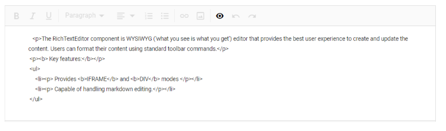

# Miscellaneous in Blazor RichTextEditor Component

## Placeholder

Specifies the placeholder for the Rich Text Editor’s content used when the Rich Text Editor body is empty through the `Placeholder` property.

Use the `e-rte-placeholder` class to define the custom font family, font color, and styles to the placeholder text.

```css

.e-richtexteditor .e-rte-placeholder {
    font-family: monospace;
}

```

The following sample demonstrates the placeholder option in Rich Text Editor.

```cshtml

@using Syncfusion.Blazor.RichTextEditor

<SfRichTextEditor Placeholder="Type something" />

<style>
    .e-richtexteditor .e-rte-placeholder {
        font-family: monospace;
    }
</style>

```


## Character count

The Rich Text Editor automatically counts the number of characters in the content while typing, using the `ShowCharCount` property. The characters count displayed at the bottom of the editor. You can limit the number of characters in your content using the `MaxLength` property. By default, the editor sets the characters limit value to infinity.

The character count color will be modified based on the characters in the Rich Text Editor.

| Status | Description |
|----------------|---------|
| Normal | Till 70% of given maxLength count reach, character count color is black.|
| Warning | Once the number of character count in the Rich Text Editor reached 70% of given maxLength count, the character count color will be orange, indicating that, the Rich Text Editor value going to reach the maximum count.|
| Error | Once the number of character count in the Rich Text Editor reached 90% of given maxLength count, the character count color will be red, indicating that, the Rich Text Editor value reached the maximum count.|

```cshtml

@using Syncfusion.Blazor.RichTextEditor

<SfRichTextEditor ShowCharCount="true" MaxLength="500">
    <p>The Rich Text Editor component is WYSIWYG ('what you see is what you get') editor that provides the best user experience to create and update the content. Users can format their content using standard toolbar commands.</p>
    <p><b> Key features:</b></p>
    <ul>
        <li><p> Provides <b>IFRAME</b> and <b>DIV</b> modes </p></li>
        <li><p> Capable of handling markdown editing.</p></li>
    </ul>
</SfRichTextEditor>

```


## Code view

Rich Text Editor includes the ability for users to directly edit HTML code via `Source View` in the text area. If you made any modification in Source view directly, the changes will be reflected in the Rich Text Editor's content. So, the users will have more flexibility over the content they have created.

```cshtml

@using Syncfusion.Blazor.RichTextEditor

<SfRichTextEditor>
    <p>The Rich Text Editor component is WYSIWYG ('what you see is what you get') editor that provides the best user experience to create and update the content. Users can format their content using standard toolbar commands.</p>
    <p><b> Key features:</b></p>
    <ul>
    <li><p> Provides <b>IFRAME</b> and <b>DIV</b> modes </p></li>
    <li><p> Capable of handling markdown editing.</p></li>
    </ul>
</SfRichTextEditor>

```



## Undo/Redo Manager

Undo and redo tools allows to edit the text by disregard or cancel the recently made changes and restore it to previous state. It is a useful tool to restore the performed action which got changed by mistake. By default, upto 30 actions can be undo/redo in the editor.

To undo and redo operations, do one of the following:

* Press the undo/redo button on the toolbar
* Press the Ctrl + Z/Ctrl + Y combination on the keyboard

Customize the undo/redo step count using `UndoRedoSteps` property. By default, undo/redo actions take `300ms` time interval for storing the action to the undo redo manager. The time interval can be customized by using the `UndoRedoTimer`.

```cshtml

@using Syncfusion.Blazor.RichTextEditor

<SfRichTextEditor UndoRedoSteps="50" UndoRedoTimer="400">
    <p>The Rich Text Editor component is WYSIWYG ('what you see is what you get') editor that provides the best user experience to create and update the content. Users can format their content using standard toolbar commands.</p>
    <p><b> Key features:</b></p>
    <ul>
    <li><p> Provides <b>IFRAME</b> and <b>DIV</b> modes </p></li>
    <li><p> Capable of handling markdown editing.</p></li>
    </ul>
</SfRichTextEditor>

```


## Resizable support

This feature allows the editor to be resized dynamically. The users can enable or disable this feature using the `EnableResize` property in the Rich Text Editor. If `EnableResize` is set to true, the Rich Text Editor component creates grip at the bottom right corner, which allows resizing the component in the diagonal direction. The following sample demonstrates the resizable feature.

### Enabling the resizable support

To render the Rich Text Editor in the resizable mode, set the `EnableResize` property to true.

```cshtml

@using Syncfusion.Blazor.RichTextEditor

<SfRichTextEditor EnableResize="true">
    <p>Rich Text Editor allows to insert images from online source as well as local computer where you want to insert the image in your content.</p><p><b>Get started Quick Toolbar to click on the image</b></p><p>It is possible to add custom style on the selected image inside the Rich Text Editor through quick toolbar.</p>
</SfRichTextEditor>

```


### Specifying the Minimum and Maximum width and height for Resize

To have a restricted resizable area for the Rich Text Editor, you need to specify the min-width, max-width, min-height and max-height CSS properties for the control's container element. By default, the control is capable of resizing upto the current viewport. The `e-richtexteditor` CSS class will be available in the component's container and can be used for applying the above mentioned styles.

```css

<style>
  .e-richtexteditor {
      min-width: 200px;
      max-width: 800px;
      min-height: 100px;
      max-height: 300px;
  }
</style>

```

N> You can refer to our [Blazor Rich Text Editor](https://www.syncfusion.com/blazor-components/blazor-wysiwyg-rich-text-editor) feature tour page for its groundbreaking feature representations. You can also explore our [Blazor Rich Text Editor](https://blazor.syncfusion.com/demos/rich-text-editor/overview?theme=bootstrap5) example to know how to render and configure the rich text editor tools.

## Number and Bullet Format Lists

This feature allows the user to change the appearance of the Numbered and Bulleted lists. Users can also apply different numbering or bullet formats lists such as lowercase greek, upper Alpha, square and circles. You can also customize the style type of the lists to be populated in the dropdown from the toolbar by using the `NumberFormatList` and `BulletFormatList` properties in the Rich Text Editor.

```cshtml

@using Syncfusion.Blazor.RichTextEditor

<SfRichTextEditor>
    <RichTextEditorToolbarSettings Items="@Tools" />
    <p>The Rich Text Editor component is WYSIWYG ('what you see is what you get') editor that provides the best user experience to create and update the content. Users can format their content using standard toolbar commands.</p>
    <p><b> Key features:</b></p>
    <ul>
    <li><p> Provides <b>IFRAME</b> and <b>DIV</b> modes </p></li>
    <li><p> Capable of handling markdown editing.</p></li>
    </ul>
</SfRichTextEditor>

@code {
    private List<ToolbarItemModel> Tools = new List<ToolbarItemModel>()
    {
        new ToolbarItemModel() { Command = ToolbarCommand.NumberFormatList },
        new ToolbarItemModel() { Command = ToolbarCommand.BulletFormatList },
    };
}

```
