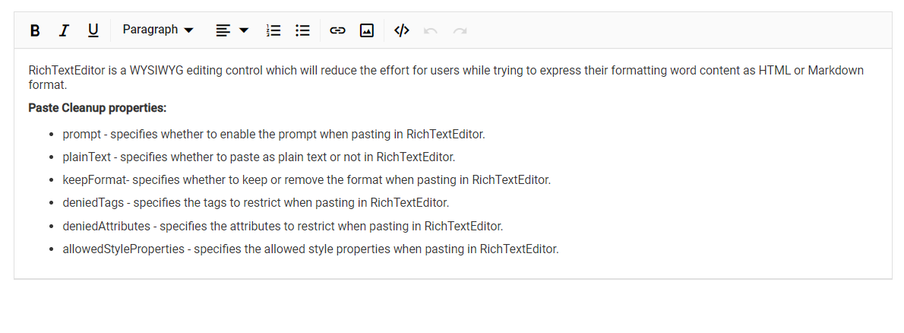

# Paste from MS Word in Blazor RichTextEditor Component

The Rich Text Editor allows you to reduce the effort while converting the Microsoft Word content to HTML format with format and styles.

## MS Word to HTML

By default, the Rich Text Editor consider the following processes on paste content from Microsoft Word.

**List conversion:** The list elements copied from the Microsoft Word document contains paragraph tags with styles and classes. The list elements are converted to standard HTML list elements by referring the styles and class names in the paragraph tags.

**Converting style:** The styles of the elements copied from the Microsoft Word document are converted to standard CSS styles and added as inline styles for each respective element.

**Tags and comments:** The Microsoft Word specific XML tags and comments are removed when cleanup on paste.

## Paste cleanup

You can control the formatting and styles on pasting the content to the editor using the pasteCleanup settings property. The following settings are available to clean up the content:

| API | Description | Default Value | Type |
|:----------------:|:---------:|:-----------------------------:|:---------:|
| [Prompt](#prompt-dialog) | To invoke prompt dialog with paste options on pasting the content in editor. | false | boolean |
| [PlainText](#paste-as-plain-text) | To paste the content as plain text. | false | boolean |
| [KeepFormat](#keep-format) | To keep the same format with copied content. | true | boolean |
| [DeniedTags](#denied-tags) | To ignore the tags when pasting HTML content. | null | string[] |
| [DeniedAttributes](#denied-attributes) | To paste the content by filtering out these attributes from the content. | null | string[] |
| [AllowedStyleProperties](#allowed-style-properties) | To paste the content by accepting these style attributes and removing other style attributes. | ['background', 'background-color', 'border', 'border-bottom', 'border-left', 'border-radius', 'border-right', 'border-style', 'border-top', 'border-width', 'clear', 'color', 'cursor', 'direction', 'display', 'float', 'font', 'font-family', 'font-size', 'font-weight', 'font-style', 'height', 'left', 'line-height', 'margin', 'margin-top', 'margin-left', 'margin-right', 'margin-bottom', 'max-height', 'max-width', 'min-height', 'min-width', 'overflow', 'overflow-x', 'overflow-y', 'padding', 'padding-bottom', 'padding-left', 'padding-right', 'padding-top', 'position', 'right', 'table-layout', 'text-align', 'text-decoration', 'text-indent', 'top', 'vertical-align', 'visibility', 'white-space', 'width'] | string[] |

> To use paste cleanup, configure paste cleanup using the `RichTextEditorPasteCleanupSettings`.

## Prompt dialog

When `Prompt` is set to true, pasting the content in the editor will open a dialog box that contains three options `Keep`, `Clean`, and `Plain Text` as radio buttons:
1. `Keep`: Radio button to keep the same format with copied content.
2. `Clean`: Radio button to clear all the style formats with copied content.
3. `Plain Text`: Radio button to paste the copied content as plain text without any formatting or style (including the removal of all tags).

> When `Prompt` value is set true, the API properties [PlainText](#paste-as-plain-text) and [KeepFormat](#keep-format) will not be considered for processing when pasting the content.

## Paste as plain text

When `PlainText` is set to true, the copied content will be converted as plain text by removing all the HTML tags and styles applied to it and only the plain text is pasted in the editor.

> When `PlainText` value is set true, the API property [Prompt](#prompt-dialog) should be set to false, and [KeepFormat](#keep-format) will not be considered for processing when pasting the content.

## Keep format

When `KeepFormat` is set to true, the copied content will maintain all the style formatting allowed in the `AllowedStyleProperties` on pasting the content in the editor.

When `KeepFormat` is set to false, the style in the copied content will be removed without considering the allowed styles in the `AllowedStyleProperties` when pasting the content in the editor.

> When `KeepFormat` value is set true, the API property [Prompt](#prompt-dialog) and [PlainText](#paste-as-plain-text) should be set to false.

## Denied tags

When `DeniedTags` values are set, the tags that matches the 'denied tags' list will be removed on pasting the copied content in the editor. For Example,

1. `'a'`: Paste the content by filtering out anchor tags.
2. `'a[!href]'`: Paste the content by filtering out anchor tags that do not have the ‘href’ attribute.
3. `'a[href, target]'`: Paste the content by filtering out anchor tags that have the 'href' and 'target' attributes.

## Denied attributes

When the `DeniedAttributes` values are set, the attributes that matches the 'denied attributes' list will be removed on pasting the copied content in the editor. For Example,

`'id', 'title'`: This will remove the attributes ‘id’ and ‘title’ from all tags.

## Allowed style properties

By default, the following basic styles are allowed on pasting the content to the editor.

['background', 'background-color', 'border', 'border-bottom', 'border-left', 'border-radius', 'border-right', 'border-style', 'border-top', 'border-width', 'clear', 'color', 'cursor', 'direction', 'display', 'float', 'font', 'font-family', 'font-size', 'font-weight', 'font-style', 'height', 'left', 'line-height', 'margin', 'margin-top', 'margin-left', 'margin-right', 'margin-bottom', 'max-height', 'max-width', 'min-height', 'min-width', 'overflow', 'overflow-x', 'overflow-y', 'padding', 'padding-bottom', 'padding-left', 'padding-right', 'padding-top', 'position', 'right', 'table-layout', 'text-align', 'text-decoration', 'text-indent', 'top', 'vertical-align', 'visibility', 'white-space', 'width']

When you configure `AllowedStyleProperties`, the styles, which matches the 'allowed style properties' list are allowed, all other style properties will be removed on pasting the content in the editor.

For Example,

`public string[] AllowedStyles = new string[] { "color", "margin" };`: This will allow only the style properties 'color' and 'margin' in each pasted element.

In the following example, the paste cleanup related settings are explained with configuration.

```csharp

@using Syncfusion.Blazor.RichTextEditor

<SfRichTextEditor>
    <RichTextEditorPasteCleanupSettings Prompt="true" PlainText="false" KeepFormat="false" DeniedTags="@DeniedTag" DeniedAttributes="@DeniedAttributes" AllowedStyleProperties="@AllowedStyles" />
    <p>Rich Text Editor is a WYSIWYG editing control which will reduce the effort for users while trying to express their formatting word content as HTML or Markdown format.</p>
    <p><b>Paste Cleanup properties:</b></p>
    <ul>
    <li><p>prompt - specifies whether to enable the prompt when pasting in Rich Text Editor.</p></li>
    <li><p>plainText - specifies whether to paste as plain text or not in Rich Text Editor.</p></li>
    <li><p>keepFormat- specifies whether to keep or remove the format when pasting in Rich Text Editor.</p></li>
    <li><p>deniedTags - specifies the tags to restrict when pasting in Rich Text Editor.</p></li>
    <li><p>deniedAttributes - specifies the attributes to restrict when pasting in Rich Text Editor.</p></li>
    <li><p>allowedStyleProperties - specifies the allowed style properties when pasting in Rich Text Editor.</p></li>
    </ul>
</SfRichTextEditor>

@code {
    private string[] DeniedTag = new string[] { "a" };
    private string[] DeniedAttributes = new string[] { "class", "title", "id" };
    private string[] AllowedStyles = new string[] { "color", "margin", "font-size" };
}

```

The output will be as follows.



> You can refer to our [Blazor Rich Text Editor](https://www.syncfusion.com/blazor-components/blazor-wysiwyg-rich-text-editor) feature tour page for its groundbreaking feature representations. You can also explore our [Blazor Rich Text Editor](https://blazor.syncfusion.com/demos/rich-text-editor/overview?theme=bootstrap4) example to knows how to render and configure the rich text editor tools.