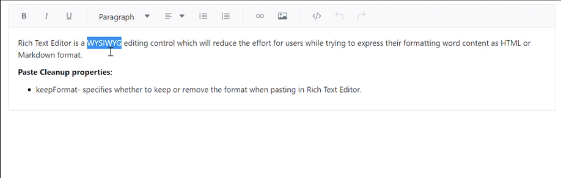

# Paste Clean-up in Blazor Rich Text Editor

The Rich Text Editor provides built-in option to paste content from Microsoft Word, Microsoft Outlook, Microsoft Excel, and other websites by filtering out tags, attributes, and styles. Copy content from Microsoft Office or other websites and paste it into the editor, where it is cleaned up and pasted based on the settings in the [PasteCleanupSettings](https://help.syncfusion.com/cr/blazor/Syncfusion.Blazor.RichTextEditor.RichTextEditorPasteCleanupSettings.html) property values.

## Paste cleanup settings

When pasting content into the editor, you can control the formatting and styles by using the [PasteCleanupSettings](https://help.syncfusion.com/cr/blazor/Syncfusion.Blazor.RichTextEditor.RichTextEditorPasteCleanupSettings.html) property. The following settings are available to clean up the content:

| API | Description | Default Value | Type |
|:----------------:|:---------:|:-----------------------------:|:---------:|
| [Prompt](https://help.syncfusion.com/cr/blazor/Syncfusion.Blazor.RichTextEditor.RichTextEditorPasteCleanupSettings.html#Syncfusion_Blazor_RichTextEditor_RichTextEditorPasteCleanupSettings_Prompt) | Displays a dialog box when content is pasted, allowing users to choose how the content should be inserted—either as plain text, with formatting, or cleaned HTML. | false | boolean |
| [PlainText](https://help.syncfusion.com/cr/blazor/Syncfusion.Blazor.RichTextEditor.RichTextEditorPasteCleanupSettings.html#Syncfusion_Blazor_RichTextEditor_RichTextEditorPasteCleanupSettings_PlainText) | To paste the content as plain text. | false | boolean |
| [KeepFormat](https://help.syncfusion.com/cr/blazor/Syncfusion.Blazor.RichTextEditor.RichTextEditorPasteCleanupSettings.html#Syncfusion_Blazor_RichTextEditor_RichTextEditorPasteCleanupSettings_KeepFormat) | To keep the same format with copied content. | true | boolean |
| [DeniedTags](https://help.syncfusion.com/cr/blazor/Syncfusion.Blazor.RichTextEditor.RichTextEditorPasteCleanupSettings.html#Syncfusion_Blazor_RichTextEditor_RichTextEditorPasteCleanupSettings_DeniedTags) | Specifies a list of HTML tags to be removed from the pasted content, such as `<script>`, `<iframe>`, or `<style>`. Helps eliminate unwanted or unsafe elements. | null | string[] |
| [DeniedAttributes](https://help.syncfusion.com/cr/blazor/Syncfusion.Blazor.RichTextEditor.RichTextEditorPasteCleanupSettings.html#Syncfusion_Blazor_RichTextEditor_RichTextEditorPasteCleanupSettings_DeniedAttributes) | Filters out specified attributes from the pasted content | null | string[] |
| [AllowedStyleProperties](https://help.syncfusion.com/cr/blazor/Syncfusion.Blazor.RichTextEditor.RichTextEditorPasteCleanupSettings.html#Syncfusion_Blazor_RichTextEditor_RichTextEditorPasteCleanupSettings_AllowedStyleProperties) | To paste the content by accepting these style attributes and removing other style attributes. | [background, background-color, border, border-bottom, border-left, border-radius, border-right, border-style, border-top, border-width, clear, color, cursor, direction, display, float, font, font-family, font-size, font-weight, font-style, height, left, line-height, margin, margin-top, margin-left, margin-right, margin-bottom, max-height, max-width, min-height, min-width, overflow, overflow-x, overflow-y, padding, padding-bottom, padding-left, padding-right, padding-top, position, right, table-layout, text-align, text-decoration, text-indent, top, vertical-align, visibility, white-space, width] | string[] |

## Prompt dialog options

When [Prompt](https://help.syncfusion.com/cr/blazor/Syncfusion.Blazor.RichTextEditor.RichTextEditorPasteCleanupSettings.html#Syncfusion_Blazor_RichTextEditor_RichTextEditorPasteCleanupSettings_Prompt) is set to true, pasting the content in the editor opens a dialog box with three options as radio buttons: keep, clean, and plain text.

1. `Keep`: To keep the same format with copied content.
2. `Clean`: To clear all the style formats with copied content.
3. `Plain Text`: To paste the copied content as plain text without any formatting or style (including the removal of all tags).

N> When the `Prompt` value is set to true, the API properties [PlainText](https://help.syncfusion.com/cr/blazor/Syncfusion.Blazor.RichTextEditor.RichTextEditorPasteCleanupSettings.html#Syncfusion_Blazor_RichTextEditor_RichTextEditorPasteCleanupSettings_PlainText) and [KeepFormat](https://help.syncfusion.com/cr/blazor/Syncfusion.Blazor.RichTextEditor.RichTextEditorPasteCleanupSettings.html#Syncfusion_Blazor_RichTextEditor_RichTextEditorPasteCleanupSettings_KeepFormat) will not be considered for processing when pasting the content.









## Paste as plain text

When [PlainText](https://help.syncfusion.com/cr/blazor/Syncfusion.Blazor.RichTextEditor.RichTextEditorPasteCleanupSettings.html#Syncfusion_Blazor_RichTextEditor_RichTextEditorPasteCleanupSettings_PlainText) is set to true, the copied content will be converted to plain text by removing all the HTML tags and styles applied to it, and only the plain text is pasted in the editor.

N> When `PlainText` value is set true, the API property [Prompt](https://help.syncfusion.com/cr/blazor/Syncfusion.Blazor.RichTextEditor.RichTextEditorPasteCleanupSettings.html#Syncfusion_Blazor_RichTextEditor_RichTextEditorPasteCleanupSettings_Prompt) should be set to false, and [KeepFormat](https://help.syncfusion.com/cr/blazor/Syncfusion.Blazor.RichTextEditor.RichTextEditorPasteCleanupSettings.html#Syncfusion_Blazor_RichTextEditor_RichTextEditorPasteCleanupSettings_KeepFormat) will not be considered for processing when pasting the content.









## Keep format

When [KeepFormat](https://help.syncfusion.com/cr/blazor/Syncfusion.Blazor.RichTextEditor.RichTextEditorPasteCleanupSettings.html#Syncfusion_Blazor_RichTextEditor_RichTextEditorPasteCleanupSettings_KeepFormat) is set to `true`, the pasted content retains its original formatting, including styles, fonts, and structure. However, the formatting is still subject to filtering based on the `AllowedStyleProperties`, `DeniedTags`, and `DeniedAttrs` settings:

* Only the style properties listed in `AllowedStyleProperties` will be preserved.
* Any HTML tags listed in `DeniedTags` will be removed.
* Any attributes listed in `DeniedAttrs` will be stripped from the pasted content.

This ensures that while the formatting is retained, it remains clean, safe, and consistent with your application's styling rules.









>When `KeepFormat` is set to true, set both `Prompt` and `PlainText` to false.

## Clean formating

When the `Prompt`, `PlainText`, and `KeepFormat` options are all set to false, the Rich Text Editor performs clean format paste cleanup. In this mode, all inline styles from the pasted content are removed, eliminating any custom or external styling. This ensures a consistent and uniform appearance within the editor.

Despite the removal of styling, essential structural HTML tags such as `
`, `<ul>`, `<table>`, and others are preserved. This maintains the original layout and semantic integrity of the content, allowing it to remain well-structured and readable.However, the formatting is still subject to filtering based on the `DeniedTags`, and `DeniedAttrs` settings:

- **`DeniedTags`**: Tags listed here will still be removed from the pasted content, even when `cleanFormat` is enabled.
- **`DeniedAttrs`**: Attributes listed here will also be stripped from the pasted content.

> The `AllowedStyleProps` setting only applies if `KeepFormat` is enabled.

## Denied tags

The [DeniedTags](https://help.syncfusion.com/cr/blazor/Syncfusion.Blazor.RichTextEditor.RichTextEditorPasteCleanupSettings.html#Syncfusion_Blazor_RichTextEditor_RichTextEditorPasteCleanupSettings_DeniedTags) specify the tags to restrict when pasting the content into the Rich Text Editor.

1. **a**: Paste the content by filtering out anchor tags.
2. **a[!href]**: Paste the content by filtering out anchor tags that do not have the ‘href’ attribute.
3. **a[href, target]**: Paste the content by filtering out anchor tags that have the ‘href’ and ‘target’ attributes.









> This setting is ignored when `PlainText` is set to `true`.  
It only works when either `KeepFormat` is set to `true`, or when `Prompt`, `PlainText`, and `KeepFormat` are all set to `false`, which triggers clean format behavior.

## Denied attributes

The [DeniedAttributes](https://help.syncfusion.com/cr/blazor/Syncfusion.Blazor.RichTextEditor.RichTextEditorPasteCleanupSettings.html#Syncfusion_Blazor_RichTextEditor_RichTextEditorPasteCleanupSettings_DeniedAttributes) property specifies the attributes to restrict when pasting the content into the Rich Text Editor.









> This setting is ignored when `PlainText` is set to `true`.  
It only works when either `KeepFormat` is set to `true`, or when `Prompt`, `PlainText`, and `KeepFormat` are all set to `false`, which triggers clean format behavior.

## Allowed style properties

By default, a predefined set of basic style properties are allowed when content is pasted into the Rich Text Editor.

When you configure `AllowedStyleProperties`, only the styles that match the allowed style properties list are allowed. All other style properties will be removed on pasting the content into the editor.

For Example, **public string[] AllowedStyles = new string[] { "color", "margin" };** This will allow only the style properties 'color' and 'margin' in each pasted element.









> This setting works only when `KeepFormat` is set to true. If `KeepFormat` is `false` or `PlainText` is `true`, style filtering via `AllowedStyleProperties` will not be applied.

## Pasting large text content

When pasting a large text into the editor it displays `Attempting to reconnect` and then the text gets inserted. To achieve this, you can increase the SignalR size at the application level by adding the `signalR` method with a larger buffer size(1024000000).

### Blazor Server App

* For **.NET 6 and .NET 7** app, open the **~/Program.cs** file and register the Syncfusion&reg; Blazor Service.




using Microsoft.AspNetCore.Components;
using Microsoft.AspNetCore.Components.Web;
using Syncfusion.Blazor;

var builder = WebApplication.CreateBuilder(args);

// Add services to the container.
builder.Services.AddRazorPages();
builder.Services.AddServerSideBlazor();
builder.Services.AddSyncfusionBlazor();
services.AddSignalR(e => { e.MaximumReceiveMessageSize = 1024000000; });

var app = builder.Build();
....




### Blazor WebAssembly App

Open **~/Program.cs** file and register the Syncfusion&reg; Blazor Service in the client web app.




using Microsoft.AspNetCore.Components.Web;
using Microsoft.AspNetCore.Components.WebAssembly.Hosting;
using Syncfusion.Blazor;

var builder = WebAssemblyHostBuilder.CreateDefault(args);
builder.RootComponents.Add<App>("#app");
builder.RootComponents.Add<HeadOutlet>("head::after");

builder.Services.AddScoped(sp => new HttpClient { BaseAddress = new Uri(builder.HostEnvironment.BaseAddress) });

builder.Services.AddSyncfusionBlazor();
builder.Services.AddSignalR(e => { e.MaximumReceiveMessageSize = 1024000000; });
await builder.Build().RunAsync();
....




## Accessing pasted content programmatically

You can get the pasted text as HTML text using the [AfterPasteCleanup](https://help.syncfusion.com/cr/blazor/Syncfusion.Blazor.RichTextEditor.RichTextEditorEvents.html#Syncfusion_Blazor_RichTextEditor_RichTextEditorEvents_AfterPasteCleanup) event argument value.




<SfRichTextEditor @ref="RteObj" @bind-Value="htmlText" EditorMode="EditorMode.HTML">
    <RichTextEditorEvents AfterPasteCleanup="@AfterPasteCleanupHandler" />
</SfRichTextEditor>

@code {
    public void AfterPasteCleanupHandler(PasteCleanupArgs args)
    {
        // Here you can get the pasted Html string using args.Value
    }
}




N> You can refer to our [Blazor Rich Text Editor](https://www.syncfusion.com/blazor-components/blazor-rich-text-editor) feature tour page for its groundbreaking feature representations. You can also explore our [Blazor Rich Text Editor](https://blazor.syncfusion.com/demos/rich-text-editor/overview?theme=bootstrap5) example to know how to render and configure the rich text editor tools.
