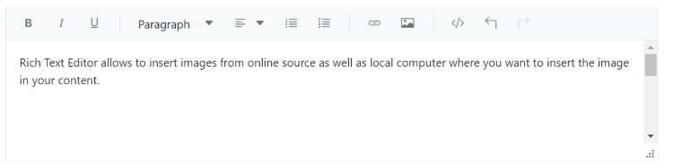
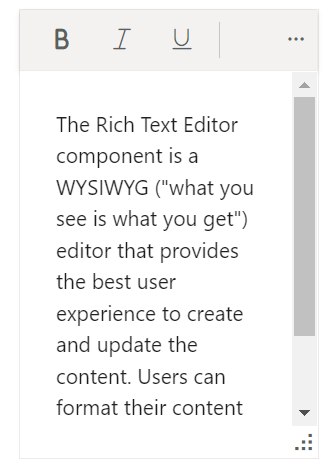

# Resizable Rich Text Editor

The Rich Text Editor supports dynamic resizing, allowing users to adjust the editor's dimensions  based on their needs. You can enable or disable this feature using the [EnableResize](https://help.syncfusion.com/cr/blazor/Syncfusion.Blazor.RichTextEditor.SfRichTextEditor.html#Syncfusion_Blazor_RichTextEditor_SfRichTextEditor_EnableResize) property. When `EnableResize` is set to `true`, a resize handle appears at the bottom-right corner of the editor, enabling diagonal resizing.











## Restrict resize

To restrict the resizable area of the Rich Text Editor, define the `min-width`, `max-width`, `min-height`, and `max-height` CSS properties on the editor's container element. By default, the editor can be resized up to the limits of the current viewport. Use the `e-richtexteditor` CSS class to apply the following styles and control the resizing boundaries.

```css
<style>
  .e-richtexteditor {
      min-width: 200px;
      max-width: 800px;
      min-height: 100px;
      max-height: 300px;
  }
</style>

```




@using Syncfusion.Blazor.RichTextEditor

<SfRichTextEditor EnableResize="true" CssClass='.e-richtexteditor'>
    <p>The Rich Text Editor component is a WYSIWYG ("what you see is what you get") editor that provides the best user experience to create and update the content. Users can format their content using standard toolbar commands.</p>
</SfRichTextEditor>
<style>
    .e-richtexteditor {
        min-width: 200px;
        max-width: 800px;
        min-height: 100px;
        max-height: 300px;
    }
</style>






N> You can refer to our [Blazor Rich Text Editor](https://www.syncfusion.com/blazor-components/blazor-wysiwyg-rich-text-editor) feature tour page for its groundbreaking feature representations. You can also explore our [Blazor Rich Text Editor](https://blazor.syncfusion.com/demos/rich-text-editor/overview?theme=bootstrap5) example to know how to render and configure the rich text editor tools.