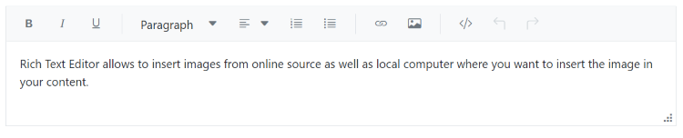

# Resizable Rich Text Editor

The Rich Text Editor allows it to be resized dynamically, so the users can able to change the size of the editor based on their needs. You can enable or disable this feature using the [EnableResize](https://help.syncfusion.com/cr/blazor/Syncfusion.Blazor.RichTextEditor.SfRichTextEditor.html#Syncfusion_Blazor_RichTextEditor_SfRichTextEditor_EnableResize) property in the Rich Text Editor. If `EnableResize` is set to true, the editor component creates a grip at the bottom right corner, which allows resizing the component in the diagonal direction.










## Restrict resize

To have a restricted resizable area for the Rich Text Editor, you need to specify the min-width, max-width, min-height, and max-height CSS properties for the component’s container element. By default, the editor is capable of resizing up to the current viewport. The `e-richtexteditor` CSS class will be available in the component's container and can be used for applying the bellow mentioned styles.

```css
<style>
  .e-richtexteditor {
      min-width: 200px;
      max-width: 800px;
      min-height: 100px;
      max-height: 300px;
  }
</style>

```




@using Syncfusion.Blazor.RichTextEditor

<SfRichTextEditor EnableResize="true" CssClass='.e-richtexteditor'>
    <p>Rich Text Editor allows to insert images from online source as well as local computer where you want to insert the image in your content.</p><p><b>Get started Quick Toolbar to click on the image</b></p><p>It is possible to add custom style on the selected image inside the Rich Text Editor through quick toolbar.</p>
</SfRichTextEditor>
<style>
    .e-richtexteditor {
        min-width: 200px;
        max-width: 800px;
        min-height: 100px;
        max-height: 300px;
    }
</style>






> You can refer to our [Blazor Rich Text Editor](https://www.syncfusion.com/blazor-components/blazor-wysiwyg-rich-text-editor) feature tour page for its groundbreaking feature representations. You can also explore our [Blazor Rich Text Editor](https://blazor.syncfusion.com/demos/rich-text-editor/overview?theme=bootstrap4) example to know how to render and configure the rich text editor tools.