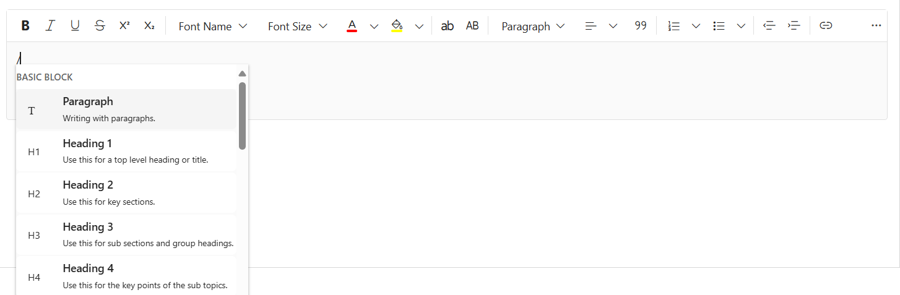

# Slash Commands in Blazor Rich Text Editor

The slash menu in the Rich Text Editor offers users a streamlined way to apply formatting, insert elements, and execute custom commands by simply typing the “/” character. This feature enhances the user experience by offering quick access to common editing actions within the editor.

## Enabling the slash menu

To enable the slash menu, set the [Enable](https://help.syncfusion.com/cr/blazor/Syncfusion.Blazor.RichTextEditor.RichTextEditorSlashMenuSettings.html#Syncfusion_Blazor_RichTextEditor_RichTextEditorSlashMenuSettings_Enable) property within [RichTextEditorSlashMenuSettings](https://help.syncfusion.com/cr/blazor/Syncfusion.Blazor.RichTextEditor.RichTextEditorSlashMenuSettings.html) to `true`. By default, this feature is disabled. Once enabled, the slash menu will appear when the user types the “/” character in the editor.

N> The SlashMenu feature is currently not supported in iframe mode of the Rich Text Editor. We are actively working on this, and support for SlashMenu in iframe mode is planned for a future update.

## Configure the slash menu items

The [RichTextEditorSlashMenuSettings](https://help.syncfusion.com/cr/blazor/Syncfusion.Blazor.RichTextEditor.RichTextEditorSlashMenuSettings.html) property allows customization of the `Items` displayed in the slash menu. By setting the [Items](https://help.syncfusion.com/cr/blazor/Syncfusion.Blazor.RichTextEditor.RichTextEditorSlashMenuSettings.html#Syncfusion_Blazor_RichTextEditor_RichTextEditorSlashMenuSettings_Items) property with a list of [SlashMenuItemModel](https://help.syncfusion.com/cr/blazor/Syncfusion.Blazor.RichTextEditor.RichTextEditorSlashMenuSettings.html#Syncfusion_Blazor_RichTextEditor_RichTextEditorSlashMenuSettings_SlashMenuItemModel), you can define which commands are available when a user types a slash (/) in the Rich Text Editor.

This list can include various formatting options such as paragraph and heading levels. Here’s an code snippet of configuring the slash menu items:









## Customizing the popup width and height

The size of the slash menu popup can be customized using the [PopupWidth](https://help.syncfusion.com/cr/blazor/Syncfusion.Blazor.RichTextEditor.RichTextEditorSlashMenuSettings.html#Syncfusion_Blazor_RichTextEditor_RichTextEditorSlashMenuSettings_PopupWidth) and [PopupHeight](https://help.syncfusion.com/cr/blazor/Syncfusion.Blazor.RichTextEditor.RichTextEditorSlashMenuSettings.html#Syncfusion_Blazor_RichTextEditor_RichTextEditorSlashMenuSettings_PopupHeight) properties within [RichTextEditorSlashMenuSettings](https://help.syncfusion.com/cr/blazor/Syncfusion.Blazor.RichTextEditor.RichTextEditorSlashMenuSettings.html). Adjusting these values allows for control over the dimensions of the menu.

Below is a code snippet showing how to customize both the width and height of the popup:









## Adding custom slash menu items

Custom items can be added by defining the [Items](https://help.syncfusion.com/cr/blazor/Syncfusion.Blazor.RichTextEditor.RichTextEditorSlashMenuSettings.html#Syncfusion_Blazor_RichTextEditor_RichTextEditorSlashMenuSettings_Items) property within the [RichTextEditorSlashMenuSettings](https://help.syncfusion.com/cr/blazor/Syncfusion.Blazor.RichTextEditor.RichTextEditorSlashMenuSettings.html). This property should be a list of [SlashMenuItemModel](https://help.syncfusion.com/cr/blazor/Syncfusion.Blazor.RichTextEditor.RichTextEditorSlashMenuSettings.html#Syncfusion_Blazor_RichTextEditor_RichTextEditorSlashMenuSettings_SlashMenuItemModel) objects, which represent custom menu items. Each [SlashMenuItemModel](https://help.syncfusion.com/cr/blazor/Syncfusion.Blazor.RichTextEditor.RichTextEditorSlashMenuSettings.html#Syncfusion_Blazor_RichTextEditor_RichTextEditorSlashMenuSettings_SlashMenuItemModel) can be configured to include details such as text labels, icons, descriptions, and grouping information, allowing users to access tailored commands quickly using the slash (/) functionality in the Rich Text Editor.

Each custom slash menu item can include the following properties:

| API | Description | 
|:----------------:|:---------:|
| Text| The label of the menu item. |
| Command | The action to be executed when the item is clicked.|
| GroupBy | Groups related items in the slash menu. |
| IconCss | Specifies the CSS class for the item’s icon. | 
| Description | Provides a short description for the item. | 

The following code demonstrates how to set up the custom slash menu item in the Rich Text Editor to insert meeting notes and signature:









> [View Sample](https://blazor.syncfusion.com/demos/rich-text-editor/smart-suggestion?theme=bootstrap5)

