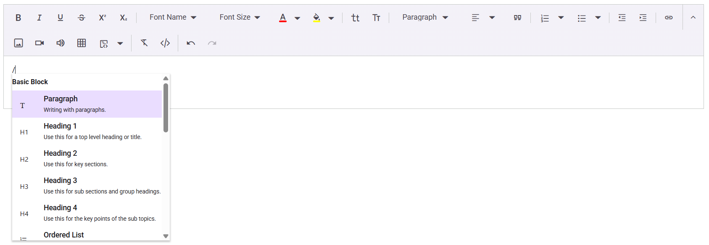

# Slash Commands in Blazor RichTextEditor

The Slash Menu in the Rich Text Editor provides users with an efficient way to apply formatting, insert elements, and execute custom commands by simply typing the “/” character. This feature enhances the user experience by offering quick access to common editing actions within the editor.

## Enabling the slash menu
To enable the Slash Menu feature in Blazor, configure the [RichTextEditorSlashMenuSettings](https://help.syncfusion.com/cr/blazor/Syncfusion.Blazor.RichTextEditor.RichTextEditorSlashMenuSettings.html) child component within the SfRichTextEditor component.

To enable the Slash Menu, set the [Enable](https://help.syncfusion.com/cr/blazor/Syncfusion.Blazor.RichTextEditor.RichTextEditorSlashMenuSettings.html#Syncfusion_Blazor_RichTextEditor_RichTextEditorSlashMenuSettings_Enable) property within [RichTextEditorSlashMenuSettings](https://help.syncfusion.com/cr/blazor/Syncfusion.Blazor.RichTextEditor.RichTextEditorSlashMenuSettings.html) to true. By default, this feature is disabled. Once enabled, the Slash Menu will appear when the user types the “/” character in the editor.

## Configure the slash menu items

The SlashMenuSettings property allows customization of the items displayed in the Slash Menu. By defining the [Items](https://help.syncfusion.com/cr/blazor/Syncfusion.Blazor.RichTextEditor.RichTextEditorSlashMenuSettings.html#Syncfusion_Blazor_RichTextEditor_RichTextEditorSlashMenuSettings_Items) property, a list of available commands can be provided for users to choose from when they type a slash (/) in the Rich Text Editor.

This list can include various formatting options such as paragraph and heading levels. Here’s an code snippet of configuring the Slash Menu items:









# Customizing the popup width and height

The size of the Slash Menu popup can be customized using the [PopupWidth](https://help.syncfusion.com/cr/blazor/Syncfusion.Blazor.RichTextEditor.RichTextEditorSlashMenuSettings.html#Syncfusion_Blazor_RichTextEditor_RichTextEditorSlashMenuSettings_PopupWidth) and [PopupHeight](https://help.syncfusion.com/cr/blazor/Syncfusion.Blazor.RichTextEditor.RichTextEditorSlashMenuSettings.html#Syncfusion_Blazor_RichTextEditor_RichTextEditorSlashMenuSettings_PopupHeight) properties within SlashMenuSettings. Adjusting these values allows for control over the dimensions of the menu.

Below is an code snippet showing how to customize both the width and height of the popup:









## Adding custom slash menu items

Custom items can be added by defining the Items property inside SlashMenuSettings. This property accepts either a command name from the [SlashMenuCommand](https://help.syncfusion.com/cr/blazor/Syncfusion.Blazor.RichTextEditor.SlashMenuCommand.html) enumeration or an array of objects representing custom menu items. of predefined items or an array of objects representing custom menu items.

Each custom item object can include the following properties:

| API | Description | 
|:----------------:|:---------:|
| Text| The label of the menu item. | false | boolean |
| Command | The action to be executed when the item is clicked.|
| GroupBy | Groups related items in the Slash Menu. |
| IconCss | Specifies the CSS class for the item’s icon. | 
| Description | Provides a short description for the item. | 

The following code demonstrates how to set up the Custom Slash Menu item in the Rich Text Editor to insert meeting notes and signature:









> [View Sample](https://blazor.syncfusion.com/demos/rich-text-editor/smart-suggestion?theme=bootstrap5)

