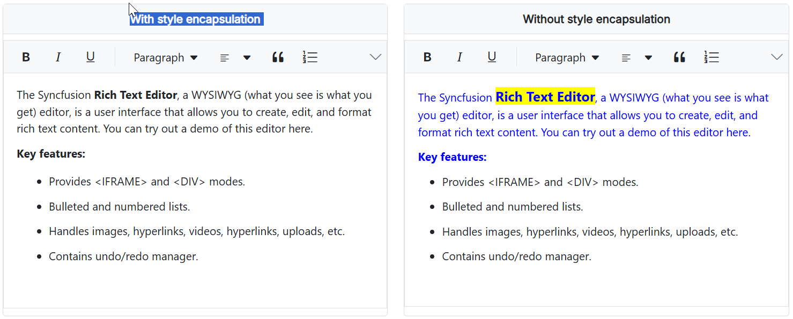

# Style Encapsulation in Blazor Rich Text Editor Component

Style encapsulation determines how styles are applied within the Syncfusion **Rich Text Editor**. This feature helps control whether the component's content inherits global styles from the application or remains isolated. 

## Encapsulation modes

The Rich Text Editor offers two rendering modes for controlling style encapsulation:

1. **Encapsulated Mode (Iframe Mode)**  
   - When enabled, the Rich Text Editor is rendered inside an `<iframe>`.  
   - The application's global CSS rules will **not** affect the content inside the editor.  
   - This ensures that the editor's content remains styled independently.  
   - **Usage:** `<RichTextEditorIFrameSettings Enable="true" />`

2. **Non-Encapsulated Mode (Default)**  
   - The Rich Text Editor is rendered **without an `<iframe>`**.  
   - The application's global CSS **will apply** to the content inside the editor.  
   - This mode allows seamless integration with existing styles.  
   - **Usage:** ` <RichTextEditorIFrameSettings Enable="false" />`

### Default behavior

By default, the Rich Text Editor uses **non-encapsulated mode** (` <RichTextEditorIFrameSettings Enable="false" />`), allowing the application's styles to affect the editor's content.

Below is a sample implementation of both **encapsulated** and **non-encapsulated** modes.









