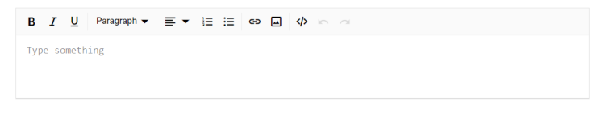
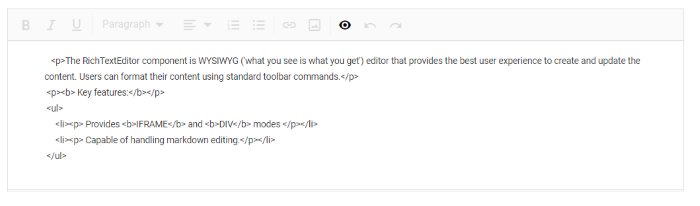
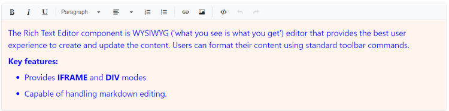
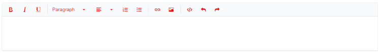
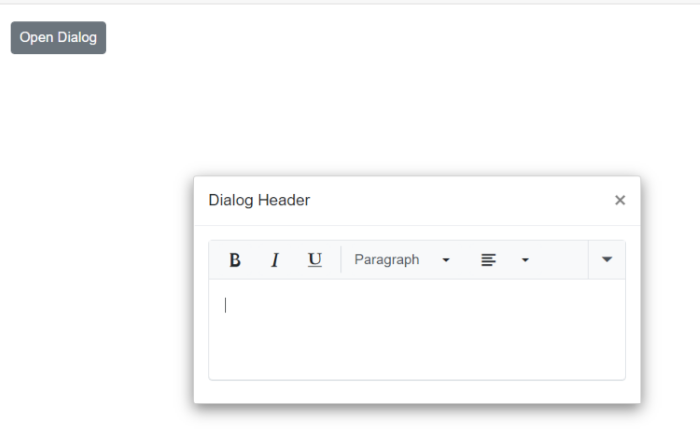
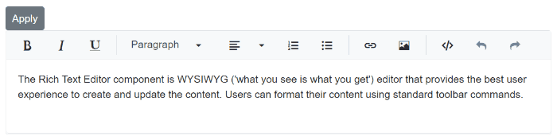

# Styling and Appearance

## Set placeholder

The [Placeholder](https://help.syncfusion.com/cr/blazor/Syncfusion.Blazor.RichTextEditor.SfRichTextEditor.html#Syncfusion_Blazor_RichTextEditor_SfRichTextEditor_Placeholder) property is used to create a placeholder for the Rich Text Editor's content when the editor body is empty. 

Use the `e-rte-placeholder` class to define the custom font family, font color, and styles to the placeholder text.

```css

.e-richtexteditor .e-rte-placeholder {
    font-family: monospace;
}

```




@using Syncfusion.Blazor.RichTextEditor

<SfRichTextEditor Placeholder="Type something" />

<style>
    .e-richtexteditor .e-rte-placeholder {
        font-family: monospace;
    }
</style>






## Source code view 

The Rich Text Editor allows users to directly edit HTML code using the `Source View` mode. Changes made in Source View are instantly reflected in the editor's content, providing enhanced flexibility and control over content formatting.

The source code is presented with enhanced formatting and consistent indentation for both block-level and inline HTML elements, resulting in a cleaner, more readable, and user-friendly editing experience.

>While the visual alignment of the source code is improved, the editor's underlying value remains unchanged.











## Customizing editor content

Apply the following CSS to customize the default content styling of the Rich Text Editor like font-family, font-size and color.

```css
/* To change font family and font size */
.e-richtexteditor .e-rte-content .e-content,
.e-richtexteditor .e-source-content .e-content {
    font-size: 20px;
    font-family: Segoe ui;
}

/* To change font color and content background */
.e-richtexteditor .e-rte-content,
.e-richtexteditor .e-source-content {
    background: seashell;
    color: blue;
}
```



## Customize toolbar appearance

Apply the following CSS to modify the default color of toolbar icons in the Rich Text Editor.

```css
/* To change font color for toolbar icon */
.e-richtexteditor .e-rte-toolbar .e-toolbar-item .e-icons,
.e-richtexteditor .e-rte-toolbar .e-toolbar-item .e-icons:active {
    color: red;
}

/* To change font color for toolbar button */
.e-toolbar .e-tbar-btn,
.e-toolbar .e-tbar-btn:active,
.e-toolbar .e-tbar-btn:hover {
    color: red;
}

/* To change font color for toolbar button in active state*/
.e-richtexteditor .e-rte-toolbar .e-toolbar-item .e-dropdown-btn.e-active .e-icons,
.e-richtexteditor .e-rte-toolbar .e-toolbar-item .e-dropdown-btn.e-active .e-rte-dropdown-btn-text {
    color: red;
}

/* To change font color for expanded toolbar items */
.e-richtexteditor .e-rte-toolbar .e-toolbar-extended .e-toolbar-item .e-tbar-btn .e-icons,
.e-toolbar.e-extended-toolbar .e-toolbar-extended .e-toolbar-item .e-tbar-btn {
    color: red;
}
```


### Refreshing the editor UI

While rendering the Rich Text Editor inside the dialog component, the dialog container and its wrapper elements are styled with display: none, so the editor’s toolbar does not get the proper offset width and will render above the edit area container. To resolve this issue, call the `RefreshUI` method of the RichTextEditor in the dialog's opened event.











## Highlight the specific lines

Programmatically highlight a portion of the text in the editor, like setting the background color of the text by applying background style to the particular text using the RichTextEditor [ExecuteCommand](https://help.syncfusion.com/cr/blazor/Syncfusion.Blazor.RichTextEditor.ExecuteCommandOption.html) method and the `jsinterop` method.

Refer to the `jsinterop` method in the `<head>` wwwroot/jsinterop.js of the file.




window.RichTextEditor = {
    setBackground: function () {
        var rteInstance = document.getElementById('defaultRTE').blazor__instance;
        rteInstance.formatter.editorManager.nodeSelection.setSelectionText(
            document, rteInstance.inputElement.childNodes[0].childNodes[0], rteInstance.inputElement.childNodes[0].childNodes[0], 9, 20);
        return true;
    }
}




Include the script reference in the `<head>` of the **~/Pages/_Host.cshtml** file.




<head> 
        … 
        … 
        <script src="jsinterop.js"></script> 
</head> 




Now, add the Syncfusion<sup style="font-size:70%">&reg;</sup> RichTextEditor component in the razor file. The RichTextEditor component is added in the **~/Pages/Index.razor** file under the **~/Pages** folder.




@using Syncfusion.Blazor.RichTextEditor
@using Syncfusion.Blazor.Buttons

<SfButton OnClick="SetBackround">Apply</SfButton>
<SfRichTextEditor @ref="@RteObj" ID="defaultRTE" Placeholder="Enter Some Content">
    <p>The Rich Text Editor component is the WYSIWYG ('what you see is what you get') editor that provides the best user experience to create and update content. Users can format their content using standard toolbar commands.</p>
</SfRichTextEditor>

@code {

    SfRichTextEditor RteObj;

    [Inject]
    IJSRuntime JsRuntime { get; set; }

    private async Task SetBackround()
    {
        await JsRuntime.InvokeAsync<bool>("RichTextEditor.setBackground");
        await this.RteObj.ExecuteCommandAsync(CommandName.BackgroundColor, "yellow");
    }
}






N> Refer to the [Blazor Rich Text Editor](https://www.syncfusion.com/blazor-components/blazor-wysiwyg-rich-text-editor) feature tour page for its groundbreaking feature representations. Also, explore [Blazor Rich Text Editor](https://blazor.syncfusion.com/demos/rich-text-editor/overview?theme=bootstrap5) example to know how to render and configure the rich text editor tools.