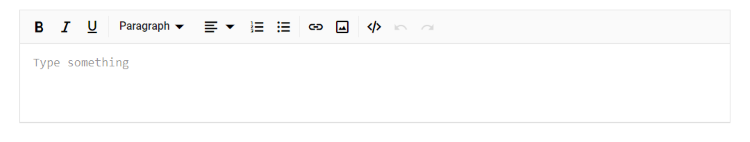
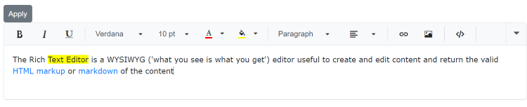

# Style and Appearance

## Set placeholder

Specifies the placeholder for the Rich Text Editor’s content used when the editor body is empty through the [Placeholder](https://help.syncfusion.com/cr/blazor/Syncfusion.Blazor.RichTextEditor.SfRichTextEditor.html#Syncfusion_Blazor_RichTextEditor_SfRichTextEditor_Placeholder) property.

Use the `e-rte-placeholder` class to define the custom font family, font color, and styles to the placeholder text.

```css

.e-richtexteditor .e-rte-placeholder {
    font-family: monospace;
}

```

The following sample demonstrates the placeholder option in Rich Text Editor.




@using Syncfusion.Blazor.RichTextEditor

<SfRichTextEditor Placeholder="Type something" />

<style>
    .e-richtexteditor .e-rte-placeholder {
        font-family: monospace;
    }
</style>






## Source Code View 

The Rich Text Editor includes the ability for the users to directly edit HTML code via `Source View` in the text area. If you made any modification in Source view directly, the changes will be reflected in the editor content. So, the users will have more flexibility over the content they have created.










## Customizing editor content

Use the following CSS to customize the default Rich Text Editor's content properties like font-family, font-size and color.

```css
/* To change font family and font size */
.e-richtexteditor .e-rte-content .e-content,
.e-richtexteditor .e-source-content .e-content {
    font-size: 20px;
    font-family: Segoe ui;
}

/* To change font color and content background */
.e-richtexteditor .e-rte-content,
.e-richtexteditor .e-source-content {
    background: seashell;
    color: blue;
}
```


## Customizing editor toolbar

Use the following CSS to customize the default color in the Rich Text Editor's toolbar icon.

```css
/* To change font color for toolbar icon */
.e-richtexteditor .e-rte-toolbar .e-toolbar-item .e-icons,
.e-richtexteditor .e-rte-toolbar .e-toolbar-item .e-icons:active {
    color: red;
}

/* To change font color for toolbar button */
.e-toolbar .e-tbar-btn,
.e-toolbar .e-tbar-btn:active,
.e-toolbar .e-tbar-btn:hover {
    color: red;
}

/* To change font color for toolbar button in active state*/
.e-richtexteditor .e-rte-toolbar .e-toolbar-item .e-dropdown-btn.e-active .e-icons,
.e-richtexteditor .e-rte-toolbar .e-toolbar-item .e-dropdown-btn.e-active .e-rte-dropdown-btn-text {
    color: red;
}

/* To change font color for expanded toolbar items */
.e-richtexteditor .e-rte-toolbar .e-toolbar-extended .e-toolbar-item .e-tbar-btn .e-icons,
.e-toolbar.e-extended-toolbar .e-toolbar-extended .e-toolbar-item .e-tbar-btn {
    color: red;
}
```


### Refresh editor

While rendering the Rich Text Editor inside the Dialog component, the dialog container and its wrapper elements are styled with display as none, so the editor’s toolbar does not get proper offset width and will render above the edit area container. To achieve this, you can call the `RefreshUI` method of RichTextEditor in the [Dialog Opened](https://help.syncfusion.com/cr/blazor/Syncfusion.Blazor.RichTextEditor.RichTextEditorEvents.html#Syncfusion_Blazor_RichTextEditor_RichTextEditorEvents_DialogOpened) event.










## Highlight the specific lines

You can programmatically highlight a portion of the text in the editor, like setting the background color of the text by applying background style to the particular text using RichTextEditor ExecuteCommand method and the `jsinterop` method.

Refer the jsintrob method in **wwwroot/jsinterop.js** of file.




window.RichTextEditor = {
    setBackground: function () {
        var rteInstance = document.getElementById('defaultRTE').blazor__instance;
        rteInstance.formatter.editorManager.nodeSelection.setSelectionText(
            document, rteInstance.inputElement.childNodes[0].childNodes[0], rteInstance.inputElement.childNodes[0].childNodes[0], 9, 20);
        return true;
    }
}




* For .NET 6 app, add the script reference in the `<head>` of the **~/Pages/_Layout.cshtml** file.

* For .NET 5 and .NET 3.X app, add the script reference in the `<head>` of the **~/Pages/_Host.cshtml** file.




<head>
    ...
    <script src="jsinterop.js"></script> 
</head>





<head>
    ...
    <script src="jsinterop.js"></script> 
</head>




Now, add the Syncfusion RichTextEditor component in razor file. Here, the RichTextEditor component is added in the **~/Pages/Index.razor** file under the **~/Pages** folder.




<SfButton OnClick="SetBackround">Apply</SfButton>
<SfRichTextEditor @ref="@RteObj" ID="defaultRTE" Placeholder="Enter Some Content">
    <RichTextEditorToolbarSettings Items="@Tools" />
    <p>The Rich Text Editor is a WYSIWYG ('what you see is what you get') editor useful to create and edit content and return the valid </p>
</SfRichTextEditor>
<style>
    .e-richtexteditor .e-rte-content .e-content,
    .e-richtexteditor .e-source-content .e-content {
        font-family: Verdana;
    }
</style>

@code {
    SfRichTextEditor RteObj;
    [Inject]
    IJSRuntime JsRuntime { get; set; }
    private async Task SetBackround()
    {
        await JsRuntime.InvokeAsync<bool>("RichTextEditor.setBackground");
        await this.RteObj.ExecuteCommandAsync(CommandName.BackgroundColor, "yellow");
    }
    private List<ToolbarItemModel> Tools = new List<ToolbarItemModel>()
    {
        new ToolbarItemModel() { Command = ToolbarCommand.Bold },
        new ToolbarItemModel() { Command = ToolbarCommand.Italic },
        new ToolbarItemModel() { Command = ToolbarCommand.Underline },
        new ToolbarItemModel() { Command = ToolbarCommand.Separator },
        new ToolbarItemModel() { Command = ToolbarCommand.FontName },
        new ToolbarItemModel() { Command = ToolbarCommand.FontSize },
        new ToolbarItemModel() { Command = ToolbarCommand.FontColor },
        new ToolbarItemModel() { Command = ToolbarCommand.BackgroundColor },
        new ToolbarItemModel() { Command = ToolbarCommand.Separator },
        new ToolbarItemModel() { Command = ToolbarCommand.Formats },
        new ToolbarItemModel() { Command = ToolbarCommand.Alignments },
        new ToolbarItemModel() { Command = ToolbarCommand.Separator },
        new ToolbarItemModel() { Command = ToolbarCommand.CreateLink },
        new ToolbarItemModel() { Command = ToolbarCommand.Image },
        new ToolbarItemModel() { Command = ToolbarCommand.Separator },
        new ToolbarItemModel() { Command = ToolbarCommand.SourceCode },
        new ToolbarItemModel() { Command = ToolbarCommand.Separator },
        new ToolbarItemModel() { Command = ToolbarCommand.Undo },
        new ToolbarItemModel() { Command = ToolbarCommand.Redo }
    };
}






> You can refer to our [Blazor Rich Text Editor](https://www.syncfusion.com/blazor-components/blazor-wysiwyg-rich-text-editor) feature tour page for its groundbreaking feature representations. You can also explore our [Blazor Rich Text Editor](https://blazor.syncfusion.com/demos/rich-text-editor/overview?theme=bootstrap4) example to know how to render and configure the rich text editor tools.