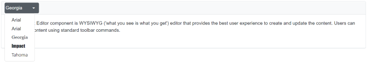
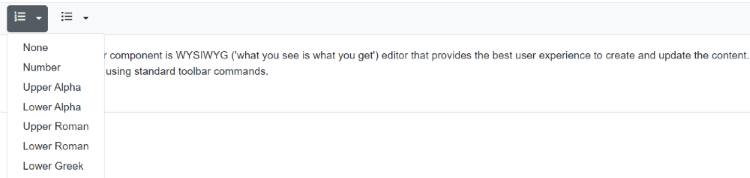
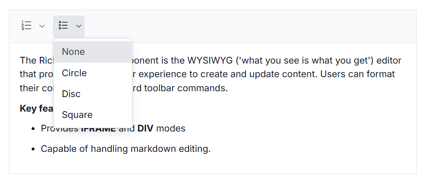

# Styling in Blazor RichTextEditor Component

## Font name and size

By default, the editor is initialized with default items of font name and font size. To change it, select a different font name and font size from the drop-down in the editor’s toolbar.

To apply different font style for section of the content, select the text that you would like to change, and select a required font style from the drop-down to apply the changes to the selected text.

### Buil-in Font name

The following table, lists the default font name and width of the `FontName` dropdown and available list of font names.

| Default Key | Default Value |
|-----|--------------------------------------|
| Default | null |
| Width | 65px|
| Items | new List&lt;DropDownItemModel&gt;()<br>{<br>&nbsp;&nbsp;&nbsp;&nbsp;new DropDownItemModel() { Text = "Segoe UI", Value = "Segoe UI" },<br>&nbsp;&nbsp;&nbsp;&nbsp;new DropDownItemModel() { Text = "Arial", Value = "Arial,Helvetica,sans-serif" },<br>&nbsp;&nbsp;&nbsp;&nbsp;new DropDownItemModel() { Text = "Georgia", Value = "Georgia,serif" },<br>&nbsp;&nbsp;&nbsp;&nbsp;new DropDownItemModel() { Text = "Impact", Value = "Impact,Charcoal,sans-serif" },<br>&nbsp;&nbsp;&nbsp;&nbsp;new DropDownItemModel() { Text = "Tahoma", Value = "Tahoma,Geneva,sans-serif" },<br>&nbsp;&nbsp;&nbsp;&nbsp;new DropDownItemModel() { Text = "Times New Roman", Value = "Times New Roman,Times,serif" },<br>&nbsp;&nbsp;&nbsp;&nbsp;new DropDownItemModel() { Text = "Verdana", Value = "Verdana,Geneva,sans-serif"}<br>}; |





@using Syncfusion.Blazor.RichTextEditor

<SfRichTextEditor>
    <RichTextEditorToolbarSettings Items="@Tools" />
    <RichTextEditorFontFamily Default="Georgia" />
    <p>The Rich Text Editor component is WYSIWYG ('what you see is what you get') editor that provides the best user experience to create and update the content. Users can format their content using standard toolbar commands.</p>
</SfRichTextEditor>
@code{
    private List<ToolbarItemModel> Tools = new List<ToolbarItemModel>()
    {
        new ToolbarItemModel() { Command = ToolbarCommand.FontName },
        new ToolbarItemModel() { Command = ToolbarCommand.FontSize },
    };
}











### Build-in Font size

The following table list the default font size and width of the [`FontSize`](https://help.syncfusion.com/cr/blazor/Syncfusion.Blazor.RichTextEditor.RichTextEditorFontSize.html) dropdown and available list of font size.

| Default Key | Default Value |
|-----|--------------------------------------|
| Default | null |
| Width | 35px.|
| Items | new List&lt;DropDownItemModel&gt;()<br>{<br>&nbsp;&nbsp;&nbsp;&nbsp;new DropDownItemModel() { Text = "8 pt", Value = "8pt" },<br>&nbsp;&nbsp;&nbsp;&nbsp;new DropDownItemModel() { Text = "10 pt", Value = "10pt" },<br>&nbsp;&nbsp;&nbsp;&nbsp;new DropDownItemModel() { Text = "12 pt", Value = "12pt" },<br>&nbsp;&nbsp;&nbsp;&nbsp;new DropDownItemModel() { Text = "14 pt", Value = "14pt" },<br>&nbsp;&nbsp;&nbsp;&nbsp;new DropDownItemModel() { Text = "18 pt", Value = "18pt" },<br>&nbsp;&nbsp;&nbsp;&nbsp;new DropDownItemModel() { Text = "24 pt", Value = "24pt" },<br>&nbsp;&nbsp;&nbsp;&nbsp;new DropDownItemModel() { Text = "36 pt", Value = "36pt" }<br>}; |




@using Syncfusion.Blazor.RichTextEditor

<SfRichTextEditor>
    <RichTextEditorToolbarSettings Items="@Tools" />
    <RichTextEditorFontSize Default="10pt" />
    <p>The Rich Text Editor component is WYSIWYG ('what you see is what you get') editor that provides the best user experience to create and update the content. Users can format their content using standard toolbar commands.</p>
</SfRichTextEditor>
@code{
    private List<ToolbarItemModel> Tools = new List<ToolbarItemModel>()
    {
        new ToolbarItemModel() { Command = ToolbarCommand.FontName },
        new ToolbarItemModel() { Command = ToolbarCommand.FontSize },
    };
}











The following sample demonstrates the option to add the font name and font size tools to the toolbar as well as modify the default `Width` of the tools.




@using Syncfusion.Blazor.RichTextEditor

<SfRichTextEditor>
    <RichTextEditorToolbarSettings Items="@Tools" />
    <RichTextEditorFontFamily Width="50px" />
    <RichTextEditorFontSize Width="50px" />
    <p>The Rich Text Editor component is WYSIWYG ('what you see is what you get') editor that provides the best user experience to create and update the content. Users can format their content using standard toolbar commands.</p>
</SfRichTextEditor>

@code{
    private List<ToolbarItemModel> Tools = new List<ToolbarItemModel>()
    {
        new ToolbarItemModel() { Command = ToolbarCommand.FontName },
        new ToolbarItemModel() { Command = ToolbarCommand.FontSize },
    };
}





## Custom font and size

Rich Text Editor provides support to custom fonts and size with existing list.
If you want to add additional font names and font sizes to font drop-down, pass the font information as `List<DropDownItemModel>` data to the `Items` field of [`RichTextEditorFontSize`](https://help.syncfusion.com/cr/blazor/Syncfusion.Blazor.RichTextEditor.RichTextEditorFontSize.html) and [`RichTextEditorFontFamily`](https://help.syncfusion.com/cr/blazor/Syncfusion.Blazor.RichTextEditor.RichTextEditorFontFamily.html) tag.




@using Syncfusion.Blazor.RichTextEditor

<SfRichTextEditor CssClass="customClass">
    <RichTextEditorToolbarSettings Items="@Tools" />
    <RichTextEditorFontSize Items="@FontSizeItems" />
    <RichTextEditorFontFamily Default="Georgia" Items="@FontFamilyItems" />
    <p>The Rich Text Editor component is WYSIWYG ('what you see is what you get') editor that provides the best user experience to create and update the content. Users can format their content using standard toolbar commands.</p>
</SfRichTextEditor>

@code{
    private List<ToolbarItemModel> Tools = new List<ToolbarItemModel>()
    {
        new ToolbarItemModel() { Command = ToolbarCommand.FontName },
        new ToolbarItemModel() { Command = ToolbarCommand.FontSize },
    };  
   private List<DropDownItemModel> FontFamilyItems = new List<DropDownItemModel>()
    {
        new DropDownItemModel() { Text = "Segoe UI", Value = "Arial,Helvetica,sans-serif" },
        new DropDownItemModel() { Text = "Arial", Value = "Roboto" },
        new DropDownItemModel() { Text = "Georgia", Value = "Georgia,serif" },
        new DropDownItemModel() { Text = "Impact", Value = "Impact,Charcoal,sans-serif" },
        new DropDownItemModel() { Text = "Tahoma", Value = "Tahoma,Geneva,sans-serif" }
    };
    private List<DropDownItemModel> FontSizeItems = new List<DropDownItemModel>()
    {
        new DropDownItemModel() { Text = "8 pt", Value = "8pt" },
        new DropDownItemModel() { Text = "10 pt", Value = "10pt" },
        new DropDownItemModel() { Text = "12 pt", Value = "12pt" },
        new DropDownItemModel() { Text = "14 pt", Value = "14pt" },
        new DropDownItemModel() { Text = "42 pt", Value = "42pt" }
    };
}














## Google Fonts Support

To use web fonts in Rich Text Editor, the web fonts need not be present in the local machine. To add the web fonts to Rich Text Editor, refer to the web font links and add the font names in the [RichTextEditorFontFamily](https://help.syncfusion.com/cr/blazor/Syncfusion.Blazor.RichTextEditor.RichTextEditorFontFamily.html) tag.


The following font style links are referred in the page.

### Blazor Server App

* For **.NET 6** app, Refer script in the `<head>` of the **~/Pages/_Layout.cshtml** file.

* For **.NET 5 and .NET 3.X** app, Refer script in the `<head>` of the **~/Pages/_Host.cshtml** file.




<head>
    <link rel="stylesheet" href="http://fonts.googleapis.com/css?family=Roboto">
    <link rel="stylesheet" href="http://fonts.googleapis.com/css?family=Great+Vibes">
</head>





<head>
    <link rel="stylesheet" href="http://fonts.googleapis.com/css?family=Roboto">
    <link rel="stylesheet" href="http://fonts.googleapis.com/css?family=Great+Vibes">
</head>




### Blazor WebAssembly App

For Blazor WebAssembly App, Refer script in the `<head>` of the **~/index.html** file.




<head>
    <link rel="stylesheet" href="http://fonts.googleapis.com/css?family=Roboto">
    <link rel="stylesheet" href="http://fonts.googleapis.com/css?family=Great+Vibes">
</head>







@using Syncfusion.Blazor.RichTextEditor

<SfRichTextEditor>
    <RichTextEditorToolbarSettings Items="@Tools" />
    <RichTextEditorFontFamily Items="@FontFamilyItems" />
    <p>The Rich Text Editor component is WYSIWYG ('what you see is what you get') editor that provides the best user experience to create and update the content. Users can format their content using standard toolbar commands.</p>
</SfRichTextEditor>

@code {
    private List<DropDownItemModel> FontFamilyItems = new List<DropDownItemModel>()
    {
        new DropDownItemModel() { CssClass = "e-segoe-ui", Command = "Font", SubCommand = "FontName", Text = "Segoe UI", Value = "Arial,Helvetica,sans-serif" },
        new DropDownItemModel() { CssClass = "e-arial", Command = "Font", SubCommand = "FontName", Text = "Arial", Value = "Roboto" },
        new DropDownItemModel() { CssClass = "e-georgia", Command = "Font", SubCommand = "FontName", Text = "Georgia", Value = "Georgia,serif" },
        new DropDownItemModel() { CssClass = "e-impact", Command = "Font", SubCommand = "FontName", Text = "Impact", Value = "Impact,Charcoal,sans-serif" },
        new DropDownItemModel() { CssClass = "e-tahoma", Command = "Font", SubCommand = "FontName", Text = "Tahoma", Value = "Tahoma,Geneva,sans-serif" }
    };
    private List<ToolbarItemModel> Tools = new List<ToolbarItemModel>()
    {
        new ToolbarItemModel() { Command = ToolbarCommand.FontName },
        new ToolbarItemModel() { Command = ToolbarCommand.FontSize },
    };
}











## Formats

By default, the editor is initialized with default items of formats. To change it, select a different format from the drop-down in the editor’s toolbar.

To apply different format style for section of the content, select a required format from the drop-down to apply the changes to the selection.

The following table, lists the default format name and width of the [`Format`](https://help.syncfusion.com/cr/blazor/Syncfusion.Blazor.RichTextEditor.RichTextEditorFormat.html#properties) dropdown and available list of format names.

| Default Key | Default Value |
|-----|--------------------------------------|
| Default | null |
| Width | 65px|
| Items | new List&lt;DropDownItemModel&gt;()<br>{<br>&nbsp;&nbsp;&nbsp;&nbsp;new DropDownItemModel() { Text = "Paragraph", Value = "P" },<br>&nbsp;&nbsp;&nbsp;&nbsp;new DropDownItemModel() { Text = "Code", Value = "Pre" },<br>&nbsp;&nbsp;&nbsp;&nbsp;new DropDownItemModel() { Text = "Quotation", Value = "BlockQuote" },<br>&nbsp;&nbsp;&nbsp;&nbsp;new DropDownItemModel() { Text = "Heading 1", Value = "H1" },<br>&nbsp;&nbsp;&nbsp;&nbsp;new DropDownItemModel() { Text = "Heading 2", Value = "H2" },<br>&nbsp;&nbsp;&nbsp;&nbsp;new DropDownItemModel() { Text = "Heading 3", Value = "H3" },<br>&nbsp;&nbsp;&nbsp;&nbsp;new DropDownItemModel() { Text = "Heading 4", Value = "H4" }<br>}; |


### Build-in Format




@using Syncfusion.Blazor.RichTextEditor

<SfRichTextEditor>
    <RichTextEditorToolbarSettings Items="@Tools" />
    <RichTextEditorFormat Default="Paragraph"/>
    <p>The Rich Text Editor component is WYSIWYG ('what you see is what you get') editor that provides the best user experience to create and update the content. Users can format their content using standard toolbar commands.</p>
</SfRichTextEditor>

@code{
    private List<ToolbarItemModel> Tools = new List<ToolbarItemModel>()
    {
        new ToolbarItemModel() { Command = ToolbarCommand.FontName },
        new ToolbarItemModel() { Command = ToolbarCommand.FontSize },
        new ToolbarItemModel() { Command = ToolbarCommand.Formats },
    };
}











### Custom formats

Rich Text Editor provides support to custom formats with existing list.
If you want to add additional formats to format drop-down, pass the format information as `List<DropDownItemModel>` data to the `Items` field of [`RichTextEditorFormat`](https://help.syncfusion.com/cr/blazor/Syncfusion.Blazor.RichTextEditor.RichTextEditorFormat.html) tag.




@using Syncfusion.Blazor.RichTextEditor

<SfRichTextEditor>
    <RichTextEditorToolbarSettings Items="@Tools" />
    <RichTextEditorFormat Items="@FormatItems" />
    <p>The Rich Text Editor component is WYSIWYG ('what you see is what you get') editor that provides the best user experience to create and update the content. Users can format their content using standard toolbar commands.</p>
</SfRichTextEditor>

@code{
    private List<ToolbarItemModel> Tools = new List<ToolbarItemModel>()
    {
        new ToolbarItemModel() { Command = ToolbarCommand.FontName },
        new ToolbarItemModel() { Command = ToolbarCommand.FontSize },
        new ToolbarItemModel() { Command = ToolbarCommand.Formats },
    };
    private List<DropDownItemModel> FormatItems = new List<DropDownItemModel>()
    {
        new DropDownItemModel() { Text = "Paragraph", Value = "P" },
        new DropDownItemModel() { Text = "Code", Value = "Pre" },
        new DropDownItemModel() { Text = "Quotation", Value = "BlockQuote" },
        new DropDownItemModel() { Text = "Heading 1", Value = "H1" },
        new DropDownItemModel() { Text = "Heading 2", Value = "H2" },
        new DropDownItemModel() { Text = "Heading 3", Value = "H3" },
        new DropDownItemModel() { Text = "Heading 4", Value = "H4" },
        new DropDownItemModel() { Text = "Heading 5", Value = "H5" },
        new DropDownItemModel() { Text = "Heading 6", Value = "H6" }
    };
}











## Font and Background color

To apply font color or background color for a selected content of RTE, use the font color and background color tools.

Rich Text Editor support to provide customs font color and background color with existing list through the `ColorCode` field of [`RichTextEditorFontColor`](https://help.syncfusion.com/cr/blazor/Syncfusion.Blazor.RichTextEditor.RichTextEditorFontColor.html) and [`RichTextEditorBackgroundColor`](https://help.syncfusion.com/cr/blazor/Syncfusion.Blazor.RichTextEditor.RichTextEditorBackgroundColor.html).

The RichTextEditorFontColor and RichTextEditorBackgroundColor tag has two `Mode` of `Picker` and `Palette`. Palette mode has predefined set of `ColorCode` and in the picker mode, more colors has been provided. Through `ModeSwitcher`, you can able to switch between these two options.




@using Syncfusion.Blazor.RichTextEditor

<SfRichTextEditor>
    <RichTextEditorToolbarSettings Items="@Tools" />
    <RichTextEditorBackgroundColor ModeSwitcher="true" />
    <RichTextEditorFontColor ModeSwitcher="true" />
    <p>The Rich Text Editor component is WYSIWYG ('what you see is what you get') editor that provides the best user experience to create and update the content. Users can format their content using standard toolbar commands.</p>
</SfRichTextEditor>

@code{
    private List<ToolbarItemModel> Tools = new List<ToolbarItemModel>()
    {
        new ToolbarItemModel() { Command = ToolbarCommand.FontName },
        new ToolbarItemModel() { Command = ToolbarCommand.FontSize },
        new ToolbarItemModel() { Command = ToolbarCommand.FontColor },
        new ToolbarItemModel() { Command = ToolbarCommand.BackgroundColor },
    };
}











## Build-in Editor content styles

By default, The content styles of Rich Text Editor are not returned while retrieving HTML value from the editor. So, the styles are not applied when using the HTML value outside of the editor. To get the styles to Rich Text Editor’s content for your application, You can copy and use the below styles directly in your application. The styles listed below which used in the UI elements of the Rich Text Editor.

> Make sure to add a CSS class ‘e-rte-content’ to the content container.

```css

.e-rte-content p {
  margin: 0 0 10px;
  margin-bottom: 10px;
}

.e-rte-content li {
  margin-bottom: 10px;
}

.e-rte-content h1 {
  font-size: 2.17em;
  font-weight: 400;
  line-height: 1;
  margin: 10px 0;
}

.e-rte-content h2 {
  font-size: 1.74em;
  font-weight: 400;
  margin: 10px 0;
}

.e-rte-content h3 {
  font-size: 1.31em;
  font-weight: 400;
  margin: 10px 0;
}

.e-rte-content h4 {
  font-size: 1em;
  font-weight: 400;
  margin: 0;
}

.e-rte-content h5 {
  font-size: 00.8em;
  font-weight: 400;
  margin: 0;
}

.e-rte-content h6 {
  font-size: 00.65em;
  font-weight: 400;
  margin: 0;
}

.e-rte-content blockquote {
  margin: 10px 0;
  margin-left: 0;
  padding-left: 5px;
}

.e-rte-content pre {
  background-color: inherit;
  border: 0;
  border-radius: 0;
  color: #333;
  font-size: inherit;
  line-height: inherit;
  margin: 0 0 10px;
  overflow: visible;
  padding: 0;
  white-space: pre-wrap;
  word-break: inherit;
  word-wrap: break-word;
}

.e-rte-content strong, .e-rte-content b {
  font-weight: 700;
}

.e-rte-content a {
  text-decoration: none;
  -webkit-user-select: auto;
  -ms-user-select: auto;
  user-select: auto;
}

.e-rte-content a:hover {
  text-decoration: underline;
}

.e-rte-content h3 + h4,
.e-rte-content h4 + h5,
.e-rte-content h5 + h6 {
  margin-top: 00.6em;
}

.e-rte-content .e-rte-image.e-imgbreak {
  border: 0;
  cursor: pointer;
  display: block;
  float: none;
  margin: 5px auto;
  max-width: 100%;
  position: relative;
}

.e-rte-content .e-rte-image {
  border: 0;
  cursor: pointer;
  display: block;
  float: none;
  margin: auto;
  max-width: 100%;
  position: relative;
}

.e-rte-content .e-rte-image.e-imginline {
  display: inline-block;
  float: none;
  margin-left: 5px;
  margin-right: 5px;
  max-width: calc(100% - (2 * 5px));
  vertical-align: bottom;
}

.e-rte-content .e-rte-image.e-imgcenter {
  cursor: pointer;
  display: block;
  float: none;
  margin: 5px auto;
  max-width: 100%;
  position: relative;
}

.e-rte-content .e-rte-image.e-imgleft {
  float: left;
  margin: 0 5px 0 0;
  text-align: left;
}

.e-rte-content .e-rte-image.e-imgright {
  float: right;
  margin: 0 0 0 5px;
  text-align: right;
}

.e-rte-content .e-rte-img-caption {
  display: inline-block;
  margin: 5px auto;
  max-width: 100%;
  position: relative;
}

.e-rte-content .e-rte-img-caption.e-caption-inline {
  display: inline-block;
  margin: 5px auto;
  margin-left: 5px;
  margin-right: 5px;
  max-width: calc(100% - (2 * 5px));
  position: relative;
  text-align: center;
  vertical-align: bottom;
}

.e-rte-content .e-rte-img-caption.e-imgcenter {
  display: block;
}

.e-rte-content .e-rte-img-caption .e-rte-image.e-imgright,
.e-rte-content .e-rte-img-caption .e-rte-image.e-imgleft {
  float: none;
  margin: 0;
}

.e-rte-content .e-rte-table {
  border-collapse: collapse;
  empty-cells: show;
}

.e-rte-content .e-rte-table td,
.e-rte-content .e-rte-table th {
  border: 1px solid #bdbdbd;
  height: 20px;
  min-width: 20px;
  padding: 2px 5px;
  vertical-align: middle;
}

.e-rte-content .e-rte-table.e-dashed-border td,
.e-rte-content .e-rte-table.e-dashed-border th {
  border-style: dashed;
}

.e-rte-content .e-rte-img-caption .e-img-inner {
  box-sizing: border-box;
  display: block;
  font-size: 16px;
  font-weight: initial;
  margin: auto;
  opacity: .9;
  position: relative;
  text-align: center;
  width: 100%;
}

.e-rte-content .e-rte-img-caption .e-img-wrap {
  display: inline-block;
  margin: auto;
  padding: 0;
  width: 100%;
}

.e-rte-content blockquote {
  border-left: solid 2px #333;
}

.e-rte-content a {
  color: #2e2ef1;
}

.e-rte-content .e-rte-table th {
  background-color: #e0e0e0;
}

```
## Number and Bullet Format Lists

This feature allows the user to change the appearance of the Numbered and Bulleted lists. Users can also apply different numbering or bullet formats lists such as lowercase greek, upper Alpha, square and circles. You can also customize the style type of the lists to be populated in the dropdown from the toolbar by using the [`NumberFormatList`](https://help.syncfusion.com/cr/blazor/Syncfusion.Blazor.RichTextEditor.RichTextEditorNumberFormatList.html) and [`BulletFormatList`](https://help.syncfusion.com/cr/blazor/Syncfusion.Blazor.RichTextEditor.RichTextEditorBulletFormatList.html) properties in the Rich Text Editor.




@using Syncfusion.Blazor.RichTextEditor

<SfRichTextEditor>
    <RichTextEditorToolbarSettings Items="@Tools" />
    <p>The Rich Text Editor component is WYSIWYG ('what you see is what you get') editor that provides the best user experience to create and update the content. Users can format their content using standard toolbar commands.</p>
    <p><b> Key features:</b></p>
    <ul>
    <li><p> Provides <b>IFRAME</b> and <b>DIV</b> modes </p></li>
    <li><p> Capable of handling markdown editing.</p></li>
    </ul>
</SfRichTextEditor>

@code {
    private List<ToolbarItemModel> Tools = new List<ToolbarItemModel>()
    {
        new ToolbarItemModel() { Command = ToolbarCommand.NumberFormatList },
        new ToolbarItemModel() { Command = ToolbarCommand.BulletFormatList },
    };
}














## Format Code Block

You can configure code block formatting as a separate toolbar button by adding the **InsertCode** Command within the [`RichTextEditorToolbarSettings`](https://help.syncfusion.com/cr/blazor/Syncfusion.Blazor.RichTextEditor.RichTextEditorToolbarSettings.html) - `Items` property. The InsertCode button has a toggle state to apply code block formatting to the editor and remove code block formatting from the editor.

The following code will configure the InsertCode button in toolbar and set the background color to “pre” tag for highlighting the code block.




@using Syncfusion.Blazor.RichTextEditor

<SfRichTextEditor>
    <RichTextEditorToolbarSettings Items="@Tools" />
        <p>The Rich Text Editor component is WYSIWYG ('what you see is what you get') editor that provides the best user experience to create and update the content. Users can format their content using standard toolbar commands.</p>
</SfRichTextEditor>

<style>
    .e-richtexteditor .e-rte-content .e-content pre {
        padding: 10px;
        background: #F4F5F7 !important;
    }
</style>

@code{
    private List<ToolbarItemModel> Tools = new List<ToolbarItemModel>()
    {
        new ToolbarItemModel() { Command = ToolbarCommand.InsertCode }
    };
}











> You can refer to our [Blazor Rich Text Editor](https://www.syncfusion.com/blazor-components/blazor-wysiwyg-rich-text-editor) feature tour page for its groundbreaking feature representations. You can also explore our [Blazor Rich Text Editor](https://blazor.syncfusion.com/demos/rich-text-editor/overview?theme=bootstrap4) example to know how to render and configure the rich text editor tools.

## See Also

* [How to add google fonts to the font family](./how-to/add-google-fonts/)
* [How to customize the placeholder](./how-to/placeholder/)