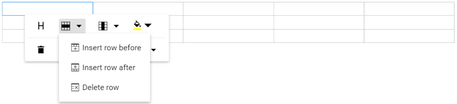

# Table in Blazor RichTextEditor Component

Rich Text Editor allows users to insert tables in edit panel and provide options to add, edit, and remove the table as well as perform other table related action. For inserting the table to the Rich Text Editor, the following list of options are available in the [RichTextEditorTableSettings](https://help.syncfusion.com/cr/blazor/Syncfusion.Blazor.RichTextEditor.TableToolbarCommand.html)

| Options | Description | Default Value |
|----------------|---------|-----------------------------|
| MinWidth | Sets the default minWidth of the table. | 0 |
| MaxWidth | Sets the default maxWidth of the table. | null |
| EnableResize | Enables resize feature in table.| true |
| Styles | This is an array of key value pair, on each pair, key should be name of styling and value is class name. This list appears in the quick toolbar and allows users to apply predefined styles such as dashed borders or alternate row shading. | `List<DropDownItemModel>` |
| Width | Sets the default width of the table. | 100% |

## Insert table

Using the `CreateTable` toolbar option, select a number of rows and columns to be inserted over the table grid and insert table into Rich Text Editor content using the mouse. Alternatively, tables can be inserted using the `Insert Table` dialog, where users manually specify the number of rows and columns. This method is commonly used on mobile devices.

In the following sample, the table has been inserted using `CreateTable` toolbar item.

```cshtml

@using Syncfusion.Blazor.RichTextEditor

<SfRichTextEditor ShowCharCount="true">
    <RichTextEditorToolbarSettings Items="@Tools" />
    <p>The Rich Text Editor component is WYSIWYG ('what you see is what you get') editor that provides the best user experience to create and update the content. Users can format their content using standard toolbar commands.</p>
    <p><b> Key features:</b></p>
    <ul>
    <li><p> Provides <b>IFRAME</b> and <b>DIV</b> modes </p></li>
    <li><p> Capable of handling markdown editing.</p></li>
    <li><p> Contains a modular library to load the necessary functionality on demand.</p></li>
    <li><p> Provides a fully customizable toolbar.</p></li>
    <li><p> Provides HTML view to edit the source directly for developers.</p></li>
    <li><p> Supports third - party library integration.</p></li>
    </ul>
</SfRichTextEditor>

@code{
    private List<ToolbarItemModel> Tools = new List<ToolbarItemModel>()
    {
        new ToolbarItemModel() { Command = ToolbarCommand.CreateTable }
    };
}

```


## Quick toolbar

The quick toolbar appears when a user clicks on a table. It has different sets of commands to be performed on the table which increases the feasibility to edit the table easily.

## Table header

`Table Header` command is available with quick toolbar option through which the header row can be added or removed from the inserted table. The following image illustrates the table header.


## Insert or delete table rows

`Rows` can be inserted above or below the required table cell through the quick toolbar. Also, focused row can be deleted. The following screenshot shows the available options of the row item.



## Insert or delete table columns

`Columns` can be inserted to the left or right side of the required table cell through the quick toolbar. Also, the focused column can be deleted. The following screenshot shows the available options of the column item.


## Set table cell background Color

The Background Color can be set for each table cell through the `BackgroundColor` command available with quick toolbar.


## Delete table

Using the delete item in the quick toolbar, users can delete the entire table.

## Vertical align

Text within table cells can be vertically aligned to top, middle, or bottom using the `TableCellVerticalAlign` command of the quick toolbar.


## Horizontal align

Text within table cells can be horizontally aligned to left, center, or right using the `TableCellHorizontalAlign` command of the quick toolbar.


## Table styles

Table styles provided for class name should be appended to a table element. It helps to design the table in specific CSS styles when inserting in the editor.

By default, provides `Dashed border` and `Alternate rows`.

**Dashed border**: Applies the dashed border to the table.

**Alternate border**: Applies the alternative background to the table.


### Add custom table styles

Rich Text Editor supports custom table styles. If you want to add additional styles, pass the styles information as `List<DropDownItemModel>` data to the `Styles` field of `RichTextEditorTableSettings` tag.

```cshtml

<SfRichTextEditor>
    <RichTextEditorTableSettings Styles="@StyleItems" />
    <RichTextEditorToolbarSettings Items="@Tools" />
</SfRichTextEditor>

@code{
    private List<ToolbarItemModel> Tools = new List<ToolbarItemModel>()
    {
        new ToolbarItemModel() { Command = ToolbarCommand.CreateTable }
    };

    private List<DropDownItemModel> StyleItems = new List<DropDownItemModel>()
    {
        new DropDownItemModel() { Text = "Alternate Rows" }
    };
}

```


## Configure table properties

Sets the default width of the table when it is inserted in the Rich Text Editor using the width of `RichTextEditorTableSettings`.

Using the quick toolbar, users can change the width, cell padding, and cell spacing in the selected table using the `TableEditProperties` command dialog action.


N> You can refer to our [Blazor Rich Text Editor](https://www.syncfusion.com/blazor-components/blazor-wysiwyg-rich-text-editor) feature tour page for its groundbreaking feature representations. You can also explore our [Blazor Rich Text Editor](https://blazor.syncfusion.com/demos/rich-text-editor/overview?theme=bootstrap5) example to know how to render and configure the rich text editor tools.

## Merge and split table cells

The Rich Text Editor allows users to change the appearance of the tables by splitting or merging the table cells.

`TableCell` item should be configured in the Table [quickToolbarSettings](../api/rich-text-editor/quickToolbarSettings/#table) property to show the merge/split icons while selecting the table cells.

### Merge table cells

The table cell merge feature allows to merge two or more row and column cells into a single cell with its contents.


### Split table cells

The table cell split feature allows to a selected cell can be split both horizontally and vertically.

