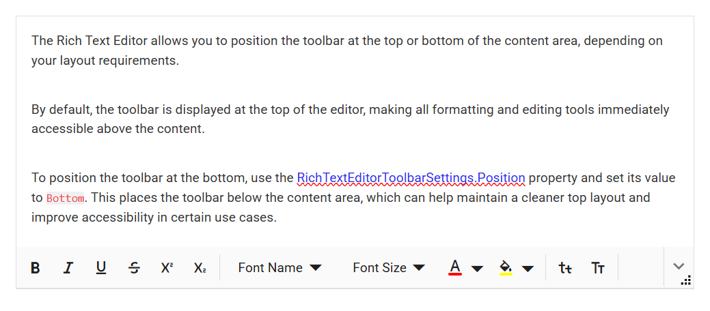

# Toolbar Position in Blazor Rich Text Editor Component

The Rich Text Editor allows you to configure the toolbar's position using the [RichTextEditorToolbarSettings.Position](https://help.syncfusion.com/cr/blazor/Syncfusion.Blazor.RichTextEditor.RichTextEditorToolbarSettings.html#Syncfusion_Blazor_RichTextEditor_RichTextEditorToolbarSettings_Position) property. The available positions are:

1. Top 
2. Bottom

## Configuring the toolbar position

You can position the toolbar at the top or bottom of the content area based on your layout requirements.

By default, the toolbar appears at the top of the editor, making all formatting and editing tools easily accessible above the content.

To move the toolbar to the bottom, set the [RichTextEditorToolbarSettings.Position](https://help.syncfusion.com/cr/blazor/Syncfusion.Blazor.RichTextEditor.RichTextEditorToolbarSettings.html#Syncfusion_Blazor_RichTextEditor_RichTextEditorToolbarSettings_Position) property to `Bottom`. This places the toolbar below the content area, which can help maintain a cleaner top layout and improve accessibility in certain scenarios.









