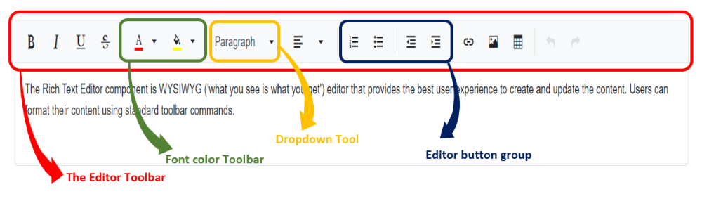
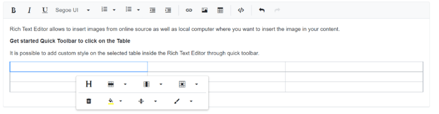

# Toolbar types

The Rich Text Editor toolbar contains a collection of tools such as bold, Italic, and text alignment buttons that are used to format the content. However, in most integrations, you can customize the toolbar configurations easily to suit your needs. The Rich Text Editor allows to configure different types of toolbar using [`RichTextEditorToolbarSettings`](https://help.syncfusion.com/cr/blazor/Syncfusion.Blazor.RichTextEditor.RichTextEditorToolbarSettings.html) - `Type` property. The types of toolbar are:

1. Expand
2. MultiRow

## Expand toolbar

The default mode of [`RichTextEditorToolbarSettings`](https://help.syncfusion.com/cr/blazor/Syncfusion.Blazor.RichTextEditor.RichTextEditorToolbarSettings.html#Syncfusion_Blazor_RichTextEditor_RichTextEditorToolbarSettings_Type) - `Type` as [`Expand`](https://help.syncfusion.com/cr/blazor/Syncfusion.Blazor.RichTextEditor.ToolbarType.html#Syncfusion_Blazor_RichTextEditor_ToolbarType_Expand) to hide the overflowing items in the next row. By clicking the expand arrow, view the overflowing toolbar items.









## Multi-row Toolbar

Set the [`RichTextEditorToolbarSettings`](https://help.syncfusion.com/cr/blazor/Syncfusion.Blazor.RichTextEditor.RichTextEditorToolbarSettings.html#Syncfusion_Blazor_RichTextEditor_RichTextEditorToolbarSettings_Type) - `Type` as [`MultiRow`](https://help.syncfusion.com/cr/blazor/Syncfusion.Blazor.RichTextEditor.ToolbarType.html#Syncfusion_Blazor_RichTextEditor_ToolbarType_MultiRow) to display the toolbar items in a row-wise format. All toolbar items are visible always.









# Floating Toolbar

By default, toolbar is float at the top of the Rich Text Editor on scrolling. It can be customized by specifying the offset of the floating toolbar from documents top position using [`FloatingToolbarOffset`](https://help.syncfusion.com/cr/blazor/Syncfusion.Blazor.RichTextEditor.SfRichTextEditor.html#Syncfusion_Blazor_RichTextEditor_SfRichTextEditor_FloatingToolbarOffset).

Enable or disable the floating toolbar using [`EnableFloating`](https://help.syncfusion.com/cr/blazor/Syncfusion.Blazor.RichTextEditor.RichTextEditorToolbarSettings.html#Syncfusion_Blazor_RichTextEditor_RichTextEditorToolbarSettings_EnableFloating) of the [`RichTextEditorToolbarSettings`](https://help.syncfusion.com/cr/blazor/Syncfusion.Blazor.RichTextEditor.RichTextEditorToolbarSettings.html) property.




@using Syncfusion.Blazor.RichTextEditor

<SfRichTextEditor Height="800px">
    <RichTextEditorToolbarSettings EnableFloating="true" />
    
The Rich Text Editor component is WYSIWYG ('what you see is what you get') editor that provides the best user experience to create and update the content. Users can format their content using standard toolbar commands.

</SfRichTextEditor>




# Quick Toolbar 

Quick commands are opened as context-menu on clicking the corresponding element. The commands must be passed to image, link and table attributes of the [`RichTextEditorQuickToolbarSettings`](https://help.syncfusion.com/cr/blazor/Syncfusion.Blazor.RichTextEditor.RichTextEditorQuickToolbarSettings.html) property.

| Target Element | Default Quick Toolbar items |
|----------------|---------|
| Image | 'Replace', 'Align', 'Caption', 'Remove', 'InsertLink', 'Display', 'AltText', 'Dimension'. |
| Link | 'Open', 'Edit', 'UnLink'. |
| Table | 'TableHeader', 'TableRows', 'TableColumns', 'BackgroundColor', 'TableRemove', 'Alignments', 'TableCellVerticalAlign', 'Styles'. |

The following sample demonstrates the option to insert the image to the Rich Text Editor content as well as option to rotate the image through the quick toolbar. The image rotation functionalities have been achieved through the [`OnToolbarClick`](https://help.syncfusion.com/cr/blazor/Syncfusion.Blazor.RichTextEditor.RichTextEditorEvents.html#Syncfusion_Blazor_RichTextEditor_RichTextEditorEvents_OnToolbarClick) event.

## Image quick Toolbar









## Link quick Toolbar









## Table quick Toolbar









> You can refer to our [Blazor Rich Text Editor](https://www.syncfusion.com/blazor-components/blazor-wysiwyg-rich-text-editor) feature tour page for its groundbreaking feature representations. You can also explore our [Blazor Rich Text Editor](https://blazor.syncfusion.com/demos/rich-text-editor/overview?theme=bootstrap4) example to knows how to render and configure the rich text editor tools.

## See Also

* [How to render the toolbar in inline mode](./inline-mode/)