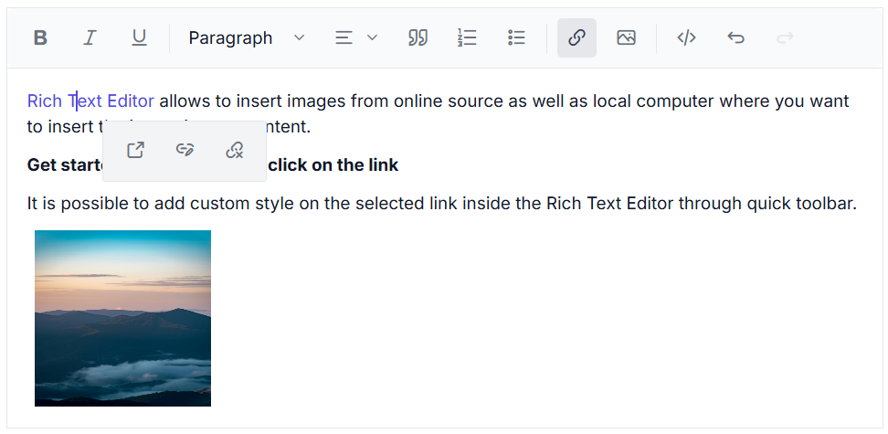

# Toolbar in Blazor RichTextEditor Component

The Rich Text Editor toolbar contains a collection of tools such as bold, Italic, and text alignment buttons that are used to format the content. However, in most integrations, you can customize the toolbar configurations easily to suit your needs. The Rich Text Editor allows to configure different types of toolbar using `RichTextEditorToolbarSettings` - `Type` property. The types of toolbar are:

1. Expand
2. MultiRow

## Expand Toolbar

The default mode of `RichTextEditorToolbarSettings` - `Type` as `Expand` to hide the overflowing items in the next row. By clicking the expand arrow, view the overflowing toolbar items.

```cshtml

@using Syncfusion.Blazor.RichTextEditor

<SfRichTextEditor>
    <RichTextEditorToolbarSettings Items="@Tools" Type="ToolbarType.Expand" />
    <p>The Rich Text Editor component is WYSIWYG ('what you see is what you get') editor that provides the best user experience to create and update the content. Users can format their content using standard toolbar commands.</p>
    <p><b> Key features:</b></p>
    <ul>
    <li><p>Provides <b>IFRAME</b> and <b>DIV</b> modes </p></li>
    <li><p> Capable of handling markdown editing.</p></li>
    <li><p> Contains a modular library to load the necessary functionality on demand.</p></li>
    <li><p> Provides a fully customizable toolbar.</p></li>
    <li><p> Provides HTML view to edit the source directly for developers.</p></li>
    <li><p> Supports third - party library integration.</p></li>
    </ul>
</SfRichTextEditor>

@code{
    private List<ToolbarItemModel> Tools = new List<ToolbarItemModel>()
    {
        new ToolbarItemModel() { Command = ToolbarCommand.Bold },
        new ToolbarItemModel() { Command = ToolbarCommand.Italic },
        new ToolbarItemModel() { Command = ToolbarCommand.Underline },
        new ToolbarItemModel() { Command = ToolbarCommand.StrikeThrough },
        new ToolbarItemModel() { Command = ToolbarCommand.Separator },
        new ToolbarItemModel() { Command = ToolbarCommand.FontName },
        new ToolbarItemModel() { Command = ToolbarCommand.FontSize },
        new ToolbarItemModel() { Command = ToolbarCommand.Separator },
        new ToolbarItemModel() { Command = ToolbarCommand.FontColor },
        new ToolbarItemModel() { Command = ToolbarCommand.BackgroundColor },
        new ToolbarItemModel() { Command = ToolbarCommand.Separator },
        new ToolbarItemModel() { Command = ToolbarCommand.LowerCase },
        new ToolbarItemModel() { Command = ToolbarCommand.UpperCase },
        new ToolbarItemModel() { Command = ToolbarCommand.Separator },
        new ToolbarItemModel() { Command = ToolbarCommand.SuperScript },
        new ToolbarItemModel() { Command = ToolbarCommand.SubScript },
        new ToolbarItemModel() { Command = ToolbarCommand.Separator },
        new ToolbarItemModel() { Command = ToolbarCommand.Formats },
        new ToolbarItemModel() { Command = ToolbarCommand.Alignments },
        new ToolbarItemModel() { Command = ToolbarCommand.Separator },
        new ToolbarItemModel() { Command = ToolbarCommand.OrderedList },
        new ToolbarItemModel() { Command = ToolbarCommand.UnorderedList },
        new ToolbarItemModel() { Command = ToolbarCommand.Separator },
        new ToolbarItemModel() { Command = ToolbarCommand.Outdent },
        new ToolbarItemModel() { Command = ToolbarCommand.Indent },
        new ToolbarItemModel() { Command = ToolbarCommand.Separator },
        new ToolbarItemModel() { Command = ToolbarCommand.CreateLink },
        new ToolbarItemModel() { Command = ToolbarCommand.Image },
        new ToolbarItemModel() { Command = ToolbarCommand.CreateTable },
        new ToolbarItemModel() { Command = ToolbarCommand.Separator },
        new ToolbarItemModel() { Command = ToolbarCommand.ClearFormat },
        new ToolbarItemModel() { Command = ToolbarCommand.Separator },
        new ToolbarItemModel() { Command = ToolbarCommand.Print },
        new ToolbarItemModel() { Command = ToolbarCommand.SourceCode },
        new ToolbarItemModel() { Command = ToolbarCommand.FullScreen },
        new ToolbarItemModel() { Command = ToolbarCommand.Separator },
        new ToolbarItemModel() { Command = ToolbarCommand.Undo },
        new ToolbarItemModel() { Command = ToolbarCommand.Redo }
    };
}

```


## Multi-row Toolbar

Set the `RichTextEditorToolbarSettings` - `Type` as `MultiRow` to display the toolbar items in a row-wise format. All toolbar items are visible always.

```cshtml

@using Syncfusion.Blazor.RichTextEditor

<SfRichTextEditor>
    <RichTextEditorToolbarSettings Items="@Tools" Type="ToolbarType.MultiRow" />
    <p>The Rich Text Editor component is WYSIWYG ('what you see is what you get') editor that provides the best user experience to create and update the content. Users can format their content using standard toolbar commands.</p>
    <p><b> Key features:</b></p>
    <ul>
    <li><p> Provides <b>IFRAME</b> and <b>DIV</b> modes </p></li>
    <li><p> Capable of handling markdown editing.</p></li>
    <li><p> Contains a modular library to load the necessary functionality on demand.</p></li>
    <li><p> Provides a fully customizable toolbar.</p></li>
    <li><p> Provides HTML view to edit the source directly for developers.</p></li>
    <li><p> Supports third - party library integration.</p></li>
    </ul>
</SfRichTextEditor>

@code {
    private List<ToolbarItemModel> Tools = new List<ToolbarItemModel>()
    {
        new ToolbarItemModel() { Command = ToolbarCommand.Bold },
        new ToolbarItemModel() { Command = ToolbarCommand.Italic },
        new ToolbarItemModel() { Command = ToolbarCommand.Underline },
        new ToolbarItemModel() { Command = ToolbarCommand.StrikeThrough },
        new ToolbarItemModel() { Command = ToolbarCommand.Separator },
        new ToolbarItemModel() { Command = ToolbarCommand.FontName },
        new ToolbarItemModel() { Command = ToolbarCommand.FontSize },
        new ToolbarItemModel() { Command = ToolbarCommand.Separator },
        new ToolbarItemModel() { Command = ToolbarCommand.FontColor },
        new ToolbarItemModel() { Command = ToolbarCommand.BackgroundColor },
        new ToolbarItemModel() { Command = ToolbarCommand.Separator },
        new ToolbarItemModel() { Command = ToolbarCommand.LowerCase },
        new ToolbarItemModel() { Command = ToolbarCommand.UpperCase },
        new ToolbarItemModel() { Command = ToolbarCommand.Separator },
        new ToolbarItemModel() { Command = ToolbarCommand.SuperScript },
        new ToolbarItemModel() { Command = ToolbarCommand.SubScript },
        new ToolbarItemModel() { Command = ToolbarCommand.Separator },
        new ToolbarItemModel() { Command = ToolbarCommand.Formats },
        new ToolbarItemModel() { Command = ToolbarCommand.Alignments },
        new ToolbarItemModel() { Command = ToolbarCommand.Separator },
        new ToolbarItemModel() { Command = ToolbarCommand.OrderedList },
        new ToolbarItemModel() { Command = ToolbarCommand.UnorderedList },
        new ToolbarItemModel() { Command = ToolbarCommand.Separator },
        new ToolbarItemModel() { Command = ToolbarCommand.Outdent },
        new ToolbarItemModel() { Command = ToolbarCommand.Indent },
        new ToolbarItemModel() { Command = ToolbarCommand.Separator },
        new ToolbarItemModel() { Command = ToolbarCommand.CreateLink },
        new ToolbarItemModel() { Command = ToolbarCommand.Image },
        new ToolbarItemModel() { Command = ToolbarCommand.CreateTable },
        new ToolbarItemModel() { Command = ToolbarCommand.Separator },
        new ToolbarItemModel() { Command = ToolbarCommand.ClearFormat },
        new ToolbarItemModel() { Command = ToolbarCommand.Separator },
        new ToolbarItemModel() { Command = ToolbarCommand.Print },
        new ToolbarItemModel() { Command = ToolbarCommand.SourceCode },
        new ToolbarItemModel() { Command = ToolbarCommand.FullScreen },
        new ToolbarItemModel() { Command = ToolbarCommand.Separator },
        new ToolbarItemModel() { Command = ToolbarCommand.Undo },
        new ToolbarItemModel() { Command = ToolbarCommand.Redo }
    };
}

```


## Floating Toolbar

By default, toolbar is float at the top of the Rich Text Editor on scrolling. It can be customized by specifying the offset of the floating toolbar from documents top position using `FloatingToolbarOffset`.

Enable or disable the floating toolbar using `EnableFloating` of the `RichTextEditorToolbarSettings` property.

```cshtml

@using Syncfusion.Blazor.RichTextEditor

<SfRichTextEditor Height="800px">
    <RichTextEditorToolbarSettings EnableFloating="false" Items="@Tools" />
    <p>The Rich Text Editor component is WYSIWYG ('what you see is what you get') editor that provides the best user experience to create and update the content. Users can format their content using standard toolbar commands.</p>
    <p><b> Key features:</b></p>
    <ul>
        <li><p> Provides <b>IFRAME</b> and <b>DIV</b> modes </p></li>
        <li><p> Capable of handling markdown editing.</p></li>
        <li><p> Contains a modular library to load the necessary functionality on demand.</p></li>
        <li><p> Provides a fully customizable toolbar.</p></li>
        <li><p> Provides HTML view to edit the source directly for developers.</p></li>
        <li><p> Supports third - party library integration.</p></li>
    </ul>
</SfRichTextEditor>

@code{
    private List<ToolbarItemModel> Tools = new List<ToolbarItemModel>()
    {
        new ToolbarItemModel() { Command = ToolbarCommand.Bold },
        new ToolbarItemModel() { Command = ToolbarCommand.Italic },
        new ToolbarItemModel() { Command = ToolbarCommand.Underline },
        new ToolbarItemModel() { Command = ToolbarCommand.StrikeThrough },
        new ToolbarItemModel() { Command = ToolbarCommand.Separator },
        new ToolbarItemModel() { Command = ToolbarCommand.FontName },
        new ToolbarItemModel() { Command = ToolbarCommand.FontSize },
        new ToolbarItemModel() { Command = ToolbarCommand.Separator },
        new ToolbarItemModel() { Command = ToolbarCommand.FontColor },
        new ToolbarItemModel() { Command = ToolbarCommand.BackgroundColor },
        new ToolbarItemModel() { Command = ToolbarCommand.Separator },
        new ToolbarItemModel() { Command = ToolbarCommand.LowerCase },
        new ToolbarItemModel() { Command = ToolbarCommand.UpperCase },
        new ToolbarItemModel() { Command = ToolbarCommand.Separator },
        new ToolbarItemModel() { Command = ToolbarCommand.SuperScript },
        new ToolbarItemModel() { Command = ToolbarCommand.SubScript },
        new ToolbarItemModel() { Command = ToolbarCommand.Separator },
        new ToolbarItemModel() { Command = ToolbarCommand.Formats },
        new ToolbarItemModel() { Command = ToolbarCommand.Alignments },
        new ToolbarItemModel() { Command = ToolbarCommand.Separator },
        new ToolbarItemModel() { Command = ToolbarCommand.OrderedList },
        new ToolbarItemModel() { Command = ToolbarCommand.UnorderedList },
        new ToolbarItemModel() { Command = ToolbarCommand.Separator },
        new ToolbarItemModel() { Command = ToolbarCommand.Outdent },
        new ToolbarItemModel() { Command = ToolbarCommand.Indent },
        new ToolbarItemModel() { Command = ToolbarCommand.Separator },
        new ToolbarItemModel() { Command = ToolbarCommand.CreateLink },
        new ToolbarItemModel() { Command = ToolbarCommand.Image },
        new ToolbarItemModel() { Command = ToolbarCommand.CreateTable },
        new ToolbarItemModel() { Command = ToolbarCommand.Separator },
        new ToolbarItemModel() { Command = ToolbarCommand.ClearFormat },
        new ToolbarItemModel() { Command = ToolbarCommand.Separator },
        new ToolbarItemModel() { Command = ToolbarCommand.Print },
        new ToolbarItemModel() { Command = ToolbarCommand.SourceCode },
        new ToolbarItemModel() { Command = ToolbarCommand.FullScreen },
        new ToolbarItemModel() { Command = ToolbarCommand.Separator },
        new ToolbarItemModel() { Command = ToolbarCommand.Undo },
        new ToolbarItemModel() { Command = ToolbarCommand.Redo }
    };
}

```

## Toolbar items

The following table lists the tools available in the toolbar.

| Name | Icons | Summary | Initialization &nbsp; &nbsp; &nbsp; &nbsp; &nbsp;  |
|----------------|---------|---------|------------------------------------------|
| Undo | | Allows to undo the actions.|public List&lt;ToolbarItemModel&gt; Items = new List&lt;ToolbarItemModel&gt;() {<br>&nbsp;&nbsp;&nbsp;&nbsp;new ToolbarItemModel() { Command = ToolbarCommand.Undo } <br> }; |
| Redo |  | Allows to redo the actions.|public List&lt;ToolbarItemModel&gt; Items = new List&lt;ToolbarItemModel&gt;() {<br>&nbsp;&nbsp;&nbsp;&nbsp;new ToolbarItemModel() { Command = ToolbarCommand.Redo } <br> }; |
| Alignment |  | Aligns the content with left, center, and right margin.|public List&lt;ToolbarItemModel&gt; Items = new List&lt;ToolbarItemModel&gt;() {<br>&nbsp;&nbsp;&nbsp;&nbsp;new ToolbarItemModel() { Command = ToolbarCommand.Alignments } <br> }; |
| OrderedList |  | Creates a new list item(numbered). |public List&lt;ToolbarItemModel&gt; Items = new List&lt;ToolbarItemModel&gt;() {<br>&nbsp;&nbsp;&nbsp;&nbsp;new ToolbarItemModel() { Command = ToolbarCommand.OrderedList } <br> }; |
| UnorderedList |  | Creates a new list item(bulleted). |public List&lt;ToolbarItemModel&gt; Items = new List&lt;ToolbarItemModel&gt;() {<br>&nbsp;&nbsp;&nbsp;&nbsp;new ToolbarItemModel() { Command = ToolbarCommand.UnorderedList } <br> }; |
| Indent |  | Allows to increase the indent level of the content.|public List&lt;ToolbarItemModel&gt; Items = new List&lt;ToolbarItemModel&gt;() {<br>&nbsp;&nbsp;&nbsp;&nbsp;new ToolbarItemModel() { Command = ToolbarCommand.Indent } <br> };|
| Outdent |  | Allows to decrease the indent level of the content.|public List&lt;ToolbarItemModel&gt; Items = new List&lt;ToolbarItemModel&gt;() {<br>&nbsp;&nbsp;&nbsp;&nbsp;new ToolbarItemModel() { Command = ToolbarCommand.Outdent } <br> };|
| Hyperlink |  | Creates a hyperlink to a text or image to a specific location in the content.|public List&lt;ToolbarItemModel&gt; Items = new List&lt;ToolbarItemModel&gt;() {<br>&nbsp;&nbsp;&nbsp;&nbsp;new ToolbarItemModel() { Command = ToolbarCommand.CreateLink } <br> };|
| Images |  | Inserts an image from an online source or local computer. |public List&lt;ToolbarItemModel&gt; Items = new List&lt;ToolbarItemModel&gt;() {<br>&nbsp;&nbsp;&nbsp;&nbsp;new ToolbarItemModel() { Command = ToolbarCommand.Image } <br> }; |
| LowerCase |  | Changes the case of selected text to lower in the content. |public List&lt;ToolbarItemModel&gt; Items = new List&lt;ToolbarItemModel&gt;() {<br>&nbsp;&nbsp;&nbsp;&nbsp;new ToolbarItemModel() { Command = ToolbarCommand.LowerCase } <br> }; |
| UpperCase |  | Changes the case of selected text to upper  in the content.|public List&lt;ToolbarItemModel&gt; Items = new List&lt;ToolbarItemModel&gt;() {<br>&nbsp;&nbsp;&nbsp;&nbsp;new ToolbarItemModel() { Command = ToolbarCommand.UpperCase } <br> }; |
| SubScript |  | Makes the selected text as subscript (lower).|public List&lt;ToolbarItemModel&gt; Items = new List&lt;ToolbarItemModel&gt;() {<br>&nbsp;&nbsp;&nbsp;&nbsp;new ToolbarItemModel() { Command = ToolbarCommand.SubScript } <br> }; |
| SuperScript |  | Makes the selected text as superscript (higher).|public List&lt;ToolbarItemModel&gt; Items = new List&lt;ToolbarItemModel&gt;() {<br>&nbsp;&nbsp;&nbsp;&nbsp;new ToolbarItemModel() { Command = ToolbarCommand.SuperScript } <br> }; |
| Print |  | Allows to print the editor content. |public List&lt;ToolbarItemModel&gt; Items = new List&lt;ToolbarItemModel&gt;() {<br>&nbsp;&nbsp;&nbsp;&nbsp;new ToolbarItemModel() { Command = ToolbarCommand.Print } <br> }; |
| FontName |  | Defines the fonts that appear under the Font Family DropDownList from the Rich Text Editor's toolbar. |public List&lt;ToolbarItemModel&gt; Items = new List&lt;ToolbarItemModel&gt;() {<br>&nbsp;&nbsp;&nbsp;&nbsp;new ToolbarItemModel() { Command = ToolbarCommand.FontName } <br> };|
| FontSize |  | Defines the font sizes that appear under the Font Size DropDownList from the Rich Text Editor's toolbar.|public List&lt;ToolbarItemModel&gt; Items = new List&lt;ToolbarItemModel&gt;() {<br>&nbsp;&nbsp;&nbsp;&nbsp;new ToolbarItemModel() { Command = ToolbarCommand.FontSize } <br> };|
| FontColor |  | Specifies an array of colors can be used in the colors popup for font color.|public List&lt;ToolbarItemModel&gt; Items = new List&lt;ToolbarItemModel&gt;() {<br>&nbsp;&nbsp;&nbsp;&nbsp;new ToolbarItemModel() { Command = ToolbarCommand.FontColor } <br> }; |
| BackgroundColor |  | Specifies an array of colors can be used in the colors popup for background color.|public List&lt;ToolbarItemModel&gt; Items = new List&lt;ToolbarItemModel&gt;() {<br>&nbsp;&nbsp;&nbsp;&nbsp;new ToolbarItemModel() { Command = ToolbarCommand.BackgroundColor } <br> }; |
| Format |  | An Object with the options that will appear in the Paragraph Format dropdown from the toolbar. |public List&lt;ToolbarItemModel&gt; Items = new List&lt;ToolbarItemModel&gt;() {<br>&nbsp;&nbsp;&nbsp;&nbsp;new ToolbarItemModel() { Command = ToolbarCommand.Formats } <br> }; |
| StrikeThrough |  | Applies double line strike through formatting for the selected text. |public List&lt;ToolbarItemModel&gt; Items = new List&lt;ToolbarItemModel&gt;() {<br>&nbsp;&nbsp;&nbsp;&nbsp;new ToolbarItemModel() { Command = ToolbarCommand.StrikeThrough } <br> }; |
| ClearFormat |  | The clear format tool is useful to remove all formatting styles (such as bold, italic, underline, color, superscript, subscript, and more) from currently selected text. As a result, all the text formatting will be cleared and return to its default formatting styles.|public List&lt;ToolbarItemModel&gt; Items = new List&lt;ToolbarItemModel&gt;() {<br>&nbsp;&nbsp;&nbsp;&nbsp;new ToolbarItemModel() { Command = ToolbarCommand.ClearFormat } <br> }; |
| FullScreen |  | Stretches the editor to the maximum width and height of the browser window.|public List&lt;ToolbarItemModel&gt; Items = new List&lt;ToolbarItemModel&gt;() {<br>&nbsp;&nbsp;&nbsp;&nbsp;new ToolbarItemModel() { Command = ToolbarCommand.FullScreen } <br> }; |
| SourceCode |   | Rich Text Editor includes the ability for users to directly edit HTML code via "Source View". If you made any modification in Source view directly, synchronize with Design view.|public List&lt;ToolbarItemModel&gt; Items = new List&lt;ToolbarItemModel&gt;() {<br>&nbsp;&nbsp;&nbsp;&nbsp;new ToolbarItemModel() { Command = ToolbarCommand.SourceCode } <br> }; |
| NumberFormatList |  | Allows to create list items with various list style types(numbered). |public List&lt;ToolbarItemModel&gt; Items = new List&lt;ToolbarItemModel&gt;() {<br>&nbsp;&nbsp;&nbsp;&nbsp;new ToolbarItemModel() { Command = ToolbarCommand.NumberFormatList } <br> }; |
| BulletFormatList |  | Allows to create list items with various list style types(bulleted). |public List&lt;ToolbarItemModel&gt; Items = new List&lt;ToolbarItemModel&gt;() {<br>&nbsp;&nbsp;&nbsp;&nbsp;new ToolbarItemModel() { Command = ToolbarCommand.BulletFormatList } <br> }; |

By default, tools will be arranged in the following order.

> new List&lt;ToolbarItemModel&gt;()<br>{<br>&nbsp;&nbsp;&nbsp;&nbsp;new ToolbarItemModel() { Command = ToolbarCommand.Bold },<br>&nbsp;&nbsp;&nbsp;&nbsp;new ToolbarItemModel() { Command = ToolbarCommand.Italic },<br>&nbsp;&nbsp;&nbsp;&nbsp;new ToolbarItemModel() { Command = ToolbarCommand.Underline },<br>&nbsp;&nbsp;&nbsp;&nbsp;new ToolbarItemModel() { Command = ToolbarCommand.Separator },<br>&nbsp;&nbsp;&nbsp;&nbsp;new ToolbarItemModel() { Command = ToolbarCommand.Formats },<br>&nbsp;&nbsp;&nbsp;&nbsp;new ToolbarItemModel() { Command = ToolbarCommand.Alignments },<br>&nbsp;&nbsp;&nbsp;&nbsp;new ToolbarItemModel() { Command = ToolbarCommand.OrderedList },<br>&nbsp;&nbsp;&nbsp;&nbsp;new ToolbarItemModel() { Command = ToolbarCommand.UnorderedList },<br>&nbsp;&nbsp;&nbsp;&nbsp;new ToolbarItemModel() { Command = ToolbarCommand.Separator },<br>&nbsp;&nbsp;&nbsp;&nbsp;new ToolbarItemModel() { Command = ToolbarCommand.CreateLink },<br>&nbsp;&nbsp;&nbsp;&nbsp;new ToolbarItemModel() { Command = ToolbarCommand.Image },<br>&nbsp;&nbsp;&nbsp;&nbsp;new ToolbarItemModel() { Command = ToolbarCommand.Separator },<br>&nbsp;&nbsp;&nbsp;&nbsp;new ToolbarItemModel() { Command = ToolbarCommand.SourceCode },<br>&nbsp;&nbsp;&nbsp;&nbsp;new ToolbarItemModel() { Command = ToolbarCommand.Undo },<br>&nbsp;&nbsp;&nbsp;&nbsp;new ToolbarItemModel() { Command = ToolbarCommand.Redo }<br>};

The tools order can be customized as your application requirement. If you are not specifying any tools order, the editor will create the toolbar with default items.

## Custom Tool

The Rich Text Editor allows to configure your own tools to its toolbar using `RichTextEditorCustomToolbarItems` tag directive with in a `RichTextEditorToolbarSettings`. The tools can be plain text, icon, HTML template. You can also define the order and group where the tool should be included.

This sample shows how to add your own tools to toolbar of the Rich Text Editor. The `Ω` command is added to insert special characters in the editor.

Refer to the following code snippet for custom tool with tooltip text which will be included in `Items` field of `RichTextEditorToolbarSettings` property.

```cshtml

@using Syncfusion.Blazor.Buttons
@using Syncfusion.Blazor.RichTextEditor

<SfRichTextEditor>
    <RichTextEditorToolbarSettings Items="@Tools">
        <RichTextEditorCustomToolbarItems>
            <RichTextEditorCustomToolbarItem Name="Symbol">
                <Template>
                    <SfButton @onclick="ClickHandler">Ω</SfButton>
                </Template>
            </RichTextEditorCustomToolbarItem>
        </RichTextEditorCustomToolbarItems>
    </RichTextEditorToolbarSettings>
    <p>The Rich Text Editor component is WYSIWYG ('what you see is what you get') editor that provides the best user experience to create and update the content. Users can format their content using standard toolbar commands.</p>
    <p><b> Key features:</b></p>
    <ul>
        <li><p>Provides <b>IFRAME</b> and <b>DIV</b> modes </p></li>
        <li><p> Capable of handling markdown editing.</p></li>
        <li><p> Contains a modular library to load the necessary functionality on demand.</p></li>
        <li><p> Provides a fully customizable toolbar.</p></li>
        <li><p> Provides HTML view to edit the source directly for developers.</p></li>
        <li><p> Supports third - party library integration.</p></li>
    </ul>
</SfRichTextEditor>

@code {
    private List<ToolbarItemModel> Tools = new List<ToolbarItemModel>()
    {
        new ToolbarItemModel() { Command = ToolbarCommand.Bold },
        new ToolbarItemModel() { Command = ToolbarCommand.Italic },
        new ToolbarItemModel() { Command = ToolbarCommand.Underline },
        new ToolbarItemModel() { Command = ToolbarCommand.Separator },
        new ToolbarItemModel() { Name = "Symbol", TooltipText = "Insert Symbol" },
        new ToolbarItemModel() { Command = ToolbarCommand.SourceCode },
        new ToolbarItemModel() { Command = ToolbarCommand.FullScreen }
    };

    private void ClickHandler()
    {
        //Perform your action here
    }
}

``` 

## Quick inline toolbar

Quick commands are opened as context-menu on clicking the corresponding element. The commands must be passed to image, link and table attributes of the `RichTextEditorQuickToolbarSettings` property.

| Target Element | Default Quick Toolbar items |
|----------------|---------|
| Image | 'Replace', 'Align', 'Caption', 'Remove', 'InsertLink', 'Display', 'AltText', 'Dimension'. |
| Link | 'Open', 'Edit', 'UnLink'. |
| Table | 'TableHeader', 'TableRows', 'TableColumns', 'BackgroundColor', 'TableRemove', 'Alignments', 'TableCellVerticalAlign', 'Styles'. |

The following sample demonstrates the option to insert the image to the Rich Text Editor content as well as option to rotate the image through the quick toolbar. The image rotation functionalities have been achieved through the `OnToolbarClick` event.

```cshtml

@using Syncfusion.Blazor.RichTextEditor

<SfRichTextEditor>
    <RichTextEditorQuickToolbarSettings Image="@Image" Link="@Link" />
    <p>Rich Text Editor allows to insert images from online source as well as local computer where you want to insert the image in your content.</p>
    <p><b>Get started Quick Toolbar to click on the image</b></p>
    <p>It is possible to add custom style on the selected image inside the Rich Text Editor through quick toolbar.</p>
    
</SfRichTextEditor>

@code {
    private List<ImageToolbarItemModel> Image = new List<ImageToolbarItemModel>()
    {
        new ImageToolbarItemModel() { Command = ImageToolbarCommand.Replace },
        new ImageToolbarItemModel() { Command = ImageToolbarCommand.Align },
        new ImageToolbarItemModel() { Command = ImageToolbarCommand.Caption },
        new ImageToolbarItemModel() { Command = ImageToolbarCommand.Remove },
        new ImageToolbarItemModel() { Command = ImageToolbarCommand.OpenImageLink },
        new ImageToolbarItemModel() { Command = ImageToolbarCommand.HorizontalSeparator },
        new ImageToolbarItemModel() { Command = ImageToolbarCommand.EditImageLink },
        new ImageToolbarItemModel() { Command = ImageToolbarCommand.RemoveImageLink },
        new ImageToolbarItemModel() { Command = ImageToolbarCommand.Display },
        new ImageToolbarItemModel() { Command = ImageToolbarCommand.AltText },
        new ImageToolbarItemModel() { Command = ImageToolbarCommand.Dimension }
    };

    private List<LinkToolbarItemModel> Link = new List<LinkToolbarItemModel>()
    {
        new LinkToolbarItemModel() { Command = LinkToolbarCommand.Open },
        new LinkToolbarItemModel() { Command = LinkToolbarCommand.Edit },
        new LinkToolbarItemModel() { Command = LinkToolbarCommand.UnLink }
    };
}

```




> You can refer to our [Blazor Rich Text Editor](https://www.syncfusion.com/blazor-components/blazor-wysiwyg-rich-text-editor) feature tour page for its groundbreaking feature representations. You can also explore our [Blazor Rich Text Editor](https://blazor.syncfusion.com/demos/rich-text-editor/overview?theme=bootstrap4) example to knows how to render and configure the rich text editor tools.

## See Also

* [How to render the toolbar in inline mode](./inline-mode/)