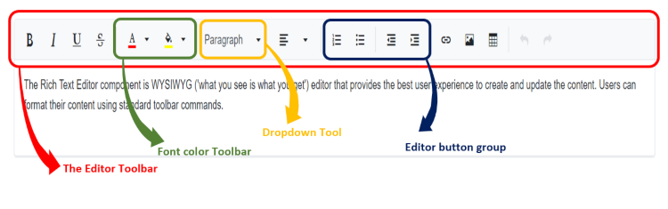

# Toolbar types in Blazor RichTextEditor

The Rich Text Editor toolbar contains a collection of tools such as bold, Italic, and text alignment buttons that are used to format the content. However, in most integrations, you can customize the toolbar configurations easily to suit your needs. The editor allows to configure different types of toolbar using [RichTextEditorToolbarSettings.Type](https://help.syncfusion.com/cr/blazor/Syncfusion.Blazor.RichTextEditor.RichTextEditorToolbarSettings.html#Syncfusion_Blazor_RichTextEditor_RichTextEditorToolbarSettings_Type) property. The types of toolbar are:

1. Expand
2. MultiRow

## Expand Toolbar

The default mode of [ToolbarType.Expand](https://help.syncfusion.com/cr/blazor/Syncfusion.Blazor.RichTextEditor.ToolbarType.html#Syncfusion_Blazor_RichTextEditor_ToolbarType_Expand) to hide the overflowing items in the next row. By clicking the expand arrow, view the overflowing toolbar items.









## Multi-row Toolbar

Set the [ToolbarType.MultiRow](https://help.syncfusion.com/cr/blazor/Syncfusion.Blazor.RichTextEditor.ToolbarType.html#Syncfusion_Blazor_RichTextEditor_ToolbarType_MultiRow) to display the toolbar items in a row-wise format. All toolbar items are visible always.









## Floating Toolbar

By default, toolbar is float at the top of the Rich Text Editor on scrolling. It can be customized by specifying the offset of the floating toolbar from documents top position using [FloatingToolbarOffset](https://help.syncfusion.com/cr/blazor/Syncfusion.Blazor.RichTextEditor.SfRichTextEditor.html#Syncfusion_Blazor_RichTextEditor_SfRichTextEditor_FloatingToolbarOffset).

Enable or disable the floating toolbar using [RichTextEditorToolbarSettings.EnableFloating](https://help.syncfusion.com/cr/blazor/Syncfusion.Blazor.RichTextEditor.RichTextEditorToolbarSettings.html#Syncfusion_Blazor_RichTextEditor_RichTextEditorToolbarSettings_EnableFloating) property.




@using Syncfusion.Blazor.RichTextEditor

<SfRichTextEditor Height="800px">
    <RichTextEditorToolbarSettings EnableFloating="true" />
    
The Rich Text Editor component is WYSIWYG ('what you see is what you get') editor that provides the best user experience to create and update the content. Users can format their content using standard toolbar commands.

</SfRichTextEditor>




## Quick Toolbar 

The Rich text editor has quick toolbars that are open as context-menu on clicking the image, link, and table elements. By default, the below quick toolbar items show on click on the corresponding elements. You can customize the quick toolbar items using the [RichTextEditorQuickToolbarSettings](https://help.syncfusion.com/cr/blazor/Syncfusion.Blazor.RichTextEditor.RichTextEditorQuickToolbarSettings.html) property.

| Target Element | Default Quick Toolbar items |
|----------------|---------|
| Image | 'Replace', 'Align', 'Caption', 'Remove', 'InsertLink', 'Display', 'AltText', 'Dimension'. |
| Link | 'Open', 'Edit', 'UnLink'. |
| Table | 'TableHeader', 'TableRows', 'TableColumns', 'BackgroundColor', 'TableRemove', 'Alignments', 'TableCellVerticalAlign', 'Styles'. |

### Image quick Toolbar

Image tools used to insert an image to the editor and click on the image to easily customize the image using quick toolbar. The quick toolbar has the following items.

| Image Toolabr items | Description |
| --------------------| ------------- |
| Replace | Can replace the image with some other image.  |
| Align | Align the image with left, right and justify |
| Caption | Set the captions for the image |
| Remove | Delete the image |
| InsertLink | Provide the link to the image |
| Display | Display the image as inline or with break |
| AltText | Provide the alternative text for the image if the image is not present in the location |
| Dimension |  "Rotation" related commands are added as custom commands to the image element |









### Link quick Toolbar

You can customize the selected link inside the editor through the quick toolbar.The quick toolbar for link has the following options.

| Tools | Description |
|----------------|--------------------------------------|
| Open | The given link page will open in new window. |
| Edit Link | Edits the link in the Rich Text Editor content. |
| Remove Link | Removes link from the content of Rich Text Editor. |









### Table quick Toolbar

Quick toolbar is opened by clicking the table. It has different sets of commands to be performed on the table which increases the feasibility to edit the table easily.

| Tools | Description |
|----------------|--------------------------------------|
| TableHeader | Header row can be added or removed from the inserted table |
| TableRows| Can be inserted above or below the required table cell |
| TableColumns | Can be inserted to the left or right side of the required table cell |
| BackgroundColor| Can be set each table cell Background Color |
| TableRemove | Delete the entire table |
| Alignments |  Can be aligned the table |
| Styles | Style the table border |









> You can refer to our [Blazor Rich Text Editor](https://www.syncfusion.com/blazor-components/blazor-wysiwyg-rich-text-editor) feature tour page for its groundbreaking feature representations. You can also explore our [Blazor Rich Text Editor](https://blazor.syncfusion.com/demos/rich-text-editor/overview?theme=bootstrap4) example to knows how to render and configure the rich text editor tools.

## See also

* [How to render the toolbar in inline mode](./inline-mode/)