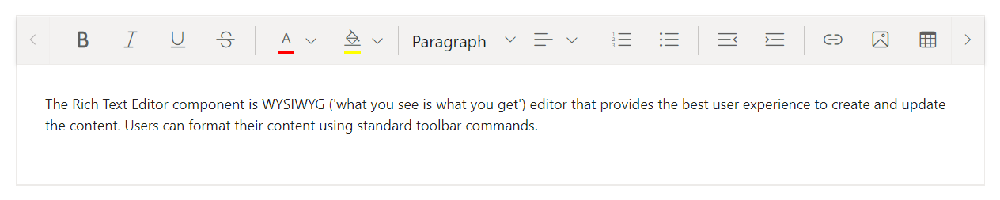
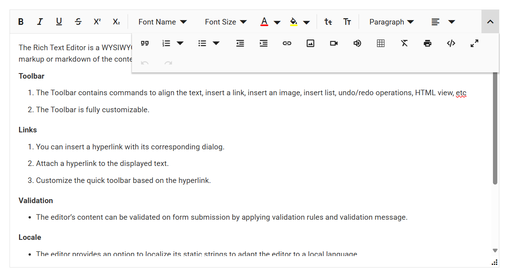

# Toolbar types in Blazor Rich Text Editor

The Rich Text Editor toolbar provides a collection of tools such as Bold, Italic, and text alignment buttons used to format the content.

You can customize the toolbar configurations by using the [RichTextEditorToolbarSettings.Type](https://help.syncfusion.com/cr/blazor/Syncfusion.Blazor.RichTextEditor.RichTextEditorToolbarSettings.html#Syncfusion_Blazor_RichTextEditor_RichTextEditorToolbarSettings_Type) property. The types of toolbar are:

1. Expand
2. MultiRow
3. Scrollable
4. Popup 

## Expand toolbar

The [Expand](https://help.syncfusion.com/cr/blazor/Syncfusion.Blazor.RichTextEditor.ToolbarType.html#Syncfusion_Blazor_RichTextEditor_ToolbarType_Expand) toolbar hides overflowing items in the next line using the  property. By clicking the expand arrow, you can view the overflowing toolbar items. The default mode of toolbar is `Expand`.









## Multi-row toolbar

The [MultiRow]((https://help.syncfusion.com/cr/blazor/Syncfusion.Blazor.RichTextEditor.ToolbarType.html#Syncfusion_Blazor_RichTextEditor_ToolbarType_MultiRow)) toolbar displays items in multiple rows, ensuring all items are always visible.









## Scrollable toolbar

The [Scrollable](https://help.syncfusion.com/cr/blazor/Syncfusion.Blazor.RichTextEditor.ToolbarType.html#Syncfusion_Blazor_RichTextEditor_ToolbarType_Scrollable) toolbar displays items in a single row with horizontal scrolling enabled.









## Configuring a popup toolbar

The [Popup](https://help.syncfusion.com/cr/blazor/Syncfusion.Blazor.RichTextEditor.ToolbarType.html#Syncfusion_Blazor_RichTextEditor_ToolbarType_Popup) toolbar property displays items in a popup container, ideal for limited space or smaller screens.









## Floating toolbar

By default, toolbar is float at the top of the Rich Text Editor on scrolling. It can be customized by specifying the offset of the floating toolbar from documents top position using [FloatingToolbarOffset](https://help.syncfusion.com/cr/blazor/Syncfusion.Blazor.RichTextEditor.SfRichTextEditor.html#Syncfusion_Blazor_RichTextEditor_SfRichTextEditor_FloatingToolbarOffset).

You can enable or disable the floating toolbar using [RichTextEditorToolbarSettings.EnableFloating](https://help.syncfusion.com/cr/blazor/Syncfusion.Blazor.RichTextEditor.RichTextEditorToolbarSettings.html#Syncfusion_Blazor_RichTextEditor_RichTextEditorToolbarSettings_EnableFloating) property.




@using Syncfusion.Blazor.RichTextEditor

<SfRichTextEditor Height="800px">
    <RichTextEditorToolbarSettings EnableFloating="true" />
    
The Rich Text Editor component is WYSIWYG ('what you see is what you get') editor that provides the best user experience to create and update the content. Users can format their content using standard toolbar commands.

</SfRichTextEditor>




## Configuring the toolbar position

The Rich Text Editor allows you to position the toolbar at the top or bottom of the content area, depending on your layout requirements.

By default, the toolbar is displayed at the top of the editor, making all formatting and editing tools immediately accessible above the content.

To move the toolbar to the bottom, use the [RichTextEditorToolbarSettings.Position](https://help.syncfusion.com/cr/blazor/Syncfusion.Blazor.RichTextEditor.RichTextEditorToolbarSettings.html#Syncfusion_Blazor_RichTextEditor_RichTextEditorToolbarSettings_Position) property and set its value to `Bottom`. This places the toolbar below the content area, which can help maintain a cleaner top layout and improve accessibility in certain use cases.









## Quick toolbar

The Rich text editor has quick toolbars that are open as context-menu on clicking the image, link, audio, video and table elements. By default, the below quick toolbar items show on click on the corresponding elements. You can customize the quick toolbar items using the [RichTextEditorQuickToolbarSettings](https://help.syncfusion.com/cr/blazor/Syncfusion.Blazor.RichTextEditor.RichTextEditorQuickToolbarSettings.html) property.

| Target Element | Default Quick Toolbar items |
|----------------|---------|
| [Image](https://help.syncfusion.com/cr/blazor/Syncfusion.Blazor.RichTextEditor.ImageToolbarCommand.html#fields) | Replace, Align, Caption, Remove, InsertLink, Display, AltText, Dimension |
| [Link](https://help.syncfusion.com/cr/blazor/Syncfusion.Blazor.RichTextEditor.LinkToolbarCommand.html#fields) | Open, Edit, UnLink |
| [Table](https://help.syncfusion.com/cr/blazor/Syncfusion.Blazor.RichTextEditor.TableToolbarCommand.html#fields) | TableHeader, TableRows, TableColumns, BackgroundColor, TableRemove, Alignments, TableCellVerticalAlign, Styles |
| [Audio](https://help.syncfusion.com/cr/blazor/Syncfusion.Blazor.RichTextEditor.AudioToolbarCommand.html#fields) | AudioReplace, AudioRemove, AudioLayoutOption |
| [Video](https://help.syncfusion.com/cr/blazor/Syncfusion.Blazor.RichTextEditor.VideoToolbarCommand.html#fields) | VideoReplace, VideoAlign, VideoRemove, VideoLayoutOption, VideoDimension |
| [Text](https://help.syncfusion.com/cr/blazor/Syncfusion.Blazor.RichTextEditor.VideoToolbarCommand.html#fields) |No Default item have it and it support the all toolbar items |

### Image quick toolbar

Customize the inserted image using the [RichTextEditorQuickToolbarSettings.Image](https://help.syncfusion.com/cr/blazor/Syncfusion.Blazor.RichTextEditor.RichTextEditorQuickToolbarSettings.html#Syncfusion_Blazor_RichTextEditor_RichTextEditorQuickToolbarSettings_Image) property. The image quick toolbar has the following items.

| Image Toolabr items | Description |
| --------------------| ------------- |
| [Replace](https://help.syncfusion.com/cr/blazor/Syncfusion.Blazor.RichTextEditor.ImageToolbarCommand.html#Syncfusion_Blazor_RichTextEditor_ImageToolbarCommand_Replace) | Can replace the image with some other image |
| [Align](https://help.syncfusion.com/cr/blazor/Syncfusion.Blazor.RichTextEditor.ImageToolbarCommand.html#Syncfusion_Blazor_RichTextEditor_ImageToolbarCommand_Align) | Align the image with left, right and justify |
| [Caption](https://help.syncfusion.com/cr/blazor/Syncfusion.Blazor.RichTextEditor.ImageToolbarCommand.html#Syncfusion_Blazor_RichTextEditor_ImageToolbarCommand_Caption) | Set the captions for the image |
| [Remove](https://help.syncfusion.com/cr/blazor/Syncfusion.Blazor.RichTextEditor.ImageToolbarCommand.html#Syncfusion_Blazor_RichTextEditor_ImageToolbarCommand_Remove) | Delete the image |
| [InsertLink](https://help.syncfusion.com/cr/blazor/Syncfusion.Blazor.RichTextEditor.ImageToolbarCommand.html#Syncfusion_Blazor_RichTextEditor_ImageToolbarCommand_InsertLink) | Provide the link to the image |
| [Display](https://help.syncfusion.com/cr/blazor/Syncfusion.Blazor.RichTextEditor.ImageToolbarCommand.html#Syncfusion_Blazor_RichTextEditor_ImageToolbarCommand_Display) | Display the image as inline or with break |
| [AltText](https://help.syncfusion.com/cr/blazor/Syncfusion.Blazor.RichTextEditor.ImageToolbarCommand.html#Syncfusion_Blazor_RichTextEditor_ImageToolbarCommand_AltText) | Provide the alternative text for the image if the image is not present in the location |
| [Dimension](https://help.syncfusion.com/cr/blazor/Syncfusion.Blazor.RichTextEditor.ImageToolbarCommand.html#Syncfusion_Blazor_RichTextEditor_ImageToolbarCommand_Dimension) | Can change an image dimensions, such as its height and width |









### Link quick toolbar

Customize the selected link using the [RichTextEditorQuickToolbarSettings.Link](https://help.syncfusion.com/cr/blazor/Syncfusion.Blazor.RichTextEditor.RichTextEditorQuickToolbarSettings.html#Syncfusion_Blazor_RichTextEditor_RichTextEditorQuickToolbarSettings_Link) property. The quick toolbar for link has the following options.

| Tools | Description |
|----------------|--------------------------------------|
| [Open](https://help.syncfusion.com/cr/blazor/Syncfusion.Blazor.RichTextEditor.LinkToolbarCommand.html#Syncfusion_Blazor_RichTextEditor_LinkToolbarCommand_Open) | The given link page will open in new window |
| [Edit](https://help.syncfusion.com/cr/blazor/Syncfusion.Blazor.RichTextEditor.LinkToolbarCommand.html#Syncfusion_Blazor_RichTextEditor_LinkToolbarCommand_Edit) | Edits the link in the Rich Text Editor content |
| [UnLink](https://help.syncfusion.com/cr/blazor/Syncfusion.Blazor.RichTextEditor.LinkToolbarCommand.html#Syncfusion_Blazor_RichTextEditor_LinkToolbarCommand_UnLink) | Removes link from the content of Rich Text Editor |









### Table quick toolbar

The table quick toolbar appears when clicking on a table. You can customize the table by using the [RichTextEditorQuickToolbarSettings.Table](https://help.syncfusion.com/cr/blazor/Syncfusion.Blazor.RichTextEditor.RichTextEditorQuickToolbarSettings.html#Syncfusion_Blazor_RichTextEditor_RichTextEditorQuickToolbarSettings_Table) property. It has different sets of commands to be performed on the table which increases the feasibility to edit the table easily.

| Tools | Description |
|----------------|--------------------------------------|
| [TableHeader](https://help.syncfusion.com/cr/blazor/Syncfusion.Blazor.RichTextEditor.TableToolbarCommand.html#Syncfusion_Blazor_RichTextEditor_TableToolbarCommand_TableHeader) | Header row can be added or removed from the inserted table |
| [TableRows](https://help.syncfusion.com/cr/blazor/Syncfusion.Blazor.RichTextEditor.TableToolbarCommand.html#Syncfusion_Blazor_RichTextEditor_TableToolbarCommand_TableRows) | Can be inserted above or below the required table cell |
| [TableColumns](https://help.syncfusion.com/cr/blazor/Syncfusion.Blazor.RichTextEditor.TableToolbarCommand.html#Syncfusion_Blazor_RichTextEditor_TableToolbarCommand_TableColumns) | Can be inserted to the left or right side of the required table cell |
| [BackgroundColor](https://help.syncfusion.com/cr/blazor/Syncfusion.Blazor.RichTextEditor.TableToolbarCommand.html#Syncfusion_Blazor_RichTextEditor_TableToolbarCommand_BackgroundColor) | Can be set each table cell background color |
| [TableRemove](https://help.syncfusion.com/cr/blazor/Syncfusion.Blazor.RichTextEditor.TableToolbarCommand.html#Syncfusion_Blazor_RichTextEditor_TableToolbarCommand_TableRemove) | Can be delete the entire table from editor |
| [Alignments](https://help.syncfusion.com/cr/blazor/Syncfusion.Blazor.RichTextEditor.TableToolbarCommand.html#Syncfusion_Blazor_RichTextEditor_TableToolbarCommand_Alignments) |  Can be aligned the table content|
| [Styles](https://help.syncfusion.com/cr/blazor/Syncfusion.Blazor.RichTextEditor.TableToolbarCommand.html#Syncfusion_Blazor_RichTextEditor_TableToolbarCommand_Alignments) | Can be style the table border |









### Audio quick toolbar

Customize the inserted audio using the [RichTextEditorQuickToolbarSettings.Audio](https://help.syncfusion.com/cr/blazor/Syncfusion.Blazor.RichTextEditor.RichTextEditorQuickToolbarSettings.html#Syncfusion_Blazor_RichTextEditor_RichTextEditorQuickToolbarSettings_Audio) property. The audio quick toolbar has the following items.

| Tools | Description |
|----------------|--------------------------------------|
| [AudioReplace](https://help.syncfusion.com/cr/blazor/Syncfusion.Blazor.RichTextEditor.AudioToolbarCommand.html#Syncfusion_Blazor_RichTextEditor_AudioToolbarCommand_AudioReplace) | Can replace the audio with some other audio |
| [AudioRemove](https://help.syncfusion.com/cr/blazor/Syncfusion.Blazor.RichTextEditor.AudioToolbarCommand.html#Syncfusion_Blazor_RichTextEditor_AudioToolbarCommand_AudioRemove) | Delete the audio |
| [AudioLayoutOption](https://help.syncfusion.com/cr/blazor/Syncfusion.Blazor.RichTextEditor.AudioToolbarCommand.html#Syncfusion_Blazor_RichTextEditor_AudioToolbarCommand_AudioLayoutOption) | Display the audio as inline or with break |









### Video quick toolbar

Customize the inserted video using the [RichTextEditorQuickToolbarSettings.video](https://help.syncfusion.com/cr/blazor/Syncfusion.Blazor.RichTextEditor.RichTextEditorQuickToolbarSettings.html#Syncfusion_Blazor_RichTextEditor_RichTextEditorQuickToolbarSettings_Video) property. The video quick toolbar has the following items.

| Tools | Description |
|----------------|--------------------------------------|
| [VideoReplace](https://help.syncfusion.com/cr/blazor/Syncfusion.Blazor.RichTextEditor.VideoToolbarCommand.html#Syncfusion_Blazor_RichTextEditor_VideoToolbarCommand_VideoReplace) | Can replace the video with some other video |
| [VideoAlign](https://help.syncfusion.com/cr/blazor/Syncfusion.Blazor.RichTextEditor.VideoToolbarCommand.html#Syncfusion_Blazor_RichTextEditor_VideoToolbarCommand_VideoAlign) | Align the image with left, right and center |
| [VideoRemove](https://help.syncfusion.com/cr/blazor/Syncfusion.Blazor.RichTextEditor.VideoToolbarCommand.html#Syncfusion_Blazor_RichTextEditor_VideoToolbarCommand_VideoRemove) | Delete the video |
| [VideoLayoutOption](https://help.syncfusion.com/cr/blazor/Syncfusion.Blazor.RichTextEditor.VideoToolbarCommand.html#Syncfusion_Blazor_RichTextEditor_VideoToolbarCommand_VideoLayoutOption) | Display the video as inline or with break |
| [VideoDimension](https://help.syncfusion.com/cr/blazor/Syncfusion.Blazor.RichTextEditor.VideoToolbarCommand.html#Syncfusion_Blazor_RichTextEditor_VideoToolbarCommand_VideoDimension) | Can change an video dimensions, such as its height and width|









N> You can refer to our [Blazor Rich Text Editor](https://www.syncfusion.com/blazor-components/blazor-rich-text-editor) feature tour page for its groundbreaking feature representations. You can also explore our [Blazor Rich Text Editor](https://blazor.syncfusion.com/demos/rich-text-editor/overview?theme=bootstrap5) example to knows how to render and configure the rich text editor tools.

### Text quick toolbar

By activating the [RichTextEditorQuickToolbarSettings.Text](https://help.syncfusion.com/cr/blazor/Syncfusion.Blazor.RichTextEditor.RichTextEditorQuickToolbarSettings.html#Syncfusion_Blazor_RichTextEditor_RichTextEditorQuickToolbarSettings_Text) property, the Rich Text Editor offers the ability to display a quick toolbar when needed. The floating toolbar shows up when you select or focus on editable text. By modifying the `RichTextEditorQuickToolbarSettings.Text` property, the commands shown in the text quick toolbar can be changed.




private List<ToolbarItemModel> textQuickToolbarItems = new List<ToolbarItemModel>()
    {
        new ToolbarItemModel() { Command = ToolbarCommand.Formats },
        new ToolbarItemModel() { Command = ToolbarCommand.Separator },
        new ToolbarItemModel() { Command = ToolbarCommand.Bold },
        new ToolbarItemModel() { Command = ToolbarCommand.Italic },
        new ToolbarItemModel() { Command = ToolbarCommand.FontColor },
        new ToolbarItemModel() { Command = ToolbarCommand.BackgroundColor },
        new ToolbarItemModel() { Command = ToolbarCommand.Separator },
        new ToolbarItemModel() { Command = ToolbarCommand.CreateLink },
        new ToolbarItemModel() { Command = ToolbarCommand.Image },
        new ToolbarItemModel() { Command = ToolbarCommand.CreateTable },
        new ToolbarItemModel() { Command = ToolbarCommand.Blockquote },
        new ToolbarItemModel() { Command = ToolbarCommand.Separator },
        new ToolbarItemModel() { Command = ToolbarCommand.UnorderedList },
        new ToolbarItemModel() { Command = ToolbarCommand.OrderedList },
        new ToolbarItemModel() { Command = ToolbarCommand.Indent },
        new ToolbarItemModel() { Command = ToolbarCommand.Outdent },
    };




Refer to the following link for a complete list of available toolbar items:

https://blazor.syncfusion.com/documentation/rich-text-editor/tools/built-in-tools




<SfRichTextEditor>
    <RichTextEditorQuickToolbarSettings Text="@TextQuickToolbarItems"></RichTextEditorQuickToolbarSettings>
    
The Rich Text Editor component is WYSIWYG ('what you see is what you get') editor that provides the best user experience to create and update the content. Users can format their content using standard toolbar commands.

</SfRichTextEditor>

@code {
    private List<ToolbarItemModel> TextQuickToolbarItems = new List<ToolbarItemModel>()
    {
        new ToolbarItemModel() { Command = ToolbarCommand.Formats },
        new ToolbarItemModel() { Command = ToolbarCommand.Separator },
        new ToolbarItemModel() { Command = ToolbarCommand.Bold },
        new ToolbarItemModel() { Command = ToolbarCommand.Italic },
        new ToolbarItemModel() { Command = ToolbarCommand.FontColor },
        new ToolbarItemModel() { Command = ToolbarCommand.BackgroundColor },
        new ToolbarItemModel() { Command = ToolbarCommand.Separator },
        new ToolbarItemModel() { Command = ToolbarCommand.CreateLink },
        new ToolbarItemModel() { Command = ToolbarCommand.Image },
        new ToolbarItemModel() { Command = ToolbarCommand.CreateTable },
        new ToolbarItemModel() { Command = ToolbarCommand.Blockquote },
        new ToolbarItemModel() { Command = ToolbarCommand.Separator },
        new ToolbarItemModel() { Command = ToolbarCommand.UnorderedList },
        new ToolbarItemModel() { Command = ToolbarCommand.OrderedList },
        new ToolbarItemModel() { Command = ToolbarCommand.Indent },
        new ToolbarItemModel() { Command = ToolbarCommand.Outdent },
    };
}




## See also

* [How to render the toolbar in inline mode](./inline-mode)
