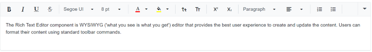
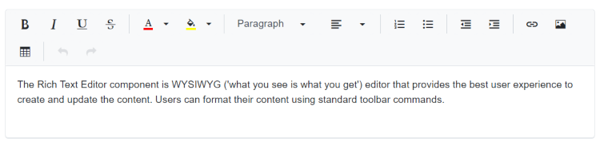
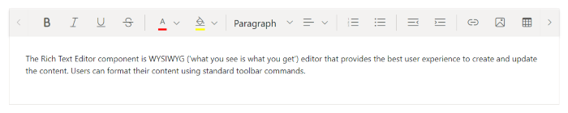
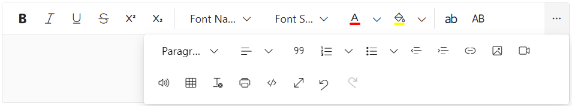
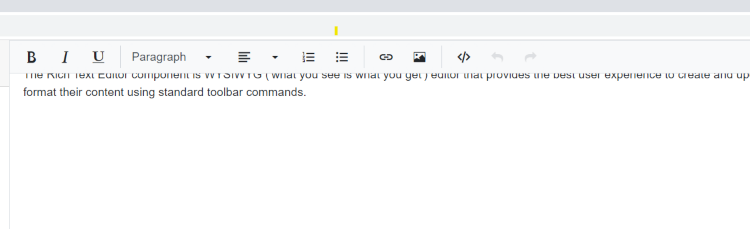

# Toolbar types in Blazor Rich Text Editor

The Rich Text Editor toolbar provides a collection of tools such as Bold, Italic, and text alignment buttons used to format the content.

You can customize the toolbar configurations by using the [RichTextEditorToolbarSettings.Type](https://help.syncfusion.com/cr/blazor/Syncfusion.Blazor.RichTextEditor.RichTextEditorToolbarSettings.html#Syncfusion_Blazor_RichTextEditor_RichTextEditorToolbarSettings_Type) property. The types of toolbar are:

1. Expand
2. MultiRow
3. Scrollable
4. Popup 

## Expand toolbar

The [Expand](https://help.syncfusion.com/cr/blazor/Syncfusion.Blazor.RichTextEditor.ToolbarType.html#Syncfusion_Blazor_RichTextEditor_ToolbarType_Expand) toolbar hides overflowing items in the next line using the  property. By clicking the expand arrow, you can view the overflowing toolbar items. The default mode of toolbar is `Expand`.









## Multi-row toolbar

The [MultiRow](https://help.syncfusion.com/cr/blazor/Syncfusion.Blazor.RichTextEditor.ToolbarType.html#Syncfusion_Blazor_RichTextEditor_ToolbarType_MultiRow) toolbar displays items in multiple rows, ensuring all items are always visible.









## Scrollable toolbar

The [Scrollable](https://help.syncfusion.com/cr/blazor/Syncfusion.Blazor.RichTextEditor.ToolbarType.html#Syncfusion_Blazor_RichTextEditor_ToolbarType_Scrollable) toolbar displays items in a single row with horizontal scrolling enabled.









## Configuring a popup toolbar

The [Popup](https://help.syncfusion.com/cr/blazor/Syncfusion.Blazor.RichTextEditor.ToolbarType.html#Syncfusion_Blazor_RichTextEditor_ToolbarType_Popup) toolbar property displays items in a popup container, ideal for limited space or smaller screens.









## Floating toolbar

By default, toolbar is float at the top of the Rich Text Editor on scrolling. It can be customized by specifying the offset of the floating toolbar from documents top position using [FloatingToolbarOffset](https://help.syncfusion.com/cr/blazor/Syncfusion.Blazor.RichTextEditor.SfRichTextEditor.html#Syncfusion_Blazor_RichTextEditor_SfRichTextEditor_FloatingToolbarOffset).

You can enable or disable the floating toolbar using [RichTextEditorToolbarSettings.EnableFloating](https://help.syncfusion.com/cr/blazor/Syncfusion.Blazor.RichTextEditor.RichTextEditorToolbarSettings.html#Syncfusion_Blazor_RichTextEditor_RichTextEditorToolbarSettings_EnableFloating) property.




@using Syncfusion.Blazor.RichTextEditor

<SfRichTextEditor Height="800px">
    <RichTextEditorToolbarSettings EnableFloating="true" />
    
The Rich Text Editor component is WYSIWYG ('what you see is what you get') editor that provides the best user experience to create and update the content. Users can format their content using standard toolbar commands.

</SfRichTextEditor>




## See also

* [Customizing Rich Text Editor Toolbar Styles](../style#customizing-editor-toolbar)
* [Implementing Inline Editing](../inline-mode)
* [Customizing Accessibility Shortcut Keys](../accessibility#keyboard-navigation)