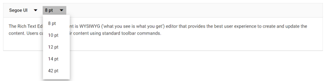
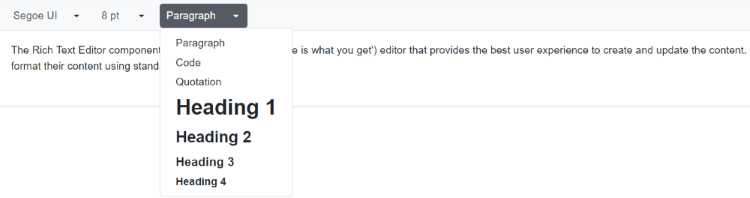
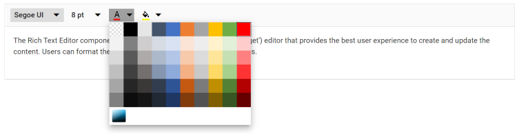
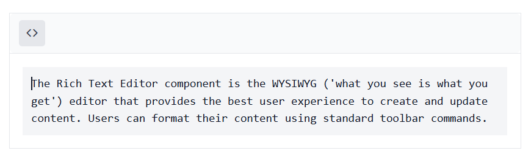
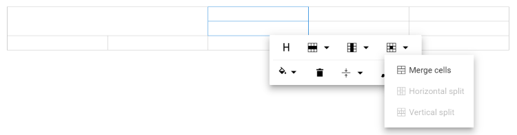
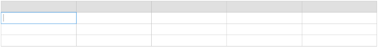
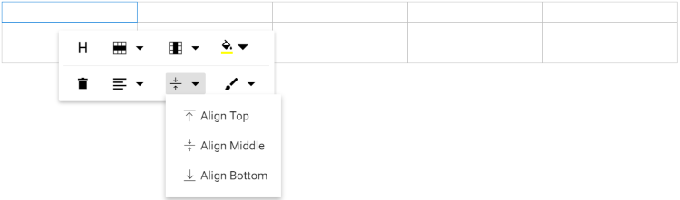
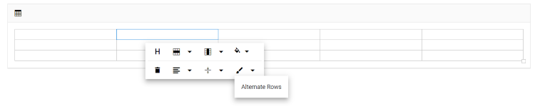

# Tools in Blazor RichTextEditor Component

## Build-in Tools

The following table lists the tools available in the toolbar.

| Name | Icons | Summary | Initialization &nbsp; &nbsp; &nbsp; &nbsp; &nbsp;  |
|----------------|---------|---------|------------------------------------------|
| Undo | | Allows to undo the actions.|public List&lt;ToolbarItemModel&gt; Items = new List&lt;ToolbarItemModel&gt;() {<br>&nbsp;&nbsp;&nbsp;&nbsp;new ToolbarItemModel() { Command = ToolbarCommand.Undo } <br> }; |
| Redo |  | Allows to redo the actions.|public List&lt;ToolbarItemModel&gt; Items = new List&lt;ToolbarItemModel&gt;() {<br>&nbsp;&nbsp;&nbsp;&nbsp;new ToolbarItemModel() { Command = ToolbarCommand.Redo } <br> }; |
| Alignment |  | Aligns the content with left, center, and right margin.|public List&lt;ToolbarItemModel&gt; Items = new List&lt;ToolbarItemModel&gt;() {<br>&nbsp;&nbsp;&nbsp;&nbsp;new ToolbarItemModel() { Command = ToolbarCommand.Alignments } <br> }; |
| OrderedList |  | Creates a new list item(numbered). |public List&lt;ToolbarItemModel&gt; Items = new List&lt;ToolbarItemModel&gt;() {<br>&nbsp;&nbsp;&nbsp;&nbsp;new ToolbarItemModel() { Command = ToolbarCommand.OrderedList } <br> }; |
| UnorderedList |  | Creates a new list item(bulleted). |public List&lt;ToolbarItemModel&gt; Items = new List&lt;ToolbarItemModel&gt;() {<br>&nbsp;&nbsp;&nbsp;&nbsp;new ToolbarItemModel() { Command = ToolbarCommand.UnorderedList } <br> }; |
| Indent |  | Allows to increase the indent level of the content.|public List&lt;ToolbarItemModel&gt; Items = new List&lt;ToolbarItemModel&gt;() {<br>&nbsp;&nbsp;&nbsp;&nbsp;new ToolbarItemModel() { Command = ToolbarCommand.Indent } <br> };|
| Outdent |  | Allows to decrease the indent level of the content.|public List&lt;ToolbarItemModel&gt; Items = new List&lt;ToolbarItemModel&gt;() {<br>&nbsp;&nbsp;&nbsp;&nbsp;new ToolbarItemModel() { Command = ToolbarCommand.Outdent } <br> };|
| Hyperlink |  | Creates a hyperlink to a text or image to a specific location in the content.|public List&lt;ToolbarItemModel&gt; Items = new List&lt;ToolbarItemModel&gt;() {<br>&nbsp;&nbsp;&nbsp;&nbsp;new ToolbarItemModel() { Command = ToolbarCommand.CreateLink } <br> };|
| Images |  | Inserts an image from an online source or local computer. |public List&lt;ToolbarItemModel&gt; Items = new List&lt;ToolbarItemModel&gt;() {<br>&nbsp;&nbsp;&nbsp;&nbsp;new ToolbarItemModel() { Command = ToolbarCommand.Image } <br> }; |
| LowerCase |  | Changes the case of selected text to lower in the content. |public List&lt;ToolbarItemModel&gt; Items = new List&lt;ToolbarItemModel&gt;() {<br>&nbsp;&nbsp;&nbsp;&nbsp;new ToolbarItemModel() { Command = ToolbarCommand.LowerCase } <br> }; |
| UpperCase |  | Changes the case of selected text to upper  in the content.|public List&lt;ToolbarItemModel&gt; Items = new List&lt;ToolbarItemModel&gt;() {<br>&nbsp;&nbsp;&nbsp;&nbsp;new ToolbarItemModel() { Command = ToolbarCommand.UpperCase } <br> }; |
| SubScript |  | Makes the selected text as subscript (lower).|public List&lt;ToolbarItemModel&gt; Items = new List&lt;ToolbarItemModel&gt;() {<br>&nbsp;&nbsp;&nbsp;&nbsp;new ToolbarItemModel() { Command = ToolbarCommand.SubScript } <br> }; |
| SuperScript |  | Makes the selected text as superscript (higher).|public List&lt;ToolbarItemModel&gt; Items = new List&lt;ToolbarItemModel&gt;() {<br>&nbsp;&nbsp;&nbsp;&nbsp;new ToolbarItemModel() { Command = ToolbarCommand.SuperScript } <br> }; |
| Print |  | Allows to print the editor content. |public List&lt;ToolbarItemModel&gt; Items = new List&lt;ToolbarItemModel&gt;() {<br>&nbsp;&nbsp;&nbsp;&nbsp;new ToolbarItemModel() { Command = ToolbarCommand.Print } <br> }; |
| FontName |  | Defines the fonts that appear under the Font Family DropDownList from the Rich Text Editor's toolbar. |public List&lt;ToolbarItemModel&gt; Items = new List&lt;ToolbarItemModel&gt;() {<br>&nbsp;&nbsp;&nbsp;&nbsp;new ToolbarItemModel() { Command = ToolbarCommand.FontName } <br> };|
| FontSize |  | Defines the font sizes that appear under the Font Size DropDownList from the Rich Text Editor's toolbar.|public List&lt;ToolbarItemModel&gt; Items = new List&lt;ToolbarItemModel&gt;() {<br>&nbsp;&nbsp;&nbsp;&nbsp;new ToolbarItemModel() { Command = ToolbarCommand.FontSize } <br> };|
| FontColor |  | Specifies an array of colors can be used in the colors popup for font color.|public List&lt;ToolbarItemModel&gt; Items = new List&lt;ToolbarItemModel&gt;() {<br>&nbsp;&nbsp;&nbsp;&nbsp;new ToolbarItemModel() { Command = ToolbarCommand.FontColor } <br> }; |
| BackgroundColor |  | Specifies an array of colors can be used in the colors popup for background color.|public List&lt;ToolbarItemModel&gt; Items = new List&lt;ToolbarItemModel&gt;() {<br>&nbsp;&nbsp;&nbsp;&nbsp;new ToolbarItemModel() { Command = ToolbarCommand.BackgroundColor } <br> }; |
| Format |  | An Object with the options that will appear in the Paragraph Format dropdown from the toolbar. |public List&lt;ToolbarItemModel&gt; Items = new List&lt;ToolbarItemModel&gt;() {<br>&nbsp;&nbsp;&nbsp;&nbsp;new ToolbarItemModel() { Command = ToolbarCommand.Formats } <br> }; |
| StrikeThrough |  | Applies double line strike through formatting for the selected text. |public List&lt;ToolbarItemModel&gt; Items = new List&lt;ToolbarItemModel&gt;() {<br>&nbsp;&nbsp;&nbsp;&nbsp;new ToolbarItemModel() { Command = ToolbarCommand.StrikeThrough } <br> }; |
| ClearFormat |  | The clear format tool is useful to remove all formatting styles (such as bold, italic, underline, color, superscript, subscript, and more) from currently selected text. As a result, all the text formatting will be cleared and return to its default formatting styles.|public List&lt;ToolbarItemModel&gt; Items = new List&lt;ToolbarItemModel&gt;() {<br>&nbsp;&nbsp;&nbsp;&nbsp;new ToolbarItemModel() { Command = ToolbarCommand.ClearFormat } <br> }; |
| FullScreen |  | Stretches the editor to the maximum width and height of the browser window.|public List&lt;ToolbarItemModel&gt; Items = new List&lt;ToolbarItemModel&gt;() {<br>&nbsp;&nbsp;&nbsp;&nbsp;new ToolbarItemModel() { Command = ToolbarCommand.FullScreen } <br> }; |
| SourceCode |   | Rich Text Editor includes the ability for users to directly edit HTML code via "Source View". If you made any modification in Source view directly, synchronize with Design view.|public List&lt;ToolbarItemModel&gt; Items = new List&lt;ToolbarItemModel&gt;() {<br>&nbsp;&nbsp;&nbsp;&nbsp;new ToolbarItemModel() { Command = ToolbarCommand.SourceCode } <br> }; |
| NumberFormatList |  | Allows to create list items with various list style types(numbered). |public List&lt;ToolbarItemModel&gt; Items = new List&lt;ToolbarItemModel&gt;() {<br>&nbsp;&nbsp;&nbsp;&nbsp;new ToolbarItemModel() { Command = ToolbarCommand.NumberFormatList } <br> }; |
| BulletFormatList |  | Allows to create list items with various list style types(bulleted). |public List&lt;ToolbarItemModel&gt; Items = new List&lt;ToolbarItemModel&gt;() {<br>&nbsp;&nbsp;&nbsp;&nbsp;new ToolbarItemModel() { Command = ToolbarCommand.BulletFormatList } <br> }; |

By default, tools will be arranged in the following order.

> new List&lt;ToolbarItemModel&gt;()<br>{<br>&nbsp;&nbsp;&nbsp;&nbsp;new ToolbarItemModel() { Command = ToolbarCommand.Bold },<br>&nbsp;&nbsp;&nbsp;&nbsp;new ToolbarItemModel() { Command = ToolbarCommand.Italic },<br>&nbsp;&nbsp;&nbsp;&nbsp;new ToolbarItemModel() { Command = ToolbarCommand.Underline },<br>&nbsp;&nbsp;&nbsp;&nbsp;new ToolbarItemModel() { Command = ToolbarCommand.Separator },<br>&nbsp;&nbsp;&nbsp;&nbsp;new ToolbarItemModel() { Command = ToolbarCommand.Formats },<br>&nbsp;&nbsp;&nbsp;&nbsp;new ToolbarItemModel() { Command = ToolbarCommand.Alignments },<br>&nbsp;&nbsp;&nbsp;&nbsp;new ToolbarItemModel() { Command = ToolbarCommand.OrderedList },<br>&nbsp;&nbsp;&nbsp;&nbsp;new ToolbarItemModel() { Command = ToolbarCommand.UnorderedList },<br>&nbsp;&nbsp;&nbsp;&nbsp;new ToolbarItemModel() { Command = ToolbarCommand.Separator },<br>&nbsp;&nbsp;&nbsp;&nbsp;new ToolbarItemModel() { Command = ToolbarCommand.CreateLink },<br>&nbsp;&nbsp;&nbsp;&nbsp;new ToolbarItemModel() { Command = ToolbarCommand.Image },<br>&nbsp;&nbsp;&nbsp;&nbsp;new ToolbarItemModel() { Command = ToolbarCommand.Separator },<br>&nbsp;&nbsp;&nbsp;&nbsp;new ToolbarItemModel() { Command = ToolbarCommand.SourceCode },<br>&nbsp;&nbsp;&nbsp;&nbsp;new ToolbarItemModel() { Command = ToolbarCommand.Undo },<br>&nbsp;&nbsp;&nbsp;&nbsp;new ToolbarItemModel() { Command = ToolbarCommand.Redo }<br>};

The tools order can be customized as your application requirement. If you are not specifying any tools order, the editor will create the toolbar with default items.

### Removing built-in tool from Toolbar

The Rich Text Editor allows to configure your own tools to its toolbar using [`RichTextEditorCustomToolbarItems`](https://help.syncfusion.com/cr/blazor/Syncfusion.Blazor.RichTextEditor.RichTextEditorCustomToolbarItems.html) tag directive with in a [`RichTextEditorToolbarSettings`](https://help.syncfusion.com/cr/blazor/Syncfusion.Blazor.RichTextEditor.RichTextEditorToolbarSettings.html). The tools can be plain text, icon, HTML template. You can also define the order and group where the tool should be included.

This sample shows how to add your own tools to toolbar of the Rich Text Editor. The `Ω` command is added to insert special characters in the editor.

Refer to the following code snippet for custom tool with tooltip text which will be included in `Items` field of [`RichTextEditorToolbarSettings`](https://help.syncfusion.com/cr/blazor/Syncfusion.Blazor.RichTextEditor.RichTextEditorToolbarSettings.html) property.




@using Syncfusion.Blazor.Buttons
@using Syncfusion.Blazor.RichTextEditor

<SfRichTextEditor>
    <RichTextEditorToolbarSettings Items="@Tools">
        <RichTextEditorCustomToolbarItems>
            <RichTextEditorCustomToolbarItem Name="Symbol">
                <Template>
                    <SfButton @onclick="ClickHandler">Ω</SfButton>
                </Template>
            </RichTextEditorCustomToolbarItem>
        </RichTextEditorCustomToolbarItems>
    </RichTextEditorToolbarSettings>
    <p>The Rich Text Editor component is WYSIWYG ('what you see is what you get') editor that provides the best user experience to create and update the content. Users can format their content using standard toolbar commands.</p>
</SfRichTextEditor>

@code {
    private List<ToolbarItemModel> Tools = new List<ToolbarItemModel>()
    {
        new ToolbarItemModel() { Command = ToolbarCommand.Bold },
        new ToolbarItemModel() { Command = ToolbarCommand.Italic },
        new ToolbarItemModel() { Command = ToolbarCommand.Underline },
        new ToolbarItemModel() { Command = ToolbarCommand.Separator },
        new ToolbarItemModel() { Name = "Symbol", TooltipText = "Insert Symbol" },
        new ToolbarItemModel() { Command = ToolbarCommand.SourceCode },
        new ToolbarItemModel() { Command = ToolbarCommand.FullScreen }
    };
    private void ClickHandler()
    {
        //Perform your action here
    }
}




## Styling Tools

### Font family

By default, the editor is initialized with default items of font family. To change it, select a different font family from the drop-down in the editor’s toolbar.

To apply different font style for section of the content, select the text that you would like to change, and select a required font style from the drop-down to apply the changes to the selected text.

### Buil-in font family

The following table, lists the default font name and width of the `FontName` dropdown and available list of font names.

| Default Key | Default Value |
|-----|--------------------------------------|
| Default | null |
| Width | 65px|
| Items | new List&lt;DropDownItemModel&gt;()<br>{<br>&nbsp;&nbsp;&nbsp;&nbsp;new DropDownItemModel() { Text = "Segoe UI", Value = "Segoe UI" },<br>&nbsp;&nbsp;&nbsp;&nbsp;new DropDownItemModel() { Text = "Arial", Value = "Arial,Helvetica,sans-serif" },<br>&nbsp;&nbsp;&nbsp;&nbsp;new DropDownItemModel() { Text = "Georgia", Value = "Georgia,serif" },<br>&nbsp;&nbsp;&nbsp;&nbsp;new DropDownItemModel() { Text = "Impact", Value = "Impact,Charcoal,sans-serif" },<br>&nbsp;&nbsp;&nbsp;&nbsp;new DropDownItemModel() { Text = "Tahoma", Value = "Tahoma,Geneva,sans-serif" },<br>&nbsp;&nbsp;&nbsp;&nbsp;new DropDownItemModel() { Text = "Times New Roman", Value = "Times New Roman,Times,serif" },<br>&nbsp;&nbsp;&nbsp;&nbsp;new DropDownItemModel() { Text = "Verdana", Value = "Verdana,Geneva,sans-serif"}<br>}; |











### Custom font family

Rich Text Editor provides support to custom fonts with existing list.
If you want to add additional font names and font sizes to font drop-down, pass the font information as `List<DropDownItemModel>` data to the `Items` field of [`RichTextEditorFontFamily`](https://help.syncfusion.com/cr/blazor/Syncfusion.Blazor.RichTextEditor.RichTextEditorFontFamily.html) tag.










### Google fonts support

To use web fonts in Rich Text Editor, the web fonts need not be present in the local machine. To add the web fonts to Rich Text Editor, refer to the web font links and add the font names in the [RichTextEditorFontFamily](https://help.syncfusion.com/cr/blazor/Syncfusion.Blazor.RichTextEditor.RichTextEditorFontFamily.html) tag.


The following font style links are referred in the page.

### Blazor Server App

* For **.NET 6** app, Refer script in the `<head>` of the **~/Pages/_Layout.cshtml** file.

* For **.NET 5 and .NET 3.X** app, Refer script in the `<head>` of the **~/Pages/_Host.cshtml** file.




<head>
    <link rel="stylesheet" href="http://fonts.googleapis.com/css?family=Roboto">
    <link rel="stylesheet" href="http://fonts.googleapis.com/css?family=Great+Vibes">
</head>





<head>
    <link rel="stylesheet" href="http://fonts.googleapis.com/css?family=Roboto">
    <link rel="stylesheet" href="http://fonts.googleapis.com/css?family=Great+Vibes">
</head>




### Blazor WebAssembly App

For Blazor WebAssembly App, Refer script in the `<head>` of the **~/index.html** file.




<head>
    <link rel="stylesheet" href="http://fonts.googleapis.com/css?family=Roboto">
    <link rel="stylesheet" href="http://fonts.googleapis.com/css?family=Great+Vibes">
</head>













### Font size

By default, the editor is initialized with default items of font size. To change it, select a different font size from the drop-down in the editor’s toolbar.

To apply different font style for section of the content, select the text that you would like to change, and select a required font style from the drop-down to apply the changes to the selected text.

### Build-in font size

The following table list the default font size and width of the [`FontSize`](https://help.syncfusion.com/cr/blazor/Syncfusion.Blazor.RichTextEditor.RichTextEditorFontSize.html) dropdown and available list of font size.

| Default Key | Default Value |
|-----|--------------------------------------|
| Default | null |
| Width | 35px.|
| Items | new List&lt;DropDownItemModel&gt;()<br>{<br>&nbsp;&nbsp;&nbsp;&nbsp;new DropDownItemModel() { Text = "8 pt", Value = "8pt" },<br>&nbsp;&nbsp;&nbsp;&nbsp;new DropDownItemModel() { Text = "10 pt", Value = "10pt" },<br>&nbsp;&nbsp;&nbsp;&nbsp;new DropDownItemModel() { Text = "12 pt", Value = "12pt" },<br>&nbsp;&nbsp;&nbsp;&nbsp;new DropDownItemModel() { Text = "14 pt", Value = "14pt" },<br>&nbsp;&nbsp;&nbsp;&nbsp;new DropDownItemModel() { Text = "18 pt", Value = "18pt" },<br>&nbsp;&nbsp;&nbsp;&nbsp;new DropDownItemModel() { Text = "24 pt", Value = "24pt" },<br>&nbsp;&nbsp;&nbsp;&nbsp;new DropDownItemModel() { Text = "36 pt", Value = "36pt" }<br>}; |










### Custom font size

Rich Text Editor provides support to custom font size with existing list.
If you want to add additional font sizes to font drop-down, pass the font information as `List<DropDownItemModel>` data to the `Items` field of [`RichTextEditorFontSize`](https://help.syncfusion.com/cr/blazor/Syncfusion.Blazor.RichTextEditor.RichTextEditorFontSize.html) tag.











### Formats

By default, the editor is initialized with default items of formats. To change it, select a different format from the drop-down in the editor’s toolbar.

To apply different format style for section of the content, select a required format from the drop-down to apply the changes to the selection.

The following table, lists the default format name and width of the [`Format`](https://help.syncfusion.com/cr/blazor/Syncfusion.Blazor.RichTextEditor.RichTextEditorFormat.html#properties) dropdown and available list of format names.

| Default Key | Default Value |
|-----|--------------------------------------|
| Default | null |
| Width | 65px|
| Items | new List&lt;DropDownItemModel&gt;()<br>{<br>&nbsp;&nbsp;&nbsp;&nbsp;new DropDownItemModel() { Text = "Paragraph", Value = "P" },<br>&nbsp;&nbsp;&nbsp;&nbsp;new DropDownItemModel() { Text = "Code", Value = "Pre" },<br>&nbsp;&nbsp;&nbsp;&nbsp;new DropDownItemModel() { Text = "Quotation", Value = "BlockQuote" },<br>&nbsp;&nbsp;&nbsp;&nbsp;new DropDownItemModel() { Text = "Heading 1", Value = "H1" },<br>&nbsp;&nbsp;&nbsp;&nbsp;new DropDownItemModel() { Text = "Heading 2", Value = "H2" },<br>&nbsp;&nbsp;&nbsp;&nbsp;new DropDownItemModel() { Text = "Heading 3", Value = "H3" },<br>&nbsp;&nbsp;&nbsp;&nbsp;new DropDownItemModel() { Text = "Heading 4", Value = "H4" }<br>}; |


### Build-in formats











### Custom format

Rich Text Editor provides support to custom formats with existing list.
If you want to add additional formats to format drop-down, pass the format information as `List<DropDownItemModel>` data to the `Items` field of [`RichTextEditorFormat`](https://help.syncfusion.com/cr/blazor/Syncfusion.Blazor.RichTextEditor.RichTextEditorFormat.html) tag.










### Font and back color

To apply font color or background color for a selected content of RTE, use the font color and background color tools.

Rich Text Editor support to provide customs font color and background color with existing list through the `ColorCode` field of [`RichTextEditorFontColor`](https://help.syncfusion.com/cr/blazor/Syncfusion.Blazor.RichTextEditor.RichTextEditorFontColor.html) and [`RichTextEditorBackgroundColor`](https://help.syncfusion.com/cr/blazor/Syncfusion.Blazor.RichTextEditor.RichTextEditorBackgroundColor.html).

The RichTextEditorFontColor and RichTextEditorBackgroundColor tag has two `Mode` of `Picker` and `Palette`. Palette mode has predefined set of `ColorCode` and in the picker mode, more colors has been provided. Through `ModeSwitcher`, you can able to switch between these two options.












### Build-in editor content styles

By default, The content styles of Rich Text Editor are not returned while retrieving HTML value from the editor. So, the styles are not applied when using the HTML value outside of the editor. To get the styles to Rich Text Editor’s content for your application, You can copy and use the below styles directly in your application. The styles listed below which used in the UI elements of the Rich Text Editor.

> Make sure to add a CSS class ‘e-rte-content’ to the content container.

```css

.e-rte-content p {
  margin: 0 0 10px;
  margin-bottom: 10px;
}

.e-rte-content li {
  margin-bottom: 10px;
}

.e-rte-content h1 {
  font-size: 2.17em;
  font-weight: 400;
  line-height: 1;
  margin: 10px 0;
}

.e-rte-content h2 {
  font-size: 1.74em;
  font-weight: 400;
  margin: 10px 0;
}

.e-rte-content h3 {
  font-size: 1.31em;
  font-weight: 400;
  margin: 10px 0;
}

.e-rte-content h4 {
  font-size: 1em;
  font-weight: 400;
  margin: 0;
}

.e-rte-content h5 {
  font-size: 00.8em;
  font-weight: 400;
  margin: 0;
}

.e-rte-content h6 {
  font-size: 00.65em;
  font-weight: 400;
  margin: 0;
}

.e-rte-content blockquote {
  margin: 10px 0;
  margin-left: 0;
  padding-left: 5px;
}

.e-rte-content pre {
  background-color: inherit;
  border: 0;
  border-radius: 0;
  color: #333;
  font-size: inherit;
  line-height: inherit;
  margin: 0 0 10px;
  overflow: visible;
  padding: 0;
  white-space: pre-wrap;
  word-break: inherit;
  word-wrap: break-word;
}

.e-rte-content strong, .e-rte-content b {
  font-weight: 700;
}

.e-rte-content a {
  text-decoration: none;
  -webkit-user-select: auto;
  -ms-user-select: auto;
  user-select: auto;
}

.e-rte-content a:hover {
  text-decoration: underline;
}

.e-rte-content h3 + h4,
.e-rte-content h4 + h5,
.e-rte-content h5 + h6 {
  margin-top: 00.6em;
}

.e-rte-content .e-rte-image.e-imgbreak {
  border: 0;
  cursor: pointer;
  display: block;
  float: none;
  margin: 5px auto;
  max-width: 100%;
  position: relative;
}

.e-rte-content .e-rte-image {
  border: 0;
  cursor: pointer;
  display: block;
  float: none;
  margin: auto;
  max-width: 100%;
  position: relative;
}

.e-rte-content .e-rte-image.e-imginline {
  display: inline-block;
  float: none;
  margin-left: 5px;
  margin-right: 5px;
  max-width: calc(100% - (2 * 5px));
  vertical-align: bottom;
}

.e-rte-content .e-rte-image.e-imgcenter {
  cursor: pointer;
  display: block;
  float: none;
  margin: 5px auto;
  max-width: 100%;
  position: relative;
}

.e-rte-content .e-rte-image.e-imgleft {
  float: left;
  margin: 0 5px 0 0;
  text-align: left;
}

.e-rte-content .e-rte-image.e-imgright {
  float: right;
  margin: 0 0 0 5px;
  text-align: right;
}

.e-rte-content .e-rte-img-caption {
  display: inline-block;
  margin: 5px auto;
  max-width: 100%;
  position: relative;
}

.e-rte-content .e-rte-img-caption.e-caption-inline {
  display: inline-block;
  margin: 5px auto;
  margin-left: 5px;
  margin-right: 5px;
  max-width: calc(100% - (2 * 5px));
  position: relative;
  text-align: center;
  vertical-align: bottom;
}

.e-rte-content .e-rte-img-caption.e-imgcenter {
  display: block;
}

.e-rte-content .e-rte-img-caption .e-rte-image.e-imgright,
.e-rte-content .e-rte-img-caption .e-rte-image.e-imgleft {
  float: none;
  margin: 0;
}

.e-rte-content .e-rte-table {
  border-collapse: collapse;
  empty-cells: show;
}

.e-rte-content .e-rte-table td,
.e-rte-content .e-rte-table th {
  border: 1px solid #bdbdbd;
  height: 20px;
  min-width: 20px;
  padding: 2px 5px;
  vertical-align: middle;
}

.e-rte-content .e-rte-table.e-dashed-border td,
.e-rte-content .e-rte-table.e-dashed-border th {
  border-style: dashed;
}

.e-rte-content .e-rte-img-caption .e-img-inner {
  box-sizing: border-box;
  display: block;
  font-size: 16px;
  font-weight: initial;
  margin: auto;
  opacity: .9;
  position: relative;
  text-align: center;
  width: 100%;
}

.e-rte-content .e-rte-img-caption .e-img-wrap {
  display: inline-block;
  margin: auto;
  padding: 0;
  width: 100%;
}

.e-rte-content blockquote {
  border-left: solid 2px #333;
}

.e-rte-content a {
  color: #2e2ef1;
}

.e-rte-content .e-rte-table th {
  background-color: #e0e0e0;
}

```

### Number and bullet format lists

This feature allows the user to change the appearance of the Numbered and Bulleted lists. Users can also apply different numbering or bullet formats lists such as lowercase greek, upper Alpha, square and circles. You can also customize the style type of the lists to be populated in the dropdown from the toolbar by using the [`NumberFormatList`](https://help.syncfusion.com/cr/blazor/Syncfusion.Blazor.RichTextEditor.RichTextEditorNumberFormatList.html) and [`BulletFormatList`](https://help.syncfusion.com/cr/blazor/Syncfusion.Blazor.RichTextEditor.RichTextEditorBulletFormatList.html) properties in the Rich Text Editor.










### Code block

You can configure code block formatting as a separate toolbar button by adding the **InsertCode** Command within the [`RichTextEditorToolbarSettings`](https://help.syncfusion.com/cr/blazor/Syncfusion.Blazor.RichTextEditor.RichTextEditorToolbarSettings.html) - `Items` property. The InsertCode button has a toggle state to apply code block formatting to the editor and remove code block formatting from the editor.

The following code will configure the InsertCode button in toolbar and set the background color to “pre” tag for highlighting the code block.











## Insert image

### Insert image from web

To insert an image from online source like Google, Ping, and more, enable images tool on the editor’s toolbar. By default, the images tool opens an image dialog that allows to insert an image from online source.


### Upload and insert image

Through the `browse` option in the Image dialog, select the image from the local machine and insert into the Rich Text Editor content.

If the path field is not specified in the [`RichTextEditorImageSettings`](https://help.syncfusion.com/cr/blazor/Syncfusion.Blazor.RichTextEditor.RichTextEditorImageSettings.html), the image will be converted into base64 and blob url for the image will be created then generated url will be set as `src` property of `` tag as below.

The image has been loaded from the local machine and it will be saved in the given location.

```


```

> If you want to insert a lot of tiny images in the editor and don't want a specific physical location for saving images, you can opt to save format as `Base64`.

#### Restrict image upload based on size

By using the Rich text editor's [`OnImageUploading`](https://help.syncfusion.com/cr/blazor/Syncfusion.Blazor.RichTextEditor.RichTextEditorEvents.html#Syncfusion_Blazor_RichTextEditor_RichTextEditorEvents_OnImageUploadSuccess) event, you can get the image size before uploading and restrict the image to upload, when the given image size is greater than the allowed size.

In the following, the image size has been validated before uploading and determined whether the image has been uploaded or not.




@using Syncfusion.Blazor.RichTextEditor

<SfRichTextEditor>
    <RichTextEditorImageSettings SaveUrl="https://aspnetmvc.syncfusion.com/services/api/uploadbox/Save" Path="./Images/" />
    <RichTextEditorEvents BeforeUploadImage="@BeforeUploadImage" />
</SfRichTextEditor>

@code {
    private void BeforeUploadImage(ImageUploadingEventArgs args)
    {
        var sizeInBytes = args.FilesData[0].Size;
        var imgSize = 500000;
        if (imgSize < sizeInBytes) {
            args.Cancel = true;
        }
    }
}





> Note: You can't restrict while uploading an image as a hyperlink in insert image dialog. 
When inserting pictures using the link, RichText does not allow you to limit the size of the image. You could not unable to identify the image file size when the image was provided as a link. You will create an image element and only assigned an image link to the src attribute in our implementation.


#### Server side action

The selected image can be uploaded to the required destination by using the following controller action. Map controller method name in `SaveUrl` property of [`RichTextEditorImageSettings`](https://help.syncfusion.com/cr/blazor/Syncfusion.Blazor.RichTextEditor.RichTextEditorImageSettings.html) and provide required destination path through `Path` property.

> The following code block shows saving the image file uploaded to Rich Text Editor using the `Blazor Server App` project. The runnable Blazor Server app demo is available in this [Github](https://github.com/SyncfusionExamples/blazor-richtexteditor-image-upload) repository.

`Index.razor`

```cshtml

@using Syncfusion.Blazor.RichTextEditor

<SfRichTextEditor>
    <RichTextEditorImageSettings SaveUrl="api/Image/Save" Path="./Images/" />
</SfRichTextEditor>

```

`ImageController.cs`

```csharp

using System;
using System.IO;
using System.Net.Http.Headers;
using Microsoft.AspNetCore.Mvc;
using Microsoft.AspNetCore.Http;
using System.Collections.Generic;
using Microsoft.AspNetCore.Hosting;
using Microsoft.AspNetCore.Http.Features;

namespace ImageUpload.Controllers
{
    [ApiController]
    public class ImageController : ControllerBase
    {
        private readonly IWebHostEnvironment hostingEnv;

        public ImageController(IWebHostEnvironment env)
        {
            this.hostingEnv = env;
        }

        [HttpPost("[action]")]
        [Route("api/Image/Save")]
        public void Save(IList<IFormFile> UploadFiles)
        {
            try
            {
                foreach (var file in UploadFiles)
                {
                    if (UploadFiles != null)
                    {
                        string targetPath = hostingEnv.ContentRootPath + "\\wwwroot\\Images";
                        string filename = ContentDispositionHeaderValue.Parse(file.ContentDisposition).FileName.Trim('"');

                        // Create a new directory, if it does not exists
                        if (!Directory.Exists(targetPath))
                        {
                            Directory.CreateDirectory(targetPath);
                        }

                        // Name which is used to save the image
                        filename = targetPath + $@"\{filename}";

                        if (!System.IO.File.Exists(filename))
                        {
                            // Upload a image, if the same file name does not exist in the directory
                            using (FileStream fs = System.IO.File.Create(filename))
                            {
                                file.CopyTo(fs);
                                fs.Flush();
                            }
                            Response.StatusCode = 200;
                        }
                        else
                        {
                            Response.StatusCode = 204;
                        }
                    }
                }
            }
            catch (Exception e)
            {
                Response.Clear();
                Response.ContentType = "application/json; charset=utf-8";
                Response.HttpContext.Features.Get<IHttpResponseFeature>().ReasonPhrase = e.Message;
            }
        }
    }
}

```


#### Image save format

By default, the Rich Text Editor inserts the images as [`Blob`](https://help.syncfusion.com/cr/blazor/Syncfusion.Blazor.RichTextEditor.SaveFormat.html#Syncfusion_Blazor_RichTextEditor_SaveFormat_Blob), but we can also change the save format  by setting the [`SaveFormat`](https://help.syncfusion.com/cr/blazor/Syncfusion.Blazor.RichTextEditor.RichTextEditorImageSettings.html#Syncfusion_Blazor_RichTextEditor_RichTextEditorImageSettings_SaveFormat) property in the [`RichTextEditorImageSettings`](https://help.syncfusion.com/cr/blazor/Syncfusion.Blazor.RichTextEditor.RichTextEditorImageSettings.html) as "SaveFormat.Base64".




@using Syncfusion.Blazor.RichTextEditor

<SfRichTextEditor> 
    <RichTextEditorImageSettings SaveFormat="SaveFormat.Base64"></RichTextEditorImageSettings> 
</SfRichTextEditor> 





### Delete image 

To remove an image from the Rich Text Editor content, select the image and click "Remove" tool from quick toolbar. It will delete the image from the Rich Text Editor content.

After selecting the image from the local machine, the URL for the image will be generated, from there also you can remove the image from the service location by clicking the cross icon as in the following image.


### Dimension

Sets the default width and height of the image when it is inserted in the Rich Text Editor using [`Width`](https://help.syncfusion.com/cr/blazor/Syncfusion.Blazor.RichTextEditor.RichTextEditorImageSettings.html#Syncfusion_Blazor_RichTextEditor_RichTextEditorImageSettings_Width) and [`Height`](https://help.syncfusion.com/cr/blazor/Syncfusion.Blazor.RichTextEditor.RichTextEditorImageSettings.html#Syncfusion_Blazor_RichTextEditor_RichTextEditorImageSettings_Height) of [`RichTextEditorImageSettings`](https://help.syncfusion.com/cr/blazor/Syncfusion.Blazor.RichTextEditor.RichTextEditorImageSettings.html).

Through the `QuickToolbar` also you can change the width and height using `Change Size` option. After clicking the option, the image size will open as below. In that specify the width and height of the image in pixel.


### Caption and alt text

Image caption and alternative text can be specified for the inserted image in the Rich Text Editor using the [`RichTextEditorQuickToolbarSettings`](https://help.syncfusion.com/cr/blazor/Syncfusion.Blazor.RichTextEditor.RichTextEditorQuickToolbarSettings.html) options such as Image Caption and Alternative Text.

Through the Alternative Text option, set the alternative text for the image, when the image is not uploaded successfully into the Rich Text Editor.

By clicking the Image Caption, the image will get wrapped in an image element with a caption. Then, you can type caption content inside the Rich Text Editor.

### Display position

Sets the default display for an image when it is inserted in the Rich Text Editor using `Display` field in [`RichTextEditorImageSettings`](https://help.syncfusion.com/cr/blazor/Syncfusion.Blazor.RichTextEditor.RichTextEditorQuickToolbarSettings.html).

> It has two possible options: `Inline` and `Break`.




@using Syncfusion.Blazor.RichTextEditor

<SfRichTextEditor>
    <RichTextEditorImageSettings Display="ImageDisplay.Inline" />
    <p>Rich Text Editor allows to insert images from online source as well as local computer where you want to insert the image in your content.</p>
    <p><b>Get started Quick Toolbar to click on the image</b></p>
    <p>It is possible to add custom style on the selected image inside the Rich Text Editor through quick toolbar.</p>
    
</SfRichTextEditor>




### Image with link

The hyperlink itself can be an image in Rich Text Editor. If the image given as hyperlink, the remove, edit, and open links will be added to the quick toolbar of image as below. For further details about link, refer to the [link documentation](./link).


### Resize image

Rich Text Editor has a built-in image inserting support. The resize points will be appearing on each corner of image when focus. So, users can resize the image using mouse points or thumb through the resize points easily. Also, the resize calculation will be done based on aspect ratio.


### Rename images before inserting

You can rename the images before insert it into the rich text editor. The [`SaveUrl`](https://help.syncfusion.com/cr/blazor/Syncfusion.Blazor.RichTextEditor.RichTextEditorImageSettings.html#Syncfusion_Blazor_RichTextEditor_RichTextEditorImageSettings_SaveUrl) specifies the URL to map the action method to save the images. The [`Path`](https://help.syncfusion.com/cr/blazor/Syncfusion.Blazor.RichTextEditor.RichTextEditorImageSettings.html#Syncfusion_Blazor_RichTextEditor_RichTextEditorImageSettings_Path) specifies the local path that is saved where the image needs to be retrieved from. 
 
The image rename can be done when saving the image to the local machine, the below code renames the image saved locally.

```csharp

[HttpPost("[action]")] 
[Route("api/Image/Rename")] 
public void Rename(IList<IFormFile> UploadFiles) 
{ 
    try 
    { 
        foreach (IFormFile file in UploadFiles) 
        { 
            if (UploadFiles != null) 
            { 
                string targetPath = hostingEnv.ContentRootPath + "\\wwwroot\\Images"; 
                string filename = ContentDispositionHeaderValue.Parse(file.ContentDisposition).FileName.Trim('"'); 
 
                // Create a new directory, if it does not exists 
                if (!Directory.Exists(targetPath)) 
                { 
                    Directory.CreateDirectory(targetPath); 
                } 
 
                imageFileName = "rteImage" + x + "-" + filename; 
                string path = hostingEnv.WebRootPath + "\\Images" + $@"\rteImage{x}-{filename}"; 
                x++; 
 
                if (!System.IO.File.Exists(path)) 
                { 
                    using (FileStream fs = System.IO.File.Create(path)) 
                    { 
                        file.CopyTo(fs); 
                        fs.Flush(); 
                        fs.Close(); 
                    } 
 
                    // Modified file name shared through response header by adding custom header 
                    Response.Headers.Add("name", imageFileName); 
                    Response.StatusCode = 200; 
                    Response.ContentType = "application/json; charset=utf-8"; 
                } 
            } 
        } 
    } 
    catch (Exception e) 
    { 
        Response.Clear(); 
        Response.ContentType = "application/json; charset=utf-8"; 
        Response.HttpContext.Features.Get<IHttpResponseFeature>().ReasonPhrase = e.Message; 
    } 
} 

```

Also, the renamed image name should be changed in the [`OnImageUploadSuccess`](https://help.syncfusion.com/cr/blazor/Syncfusion.Blazor.RichTextEditor.RichTextEditorEvents.html#Syncfusion_Blazor_RichTextEditor_RichTextEditorEvents_OnImageUploadSuccess) event to display the renamed images properly.




@using Syncfusion.Blazor.RichTextEditor

<SfRichTextEditor> 
    <RichTextEditorImageSettings SaveUrl="api/Image/Rename" Path="./Images/"></RichTextEditorImageSettings> 
    <RichTextEditorEvents OnImageUploadSuccess="@ImageUploadSuccess"> </RichTextEditorEvents> 
</SfRichTextEditor> 
 
@code { 
    public string[] header { get; set; } 
    private void ImageUploadSuccess(ImageSuccessEventArgs args) 
    { 
        var headers = args.Response.Headers.ToString(); 
        header = headers.Split("name: "); 
        header = header[1].Split("\r"); 
        // Update the modfied image name to display a image in the editor. 
        args.File.Name = header[0]; 
    } 
} 
 



> For more details about renaming images before inserting, refer this documentation [section](./how-to/rename-image.md)

### Upload image with authentication

You can upload the Image in the Azure Blob with Rich Text Editor. Place authentication and image upload logic into SaveUrl specified controller. Finally update and return uploaded image remote Url through response headers. Follows the below steps to authenticate and upload a image from controller.

```csharp

[HttpPost] 
[Route("Save")] 
public async void Save(IList<IFormFile> UploadFiles) 
{ 
    try 
    { 
        foreach (var file in UploadFiles) 
        { 
            /* Azure blob storage related logics start here */ 
            // use your credentials here to authenticate 
            const string accountName = "exampleaccount"; 
            const string key = "examplekey"; 
 
            var storageAccount = new CloudStorageAccount(new StorageCredentials(accountName, key), true); 
 
            var blobClient = storageAccount.CreateCloudBlobClient(); 
            var container = blobClient.GetContainerReference("images"); 
            await container.CreateIfNotExistsAsync(); 
            await container.SetPermissionsAsync(new BlobContainerPermissions() 
            { 
                PublicAccess = BlobContainerPublicAccessType.Blob 
            }); 
 
            var blob = container.GetBlockBlobReference("test.jpg"); 
            using (var stream = file.OpenReadStream()) 
            { 
                await blob.UploadFromStreamAsync(stream); 
            } 
            /* Azure blob storage related logics end here */ 
        } 
 
        Response.Clear(); 
 
        // Update the Azure uploaded image url into 'name' header to modify and display a image in RTE like below. 
        Response.Headers.Add("name", "https://blazor.syncfusion.com/documentation/rich-text-editor/images/image-upload.png"); 
        Response.ContentType = "application/json; charset=utf-8"; 
    } 
    catch (Exception e) {} 
} 

```
Configure empty string in the [`Path`](https://help.syncfusion.com/cr/blazor/Syncfusion.Blazor.RichTextEditor.RichTextEditorImageSettings.html#Syncfusion_Blazor_RichTextEditor_RichTextEditorImageSettings_Path) API of SfRichTextEditor. To replace azure uploaded remote image Url into editor, you need to configure this in Rich Text Editor.




@using Syncfusion.Blazor.RichTextEditor

<SfRichTextEditor ID="default_RTE"> 
    <RichTextEditorImageSettings SaveUrl="api/SampleData/Save" Path=""></RichTextEditorImageSettings> 
</SfRichTextEditor> 




Bind [`OnImageUploadSuccess`](https://help.syncfusion.com/cr/blazor/Syncfusion.Blazor.RichTextEditor.RichTextEditorEvents.html#Syncfusion_Blazor_RichTextEditor_RichTextEditorEvents_OnImageUploadSuccess) event and place the below code in the callback as follows,




@using Syncfusion.Blazor.RichTextEditor

<SfRichTextEditor ID="default_RTE"> 
    <RichTextEditorImageSettings SaveUrl="api/SampleData/Save" Path=""></RichTextEditorImageSettings> 
    <RichTextEditorEvents OnImageUploadSuccess="@OnImageUploadSuccess"></RichTextEditorEvents> 
</SfRichTextEditor> 
 
@code{ 
    string[] header; 
    private void OnImageUploadSuccess(ImageSuccessEventArgs args) 
    { 
        var headers = args.Response.Headers.ToString(); 
        header = headers.Split("name: "); 
        header = header[1].Split("\r"); 
        args.File.Name = header[0]; 
    } 
} 
 




## Link Manipulation

A hyperlink can be inserted into the editor for quick access to the related information. The hyperlink itself can be a text or an image.

### Insert link

Point the cursor anywhere within the editor where you would like to insert the link. It is also possible to select a text or an image within the editor and can be converted to the hyperlink. Click the Insert HyperLink tool on the toolbar. The Insert Link Dialog will open. The dialog has the following options.


| Options | Description |
|----------------|--------------------------------------|
| Web Address | Types or pastes the destination for the link you are creating |
| Display Text | Types or edits the required text that you want to display text for the link|
| Tooltip | Displays additional helpful information when you place the pointer on the hyperlink, type the required text in the "Tooltip" field. |
| Open Link in New Window | Specifies whether the given link will open in new window or not |

> The Rich Text Editor link tool validates the URLs as you type them in Web Address. URLs considered invalid will be highlighted with red color by clicking the insert button in the [`Insert Link`](https://help.syncfusion.com/cr/blazor/Syncfusion.Blazor.RichTextEditor.ToolbarCommand.html#Syncfusion_Blazor_RichTextEditor_ToolbarCommand_CreateLink) dialog.










### Auto-link

When you type URL and enter key to the Rich Text Editor, the typed URL will be automatically changed into the hyperlink.

### Auto-url

When the [EnableAutoUrl](https://help.syncfusion.com/cr/blazor/Syncfusion.Blazor.RichTextEditor.SfRichTextEditor.html#Syncfusion_Blazor_RichTextEditor_SfRichTextEditor_EnableAutoUrl) property is enabled, it will accept the given URL (relative or absolute) without validating it for hyperlinks. Otherwise, the given URL will be automatically converted to absolute path URL by prefixing https:// for hyperlinks, and it defaults to false.

### Edit and Remove Link

Add the custom tools on the selected link inside the Rich Text Editor through the quick toolbar.


The quick toolbar for the link has the following options.

| Tools | Description |
|----------------|--------------------------------------|
| Open | The given link page will open in new window. |
| Edit Link | Edits the link in the Rich Text Editor content. |
| Remove Link | Removes link from the content of Rich Text Editor. |










## Table Manipulation

Rich Text Editor allows to insert table of content in edit panel and provide options to add, edit, and remove the table as well as perform other table related action. For inserting the table to the Rich Text Editor, the following list of options have been provided in the [`RichTextEditorTableSettings`](https://help.syncfusion.com/cr/blazor/Syncfusion.Blazor.RichTextEditor.RichTextEditorTableSettings.html)

| Options | Description | Default Value |
|----------------|---------|-----------------------------|
| MinWidth | Sets the default minWidth of the table. | 0 |
| MaxWidth | Sets the default maxWidth of the table. | null |
| EnableResize | Enables resize feature in table.| true |
| Styles | This is an array of key value pair, on each pair, key should be name of styling and value is class name. This list will be shown on quick toolbar options to change the styles of table on designing like dashed, double bordered. | `List<DropDownItemModel>` |
| Width | Sets the default width of the table. | 100% |

### Insert table

Using the [`CreateTable`](https://help.syncfusion.com/cr/blazor/Syncfusion.Blazor.RichTextEditor.ToolbarCommand.html#Syncfusion_Blazor_RichTextEditor_ToolbarCommand_CreateTable) toolbar option, select a number of rows and columns to be inserted over the table grid and insert table into Rich Text Editor content using the mouse. Tables can also be inserted through the option in the pop-up where the number of rows and columns can be provided manually and this is the default way in devices.

In the following sample, the table has been inserted using [`CreateTable](https://help.syncfusion.com/cr/blazor/Syncfusion.Blazor.RichTextEditor.ToolbarCommand.html#Syncfusion_Blazor_RichTextEditor_ToolbarCommand_CreateTable)` toolbar item.










### Quick Toolbar

Quick toolbar is opened by clicking the table. It has different sets of commands to be performed on the table which increases the feasibility to edit the table easily.

> For more details about quick toolbar, refer this documentation [section](./toolbar.md)

## Table Properties

Sets the default width of the table when it is inserted in the Rich Text Editor using the width of [`RichTextEditorTableSettings`](https://help.syncfusion.com/cr/blazor/Syncfusion.Blazor.RichTextEditor.RichTextEditorTableSettings.html).

Using the quick toolbar, users can change the width, cell padding, and cell spacing in the selected table using the [`TableEditProperties`](https://help.syncfusion.com/cr/blazor/Syncfusion.Blazor.RichTextEditor.TableToolbarCommand.html#Syncfusion_Blazor_RichTextEditor_TableToolbarCommand_TableEditProperties) command dialog action.


> You can refer to our [Blazor Rich Text Editor](https://www.syncfusion.com/blazor-components/blazor-wysiwyg-rich-text-editor) feature tour page for its groundbreaking feature representations. You can also explore our [Blazor Rich Text Editor](https://blazor.syncfusion.com/demos/rich-text-editor/overview?theme=bootstrap4) example to know how to render and configure the rich text editor tools.

## Table cell merge and split

The Rich Text Editor allows users to change the appearance of the tables by splitting or merging the table cells.

[`TableCell`](https://help.syncfusion.com/cr/blazor/Syncfusion.Blazor.RichTextEditor.TableToolbarCommand.html#Syncfusion_Blazor_RichTextEditor_TableToolbarCommand_TableCell) item should be configured in the Table [quickToolbarSettings](../api/rich-text-editor/quickToolbarSettings/#table) property to show the merge/split icons while selecting the table cells.

### Table cell merge

The table cell merge feature allows to merge two or more row and column cells into a single cell with its contents.



### Table cell split

The table cell split feature allows to a selected cell can be split both horizontally and vertically.


### Table Header

[`Table Header`](https://help.syncfusion.com/cr/blazor/Syncfusion.Blazor.RichTextEditor.TableToolbarCommand.html#Syncfusion_Blazor_RichTextEditor_TableToolbarCommand_TableHeader) command is available with quick toolbar option through which the header row can be added or removed from the inserted table. The following image illustrates the table header.



### Insert Rows

[`Rows`](https://help.syncfusion.com/cr/blazor/Syncfusion.Blazor.RichTextEditor.TableCommandsArgs.html#Syncfusion_Blazor_RichTextEditor_TableCommandsArgs_Rows) can be inserted above or below the required table cell through the quick toolbar. Also, focused row can be deleted. The following screenshot shows the available options of the row item.


### Insert Columns

[`Columns`](https://help.syncfusion.com/cr/blazor/Syncfusion.Blazor.RichTextEditor.TableCommandsArgs.html#Syncfusion_Blazor_RichTextEditor_TableCommandsArgs_Columns) can be inserted to the left or right side of the required table cell through the quick toolbar. Also, the focused column can be deleted. The following screenshot shows the available
options of the column item.


### Vertical Align

Text inside the table can be aligned to top, middle, or bottom using the [`TableCellVerticalAlign`](https://help.syncfusion.com/cr/blazor/Syncfusion.Blazor.RichTextEditor.TableToolbarCommand.html#Syncfusion_Blazor_RichTextEditor_TableToolbarCommand_TableCellVerticalAlign) command of the quick toolbar.



### Horizontal Align

Text inside the table can be aligned left, right, or center using the `TableCellHorizontalAlign` command of the quick toolbar.


### Border Styles

Table styles provided for class name should be appended to a table element. It helps to design the table in specific CSS styles when inserting in the editor.

By default, provides `Dashed border` and `Alternate rows`.

**Dashed border**: Applies the dashed border to the table.

**Alternate border**: Applies the alternative background to the table.


### Custom Styles

Rich Text Editor provides support to custom styles for tables. If you want to add additional styles, pass the styles information as `List<DropDownItemModel>` data to the `Styles` field of [`RichTextEditorTableSettings`](https://help.syncfusion.com/cr/blazor/Syncfusion.Blazor.RichTextEditor.RichTextEditorTableSettings.html) tag.











## Cell Color

The Background Color can be set for each table cell through the [`BackgroundColor`](https://help.syncfusion.com/cr/blazor/Syncfusion.Blazor.RichTextEditor.TableToolbarCommand.html#Syncfusion_Blazor_RichTextEditor_TableToolbarCommand_BackgroundColor) command available with quick toolbar.


## Custom Tool

The Rich Text Editor allows to configure your own tools to its toolbar using [`RichTextEditorCustomToolbarItems`](https://help.syncfusion.com/cr/blazor/Syncfusion.Blazor.RichTextEditor.RichTextEditorCustomToolbarItems.html) tag directive with in a [`RichTextEditorToolbarSettings`](https://help.syncfusion.com/cr/blazor/Syncfusion.Blazor.RichTextEditor.RichTextEditorToolbarSettings.html). The tools can be plain text, icon, HTML template. You can also define the order and group where the tool should be included.

This sample shows how to add your own tools to toolbar of the Rich Text Editor. The `Ω` command is added to insert special characters in the editor.

Refer to the following code snippet for custom tool with tooltip text which will be included in `Items` field of [`RichTextEditorToolbarSettings`](https://help.syncfusion.com/cr/blazor/Syncfusion.Blazor.RichTextEditor.RichTextEditorToolbarSettings.html) property.




@using Syncfusion.Blazor.Buttons
@using Syncfusion.Blazor.RichTextEditor

<SfRichTextEditor>
    <RichTextEditorToolbarSettings Items="@Tools">
        <RichTextEditorCustomToolbarItems>
            <RichTextEditorCustomToolbarItem Name="Symbol">
                <Template>
                    <SfButton @onclick="ClickHandler">Ω</SfButton>
                </Template>
            </RichTextEditorCustomToolbarItem>
        </RichTextEditorCustomToolbarItems>
    </RichTextEditorToolbarSettings>
    <p>The Rich Text Editor component is WYSIWYG ('what you see is what you get') editor that provides the best user experience to create and update the content. Users can format their content using standard toolbar commands.</p>
</SfRichTextEditor>

@code {
    private List<ToolbarItemModel> Tools = new List<ToolbarItemModel>()
    {
        new ToolbarItemModel() { Command = ToolbarCommand.Bold },
        new ToolbarItemModel() { Command = ToolbarCommand.Italic },
        new ToolbarItemModel() { Command = ToolbarCommand.Underline },
        new ToolbarItemModel() { Command = ToolbarCommand.Separator },
        new ToolbarItemModel() { Name = "Symbol", TooltipText = "Insert Symbol" },
        new ToolbarItemModel() { Command = ToolbarCommand.SourceCode },
        new ToolbarItemModel() { Command = ToolbarCommand.FullScreen }
    };
    private void ClickHandler()
    {
        //Perform your action here
    }
}




> You can refer to our [Blazor Rich Text Editor](https://www.syncfusion.com/blazor-components/blazor-wysiwyg-rich-text-editor) feature tour page for its groundbreaking feature representations. You can also explore our [Blazor Rich Text Editor](https://blazor.syncfusion.com/demos/rich-text-editor/overview?theme=bootstrap4) example to know how to render and configure the rich text editor tools.

## See Also

* [How to edit the quick toolbar settings](./toolbar/#quick-inline-toolbar)
* [How to insert link editing option in the toolbar items](./link/#insert-link)
* [How to insert image editing option in the toolbar items](./image/#upload-options)
