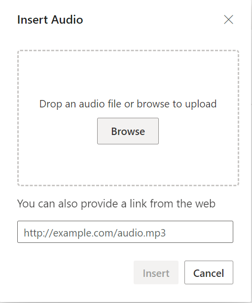
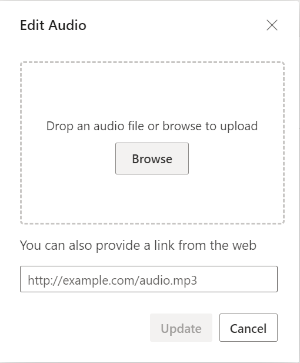
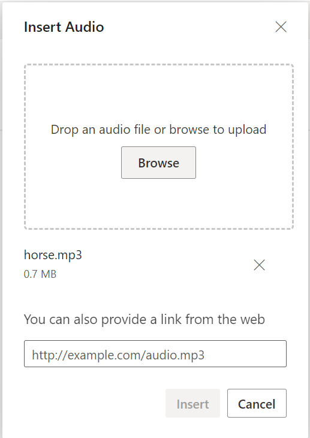

# Insert Audio in Blazor Rich Text Editor Component

The Rich Text Editor allows inserting audio files from online sources and the local computer where you want to insert the audio in your content. For inserting audio into the Rich Text Editor, the following list of options has been provided in the [RichTextEditorAudioSettings](https://help.syncfusion.com/cr/blazor/Syncfusion.Blazor.RichTextEditor.RichTextEditorAudioSettings.html).

| Options | Description |
|----------------|---------|
| [AllowedTypes](https://help.syncfusion.com/cr/blazor/Syncfusion.Blazor.RichTextEditor.RichTextEditorAudioSettings.html#Syncfusion_Blazor_RichTextEditor_RichTextEditorAudioSettings_AllowedTypes) |Specifies the extensions of the audio types allowed to insert on bowering and passing the extensions with comma separators. For example, pass allowedTypes as `.mp3,` `.wav,` `.m4a,` and `.wma.`|
| [LayoutOption](https://help.syncfusion.com/cr/blazor/Syncfusion.Blazor.RichTextEditor.RichTextEditorMediaSettings.html#Syncfusion_Blazor_RichTextEditor_RichTextEditorMediaSettings_LayoutOption) | Sets the default display for audio when it is inserted into the Rich Text Editor. Possible options are `Inline` and `Break.`|
| [SaveFormat](https://help.syncfusion.com/cr/blazor/Syncfusion.Blazor.RichTextEditor.RichTextEditorMediaSettings.html#Syncfusion_Blazor_RichTextEditor_RichTextEditorMediaSettings_SaveFormat) | Sets the default save format of the audio element when inserted. Possible options are `Blob` and `Base64.`|
| [SaveUrl](https://help.syncfusion.com/cr/blazor/Syncfusion.Blazor.RichTextEditor.RichTextEditorMediaSettings.html#Syncfusion_Blazor_RichTextEditor_RichTextEditorMediaSettings_SaveUrl) | Provides URL to map the action result method to save the audio.|
| [Path](https://help.syncfusion.com/cr/blazor/Syncfusion.Blazor.RichTextEditor.RichTextEditorMediaSettings.html#Syncfusion_Blazor_RichTextEditor_RichTextEditorMediaSettings_Path) | Specifies the location to store the audio.|

## Configure audio tool in the toolbar

To include the audio tool in the Rich Text Editor, you can add the toolbar item `Audio` to the [RichTextEditorToolbarSettings.Items](https://help.syncfusion.com/cr/aspnetmvc-js2/Syncfusion.EJ2.RichTextEditor.RichTextEditorToolbarSettings.html#Syncfusion_EJ2_RichTextEditor_RichTextEditorToolbarSettings_Items) property.

To configure `Audio` toolbar item, refer to the below code.









## Insert audio from web

To insert audio from the hosted link or local machine, you should enable the audio tool in the editor's toolbar.

## Insert audio from web URL

By default, the audio tool opens the audio dialog, allowing you to insert audio from an online source. Inserting the URL will be added to the `src` attribute of the `<source>` tag.



## Upload and insert audio

In the audio dialog, using the `browse` option, select the audio from the local machine and insert it into the Rich Text Editor content.

If the path field is not specified in the [RichTextEditorAudioSettings](https://help.syncfusion.com/cr/blazor/Syncfusion.Blazor.RichTextEditor.RichTextEditorAudioSettings.html), the audio will be converted into `Blob` url or `Base64` and inserted inside the Rich Text Editor.

### Server-side action

The selected audio can be uploaded to the required destination using the controller action below. Map this method name in [RichTextEditorMediaSettings.SaveUrl](https://help.syncfusion.com/cr/blazor/Syncfusion.Blazor.RichTextEditor.RichTextEditorMediaSettings.html#Syncfusion_Blazor_RichTextEditor_RichTextEditorMediaSettings_SaveUrl) and provide the required destination path through [RichTextEditorMediaSettings.Path](https://help.syncfusion.com/cr/blazor/Syncfusion.Blazor.RichTextEditor.RichTextEditorMediaSettings.html#Syncfusion_Blazor_RichTextEditor_RichTextEditorMediaSettings_Path) properties.

N> If you want to insert lower-sized audio files in the editor and don't want a specific physical location for saving audio, you can opt to save the format as `Base64`.












using System;
using System.IO;
using System.Net.Http.Headers;
using Microsoft.AspNetCore.Mvc;
using Microsoft.AspNetCore.Http;
using System.Collections.Generic;
using Microsoft.AspNetCore.Hosting;
using Microsoft.AspNetCore.Http.Features;
namespace AudioUpload.Controllers
{
    [ApiController]
    public class AudioController : ControllerBase
    {
        private readonly IWebHostEnvironment hostingEnv;
        public AudioController(IWebHostEnvironment env)
        {
            this.hostingEnv = env;
        }
        [HttpPost("[action]")]
        [Route("api/Audio/Save")]
        public void Save(IList<IFormFile> UploadFiles)
        {
            try
            {
                foreach (var file in UploadFiles)
                {
                    if (UploadFiles != null)
                    {
                        string targetPath = hostingEnv.ContentRootPath + "\\wwwroot\\Audio";
                        string filename = ContentDispositionHeaderValue.Parse(file.ContentDisposition).FileName.Trim('"');
                        // Create a new directory if it does not exist
                        if (!Directory.Exists(targetPath))
                        {
                            Directory.CreateDirectory(targetPath);
                        }

                        // Name which is used to save the audio
                        filename = targetPath + $@"\{filename}";
                        if (!System.IO.File.Exists(filename))
                        {
                            // Upload an audio, if the same file name does not exist in the directory
                            using (FileStream fs = System.IO.File.Create(filename))
                            {
                                file.CopyTo(fs);
                                fs.Flush();
                            }
                            Response.StatusCode = 200;
                        }
                        else
                        {
                            Response.StatusCode = 204;
                        }
                    }
                }
            }
            catch (Exception e)
            {
                Response.Clear();
                Response.ContentType = "application/json; charset=utf-8";
                Response.HttpContext.Features.Get<IHttpResponseFeature>().ReasonPhrase = e.Message;
            }
        }
    }
}




### Audio save format

The audio files can be saved as `Blob` or `Base64` url by using the [RichTextEditorAudioSettings.SaveFormat](https://help.syncfusion.com/cr/blazor/Syncfusion.Blazor.RichTextEditor.RichTextEditorMediaSettings.html#Syncfusion_Blazor_RichTextEditor_RichTextEditorMediaSettings_SaveFormat) property, which is of enum type and the generated url will be set to the `src` attribute of the `<source>` tag.

N> By default, the files are saved in the `Blob` format.

```cshtml

<audio>
    <source src="blob:http://ej2.syncfusion.com/3ab56a6e-ec0d-490f-85a5-f0aeb0ad8879" type="audio/mp3" />
</audio>
<audio>
    <source src="data:audio/mp3;base64,iVBORw0KGgoAAAANSUhEUgAAADAAAAAwCAYAAABXAvmHA" type="audio/mp3" />
</audio>

```

## Maximum file size restriction

By using the Rich Text Editor's [RichTextEditorAudioSettings.MaxFileSize](https://help.syncfusion.com/cr/blazor/Syncfusion.Blazor.RichTextEditor.RichTextEditorAudioSettings.html#Syncfusion_Blazor_RichTextEditor_RichTextEditorAudioSettings_MaxFileSize) property, you can restrict the audio to upload when the given audio size is greater than the allowed fileSize. 

In the following illustration, the audio size has been validated before uploading, and it is determined whether the audio has been uploaded or not.









## Replacing audio

Once an audio file has been inserted, you can change it using the Rich Text Editor [RichTextEditorQuickToolbarSettings](https://help.syncfusion.com/cr/blazor/Syncfusion.Blazor.RichTextEditor.RichTextEditorQuickToolbarSettings.html#Syncfusion_Blazor_RichTextEditor_RichTextEditorQuickToolbarSettings_Audio) “Replace” option. You can replace the audio file using the web URL or the browse option in the audio dialog.



## Delete audio

To remove audio from the Rich Text Editor content, select audio and click the `Remove` tool from the quick toolbar. It will delete the audio from the Rich Text Editor content.

Once you select the audio from the local machine, the URL for the audio will be generated. You can remove the audio from the service location by clicking the cross icon.



## Display Position

Sets the default display for an audio file when it is inserted in the Rich Text Editor using the [RichTextEditorMediaSettings.layoutOption](https://help.syncfusion.com/cr/blazor/Syncfusion.Blazor.RichTextEditor.RichTextEditorMediaSettings.html#Syncfusion_Blazor_RichTextEditor_RichTextEditorMediaSettings_LayoutOption) property. The possible options are `inline` and `break.` It also updates the audio elements’ layout position when updating the display positions.

N> The default `layoutOption` property is set to `Inline`.









## Drag and drop audio insertion

Default upload: Insert audio directly from your local file system (e.g., File Explorer, Finder) into the editor.

Server upload: Use the `SaveUrl` property to upload audio files to your server before inserting them into the editor.









### Disabling audio drag and drop

You can prevent drag-and-drop action by setting the `OnMediaDrop` argument cancel value to true. The following code shows how to prevent the drag-and-drop.

```
<RichTextEditorEvents OnMediaDrop="@OnMediaDrop"></RichTextEditorEvents>
@code{
    private void OnMediaDrop(MediaDropEventArgs args)
    {
        if (args.MediaType == "Audio") {
            args.Cancel = true;
        }
    }
}
```
## Rename audio before inserting

Using the [RichTextEditorAudioSettings](https://help.syncfusion.com/cr/blazor/Syncfusion.Blazor.RichTextEditor.RichTextEditorAudioSettings.html) property, specify the server handler to upload the selected audio. Then, by binding the `FileUploadSuccess` event, you will receive the modified file name from the server and update it in the Rich Text Editor's insert audio dialog.

Refer `rename.cs` controller file for configure the server-side.












using System;
using System.IO;
using System.Net.Http.Headers;
using Microsoft.AspNetCore.Mvc;
using Microsoft.AspNetCore.Http;
using System.Collections.Generic;
using Microsoft.AspNetCore.Hosting;
using Microsoft.AspNetCore.Http.Features;

namespace RenameAudio.Controllers
{
    [ApiController]
    public class AudioController : ControllerBase
    {
        private double x;
        private string audiofileName;
        private readonly IWebHostEnvironment hostingEnv;

        public AudioController(IWebHostEnvironment env)
        {
            this.hostingEnv = env;
        }

        [HttpPost("[action]")]
        [Route("api/Audio/Rename")]
        public void Rename(IList<IFormFile> UploadFiles)
        {
            try
            {
                foreach (IFormFile file in UploadFiles)
                {
                    if (UploadFiles != null)
                    {
                        string targetPath = hostingEnv.ContentRootPath + "\\wwwroot\\Audio";
                        string filename = ContentDispositionHeaderValue.Parse(file.ContentDisposition).FileName.Trim('"');

                        // Create a new directory if it does not exist
                        if (!Directory.Exists(targetPath))
                        {
                            Directory.CreateDirectory(targetPath);
                        }

                        audiofileName = filename;
                        string path = hostingEnv.WebRootPath + "\\Images" + $@"\{filename}";

                        // Rename a uploaded audio file name
                        while (System.IO.File.Exists(path))
                        {
                            audiofileName = "rteImage" + x + "-" + filename;
                            path = hostingEnv.WebRootPath + "\\Images" + $@"\rteImage{x}-{filename}";
                            x++;
                        }

                        if (!System.IO.File.Exists(path))
                        {
                            using (FileStream fs = System.IO.File.Create(path))
                            {
                                file.CopyTo(fs);
                                fs.Flush();
                                fs.Close();
                            }

                            // Modified file name shared through response header by adding custom header
                            Response.Headers.Add("name", audiofileName);
                            Response.StatusCode = 200;
                            Response.ContentType = "application/json; charset=utf-8";
                        }
                    }
                }
            }
            catch (Exception e)
            {
                Response.Clear();
                Response.ContentType = "application/json; charset=utf-8";
                Response.HttpContext.Features.Get<IHttpResponseFeature>().ReasonPhrase = e.Message;
            }
        }
    }
}




## Upload audio with authentication

The Rich Text Editor control allows you to add additional data with the File Upload, which can be received on the server side. By using the `FileUploading` event and its `CustomFormData` argument, you can pass parameters to the controller action. On the server side, you can fetch the custom headers by accessing the form collection from the current request, which retrieves the values sent using the POST method.

N> By default it doesn't support `UseDefaultCredentials` property, we need to manually append the default credentials with the upload request.












using System;
using System.IO;
using System.Net.Http.Headers;
using Microsoft.AspNetCore.Mvc;
using Microsoft.AspNetCore.Http;
using System.Collections.Generic;
using Microsoft.AspNetCore.Hosting;
using Microsoft.AspNetCore.Http.Features;

namespace AudioUpload.Controllers
{
    [ApiController]
    public class AudioController : ControllerBase
    {
        private readonly IWebHostEnvironment hostingEnv;

        public AudioController(IWebHostEnvironment env)
        {
            this.hostingEnv = env;
        }

        [HttpPost("[action]")]
        [Route("api/Audio/Save")]
        public void Save(IList<IFormFile> UploadFiles)
        {
            string currentPath = Request.Form["Authorization"].ToString();
            try
            {
                foreach (var file in UploadFiles)
                {
                    if (UploadFiles != null)
                    {
                        string targetPath = hostingEnv.ContentRootPath + "\\wwwroot\\Audio";
                        string filename = ContentDispositionHeaderValue.Parse(file.ContentDisposition).FileName.Trim('"');

                        // Create a new directory if it does not exist
                        if (!Directory.Exists(targetPath))
                        {
                            Directory.CreateDirectory(targetPath);
                        }

                        // Name which is used to save the audio
                        filename = targetPath + $@"\{filename}";

                        if (!System.IO.File.Exists(filename))
                        {
                            // Upload an audio, if the same file name does not exist in the directory
                            using (FileStream fs = System.IO.File.Create(filename))
                            {
                                file.CopyTo(fs);
                                fs.Flush();
                            }
                            Response.StatusCode = 200;
                        }
                        else
                        {
                            Response.StatusCode = 204;
                        }
                    }
                }
            }
            catch (Exception e)
            {
                Response.Clear();
                Response.ContentType = "application/json; charset=utf-8";
                Response.HttpContext.Features.Get<IHttpResponseFeature>().ReasonPhrase = e.Message;
            }
        }
    }
}




## See also

* [How to configuring the toolbar position](../toolbar#configuring-the-toolbar-position)
* [How to use link editing option in the toolbar items](../tools#insert-link)
