# Built-in Tools in Blazor Rich Text Editor Component

By default, the Rich Text Editor displays the following toolbar items:

> `Bold` , `Italic` , `Underline` , `|` , `Formats` , `Alignments` , `Blockquote`, `OrderedList` , `UnorderedList` , `|` , `CreateLink` , `Image` , `|` , `SourceCode` , `Undo` , `Redo`

These default items cover essential text editing features, such as text formatting, lists, alignment, and linking.

## Available toolbar items

The following table shows the list of available tools in the Rich Text Editor's toolbar.

The order of items in the toolbar can be customized to meet your application's requirements. If no specific order is set, the editor will render the above default toolbar items. Below is a list of all available toolbar items in the Rich Text Editor.

### Text formatting

It provides tools for applying text styles such as bold, italic, underline, strike-through, and more to modify the appearance of the text.

| Name | Icons | Summary | 
|----------------|---------|---------|
| Bold  |  | Text that is thicker and darker than usual. |
| Italic |  | Shows a text that is leaned to the right. | 
| Underline |  | The underline is added to the selected text. | 
| StrikeThrough |  | Apply double line strike through formatting for the selected text. |
| ClearFormat |  | The clear format tool is useful to remove all formatting styles (such as bold, italic, underline, color, superscript, subscript, and more) from currently selected text. As a result, all the text formatting will be cleared and return to its default formatting styles.|
| Blockquote |  | Blockquotes visually highlight important text within an editor, emphasizing key information or quotations. |
| SubScript |  | Makes the selected text as subscript (lower).|
| SuperScript |  | Makes the selected text as superscript (higher).|
| LowerCase |  | Change the case of selected text to lower in the content. |
| UpperCase |  | Change the case of selected text to upper  in the content.|

### Font & styling

Tools in this section allow users to customize font properties such as font family, size, color, background color, and paragraph formatting.

| Name | Icons | Summary | 
|----------------|---------|---------|
| FontName |  | Defines the fonts that appear under the Font Family DropDownList from the Rich Text Editor's toolbar. |
| FontSize |  | Defines the font sizes that appear under the Font Size DropDownList from the Rich Text Editor's toolbar.|
| FontColor |  | Specifies an array of colors can be used in the colors popup for font color.|
| BackgroundColor |  | Specifies an array of colors can be used in the colors popup for background color.|
| Formats (Paragraph, Headings) |  | An Object with the options that will appear in the Paragraph Format dropdown from the toolbar. |

### Alignment

This section provides alignment options for the text or content, allowing users to justify text or align it to the left, center, or right.

| Name | Icons | Summary | 
|----------------|---------|---------|
| Alignment |  | Align the content with left, center, and right margin.|
| JustifyLeft |  | Allows each line to begin at the same distance from the editor’s left-hand side. | 
| JustifyCenter | 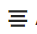 | There is an even space on each side of each line since the text is not aligned to the left or right margins. |
| JustifyRight | 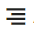 | Allows each line to end at the same distance from the editor’s right-hand side. | 
| JustifyFull |  | The text is aligned with both right and left margins. | 

### Lists & indentation

Tools here allow users to create ordered and unordered lists, change the list style, and adjust indentation levels for improved document structure.

| Name | Icons | Summary | 
|----------------|---------|---------|
| OrderedList |  | Create a new list item(numbered). |
| UnorderedList |  | Create a new list item(bulleted). |
| NumberFormatList |  | Allows to create list items with various list style types(numbered).|
| BulletFormatList |  | Allows to create list items with various list style types(bulleted).|
| Indent |  | Allows to increase the indent level of the content.|
| Outdent |  | Allows to decrease the indent level of the content.|

### Hyperlinks

This section provides tools for inserting and managing hyperlinks within the content. Users can create new links or modify existing ones to enhance document navigation and interactivity.

| Name | Icons | Summary | 
|----------------|---------|---------|
| Hyperlink |  | Creates a hyperlink to a text or image to a specific location in the content.|
| InsertLink |  |Allows users to add a link to a particular item. |

#### Link quicktoolbar items

The link quicktoolbar provides tools to manage hyperlinks in the Rich Text Editor, allowing users to add, edit, or remove links from selected text or images directly within the editor.

| Name | Icons | Summary | 
|----------------|---------|---------|
| OpenLink | 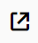 | To open the URL link that is  attached to the selected text. |
| EditLink | 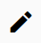 | Allows you to change the URL that has been attached to a specific item. | 
| RemoveLink | 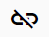 | Allows you to remove the applied link from the selected item. |

### Images

This section contains the primary tool for inserting images into the editor.

| Name | Icons | Summary | 
|----------------|---------|---------|
| Insert Image |  | Inserts an image from an online source or local computer. |

#### Image quicktoolbar items

The image quicktoolbar offers a set of tools to edit images inserted in the Rich Text Editor. It allows users to modify image properties, including alignment, size, alternate text, and links, enhancing image management in the content.

| Name | Icons | Summary | 
|----------------|---------|---------|
| Replace Image  | 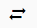 | Replace the selected image with another image. | 
| Align Image |  | The image can be aligned to the right, left, or center. | 
| Remove Image | 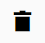 | Allows to remove the selected image from the editor. | 
| OpenImageLink |  | Opens the link that is attached to the selected image. | 
| EditImageLink |  | Allows to edit the link that is attached to the selected image. |
| RemoveImageLink |  | Removes the link that is attached to the selected image. | 
| Display | 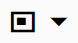 | Allows you to choose whether an image should be shown inline or as a block. | 
| AltText | 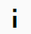 | To display image description when an image on a Web page cannot be displayed. | 
| Dimension | 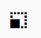 | Allows you to customize the image’s height and width. |

### Tables

This section offers the main tool for creating tables within the content.

| Name | Icons | Summary |
|----------------|---------|---------|
| CreateTable | 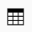 | Create a table with defined columns and rows. |

#### Table quicktoolbar items

The table quicktoolbar provides options for table editing within the Rich Text Editor. Users can insert or remove rows and columns, merge or split cells, and access table properties for easier table management and customization.

| Name | Icons | Summary | 
|----------------|---------|---------|
| RemoveTable |  | Removes the selected table and its contents. | 
| TableHeader | 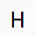 | Allows you to add a table header. |
| TableColumns | 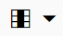 | Shows the dropdown to insert a column or delete the selected column. |
| TableRows | 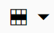 | Shows the dropdown to insert a row ors delete the selected row. | 
| TableCellHorizontalAAlignmentslign |  | Allows the table cell content to be aligned horizontally. | 
| TableCellVerticalAlign | 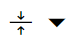 | Allows the table cell content to be aligned vertically. | 
| TableEditProperties | 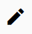 | Allows you to change the table width, padding, and cell spacing styles. |

### Horizontal Line

Horizontal lines visually separate sections of content in the editor, enhancing readability and layout clarity.

| Name | Icons | Summary |
|----------------|---------|---------|
| Horizontal Line |  | Allows you to insert horizontal line.|

### Undo & redo

These tools allow users to easily undo or redo any changes made within the editor to restore or repeat previous actions.

| Name | Icons | Summary |
|----------------|---------|---------|
| Undo |  | Allows to undo the actions.|toolbarSettings: { items: ['Undo']} |
| Redo |  | Allows to redo the actions.|toolbarSettings: { items: ['Redo']}|

### Other tools

This section contains miscellaneous tools such as full-screen mode, print, preview, source code editing, and clearing all styles from text.

| Name | Icons | Summary | 
|----------------|---------|---------|
| FullScreen |  | Stretches the editor to the maximum width and height of the browser window.|
| Minimize | 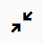 | Shrinks the editor to the default width and height. | 
| Preview | 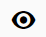 | Allows to see how the editor’s content looks in a browser. | 
| InsertCode | 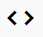 | Represents preformatted text which is to be presented exactly as written in the HTML file. | 
| Print |  | Allows to print the editor content. |
| ClearAll | 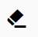 | Removes all styles that have been applied to the selected text.| 
| SourceCode |   | Rich Text Editor includes the ability for users to directly edit HTML code via “Source View”. If you made any modification in Source view directly, synchronize with Design view.|

## Removing built-in tool from toolbar

Remove the built-in tools from the toolbar by using the [RichTextEditorToolbarSettings.Items](https://help.syncfusion.com/cr/blazor/Syncfusion.Blazor.RichTextEditor.RichTextEditorToolbarSettings.html#Syncfusion_Blazor_RichTextEditor_RichTextEditorToolbarSettings_Items) property.




<SfRichTextEditor>
    <RichTextEditorToolbarSettings Items="@Tools" />
    
The Rich Text Editor component is WYSIWYG ('what you see is what you get') editor that provides the best user experience to create and update the content. Users can format their content using standard toolbar commands.

</SfRichTextEditor>

@code {
    private List<ToolbarItemModel> Tools = new List<ToolbarItemModel>()
    {
        new ToolbarItemModel() { Command = ToolbarCommand.Bold },
        new ToolbarItemModel() { Command = ToolbarCommand.Italic },
        new ToolbarItemModel() { Command = ToolbarCommand.FontName },
        new ToolbarItemModel() { Command = ToolbarCommand.FontSize },
        new ToolbarItemModel() { Command = ToolbarCommand.CreateLink },
        new ToolbarItemModel() { Command = ToolbarCommand.Image },
        new ToolbarItemModel() { Command = ToolbarCommand.CreateTable },
        new ToolbarItemModel() { Command = ToolbarCommand.Undo },
        new ToolbarItemModel() { Command = ToolbarCommand.Redo }
    };
}




