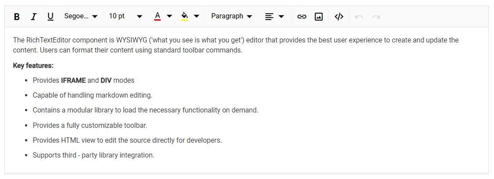
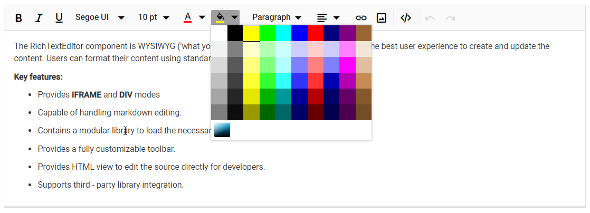
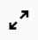
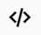
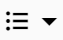
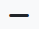
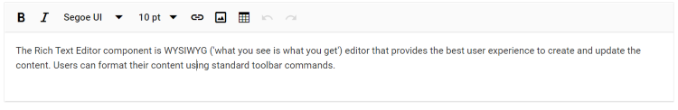

# Overview of Built-in Tools in Blazor Rich Text Editor

To initialize the tools, use the following code. You can change the tool's name as per your requirements. For your reference, here is the `bold` tool initialized.




private List<ToolbarItemModel> Items = new List<ToolbarItemModel>()
    {
        new ToolbarItemModel() { Command = ToolbarCommand.Bold }
    } 




The following table lists the tools available in the toolbar.

<table>
<tr>
<td><b>Name</b></td>
<td><b>Icons</b></td>
<td><b>Summary</b></td>
</tr>

<tr>
<td>
Undo
</td>
<td></td>
<td>
Allows you to undo the actions.
</td>
</tr>

<tr>
<td>
Redo
</td>
<td></td>
<td>
Allows you to redo the actions.
</td>
</tr>

<tr>
<td>
Alignment
</td>
<td></td>
<td>
Aligns the content with the left, center, and right margins.
</td>
</tr>

<tr>
<td>
OrderedList
</td>
<td></td>
<td>
Creates a new list item(numbered).
</td>
</tr>

<tr>
<td>
UnorderedList
</td>
<td></td>
<td>
Creates a new list item(bulleted).
</td>
</tr>

<tr>
<td>
Indent
</td>
<td></td>
<td>
Allows you to increase the content's indentation level. 
</td>
</tr>

<tr>
<td>
Outdent
</td>
<td></td>
<td>
Allows you to decrease the content's indentation level.
</td>
</tr>

<tr>
<td>
Hyperlink
</td>
<td></td>
<td>
Creates a hyperlink from a text or image to a specific location in the content.
</td>
</tr>

<tr>
<td>
Images
</td>
<td></td>
<td>
Inserts an image from an online source or local computer.
</td>
</tr>

<tr>
<td>
LowerCase
</td>
<td></td>
<td>
Changes the selected content to lowercase.
</td>
</tr>

<tr>
<td>
UpperCase
</td>
<td></td>
<td>
Changes the selected content to uppercase.
</td>
</tr>

<tr>
<td>
SubScript
</td>
<td></td>
<td>
 Formats the selected text as subscript (lower).
</td>
</tr>

<tr>
<td>
SuperScript
</td>
<td></td>
<td>
 Formats the selected text as superscript (higher).
</td>
</tr>

<tr>
<td>
Print
</td>
<td></td>
<td>
Allows the editor's content to be printed. 
</td>
</tr>

<tr>
<td>
FontName
</td>
<td></td>
<td>
Defines the fonts that appear in the Rich Text Editor's Font Family DropDownList.
</td>
</tr>

<tr>
<td>
FontSize
</td>
<td></td>
<td>
Defines the font sizes that appear under the Font Size DropDownList from the Rich Text Editor's toolbar.
</td>
</tr>

<tr>
<td>
FontColor
</td>
<td></td>
<td>
Specifies an array of colors that can be used in the color popup for the font color.
</td>
</tr>

<tr>
<td>
BackgroundColor
</td>
<td></td>
<td>
Specifies an array of colors that can be used in the color popup for the background color.
</td>
</tr>

<tr>
<td>
Format
</td>
<td></td>
<td>
An Object with the options that will appear in the Paragraph Format dropdown from the toolbar.
</td>
</tr>

<tr>
<td>
Blockquote
</td>
<td></td>
<td>
Blockquotes visually highlight important text within an editor, emphasizing key information or quotations.
</td>
</tr>

<tr>
<td>
StrikeThrough
</td>
<td></td>
<td>
Applies double line strike through formatting for the selected text.
</td>
</tr>

<tr>
<td>
ClearFormat
</td>
<td></td>
<td>
The clear format tool is useful for removing all formatting styles from currently selected text, such as bold, italic, underline, color, superscript, subscript, and more. As a result, all the text formatting will be cleared and returned to its default styles.
</td>
</tr>

<tr>
<td>
FullScreen
</td>
<td></td>
<td>
Stretches the editor to the maximum width and height of the browser window.
</td>
</tr>

<tr>
<td>
SourceCode
</td>
<td></td>
<td>
Allows users to toggle between design view and HTML source view. Changes made in source view are synchronized with the design view.
</td>
</tr>

<tr>
<td>
NumberFormatList
</td>
<td></td>
<td>
Allows to create list items with various list style types(numbered). 
</td>
</tr>

<tr>
<td>
BulletFormatList
</td>
<td></td>
<td>
Allows to create list items with various list style types(bulleted).
</td>
</tr>

<tr>
<td>
HorizontalLine
</td>
<td></td>
<td>
Horizontal lines visually separate sections of content in the editor, enhancing readability and layout clarity.
</td>
</tr>
</table>

Users can customize the order of toolbar tools to suit your application's requirements. If you are not specifying any tools order, the editor will create the toolbar with default items.

## How to remove built-in tool from toolbar

Remove the built-in tools from the toolbar by using the [RichTextEditorToolbarSettings.Items](https://help.syncfusion.com/cr/blazor/Syncfusion.Blazor.RichTextEditor.RichTextEditorToolbarSettings.html#Syncfusion_Blazor_RichTextEditor_RichTextEditorToolbarSettings_Items) property.




<SfRichTextEditor>
    <RichTextEditorToolbarSettings Items="@Tools" />
    
The Rich Text Editor component is WYSIWYG ('what you see is what you get') editor that provides the best user experience to create and update the content. Users can format their content using standard toolbar commands.

</SfRichTextEditor>

@code {
    private List<ToolbarItemModel> Tools = new List<ToolbarItemModel>()
    {
        new ToolbarItemModel() { Command = ToolbarCommand.Bold },
        new ToolbarItemModel() { Command = ToolbarCommand.Italic },
        new ToolbarItemModel() { Command = ToolbarCommand.FontName },
        new ToolbarItemModel() { Command = ToolbarCommand.FontSize },
        new ToolbarItemModel() { Command = ToolbarCommand.CreateLink },
        new ToolbarItemModel() { Command = ToolbarCommand.Image },
        new ToolbarItemModel() { Command = ToolbarCommand.CreateTable },
        new ToolbarItemModel() { Command = ToolbarCommand.Undo },
        new ToolbarItemModel() { Command = ToolbarCommand.Redo }
    };
}




